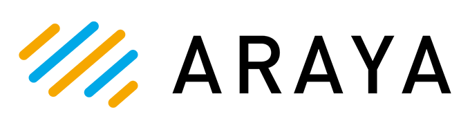

# Araya OptiNiSt 

<p align="center">
    <a>
       
    </a>
    <a>
      
    </a>
    <a href="https://pypi.org/project/optinist">
        
    </a>
    <a href="https://pypi.org/project/optinist">
        
    </a>
    <a href="https://pypi.org/project/optinist">
      
    </a>
    <a href="https://github.com/arayabrain/araya-optinist">
      
    </a>
    <a href="https://github.com/arayabrain/araya-optinist">
      
    </a>
    <a href="https://github.com/arayabrain/araya-optinist">
      
    </a>
</p>

**Araya OptiNiSt** allows researchers to process and visualize their calcium imaging data entirely online. It was built by [Araya Inc.](https://www.araya.org/en/) on top of [OptiNiSt](https://github.com/oist/optinist), an open-source calcium imaging pipeline tool originally developed in collaboration with [OIST](https://www.oist.jp/).

We believe in open, reproducible science and in making it easy to share results between labs. Araya OptiNiSt is built around these principles:

- **Public Data Sharing**: Publish your experiments to the [public page](https://www.araya-optinist.com/public), where anyone can view your results and reproduce your workflows without needing an account.
- **Cloud Computing**: Run analysis pipelines on cloud infrastructure without managing local hardware.
- **Cloud Storage**: Store your data securely in the cloud with Amazon S3-backed storage and on-demand synchronization.

### Plans

Plans are available to suit different needs, from individual researchers to large labs.

- **Free** -- Shared compute resources with limited storage.
- **Premium** -- Dedicated compute resources with expanded storage.
- **Custom** -- Any size of compute (CPU or GPU) and storage. Additional analysis methods and plots can be added on request.

See the [Subscription page](https://www.araya-optinist.com/subscription) for full details.

## About OptiNiSt

**OptiNiSt (Optical Neuroimage Studio)** helps researchers try multiple data analysis methods, visualize the results, and construct data analysis pipelines easily and quickly. OptiNiSt's data-saving format follows NWB standards.

OptiNiSt also supports reproducibility of scientific research, standardization of analysis protocols, and development of novel analysis tools as plug-ins.

### Main Features

- **Easy-To-Create Workflow**: Create analysis pipelines easily on the GUI with zero knowledge of coding.
- **Visualizing Analysis Results**: Visualize analysis results quickly with interactive plots.
- **Managing Workflows**: Record and reproduce workflow pipelines easily.

### Support Library

#### ROI detection

- [x] [Suite2p](https://github.com/MouseLand/suite2p)
- [x] [CaImAn](https://github.com/flatironinstitute/CaImAn)
- [x] [LCCD](https://github.com/magnetizedCell/lccd-python)

#### Postprocessing

- [x] Basic Neural Analysis (Event Trigger Average...)
- [x] Dimension Reduction (PCA...)
- [x] Neural Decoding (LDA...)
- [x] Neural Population Analysis (Correlation...)

#### Saving Format

- [x] [NWB](https://github.com/NeurodataWithoutBorders/pynwb)

## Using the GUI

### Workflow

- OptiNiSt allows you to make your analysis pipelines by graph style using nodes and edges on GUI. Parameters for each analysis are easily changeable.
<p align="center">
  
</p>

### Visualize

- OptiNiSt allows you to visualize the analysis results with one click by plotly. It supports a variety of plotting styles.
<p align="center">
  
</p>

### Record

- OptiNiSt supports you in recording and reproducing workflow pipelines in an organized manner.
<p align="center">
  
</p>

## Documentation

https://araya-optinist.readthedocs.io/en/latest/

## References

[[Suite2p]](https://github.com/MouseLand/suite2p) Marius Pachitariu, Carsen Stringer, Mario Dipoppa, Sylvia Schröder, L. Federico Rossi, Henry Dalgleish, Matteo Carandini, Kenneth D. Harris. "Suite2p: beyond 10,000 neurons with standard two-photon microscopy". 2017
[[CaImAn]](https://github.com/flatironinstitute/CaImAn) Andrea Giovannucci Is a corresponding author, Johannes Friedrich, Pat Gunn, Jérémie Kalfon, Brandon L Brown, Sue Ann Koay, Jiannis Taxidis, Farzaneh Najafi, Jeffrey L Gauthier, Pengcheng Zhou, Baljit S Khakh, David W Tank, Dmitri B Chklovskii, Eftychios A Pnevmatikakis. "CaImAn: An open source tool for scalable Calcium Imaging data Analysis". 2019
[[LCCD]](https://github.com/magnetizedCell/lccd-python) Tsubasa Ito, Keisuke Ota, Kanako Ueno, Yasuhiro Oisi, Chie Matsubara, Kenta Kobayashi, Masamichi Ohkura, Junichi Nakai, Masanori Murayama, Toru Aonishi, "Low computational-cost cell detection method for calcium imaging data", 2022
[[PyNWB]](https://github.com/NeurodataWithoutBorders/pynwb) Oliver Rübel, Andrew Tritt, Ryan Ly, Benjamin K. Dichter, Satrajit Ghosh, Lawrence Niu, Ivan Soltesz, Karel Svoboda, Loren Frank, Kristofer E. Bouchard, "The Neurodata Without Borders ecosystem for neurophysiological data science", bioRxiv 2021.03.13.435173, March 15, 2021

## Citation

<table width="100%">
<tr>
<td valign="top" width="50%">
If you use this software, please cite our paper:
<a href="https://journals.plos.org/ploscompbiol/article?id=10.1371/journal.pcbi.1013087">Optical Neuroimage Studio (OptiNiSt): intuitive, scalable, extendable framework for optical neuroimage data analysis</a>
</td>
<td valign="top" width="50%" align="right">

</td>
</tr>
</table>

```
@misc{OptiNiSt,
	author = {Yamane, Yukako and Li, Yuzhe and Matsumoto, Keita and Kanai, Ryota and Desforges, Miles and Gutierrez, Carlos Enrique and Doya, Kenji},
	title = {Optical Neuroimage Studio (OptiNiSt): intuitive, scalable, extendable framework for optical neuroimage data analysis},
	volume = {21},
	issue = {5},
	year = {2025},
	doi = {10.1371/journal.pcbi.1013087},
  journal = {PLOS Computational Biology}
}
```

## Join Our User Community on Slack

We've launched a Slack workspace to provide a more casual space for discussions and interaction among users.

[Join the Optinist User Community on Slack](https://join.slack.com/t/optinist-community/shared_invite/zt-32gtn36gx-stu8ywHn6L807k95zWVUkg)

Feel free to use it as a space for casual conversations, product questions, requests, and feedback.

## Contact Support

For questions, bug reports, or assistance, please reach out via [GitHub Issues](https://github.com/arayabrain/araya-optinist/issues) or the [contact page](https://araya-optinist.readthedocs.io/en/latest/other/contact.html) in our documentation.
