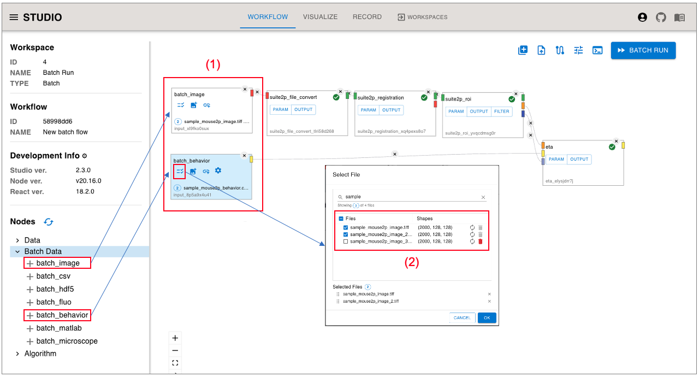
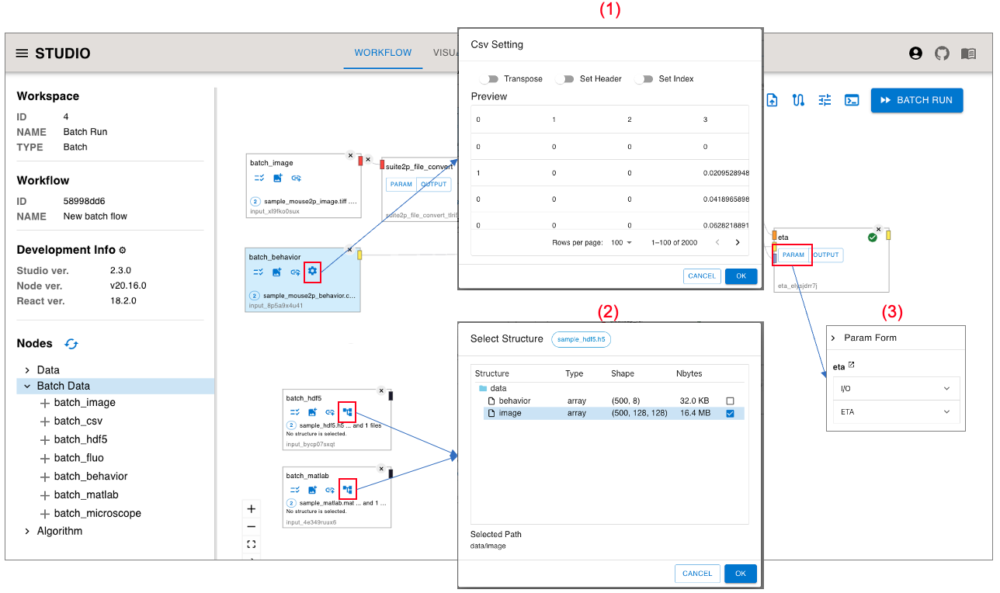
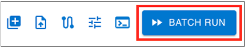

(workflow-batch-run)=
Workflow Batch Run
=================

By using the Workflow Batch Run function, you can batch-execute workflows with the same configuration for a group of input data.

- This feature is for ["Multi User Mode"](host_for_multiuser/index.rst).

```{contents}
:depth: 3
```

## Usage Procedure

### Creating a Workspace (Batch Type)

- Create a Workspace of Type:Batch.

<p>

</p>

- By specifying the Batch Type when creating a Workspace, the Batch Type Workflow becomes available.

### Workflow Screen (Batch Type)

In the workflow of a Type:Batch workspace, the UI changes as follows.

<p>

</p>

- (1) ... Display Type:Batch
- (2) ... From the Batch Data section in the left side menu, you can select each Batch Input Node.
- (3) ... The "Run" button will display as the "Batch Run" button.


### Selecting Data

<p>

</p>

- (1) ... Placing Batch Input Nodes
  - Place a Batch Input Node from "Batch Data" in the left side menu.
    - As an example, batch_image and batch_behavior are placed here.
  - Each Batch Input Node corresponds to a standard Input Nodes.
    - `batch_{image, csv, fluo, behavior, microscope, hdf5, matlab}`
- (2) ... File Select Dialog
  - Each Batch Input Node can select multiple files.

#### Supplementary

- Handling of data set
  - Data are processed in the order they are selected. 
- Validation rules 
  - Verify that the number of data in each Batch Input Data Node matches.
    - Basically, **only the number of data items is checked**. File names and data contents are not checked.

### Setting dialogs

<p>

</p>

- (1) ... CSV Setting Dialog 
  - For CSV-based Nodes (`batch_{cvs, fluo, behavior}`), various settings can be made in the CSV Setting Dialog. 
  - In the CSV Setting Dialog, **the contents of the first file** is previewed, and the setting content is **same settings applied to all files**.
- (2) ... Select Structure Dialog 
  - For Structured data type Nodes (`batch_{hdf5, matlab}`), the path of Input Data can be selected in the Select Structure Dialog. 
  - In the Select Structure Dialog, **the contents of the first file (Structure)** is displayed, and the settings are **same settings applied to all files**.
- (3) ... Node Param Setting 
  - Params settings for Node are **set commonly for all Workflows**.
  - **The same settings of Params** set on each node are applied to **all Batch Run Workflows**.

### Batch Run

<p>

</p>

#### Batch Run Button execution behavior

- Validation for Input Data
  - Check the number of items for each Batch Input Data 
    - \***The only check condition is the number of items.** File names and data contents are not checked.
- Execute Batch Run 
  - No reservations, immediate execution only 
    - As soon as the process is successfully started, the Workflow will immediately have a completed status.
  - The following records are generated 
    - Batch Workflow (Template) 
      - Generate one Template Workflow as the basis of Running Workflow .
    - Batch Workflow (Running) 
      - Automatically create Workflows for the number of Data items based on Template Workflow and start parallel execution.

## Record Screen

<p>

</p>

- (1) ... Record of Batch Workflow (Template) 
  - Created when Batch Run Button is executed.
  - This Workflow does not run snakemake directly.
- (2) ... Record of Batch Workflow (Running) 
  - Records of each workflow actually executed based on Batch Workflow (Template) 
  - Same content as regular Workflow Record 
  - "Name" is automatically generated based on the Template Name
- (3) ... Other menu of Batch Workflow (Template) 
  - Reproduce ... Batch Workflow (Template) can be reproduced 
  - Download workflow yaml ... You can also download and import Batch Workflow (Template) workflow.yaml 
  - Download snakemake yaml ... It is not possible to download snakemake.yaml of Batch Workflow (Template) (because it is not subject to snakemake execution)
