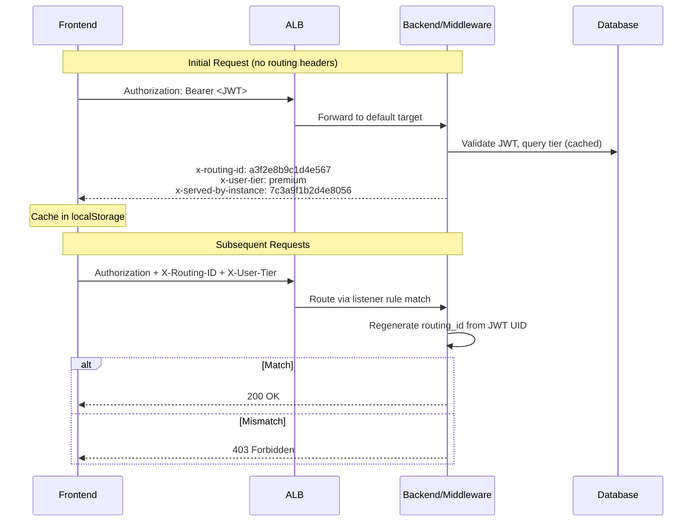

# ALB Routing: Secure Non-Reversible Routing IDs

## Executive Summary

- **Secure routing** uses HMAC-SHA256 to generate non-reversible routing IDs from Firebase UIDs
- **Backend-issued headers** prevent client-side spoofing (clients never see raw UIDs)
- **ALB rule matching** routes premium users to dedicated instances via `X-Routing-ID` and `X-User-Tier` headers
- **Backend validation** regenerates routing IDs from JWT and rejects mismatches with 403
- **Immediate tier changes** via webhook-triggered cache invalidation (no TTL delay)
- **503 fallback** automatically retries on free tier when premium instance is unavailable, and raises a user-visible warning plus a half-open circuit that re-probes the instance for recovery
- **Static rule band** (priorities 200-320) splits unauthenticated, bootstrap, and public-dataview traffic onto the public tier, with the listener default action serving the SPA shell from public
- **Instance identity** (`X-Served-By-Instance`) uses a domain-separated HMAC of the EC2 instance ID to detect ALB fallback to the shared backend without exposing infrastructure details

---

## Key Architectural Principles

1. **Backend Authority Over Routing Headers**
   - Backend generates routing IDs; clients cache and echo them
   - Clients cannot forge routing IDs without `ROUTING_SECRET_KEY`
   - JWT is the source of truth for identity; routing headers are supplemental

2. **Non-Reversibility**
   - `routing_id = HMAC-SHA256(SECRET_KEY, uid)[:16]`
   - Cannot extract UID from routing ID (one-way hash)
   - Deterministic: same UID always produces the same routing ID

3. **Defense in Depth**
   - ALB matches routing ID in listener rules (first layer)
   - Backend validates routing ID against JWT UID (second layer)
   - Mismatch returns 403 and logs a security event

4. **Single Source of Truth for Constants**
   - Header names defined in `infrastructure/aws_constants.py` (`RoutingHeaders` class)
   - Frontend mirror in `frontend/src/const/Subscription.ts`
   - Both locations use identical values (`X-Routing-ID`, `X-User-Tier`, `X-Served-By-Instance`)

---

## Architecture Overview



### Responsibility Matrix

| Responsibility | Backend Middleware | Premium Manager Lambda | Frontend |
|---|---|---|---|
| Generate routing ID | Yes - On every response | Yes - On ALB rule creation | No |
| Generate instance hash | Yes - On every authenticated response | No | No |
| Validate routing ID | Yes - Compare header vs JWT | No | No |
| Create ALB rules | No | Yes - Exclusive | No |
| Cache routing headers | No | No | Yes - localStorage |
| Gate header sending | No | No | Yes - `premiumAssigned` flag (re-armed by circuit breaker during unreachable recovery) |
| Invalidate tier cache | Yes - Via `invalidate_user_tier_cache()` | No | No |
| 503 fallback to free | No | No | Yes - Strip headers, retry, emit `premiumUnreachable` event |
| Detect instance recovery | No | No | Yes - Half-open probe + `premiumReachable` event (gated on instance identity match) |
| Store expected instance hash | No | No | Yes - `premiumInstanceId` in localStorage (set from `/premium/assign` and `/premium/status`) |
| Surface degraded state | No | No | Yes - Warning snackbar with terminal retry action |

---

## Static Listener Rule Band (Tier Split)

Premium routing IDs occupy dynamic rules 100-199 (created by the Premium Manager Lambda). The static rules below, defined in `infrastructure/terraform/public_alb_rules.tf`, split the remaining traffic between the public tier and the free tier. Lower priority numbers win; the listener default action is the final fallback.

| Priority | Rule | Target | Match |
|---|---|---|---|
| 100-199 | premium dynamic rules | Premium instance | `X-Routing-ID` + `X-User-Tier` (Lambda-created) |
| 200 | `sync_experiment_to_public` | Public | `/system-internal/sync-experiment/*` |
| 210 | `sync_experiments_to_free` | Free | `/system-internal/sync-experiments/*` |
| 280 | `visualizations_public_header` | Public | `/api/visualizations/*` + `DATAVIEW_PUBLIC_REQUEST: true` |
| 300 | `public_dataview_api` | Public | `/api/public/dataview`, `/api/public/dataview/*` |
| 305 | `auth_to_public` | Public | `/auth/*` |
| 306 | `users_me_to_public` | Public | `/users/me`, `/users/me/*` |
| 307 | `log_report_to_public` | Public | `/log-report/*` |
| 310 | `static_assets_to_public` | Public | `/static/*`, `/images/*`, `/favicon.ico`, `/manifest.json`, `/robots.txt` |
| 311 | `docs_to_public` | Public | `/docs`, `/docs/*`, `/openapi`, `/redoc`, `/health` |
| 312 | `asset_manifest_to_public` | Public | `/asset-manifest.json` |
| 315 | `visualizations_authenticated_to_free` | Free | `/api/visualizations/*` (own-data reads) |
| 316 | `anonymous_flows_to_free` | Free | `/api/register`, `/api/register/*`, `/api/subsc/webhooks`, `/api/subsc/webhooks/*` |
| 320 | `authenticated_to_free` | Free | `Authorization: Bearer *` |
| default | listener default action | Public | no rule match (SPA document requests) |

**Why bootstrap routes go to public:** `auth`, `users_me`, and `log-report` are served from the public tier so login, the post-login bootstrap calls, and client-error reporting keep working when the free tier is scaled to zero. Without these rules those requests would hit the priority-320 Bearer catch-all and 503 during a free outage.

**Why the default action is public:** open-ended SPA routes (e.g. `/workspaces/15`) cannot be enumerated as rules. A browser document request carries `Accept: text/html` and no `Authorization` header, so it misses every rule and falls through to the default action, which serves the static SPA shell from public via `SPARoutingMiddleware`. See `PUBLIC_INSTANCE_ARCHITECTURE.md`.

---

## Implementation Details

### generate_routing_id()

**File:** `studio/app/common/core/middleware/secure_routing_middleware.py`
**Purpose:** Generate a non-reversible routing ID from a Firebase UID using HMAC-SHA256
**Input:** `uid` (Firebase UID string), `secret_key` (256-bit hex key)
**Output:** 16-character hex string (64 bits of entropy)
**Note:** Identical implementation exists in `infrastructure/terraform/premium_manager_package/premium_manager.py`

### generate_instance_hash()

**File:** `studio/app/common/core/middleware/secure_routing_middleware.py`
**Purpose:** Generate a non-reversible hash of an EC2 instance ID using HMAC-SHA256
**Input:** `instance_id` (EC2 instance ID string), `secret_key` (256-bit hex key)
**Output:** 16-character hex string (64 bits of entropy)
**Key detail:** Uses domain-separated key (`"instance:" + secret_key`) to ensure the output never collides with routing IDs generated by `generate_routing_id()` (which uses the raw `secret_key`). The raw EC2 instance ID is never exposed to the client.

### SecureRoutingMiddleware

**File:** `studio/app/common/core/middleware/secure_routing_middleware.py`
**Purpose:** ASGI middleware that issues and validates routing headers on every request
**Input:** HTTP request with `Authorization: Bearer <JWT>` header
**Output:** Response with `x-routing-id`, `x-user-tier`, and `x-served-by-instance` headers; 403 on routing ID mismatch
**Calls:** `generate_routing_id()` -> `get_user_tier_cached()` -> `generate_instance_hash()`

### invalidate_user_tier_cache()

**File:** `studio/app/common/core/middleware/secure_routing_middleware.py`
**Purpose:** Immediately invalidate cached tier for a user after subscription change
**Input:** `uid` (Firebase UID string)
**Output:** None (side effect: next request triggers fresh DB query)
**Called by:** 5 webhook handlers in `webhook_service.py` (checkout, payment failure, cancellation, schedule release, payment success)

### cleanup_duplicate_rules_for_routing_id()

**File:** `infrastructure/terraform/premium_manager_package/premium_manager.py`
**Purpose:** Remove existing ALB rules for a routing ID before creating new ones
**Input:** `listener_arn`, `routing_id`
**Output:** Count of deleted rules

### Frontend Routing Flow

**File:** `frontend/src/utils/routing/RoutingService.ts`

- `getRoutingHeaders()` - Returns cached `X-Routing-ID` and `X-User-Tier` for request interceptor
- `updateRoutingToken()` - Stores backend-issued routing ID from response headers
- `isPremiumAssigned()` - Gate: headers only sent when backend confirms instance availability
- `clearRoutingInfo()` - Clears all routing data on logout (including `premiumInstanceId`)
- `setPremiumInstanceId()` / `getPremiumInstanceId()` - Store/retrieve the HMAC hash of the assigned instance (set from `/premium/assign` and `/premium/status` responses, persisted in localStorage)
- `onPremiumUnreachable()` / `emitPremiumUnreachable()` - Listener pool notified when an outgoing premium-routed request fails
- `onPremiumReachable()` / `emitPremiumReachable()` - Listener pool notified when an outgoing premium-routed request succeeds with matching routing ID and instance identity

**File:** `frontend/src/utils/axios.ts`

- Request interceptor adds routing headers (skipped if `_retryWithoutPremium` is set) and tags the request with `_hadPremiumHeaders`, `_outgoingRoutingId`, `_outgoingInstanceId`, `_premiumSentAt` for the response-side correlation
- `shouldEmitPremiumReachable()` - Pure function that determines whether a successful response confirms the dedicated instance is reachable. Returns true only when: (1) request carried premium headers, (2) routing-id was NOT rotated, and (3) `x-served-by-instance` matches the expected instance hash (or the expected hash is unknown — startup race fallback)
- Response interceptor captures `x-routing-id` from backend responses and calls `shouldEmitPremiumReachable()` to gate the `premiumReachable` event
- `handlePremiumRoutingError()` - On 503: strips routing headers and all premium markers (including `_outgoingInstanceId`), retries on free tier, emits `premiumUnreachable` on the original (pre-retry) request

---

## Edge Case Handling

### 1. Client Spoofs Routing ID

**Problem:** Malicious user modifies `X-Routing-ID` header to access another user's premium instance.

**Solution:** Dual-layer defense:
- ALB won't match the forged routing ID to any listener rule
- Backend regenerates routing ID from JWT UID and compares; rejects with 403 on mismatch

### 2. Client Sniffs Another User's Routing ID

**Problem:** Attacker captures a premium user's routing ID from network traffic.

**Solution:** Routing ID is bound to the JWT:
- Attacker's JWT contains a different UID
- Backend regenerates from attacker's UID, detects mismatch, returns 403

### 3. Subscription Downgrade (Stale Routing ID)

**Problem:** User downgrades but continues sending premium routing headers.

**Solution:** Webhook-triggered cache invalidation:
- Stripe webhook calls `invalidate_user_tier_cache(uid)`
- Next request gets fresh tier from DB (returns "free")
- Backend response excludes routing ID headers
- Client cache updated; routing ID removed

### 4. Premium Instance Unavailable (503)

**Problem:** Premium instance returns 503 or network error. Stripping the headers and retrying on the free tier would leave the user silently degraded with no UI signal and no recovery path -- the polling loop in `PremiumAssignmentContext` stops once the assignment is dedicated, so nothing re-checks the instance.

**Solution:** Three-layer response -- fallback, observe, recover:

- **Fallback.** `handlePremiumRoutingError()` strips routing headers, sets `_retryWithoutPremium` to prevent loops, and retries on the free tier. Markers (`_hadPremiumHeaders`, `_outgoingRoutingId`, `_outgoingInstanceId`, `_premiumSentAt`) are deleted from the retry config so the free-tier retry cannot falsely emit `premiumReachable`.
- **Observe.** Axios emits `premiumUnreachable` via `RoutingService`. `PremiumAssignmentContext` listens for it, transitions the dedicated assignment into a tracked unreachable state, logs `instance_unreachable`, broadcasts `PREMIUM_INSTANCE_UNREACHABLE` to peer tabs, and raises a warning snackbar through `PremiumNotificationManager`.
- **Recover.** A half-open circuit arms a probe with exponential backoff (30 s -> 5 min, capped at `MAX_FAILED_PROBES = 5`). Each probe flips `premiumAssigned` back to `true` so the next real user-driven request carries premium headers. A 2xx that passes `shouldEmitPremiumReachable()` (unrotated routing ID AND matching instance identity) emits `premiumReachable` and clears the state; a 5xx counts as a probe failure. Exhausting the probe budget marks the state terminal and swaps the snackbar to a "Retry" action that resets the budget without itself signalling recovery.

**Edge behaviour pinned by the code:**

- **Stale-failure watermark** -- failures whose send timestamp predates the last successful `premiumReachable` are suppressed so an in-flight 5xx cannot reopen an already-recovered state.
- **Routing-ID rotation** -- if the response's routing ID differs from the one sent, the ALB served the retry from a different instance; reachability of the probed instance is inconclusive and no event fires.
- **Instance identity mismatch** -- if `x-served-by-instance` differs from the expected instance hash stored in `premiumInstanceId`, the response came from a fallback backend (ALB rerouted to the shared instance). `premiumReachable` is suppressed even though the routing ID matches (routing IDs are UID-based, identical across all backends). This closes the false-positive gap where ALB fallback responses would spuriously clear the unreachable state (issue #566).
- **Startup race** -- if `premiumInstanceId` is null (assignment API has not yet returned), the instance identity check is skipped and the routing-id-only check is used. This preserves backward compatibility during the brief window after login.
- **Cross-tab sync** -- state transitions broadcast via `crossTabSync` (`PREMIUM_INSTANCE_UNREACHABLE`, `PREMIUM_INSTANCE_REACHABLE`, `PREMIUM_INSTANCE_PROBE_UPDATE`). Peer handlers apply state locally and do not re-broadcast, preventing echo loops.
- **Snapshot recovery** -- a freshly opened tab hydrates from a `localStorage` snapshot (`premium_unreachable_snapshot`, 1 h TTL) gated on `instance_id` match so a snapshot from a prior assignment cannot be adopted.

### 5. Logout Without Clearing Routing Data

**Problem:** Browser closed before logout completes; stale routing data remains in localStorage.

**Solution:** Multiple cleanup paths:
- Normal logout calls `routingService.clearRoutingInfo()`
- Premium cleanup Lambda removes stale ALB rules (hourly)
- Backend validation rejects stale routing IDs after instance reassignment

---

## Monitoring and Metrics

Routing security events are logged but not yet published as CloudWatch metrics:

| Event | Source | Level | Status |
|-------|--------|-------|--------|
| Routing ID mismatch | `SecureRoutingMiddleware` | WARNING | Logged (not published to CloudWatch) |
| Tier cache invalidation | `invalidate_user_tier_cache()` | INFO | Logged (not published to CloudWatch) |

---

## Configuration

| Variable | Purpose | Location |
|---|---|---|
| `ROUTING_SECRET_KEY` | 256-bit HMAC key for routing ID generation | Lambda env var + Backend env var (sensitive) |

**Key generation:**
```bash
openssl rand -hex 32
```

**Header constants:**

| Constant | Value | Backend Location | Frontend Location |
|---|---|---|---|
| `RoutingHeaders.ROUTING_ID` | `X-Routing-ID` | `infrastructure/aws_constants.py` | `frontend/src/const/Subscription.ts` |
| `RoutingHeaders.USER_TIER` | `X-User-Tier` | `infrastructure/aws_constants.py` | `frontend/src/const/Subscription.ts` |
| `RoutingHeaders.SERVED_BY_INSTANCE` | `X-Served-By-Instance` | `infrastructure/aws_constants.py` | `frontend/src/const/Subscription.ts` |

---

## Key Functions Reference

| Function | File | Purpose |
|---|---|---|
| `generate_routing_id()` | `secure_routing_middleware.py` | HMAC-SHA256 routing ID from UID |
| `generate_instance_hash()` | `secure_routing_middleware.py` | HMAC-SHA256 instance hash from EC2 ID (domain-separated key) |
| `SecureRoutingMiddleware` | `secure_routing_middleware.py` | Issue and validate routing headers (incl. `x-served-by-instance`) |
| `get_user_tier_cached()` | `secure_routing_middleware.py` | Tier lookup with 5-minute cache |
| `invalidate_user_tier_cache()` | `secure_routing_middleware.py` | Webhook-triggered cache clear |
| `generate_routing_id()` | `premium_manager.py` | Identical HMAC for ALB rule creation |
| `cleanup_duplicate_rules_for_routing_id()` | `premium_manager.py` | Remove stale ALB rules for routing ID |
| `getRoutingHeaders()` | `RoutingService.ts` | Return cached headers for requests |
| `isPremiumAssigned()` | `RoutingService.ts` | Gate: only send headers when assigned |
| `clearRoutingInfo()` | `RoutingService.ts` | Clear routing data on logout (incl. `premiumInstanceId`) |
| `setPremiumInstanceId()` / `getPremiumInstanceId()` | `RoutingService.ts` | Store/retrieve expected instance hash for ALB fallback detection |
| `emitPremiumUnreachable()` | `RoutingService.ts` | Notify listeners that a premium-routed request failed |
| `emitPremiumReachable()` | `RoutingService.ts` | Notify listeners that a premium-routed request succeeded with matching routing ID and instance identity |
| `shouldEmitPremiumReachable()` | `axios.ts` | Pure function: three-way check (premium headers + routing-id match + instance-id match) |
| `onPremiumUnreachable()` / `onPremiumReachable()` | `RoutingService.ts` | Subscribe to the pools above (returns an unsubscribe function) |
| `handlePremiumRoutingError()` | `axios.ts` | 503 fallback to free tier, emits `premiumUnreachable` |
| `unreachableMachineReducer()` | `PremiumAssignmentContext.tsx` | State machine driving the degraded / probing / terminal lifecycle |
