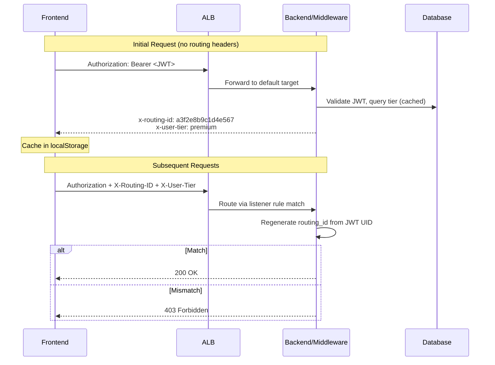

# ALB Routing: Secure Non-Reversible Routing IDs

## Executive Summary

- **Secure routing** uses HMAC-SHA256 to generate non-reversible routing IDs from Firebase UIDs
- **Backend-issued headers** prevent client-side spoofing (clients never see raw UIDs)
- **ALB rule matching** routes premium users to dedicated instances via `X-Routing-ID` and `X-User-Tier` headers
- **Backend validation** regenerates routing IDs from JWT and rejects mismatches with 403
- **Immediate tier changes** via webhook-triggered cache invalidation (no TTL delay)
- **503 fallback** automatically retries on free tier when premium instance is unavailable

---

## Key Architectural Principles

1. **Backend Authority Over Routing Headers**
   - Backend generates routing IDs; clients cache and echo them
   - Clients cannot forge routing IDs without `ROUTING_SECRET_KEY`
   - JWT is the source of truth for identity; routing headers are supplemental

2. **Non-Reversibility**
   - `routing_id = HMAC-SHA256(SECRET_KEY, uid)[:16]`
   - Cannot extract UID from routing ID (one-way hash)
   - Deterministic: same UID always produces the same routing ID

3. **Defense in Depth**
   - ALB matches routing ID in listener rules (first layer)
   - Backend validates routing ID against JWT UID (second layer)
   - Mismatch returns 403 and logs a security event

4. **Single Source of Truth for Constants**
   - Header names defined in `infrastructure/aws_constants.py` (`RoutingHeaders` class)
   - Frontend mirror in `frontend/src/const/Subscription.ts`
   - Both locations use identical values (`X-Routing-ID`, `X-User-Tier`)

---

## Architecture Overview



### Responsibility Matrix

| Responsibility | Backend Middleware | Premium Manager Lambda | Frontend |
|---|---|---|---|
| Generate routing ID | Yes - On every response | Yes - On ALB rule creation | No |
| Validate routing ID | Yes - Compare header vs JWT | No | No |
| Create ALB rules | No | Yes - Exclusive | No |
| Cache routing headers | No | No | Yes - localStorage |
| Gate header sending | No | No | Yes - `premiumAssigned` flag |
| Invalidate tier cache | Yes - Via `invalidate_user_tier_cache()` | No | No |
| 503 fallback to free | No | No | Yes - Strip headers and retry |

---

## Implementation Details

### generate_routing_id()

**File:** `studio/app/common/core/middleware/secure_routing_middleware.py`
**Purpose:** Generate a non-reversible routing ID from a Firebase UID using HMAC-SHA256
**Input:** `uid` (Firebase UID string), `secret_key` (256-bit hex key)
**Output:** 16-character hex string (64 bits of entropy)
**Note:** Identical implementation exists in `infrastructure/terraform/premium_manager_package/premium_manager.py`

### SecureRoutingMiddleware

**File:** `studio/app/common/core/middleware/secure_routing_middleware.py`
**Purpose:** ASGI middleware that issues and validates routing headers on every request
**Input:** HTTP request with `Authorization: Bearer <JWT>` header
**Output:** Response with `x-routing-id` and `x-user-tier` headers; 403 on routing ID mismatch
**Calls:** `generate_routing_id()` -> `get_user_tier_cached()`

### invalidate_user_tier_cache()

**File:** `studio/app/common/core/middleware/secure_routing_middleware.py`
**Purpose:** Immediately invalidate cached tier for a user after subscription change
**Input:** `uid` (Firebase UID string)
**Output:** None (side effect: next request triggers fresh DB query)
**Called by:** 5 webhook handlers in `webhook_service.py` (checkout, payment failure, cancellation, schedule release, payment success)

### cleanup_duplicate_rules_for_routing_id()

**File:** `infrastructure/terraform/premium_manager_package/premium_manager.py`
**Purpose:** Remove existing ALB rules for a routing ID before creating new ones
**Input:** `listener_arn`, `routing_id`
**Output:** Count of deleted rules

### Frontend Routing Flow

**File:** `frontend/src/utils/routing/RoutingService.ts`

- `getRoutingHeaders()` - Returns cached `X-Routing-ID` and `X-User-Tier` for request interceptor
- `updateRoutingToken()` - Stores backend-issued routing ID from response headers
- `isPremiumAssigned()` - Gate: headers only sent when backend confirms instance availability
- `clearRoutingInfo()` - Clears all routing data on logout

**File:** `frontend/src/utils/axios.ts`

- Request interceptor adds routing headers (skipped if `_retryWithoutPremium` is set)
- Response interceptor captures `x-routing-id` from backend responses
- `handlePremiumRoutingError()` - On 503: strips routing headers, retries on free tier

---

## Edge Case Handling

### 1. Client Spoofs Routing ID

**Problem:** Malicious user modifies `X-Routing-ID` header to access another user's premium instance.

**Solution:** Dual-layer defense:
- ALB won't match the forged routing ID to any listener rule
- Backend regenerates routing ID from JWT UID and compares; rejects with 403 on mismatch

### 2. Client Sniffs Another User's Routing ID

**Problem:** Attacker captures a premium user's routing ID from network traffic.

**Solution:** Routing ID is bound to the JWT:
- Attacker's JWT contains a different UID
- Backend regenerates from attacker's UID, detects mismatch, returns 403

### 3. Subscription Downgrade (Stale Routing ID)

**Problem:** User downgrades but continues sending premium routing headers.

**Solution:** Webhook-triggered cache invalidation:
- Stripe webhook calls `invalidate_user_tier_cache(uid)`
- Next request gets fresh tier from DB (returns "free")
- Backend response excludes routing ID headers
- Client cache updated; routing ID removed

### 4. Premium Instance Unavailable (503)

**Problem:** Premium instance returns 503 or network error.

**Solution:** Frontend fallback:
- `handlePremiumRoutingError()` strips routing headers on 503 or network error
- Sets `_retryWithoutPremium` flag to prevent infinite loops
- Retries request on free tier

### 5. Logout Without Clearing Routing Data

**Problem:** Browser closed before logout completes; stale routing data remains in localStorage.

**Solution:** Multiple cleanup paths:
- Normal logout calls `routingService.clearRoutingInfo()`
- Premium cleanup Lambda removes stale ALB rules (hourly)
- Backend validation rejects stale routing IDs after instance reassignment

---

## Monitoring and Metrics

Routing security events are logged but not yet published as CloudWatch metrics:

| Event | Source | Level | Status |
|-------|--------|-------|--------|
| Routing ID mismatch | `SecureRoutingMiddleware` | WARNING | Logged (not published to CloudWatch) |
| Tier cache invalidation | `invalidate_user_tier_cache()` | INFO | Logged (not published to CloudWatch) |

---

## Configuration

| Variable | Purpose | Location |
|---|---|---|
| `ROUTING_SECRET_KEY` | 256-bit HMAC key for routing ID generation | Lambda env var + Backend env var (sensitive) |

**Key generation:**
```bash
openssl rand -hex 32
```

**Header constants:**

| Constant | Value | Backend Location | Frontend Location |
|---|---|---|---|
| `RoutingHeaders.ROUTING_ID` | `X-Routing-ID` | `infrastructure/aws_constants.py` | `frontend/src/const/Subscription.ts` |
| `RoutingHeaders.USER_TIER` | `X-User-Tier` | `infrastructure/aws_constants.py` | `frontend/src/const/Subscription.ts` |

---

## Key Functions Reference

| Function | File | Purpose |
|---|---|---|
| `generate_routing_id()` | `secure_routing_middleware.py` | HMAC-SHA256 routing ID from UID |
| `SecureRoutingMiddleware` | `secure_routing_middleware.py` | Issue and validate routing headers |
| `get_user_tier_cached()` | `secure_routing_middleware.py` | Tier lookup with 5-minute cache |
| `invalidate_user_tier_cache()` | `secure_routing_middleware.py` | Webhook-triggered cache clear |
| `generate_routing_id()` | `premium_manager.py` | Identical HMAC for ALB rule creation |
| `cleanup_duplicate_rules_for_routing_id()` | `premium_manager.py` | Remove stale ALB rules for routing ID |
| `getRoutingHeaders()` | `RoutingService.ts` | Return cached headers for requests |
| `isPremiumAssigned()` | `RoutingService.ts` | Gate: only send headers when assigned |
| `clearRoutingInfo()` | `RoutingService.ts` | Clear routing data on logout |
| `handlePremiumRoutingError()` | `axios.ts` | 503 fallback to free tier |
