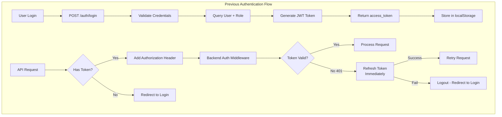
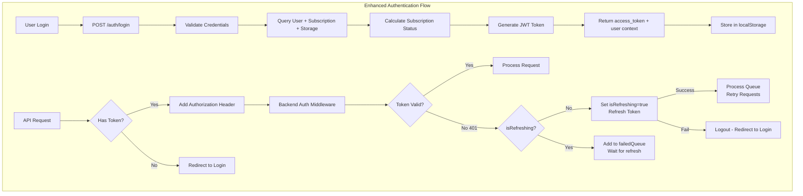

# Authentication, Sync, and Routing Enhancements

## Executive Summary

This document describes the features being added to `develop-subscription` from the `feature/auth-sync-routing-frontend` branch. These enhancements add robustness and functionality to three critical areas:
- **Frontend Authentication** - Enhanced token refresh queue and logout coordination
- **Backend Authentication** - Added subscription/storage data to auth flow
- **SPA Routing** - Added custom middleware for better frontend routing support
- **Background Jobs** - Added sync scheduler and S3 sync jobs


---

## Key Architectural Additions

### 1. Enhanced Authentication Flow

**Before:** Simple token refresh on 401 errors
**After:** Robust token refresh queue with logout coordination

**Benefits:**
- Prevents race conditions between logout and token refresh
- Queues concurrent 401 requests during token refresh (prevents duplicate refresh calls)
- Coordinates async operations between axios and auth utils
- More sophisticated error handling and state management

### 2. Subscription Logic Added to Auth

**Before:** Auth endpoint only returns user identity and role
**After:** Auth endpoint joins subscription, storage, and plan tables

**Benefits:**
- User context includes subscription status immediately upon authentication
- Single query provides complete user context (subscription + storage + role)
- Frontend can display subscription warnings without additional API calls
- Centralized subscription logic in auth layer

### 3. SPA Routing Middleware Added

**Before:** Standard frontend router handles all client-side routing
**After:** Custom ASGI middleware intercepts Accept: text/html requests

**Benefits:**
- Adds 113 lines of custom middleware to handle SPA routing edge cases
- Backend can serve index.html for SPA routes
- Better handling of deep-linking and browser refresh

### 4. Background Sync Jobs Added

**Before:** No background jobs (sync handled differently or not at all)
**After:** APScheduler runs periodic S3 sync jobs with file locking

**Benefits:**
- Automated background sync of S3 data to local storage
- File locking prevents concurrent sync operations
- Database tracking of sync status
- Retry logic with exponential backoff

---

## Architecture Overview

### Before: Previous Authentication Flow (develop-subscription)



**Limitations:**
- Multiple concurrent 401s trigger parallel refresh attempts
- No subscription/storage data in auth context
- Token refresh could interfere with logout
- No request queuing

### After: Enhanced Authentication Flow (feature/auth-sync-routing-frontend)



**Enhancements:**
- Single token refresh for concurrent 401s (with queue)
- Subscription/storage data in auth response
- Logout coordination prevents refresh during logout
- Request queuing ensures all requests retry after refresh

---

## Detailed Changes by Component

### 1. Frontend: Axios Interceptor Enhancement

**File:** `frontend/src/utils/axios.ts`

#### Before: Simple Token Refresh (22 lines)

```typescript
axios.interceptors.response.use(
  async (res) => res,
  async (error) => {
    if (error?.response?.status === 401) {
      try {
        const { access_token } = await refreshTokenApi()
        saveToken(access_token)
        error.config.headers.Authorization = `Bearer ${access_token}`
        return axiosLibrary(error.config)
      } catch (e) {
        if (axiosLibrary.isAxiosError(e) && e?.response?.status === 400) {
          logout()
        }
        throw e
      }
    }
    return Promise.reject(error)
  }
)
```

**Issues with Simple Approach:**
- Multiple concurrent 401s trigger parallel refresh attempts (inefficient)
- No coordination between concurrent requests
- Token refresh could interfere with logout process
- No request queuing during token refresh

#### After: Enhanced Token Refresh Queue (150+ lines)

```typescript
// Track logout state globally
let isLoggingOut = false
let isRefreshing = false
let failedQueue: Array<{resolve, reject}> = []

// Export function to coordinate logout
export const setLoggingOut = (value: boolean) => {
  isLoggingOut = value
  if (value) {
    // Clear the refresh queue when logging out
    processQueue(new Error("User is logging out"), null)
    isRefreshing = false
  }
}

// Queue requests during token refresh
axios.interceptors.response.use(
  async (res) => res,
  async (error) => {
    const originalRequest = error.config

    // Skip refresh if logging out
    if (isLoggingOut) {
      return Promise.reject(error)
    }

    if (error?.response?.status === 401 && !originalRequest._retry) {
      originalRequest._retry = true

      if (isRefreshing) {
        // Queue this request - wait for refresh to complete
        return new Promise((resolve, reject) => {
          failedQueue.push({ resolve, reject })
        })
          .then((token) => {
            originalRequest.headers.Authorization = `Bearer ${token}`
            return axiosLibrary(originalRequest)
          })
          .catch((err) => Promise.reject(err))
      }

      isRefreshing = true

      try {
        const { access_token } = await refreshTokenApi()
        saveToken(access_token)

        // Process queued requests
        processQueue(null, access_token)

        originalRequest.headers.Authorization = `Bearer ${access_token}`
        return axiosLibrary(originalRequest)
      } catch (e) {
        processQueue(e, null)
        if (axiosLibrary.isAxiosError(e) && e?.response?.status === 400) {
          logout()
        }
        throw e
      } finally {
        isRefreshing = false
      }
    }
    return Promise.reject(error)
  }
)
```

**Benefits:**
- ✅ Single token refresh for concurrent 401s (efficient)
- ✅ Queues requests during refresh (no duplicate refresh attempts)
- ✅ Coordinates with logout to prevent race conditions
- ✅ Processes all queued requests after successful refresh

---

### 2. Frontend: Auth Utils Enhancement

**File:** `frontend/src/utils/auth/AuthUtils.ts`

#### Before: Synchronous Logout (7 lines)

```typescript
export const logout = () => {
  removeRefreshToken()
  removeToken()
  removeExToken()
  window.location.href = "/login"
}
```

**Issues:**
- No coordination with axios interceptor
- Token refresh could happen after logout starts
- No cleanup of session storage

#### After: Coordinated Async Logout (29 lines)

```typescript
export const logout = async () => {
  // Dynamic import to avoid circular dependency
  const setLoggingOut = await getSetLoggingOut()
  setLoggingOut(true)  // Signal axios interceptor

  removeRefreshToken()
  removeToken()
  removeExToken()

  // Clear all session data
  localStorage.removeItem("dismissedWarnings")
  sessionStorage.removeItem("storage-refreshed-on-login")

  // Reset flag immediately after token removal
  setLoggingOut(false)

  window.location.href = "/login"
}

// Helper to avoid circular dependency
const getSetLoggingOut = async () => {
  const axiosModule = await import("@/utils/axios")
  return axiosModule.setLoggingOut
}
```

**Benefits:**
- ✅ Coordinates with axios interceptor via setLoggingOut flag
- ✅ Clears session storage and warnings
- ✅ Prevents token refresh during logout
- ✅ Handles circular dependency with dynamic import

---

### 3. Frontend: Layout Component Enhancement

**File:** `frontend/src/components/Layout/index.tsx`

#### Before: Single Token Check (52 lines)

```typescript
const checkAuth = async () => {
  if (user) {
    if (loading) setLoading(false)
    return
  }

  const token = getToken()
  const isLogin = location.pathname === "/login"

  try {
    if (token) {
      await dispatch(getMe())
      // ... storage refresh ...
      if (isLogin) navigate("/dashboard")
      return
    } else if (!isLogin) {
      throw new Error("fail auth")
    }
  } catch {
    navigate("/login", { replace: true })
  } finally {
    if (loading) setLoading(false)
  }
}
```

**Issues:**
- No protection against logout race conditions during async operations
- Token could be removed while getMe() or storage refresh is running
- No revalidation of token after async operations

#### After: Multiple Token Revalidations (135 lines)

```typescript
const checkAuth = async () => {
  const token = getToken()

  // 1. Revalidate before fetching user
  if (!token) {
    navigate("/login")
    return
  }

  await dispatch(getMe())

  // 2. Revalidate after fetching user
  let currentToken = getToken()
  if (!currentToken) {
    console.warn("Token removed during getMe - logout in progress")
    return  // Exit - logout will handle navigation
  }

  await refreshAllWorkspacesStorageApi()

  // 3. Revalidate after storage refresh
  currentToken = getToken()
  if (!currentToken) {
    console.warn("Token removed during storage refresh - logout in progress")
    return  // Exit - logout will handle navigation
  }

  // 4. Revalidate before navigation
  currentToken = getToken()
  if (!currentToken) {
    console.warn("Token removed before navigation - logout in progress")
    return
  }

  // Safe to navigate
  if (location.pathname === "/login") {
    navigate("/dashboard")
  }
}
```

**Benefits:**
- ✅ Detects logout during async operations
- ✅ Multiple token checks prevent race conditions
- ✅ Graceful handling of token removal mid-flow
- ✅ Prevents navigation with stale token

---

### 4. Backend: Auth Dependencies Enhancement

**File:** `studio/app/common/core/auth/auth_dependencies.py`

#### Before: Simple User Query

```python
def __get_current_user_record(db: Session, uid: str):
    user_data = (
        db.query(
            UserModel,
            func.min(UserRoleModel.role_id),
            # ... capacity calculations only ...
        )
        .outerjoin(WorkspaceCapacity, ...)
        .outerjoin(ExperimentCapacity, ...)
        .outerjoin(UserRoleModel, ...)
        .filter(UserModel.uid == uid)
        .first()
    )

    return user_data  # Returns: (user, role_id, data_usage)
```

**Issues:**
- Subscription data not available in auth context
- Frontend needs separate API calls for subscription status
- Storage quota not available for middleware/auth checks

#### After: Complex User Query with Subscription Joins

```python
def __get_current_user_record(db: Session, uid: str):
    user_data = (
        db.query(
            UserModel,
            func.min(UserRoleModel.role_id),
            # ... capacity calculations ...
            func.max(SubscriptionPlans.name).label("subscription_plan_name"),
            UserStorageUsage.storage_usage_bytes,
            UserStorageUsage.storage_quota_bytes,
            func.max(UserSubscription.expiration).label("subscription_expiration"),
            func.max(UserSubscription.plan_id).label("subscription_plan_id"),
        )
        .outerjoin(UserSubscription, UserModel.id == UserSubscription.user_id)
        .outerjoin(SubscriptionPlans, UserSubscription.plan_id == SubscriptionPlans.id)
        .outerjoin(UserStorageUsage, UserModel.id == UserStorageUsage.user_id)
        .outerjoin(WorkspaceCapacity, ...)
        .outerjoin(ExperimentCapacity, ...)
        .outerjoin(UserRoleModel, ...)
        .filter(UserModel.uid == uid)
        .group_by(UserModel.id)  # Required for aggregation
        .first()
    )

    # Calculate subscription status, grace period, days remaining
    # (70+ lines of status calculation logic)
    now = datetime.now(timezone.utc)
    if subscription_expiration and subscription_plan_id:
        days_remaining = (subscription_expiration - now).days

        if subscription_plan_id == 1:  # Free plan
            authed_user.subscription_status = "Free"
        elif subscription_plan_id == 2:  # Premium plan
            if days_remaining > 0:
                authed_user.subscription_status = "Premium"
            elif days_remaining >= -30:  # Grace period
                authed_user.subscription_status = "LimitGrace"
                authed_user.subscription_days_remaining = 30 + days_remaining
            else:
                authed_user.subscription_status = "Expired"

    return user_data
```

**Benefits:**
- ✅ Complete user context in single query (auth + subscription + storage)
- ✅ Subscription status available for middleware decisions
- ✅ Storage quota available for upload validation
- ✅ Grace period calculation handles expired subscriptions

**Return Value Additions:**

| Field                         | Before | After     |
|-------------------------------|--------|-----------|
| `user`                        | ✅     | ✅         |
| `role_id`                     | ✅     | ✅         |
| `data_usage`                  | ✅     | ✅         |
| `subscription_plan_name`      | ❌     | ✅ Added  |
| `storage_usage_bytes`         | ❌     | ✅ Added  |
| `storage_quota_bytes`         | ❌     | ✅ Added  |
| `storage_usage_percent`       | ❌     | ✅ Added  |
| `subscription_status`         | ❌     | ✅ Added  |
| `subscription_days_remaining` | ❌     | ✅ Added  |

---

### 5. Backend: Auth Router Enhancement

**File:** `studio/app/common/routers/auth.py`

#### Before: Simple Login

```python
async def login(user_data: UserAuth, db: Session = Depends(get_db)):
    # ... authentication ...

    # Download experiments metadata (using user.remote_bucket_name directly)
    async with RemoteStorageSimpleReader(
        user.remote_bucket_name
    ) as remote_storage_controller:
        await remote_storage_controller.download_all_experiments_metas()
```

**Issues:**
- No storage/subscription warnings at login
- No bucket name fallback logic
- Limited visibility into user limits

#### After: Login with Limit Warning Calculation

```python
async def login(user_data: UserAuth, db: Session = Depends(get_db)):
    # ... authentication ...

    # Calculate bucket name with fallback
    remote_bucket_name = _get_user_remote_bucket_name(user)

    # Download experiments metadata
    await remote_storage_controller.download_all_experiments_metas()

    # Check for limit warnings (storage, subscription)
    try:
        limit_warning = await calculate_limit_warning(user.id)
        if limit_warning:
            logger.warning(f"User has {limit_warning['warning_type']} warning")
            # Warning included in login response for frontend display
    except Exception as e:
        logger.warning(f"Failed to check limit warning: {e}")
```

**Benefits:**
- ✅ Proactive limit warnings at login
- ✅ Bucket name fallback logic handles edge cases
- ✅ Frontend can display warnings immediately
- ✅ Better logging of user limit status

---

### 6. Backend: SPA Routing Middleware Added

**File:** `studio/app/common/core/middleware/spa_routing_middleware.py` (NEW - 113 lines)

#### What Was Added

```python
class SPARoutingMiddleware:
    """
    Intercepts requests with Accept: text/html and serves index.html
    for SPA routes like /workspaces, /dashboard, etc.

    This ensures that:
    1. Browser refresh on SPA routes serves the app (not 404)
    2. Deep linking works correctly
    3. Backend API routes are not intercepted
    """

    def _should_serve_spa(self, scope: Scope) -> bool:
        # Check if request accepts text/html (browser navigation)
        # Don't intercept /static/, /images/, /docs, /health
        path = scope.get("path", "")

        # Skip API routes
        if path.startswith("/api/"):
            return False

        # Skip static assets
        if any(path.startswith(prefix) for prefix in ["/static/", "/images/", "/docs"]):
            return False

        # Check Accept header for text/html
        headers = dict(scope.get("headers", []))
        accept = headers.get(b"accept", b"").decode()
        return "text/html" in accept

    async def _serve_index_html(self, scope: Scope) -> Response:
        # Serve index.html from build directory
        index_path = Path(settings.STATIC_DIR) / "index.html"
        return FileResponse(index_path)
```

**Why It Was Added:**

1. **SPA Routing Support**
   - Handles browser refresh on client-side routes
   - Serves index.html for routes like /workspaces, /dashboard
   - Prevents 404 errors on deep links

2. **Backend/Frontend Separation**
   - Clear distinction between API routes (/api/*) and SPA routes
   - Static assets served directly
   - SPA routes get index.html

3. **Better User Experience**
   - Refresh works on any page
   - Bookmarks/deep links work correctly
   - No 404 errors for SPA routes

---

### 7. Backend: Background Sync Jobs Added

#### Files Added:

1. **`studio/app/common/core/background/sync_job.py`** (432 lines)
   - S3 sync job with file locking
   - Parallel downloads with semaphore (max 3 concurrent)
   - Retry logic with exponential backoff
   - CloudWatch metrics publishing

2. **`studio/app/common/core/background/scheduler.py`** (160 lines)
   - APScheduler wrapper for job management
   - S3 configuration validation
   - Job lifecycle (add/start/shutdown)

3. **`studio/app/common/core/background/__init__.py`**
   - Exports for background job system

4. **`studio/alembic/versions/a5b9c8d7e6f5_add_sync_logout_and_versioning.py`** (91 lines)
   - Migration adding `local_sync_status` to experiments (VARCHAR(20): pending, synced, error)
   - Migration adding `logged_out_at` to free user assignments (TIMESTAMP)
   - Migration adding `version` for optimistic locking (INTEGER)

#### What Background Jobs Do:

```python
class PublishedExperimentSyncJob:
    """
    Runs every 5 minutes to sync published experiments from S3 to local storage.

    Operations:
    1. Acquire file lock to prevent concurrent runs
    2. Query published experiments with local_sync_status='pending'
    3. Download from S3 to local storage (parallel, max 3 concurrent)
    4. Update sync status in database (pending → synced/error)
    5. Retry failed syncs with exponential backoff
    6. Publish CloudWatch metrics
    """

    def run(self):
        # Acquire file lock
        with FileLock(SYNC_LOCK_FILE):
            # Get pending experiments
            pending = db.query(ExperimentRecord).filter(
                ExperimentRecord.publish_status == 'on',
                ExperimentRecord.local_sync_status.in_(['pending', 'error'])
            ).limit(10).all()

            # Sync in parallel (max 3 concurrent)
            with Semaphore(3):
                for exp in pending:
                    self._sync_experiment(exp)

            # Publish metrics
            self._publish_cloudwatch_metrics()
```

**Database Schema Added:**

```sql
-- experiment_records table
ALTER TABLE experiment_records
  ADD COLUMN local_sync_status VARCHAR(20) DEFAULT 'pending',
  ADD COLUMN version INTEGER DEFAULT 0;

CREATE INDEX idx_local_sync_status ON experiment_records(local_sync_status);
CREATE INDEX idx_publish_sync_status ON experiment_records(publish_status, local_sync_status);

-- free_user_assignments table
ALTER TABLE free_user_assignments
  ADD COLUMN logged_out_at TIMESTAMP NULL;

CREATE INDEX idx_logged_out_at ON free_user_assignments(logged_out_at);
```

**Why It Was Added:**

1. **Automated Sync** - Background job automatically syncs S3 to local
2. **Reliability** - File locking prevents race conditions, retry logic handles transient failures
3. **Visibility** - Database tracking shows sync status, CloudWatch metrics for monitoring
4. **Performance** - Parallel downloads (max 3) balance speed vs resource usage
5. **Optimistic Locking** - Version field prevents concurrent update conflicts

---

## Flow Diagrams

### 1. Login Flow (Before vs After)

#### Before: Simple Login

```
┌─────────────────────────────────────────────────────────────┐
│ 1. User Submits Login Form                                 │
└─────────────────────────────────────────────────────────────┘
                         ↓
┌─────────────────────────────────────────────────────────────┐
│ 2. POST /auth/login                                         │
│    → Validate credentials                                   │
│    → Query user + role + data_usage (2 table joins)         │
└─────────────────────────────────────────────────────────────┘
                         ↓
┌─────────────────────────────────────────────────────────────┐
│ 3. Download Experiments Metadata from S3                    │
│    → Use user.remote_bucket_name directly                   │
│    → remote_storage_controller.download_all_experiments()   │
└─────────────────────────────────────────────────────────────┘
                         ↓
┌─────────────────────────────────────────────────────────────┐
│ 4. Return JWT Token                                         │
│    → Frontend stores in localStorage                        │
└─────────────────────────────────────────────────────────────┘
```

#### After: Enhanced Login with Subscription

```
┌─────────────────────────────────────────────────────────────┐
│ 1. User Submits Login Form                                 │
└─────────────────────────────────────────────────────────────┘
                         ↓
┌─────────────────────────────────────────────────────────────┐
│ 2. POST /auth/login                                         │
│    → Validate credentials                                   │
│    → Query user + subscription + storage (6 table joins)    │
│    → Calculate subscription status, grace period, etc.      │
└─────────────────────────────────────────────────────────────┘
                         ↓
┌─────────────────────────────────────────────────────────────┐
│ 3. Get User Remote Bucket (with fallback logic)            │
│    → _get_user_remote_bucket_name(user)                     │
└─────────────────────────────────────────────────────────────┘
                         ↓
┌─────────────────────────────────────────────────────────────┐
│ 4. Download Experiments Metadata from S3                    │
│    → remote_storage_controller.download_all_experiments()   │
└─────────────────────────────────────────────────────────────┘
                         ↓
┌─────────────────────────────────────────────────────────────┐
│ 5. Calculate Limit Warnings                                 │
│    → calculate_limit_warning(user.id)                       │
│    → Check storage quota, subscription expiration           │
│    → Include warnings in response                           │
└─────────────────────────────────────────────────────────────┘
                         ↓
┌─────────────────────────────────────────────────────────────┐
│ 6. Return JWT Token + User Context                          │
│    → Frontend stores in localStorage                        │
│    → User context includes subscription + storage           │
└─────────────────────────────────────────────────────────────┘
```

**Additions:**
- 3 additional table joins (subscription, plans, storage)
- Subscription status calculation
- Limit warning calculation
- Richer user context in response

---

### 2. Token Refresh Flow (Before vs After)

#### Before: Simple Token Refresh

```
┌─────────────────────────────────────────────────────────────┐
│ Request 1: GET /api/workspaces → 401 Unauthorized          │
│ Request 2: GET /api/experiments → 401 Unauthorized         │
│ Request 3: GET /api/users → 401 Unauthorized               │
└─────────────────────────────────────────────────────────────┘
                         ↓
┌─────────────────────────────────────────────────────────────┐
│ Axios Interceptor (All Requests, Parallel)                  │
│    → Call refreshTokenApi()                                 │
│    → saveToken(access_token)                                │
│    → Retry with new token                                   │
└─────────────────────────────────────────────────────────────┘
```

**Issues:**
- Multiple concurrent refresh API calls (inefficient)
- No coordination between requests

#### After: Enhanced Token Refresh with Queue

```
┌─────────────────────────────────────────────────────────────┐
│ Request 1: GET /api/workspaces → 401 Unauthorized          │
│ Request 2: GET /api/experiments → 401 Unauthorized         │
│ Request 3: GET /api/users → 401 Unauthorized               │
└─────────────────────────────────────────────────────────────┘
                         ↓
┌─────────────────────────────────────────────────────────────┐
│ Axios Interceptor (Request 1)                               │
│    → Check isLoggingOut flag → False                        │
│    → Check isRefreshing flag → False                        │
│    → Set isRefreshing = true                                │
│    → Call refreshTokenApi()                                 │
└─────────────────────────────────────────────────────────────┘
                         ↓
┌─────────────────────────────────────────────────────────────┐
│ Axios Interceptor (Request 2, 3)                            │
│    → Check isRefreshing flag → True                         │
│    → Add to failedQueue (wait for refresh)                  │
└─────────────────────────────────────────────────────────────┘
                         ↓
┌─────────────────────────────────────────────────────────────┐
│ Refresh Token API Success                                   │
│    → saveToken(access_token)                                │
│    → processQueue(null, access_token)                       │
│    → Retry Request 1 with new token                         │
│    → Retry Request 2, 3 from queue                          │
│    → Set isRefreshing = false                               │
└─────────────────────────────────────────────────────────────┘
```

**Benefits:**
- ✅ Single refresh API call for concurrent 401s (efficient)
- ✅ Queues requests during refresh
- ✅ Coordinates all requests after successful refresh

---

### 3. Logout Flow (Before vs After)

#### Before: Simple Logout

```
┌─────────────────────────────────────────────────────────────┐
│ 1. User Clicks Logout                                       │
└─────────────────────────────────────────────────────────────┘
                         ↓
┌─────────────────────────────────────────────────────────────┐
│ 2. logout() Function (synchronous)                          │
│    → removeRefreshToken()                                   │
│    → removeToken()                                          │
│    → removeExToken()                                        │
└─────────────────────────────────────────────────────────────┘
                         ↓
┌─────────────────────────────────────────────────────────────┐
│ 3. Redirect to Login (Immediate)                            │
│    → window.location.href = "/login"                        │
│    → Page navigation cancels all pending requests           │
└─────────────────────────────────────────────────────────────┘
```

**Issues:**
- No coordination with axios interceptor
- Token refresh could start after logout
- No cleanup of session storage

#### After: Coordinated Logout

```
┌─────────────────────────────────────────────────────────────┐
│ 1. User Clicks Logout                                       │
└─────────────────────────────────────────────────────────────┘
                         ↓
┌─────────────────────────────────────────────────────────────┐
│ 2. logout() Function (async)                                │
│    → Dynamic import: getSetLoggingOut()                     │
│    → setLoggingOut(true) [Signal to axios interceptor]      │
└─────────────────────────────────────────────────────────────┘
                         ↓
┌─────────────────────────────────────────────────────────────┐
│ 3. Clear Tokens and Session Data                            │
│    → removeRefreshToken()                                   │
│    → removeToken()                                          │
│    → removeExToken()                                        │
│    → localStorage.removeItem("dismissedWarnings")           │
│    → sessionStorage.removeItem("storage-refreshed-on-login")│
└─────────────────────────────────────────────────────────────┘
                         ↓
┌─────────────────────────────────────────────────────────────┐
│ 4. Reset Logout Flag                                        │
│    → setLoggingOut(false)                                   │
└─────────────────────────────────────────────────────────────┘
                         ↓
┌─────────────────────────────────────────────────────────────┐
│ 5. Redirect to Login                                        │
│    → window.location.href = "/login"                        │
└─────────────────────────────────────────────────────────────┘
                         ↓
┌─────────────────────────────────────────────────────────────┐
│ Axios Interceptor (Concurrent Requests)                     │
│    → Check isLoggingOut flag → True                         │
│    → Skip token refresh                                     │
│    → Reject request                                         │
└─────────────────────────────────────────────────────────────┘
```

**Benefits:**
- ✅ Coordinates with axios interceptor
- ✅ Prevents token refresh during logout
- ✅ Cleans up session storage
- ✅ Clear request queue during logout

---

### 4. Background Sync Flow (NEW)

This entire flow is added:

```
┌─────────────────────────────────────────────────────────────┐
│ APScheduler Trigger (Every 5 Minutes)                       │
└─────────────────────────────────────────────────────────────┘
                         ↓
┌─────────────────────────────────────────────────────────────┐
│ 1. Acquire File Lock (fcntl.flock)                          │
│    → Check for stale locks (>1 hour)                        │
│    → Write PID to lock file                                 │
│    → Exit if another instance running                       │
└─────────────────────────────────────────────────────────────┘
                         ↓
┌─────────────────────────────────────────────────────────────┐
│ 2. Query Pending Experiments                                │
│    → SELECT * FROM experiment_records                       │
│    → WHERE publish_status = 'on'                            │
│    → AND local_sync_status IN ('pending', 'error')          │
│    → LIMIT 10                                               │
└─────────────────────────────────────────────────────────────┘
                         ↓
┌─────────────────────────────────────────────────────────────┐
│ 3. Sync Experiments (Parallel, Max 3 Concurrent)            │
│    → Download from S3 with exponential backoff retry        │
│    → Update local_sync_status = 'synced' or 'error'         │
│    → Increment retry count on failure                       │
└─────────────────────────────────────────────────────────────┘
                         ↓
┌─────────────────────────────────────────────────────────────┐
│ 4. Publish CloudWatch Metrics                               │
│    → ExperimentsSynced                                      │
│    → SyncErrors                                             │
│    → SyncErrorRate                                          │
└─────────────────────────────────────────────────────────────┘
                         ↓
┌─────────────────────────────────────────────────────────────┐
│ 5. Release Lock and Cleanup                                 │
│    → fcntl.flock(UNLOCK)                                    │
│    → Delete lock file                                       │
└─────────────────────────────────────────────────────────────┘
```

**Added Infrastructure:**
- APScheduler dependency
- File locking system (prevents concurrent runs)
- CloudWatch metrics integration
- Database fields (local_sync_status, version, logged_out_at)
- 3 new database indexes

---

## Edge Case Handling

### 1. Concurrent 401 Errors (Token Refresh)

**Problem:** Multiple API calls could receive 401 simultaneously.

**Solution Added:** Request queueing during token refresh:
- First 401 triggers refresh (sets isRefreshing = true)
- Subsequent 401s added to failedQueue
- After successful refresh, all queued requests retried
- Single token refresh serves all concurrent requests

### 2. Logout During Token Refresh

**Problem:** User could logout while token refresh in progress.

**Solution Added:** Logout coordination flag:
```typescript
export const setLoggingOut = (value: boolean) => {
  isLoggingOut = value
  if (value) {
    // Clear the refresh queue when logging out
    processQueue(new Error("User is logging out"), null)
    isRefreshing = false
  }
}
```

- Axios interceptor checks isLoggingOut before refresh
- Logout clears failedQueue
- Prevents refresh from completing after logout starts

### 3. Token Removal During Async Operations

**Problem:** Token could be removed while Layout component fetches user/storage data.

**Solution Added:** Multiple token revalidations:
- Check token before getMe()
- Check token after getMe()
- Check token after storage refresh
- Check token before navigation
- Exit gracefully if token removed (logout in progress)

### 4. Concurrent Background Sync Jobs

**Problem:** Multiple instances could try to sync simultaneously.

**Solution Added:** File-based locking:
```python
with FileLock(SYNC_LOCK_FILE, timeout=10):
    # Sync logic here
    # Only one instance can acquire lock
```

- fcntl.flock provides OS-level lock
- Stale locks cleaned up (>1 hour old)
- PID written to lock file for debugging

### 5. Subscription Expiration Edge Cases

**Problem:** Subscription could expire during user session.

**Solution Added:** Grace period calculation:
```python
if days_remaining > 0:
    status = "Premium"
elif days_remaining >= -30:  # Grace period
    status = "LimitGrace"
    days_remaining = 30 + days_remaining  # Days left in grace
else:
    status = "Expired"
```

- 30-day grace period after expiration
- Status transitions: Premium → LimitGrace → Expired
- Days remaining tracks grace period countdown

---

## Configuration

### Environment Variables

**Backend (Auth + Sync):**
```bash
# Database
RDS_HOST                    # Database endpoint (via RDS Proxy)
RDS_USER                    # Database username
RDS_PASSWORD                # Database password
RDS_DATABASE                # Database name

# S3 Storage
S3_BUCKET_NAME              # S3 bucket for experiment data
S3_REGION                   # AWS region for S3

# Sync Job Configuration
SYNC_JOB_ENABLED            # Enable/disable background sync (default: true)
SYNC_JOB_INTERVAL           # Sync interval in minutes (default: 5)
SYNC_CONCURRENCY            # Max concurrent downloads (default: 3)
SYNC_LOCK_FILE              # Path to lock file (default: /tmp/sync.lock)
```

### Database Schema Additions

**Experiments Table:**
```sql
ALTER TABLE experiment_records
  ADD COLUMN local_sync_status VARCHAR(20) DEFAULT 'pending',
  ADD COLUMN version INTEGER DEFAULT 0;

CREATE INDEX idx_local_sync_status ON experiment_records(local_sync_status);
CREATE INDEX idx_publish_sync_status ON experiment_records(publish_status, local_sync_status);
```

**Free User Assignments Table:**
```sql
ALTER TABLE free_user_assignments
  ADD COLUMN logged_out_at TIMESTAMP NULL;

CREATE INDEX idx_logged_out_at ON free_user_assignments(logged_out_at);
```
