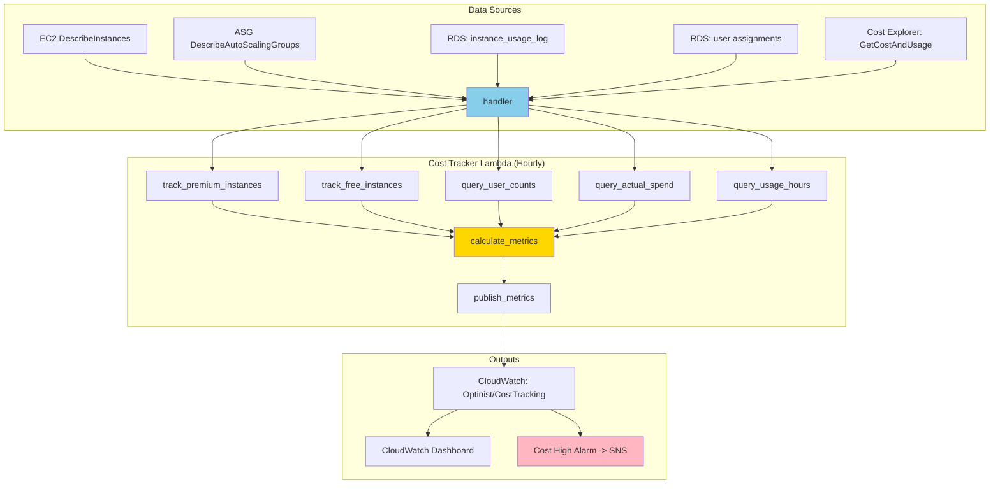
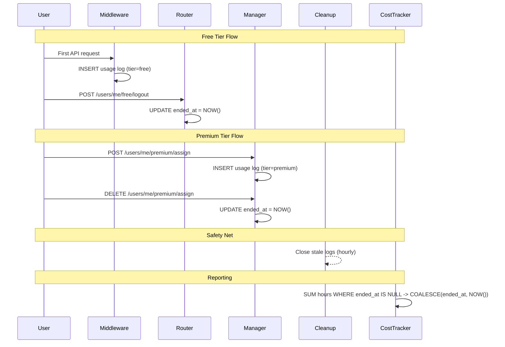

# Cost Tracking: Usage-Based Cost Metrics and Budget Monitoring

## Executive Summary

- **Cost Tracker Lambda** publishes hourly cost and utilization metrics to the `Optinist/CostTracking` CloudWatch namespace
- **Usage-based cost reporting** uses the `instance_usage_log` table to compute per-user costs from actual session hours rather than assuming 24/7 usage
- **Actual AWS spend** queried from Cost Explorer and compared against projected budget to trigger cost alarms
- **Session lifecycle** tracked across all user flows (login, logout, cleanup, assignment, release) to ensure accurate hour accounting
- **CloudWatch dashboard** shows spend vs. budget on the left axis and instance/user counts on the right axis

---

## Key Architectural Principles

1. **Measure Actual Usage, Not Theoretical Maximums**
   - Per-user cost is derived from real session hours recorded in `instance_usage_log`
   - Cost Explorer provides ground-truth month-to-date spend

2. **Session Lifecycle Completeness**
   - Every code path that creates or destroys a user session also creates or closes a usage log entry
   - `ended_at IS NULL` means an active session; `COALESCE(ended_at, NOW())` handles open sessions in queries
   - Crash safety: usage logs are closed BEFORE assignment records are deleted

3. **Least-Privilege Lambda**
   - Cost Tracker has its own IAM role (`subscr-cost-tracker-lambda-role`) separate from the premium manager
   - Only permissions granted: CloudWatch metrics, EC2 Describe, ASG Describe, Cost Explorer

4. **Hourly Cadence with Daily Alarm Evaluation**
   - Lambda runs hourly to keep metrics fresh
   - Cost alarm evaluates on a 24-hour period to avoid noisy alerts from hourly fluctuations

---

## Architecture Overview



### Responsibility Matrix

| Responsibility                     | Cost Tracker       | Premium Manager    | Premium Cleanup    | Middleware         |
|------------------------------------|--------------------|--------------------|--------------------|--------------------|
| Publish cost/budget metrics        | Yes - Exclusive    | No                 | No                 | No                 |
| Query Cost Explorer                | Yes - Exclusive    | No                 | No                 | No                 |
| Create usage log (premium)         | No                 | Yes                | No                 | No                 |
| Create usage log (free)            | No                 | No                 | No                 | Yes                |
| Close usage log (premium release)  | No                 | Yes                | Yes (stale)        | No                 |
| Close usage log (free logout)      | No                 | No                 | No                 | No (router does)   |
| Close usage log (free cleanup)     | No                 | No                 | No                 | No (cleanup job)   |
| Query usage hours                  | Yes                | No                 | No                 | No                 |

---

## Implementation Details

### Cost Tracker Lambda

**File:** `infrastructure/terraform/cost_tracker_package/cost_tracker.py`

#### Handler: `handler()`

Orchestrates 6 steps sequentially on each hourly invocation:

```
┌───────────────────────────────────────────────────────────┐
│ 1. Collect premium instance counts (EC2 DescribeInstances)│
│    → Filter: tag Service=premium-tier                     │
└───────────────────────────────────────────────────────────┘
                         ↓
┌───────────────────────────────────────────────────────────┐
│ 2. Collect free instance counts (ASG)                     │
│    → InService instances from auto scaling group          │
└───────────────────────────────────────────────────────────┘
                         ↓
┌───────────────────────────────────────────────────────────┐
│ 3. Query active user counts from RDS                      │
│    → free_user_assignments + premium_user_assignments     │
└───────────────────────────────────────────────────────────┘
                         ↓
┌───────────────────────────────────────────────────────────┐
│ 4. Query actual month-to-date spend (Cost Explorer)       │
│    → UnblendedCost for current month                      │
└───────────────────────────────────────────────────────────┘
                         ↓
┌───────────────────────────────────────────────────────────┐
│ 5. Query session hours from instance_usage_log            │
│    → SUM(TIMESTAMPDIFF) grouped by tier                   │
└───────────────────────────────────────────────────────────┘
                         ↓
┌───────────────────────────────────────────────────────────┐
│ 6. Calculate derived metrics and publish to CloudWatch    │
│    → Per-user costs, utilization, budget projections      │
└───────────────────────────────────────────────────────────┘
```

#### calculate_metrics()

**File:** `infrastructure/terraform/cost_tracker_package/cost_tracker.py`
**Purpose:** Derive per-user costs, utilization rates, and budget projections from raw data
**Input:** Instance counts, user counts, actual spend, usage hours
**Output:** Dict with all derived metric values

Key formulas:

- **Cost per premium user:** `(premium_session_hours * PREMIUM_HOURLY_RATE) / premium_user_count`
- **Cost per free user:** `(free_session_hours * FREE_HOURLY_RATE) / free_user_count`
- **Projected monthly spend:** `(actual_spend / days_elapsed) * days_in_month`

### Usage Log Lifecycle

**Table:** `instance_usage_log`



#### Where Usage Logs Are Created

| Trigger | File | Tier | Condition |
|---------|------|------|-----------|
| First free user activity | `studio/app/common/core/middleware/user_activity_middleware.py` | free | New assignment (rowcount == 0) |
| Premium assignment | `infrastructure/terraform/premium_manager_package/premium_manager.py` | premium | Non-standby assignment |

#### Where Usage Logs Are Closed

| Trigger | File | Tier |
|---------|------|------|
| Free user logout | `studio/app/common/routers/users_me.py` | free |
| Free cleanup (mark cleaned) | `studio/app/common/core/background/cleanup_job.py` | free |
| Free cleanup (orphaned) | `studio/app/common/core/background/cleanup_job.py` | free |
| Free-to-premium migration | `infrastructure/terraform/premium_manager_package/premium_manager.py` | free |
| Premium user release | `infrastructure/terraform/premium_manager_package/premium_manager.py` | premium |
| Premium stale cleanup | `infrastructure/terraform/premium_cleanup_package/premium_cleanup.py` | premium |
| Premium test cleanup | `infrastructure/terraform/premium_cleanup_package/premium_cleanup.py` | premium |

---

## Edge Case Handling

### 1. Application Crash Before Session Close

**Problem:** If the application crashes, `ended_at` remains NULL and session hours keep accumulating.

**Solution:** Multiple safety nets:
- Cost tracker query uses `COALESCE(ended_at, NOW())` so open sessions are counted accurately up to query time
- Premium Cleanup runs hourly and closes stale premium sessions
- Data Cleanup Job closes orphaned free sessions

### 2. First Day of Month (No Cost Explorer Data)

**Problem:** Cost Explorer's end date is exclusive; on the 1st, `Start == End` is invalid.

**Solution:** `query_actual_spend()` returns `0.0` when `first_of_month == today`, avoiding an API error.

### 3. Division by Zero in Metric Calculations

**Problem:** Zero users or zero instances would cause division errors.

**Solution:** All division operations are guarded:
- `days_elapsed = max(..., 0.01)` prevents zero denominator for daily rate
- Per-user costs return `0.0` when user count is zero
- Utilization returns `0.0` when capacity is zero

### 4. Duplicate Active Sessions

**Problem:** Concurrent middleware requests could create duplicate usage log entries for the same user.

**Solution:** The `FreeUserAssignment` INSERT uses a transaction; if the assignment INSERT fails with `IntegrityError`, the entire transaction (including the usage log INSERT) rolls back. Premium assignments are single-threaded per user through the Lambda.

### 5. Cost Explorer API Costs

**Problem:** Cost Explorer charges $0.01 per API request (~$7.30/month at hourly cadence).

**Solution:** This is an accepted operational cost. The metric provides ground-truth spend data that cannot be derived from other sources.

---

## Constants

| Constant | Value | Source | Purpose |
|----------|-------|--------|---------|
| `PREMIUM_HOURLY_RATE` | `0.1088` | Env var (default) | t3.large on-demand rate in ap-northeast-1 (as of March 2026) |
| `FREE_HOURLY_RATE` | `0.1088` | Env var (default) | Same instance type for free tier (as of March 2026) |

These rates are used to convert session hours into estimated cost:

```
cost_per_premium_user = (premium_session_hours * PREMIUM_HOURLY_RATE) / premium_user_count
cost_per_free_user    = (free_session_hours * FREE_HOURLY_RATE) / free_user_count
```

---

## Formulas

### Projected Monthly Spend

```
days_elapsed    = (current_day - 1) + (current_hour / 24)   # min 0.01
daily_rate      = actual_spend / days_elapsed
projected_monthly = daily_rate * days_in_month
```

- `actual_spend` comes from Cost Explorer (`UnblendedCost`, month-to-date)
- Published as the `ExpectedMonthlyBudget` metric

### Per-User Cost

```
premium_total_cost    = premium_session_hours_mtd * PREMIUM_HOURLY_RATE
cost_per_premium_user = premium_total_cost / premium_user_count   (0 if no users)

free_total_cost       = free_session_hours_mtd * FREE_HOURLY_RATE
cost_per_free_user    = free_total_cost / free_user_count          (0 if no users)
```

- Session hours are aggregated from `instance_usage_log` using `COALESCE(ended_at, NOW())`

### Utilization

```
premium_utilization = (active_premium_users / running_premium_instances) * 100
free_utilization    = (active_free_users / (running_free_instances * 5)) * 100
```

- Free tier assumes 5 users per instance

---

## Monitoring and Metrics

### CloudWatch Metrics Published

**Namespace:** `Optinist/CostTracking`
**Frequency:** Hourly (via EventBridge `rate(1 hour)`)

| Metric Name | Formula / Source | Unit |
|-------------|-----------------|------|
| `PremiumInstanceCount` | EC2 DescribeInstances (tag `Service=premium-tier`, state `running`) | Count |
| `FreeInstanceCount` | ASG InService instance count | Count |
| `ActivePremiumUsers` | `SELECT COUNT(*) FROM premium_user_assignments WHERE status='active' AND is_standby=0` | Count |
| `ActiveFreeUsers` | `SELECT COUNT(*) FROM free_user_assignments` | Count |
| `ActualMonthToDateSpend` | Cost Explorer `UnblendedCost` for current month | USD |
| `ExpectedMonthlyBudget` | `(actual_spend / days_elapsed) * days_in_month` | USD |
| `CostPerPremiumUser` | `(premium_hours * PREMIUM_HOURLY_RATE) / premium_users` | USD |
| `CostPerFreeUser` | `(free_hours * FREE_HOURLY_RATE) / free_users` | USD |
| `PremiumUtilization` | `premium_users / premium_instances * 100` | Percent |
| `FreeUtilization` | `free_users / (free_instances * 5) * 100` | Percent |
| `PremiumSessionHoursMTD` | `SUM(TIMESTAMPDIFF(...)) FROM instance_usage_log WHERE tier='premium'` | Count |

### CloudWatch Alarms

#### Cost Alarm: `subscr-monthly-cost-high`

| Property | Value |
|----------|-------|
| **Metric** | `ExpectedMonthlyBudget` (daily max) |
| **Threshold** | `var.monthly_budget_usd` (set in `terraform.tfvars`, not in repo) |
| **Condition** | Projected monthly spend > budget |
| **Evaluation** | 1 × 24h period |
| **Action (ALARM)** | SNS `subscr-optinist-critical-alerts` → email `support@araya-optinist.com` |
| **Action (OK)** | Same SNS topic (sends recovery notification) |
| **Defined in** | `premium_manager.tf` → `aws_cloudwatch_metric_alarm.monthly_cost_high` |

### CloudWatch Dashboard

**Dashboard:** `subscr-optinist-monitoring`

The "Cost Tracking & Instance Counts" widget (Row 2, right) displays:
- **Left axis (USD):** Actual MTD Spend, Expected Budget
- **Right axis (Count):** Premium Instances, Free Instances, Active Premium Users, Active Free Users

---

## Monthly Maintenance Report

**Script:** `infrastructure/scripts/monthly-maintenance.sh`
**Output:** `monthly-maintenance-YYYY-MM.md`

The report queries and includes:

| Section | Contents |
|---------|----------|
| **1. AWS Cost Review** | 3-month cost trend by service (from Cost Explorer), filtered to tagged resources. Flags services with >20% month-over-month increase. |
| **1b. Cost Tracker Metrics** | Latest value for all 11 `Optinist/CostTracking` metrics (spend, budget, per-user costs, utilization, session hours, instance/user counts). |
| **2. RDS Health Check** | Backup status, free storage (GB), slow query count (30 days), RDS error log count. |
| **3. Lambda Log Review** | Error counts per Lambda function over past 30 days (days with errors + total). |
| **4. Alarm Summary** | Count of ALARM transitions in past 30 days, list of unique alarms that fired. |
| **5. Storage Overview** | S3 bucket size + 3-month trend, EFS filesystem sizes + 3-month trend, CloudWatch log group storage + retention settings. |
| **6. Rotation Summary** | Manual section for support emails, recurring issues, handoff notes, action items. |
| **Appendix A** | Raw RDS slow query and error log samples. |
| **Appendix B** | Raw alarm state transition history. |

---

## Configuration

### Environment Variables

| Variable | Purpose | Default |
|----------|---------|---------|
| `ASG_NAME` | Auto Scaling Group name for free tier instance count | *(required)* |
| `REGION` | AWS region for EC2/ASG/CloudWatch clients | `ap-northeast-1` |
| `RDS_HOST` | Database endpoint (via RDS Proxy) | *(required)* |
| `RDS_USER` | Database username | *(required)* |
| `RDS_PASSWORD` | Database password | *(required)* |
| `RDS_DATABASE` | Database name | *(required)* |
| `PREMIUM_HOURLY_RATE` | Hourly EC2 rate for premium instances (t3.large ap-northeast-1, as of March 2026) | `0.1088` |
| `FREE_HOURLY_RATE` | Hourly EC2 rate for free instances (t3.large ap-northeast-1, as of March 2026) | `0.1088` |

### Database Tables

| Table | Purpose | Key Columns |
|-------|---------|-------------|
| `instance_usage_log` | Per-user session tracking | `user_id`, `tier`, `started_at`, `ended_at` |
| `free_user_assignments` | Active free tier assignments | `user_id`, `instance_id` |
| `premium_user_assignments` | Active premium assignments | `user_id`, `instance_id`, `status` |

### Indices on `instance_usage_log`

| Index | Columns | Purpose |
|-------|---------|---------|
| `idx_usage_log_user_tier` | `(user_id, tier)` | Close logs by user and tier |
| `idx_usage_log_active` | `(ended_at)` | Find active sessions |
| `idx_usage_log_tier_started` | `(tier, started_at)` | Cost tracker monthly aggregation queries |

---

## AWS Resources

| Resource | Name | Details |
|----------|------|---------|
| Lambda Function | `subscr-cost-tracker` | Timeout: 300s, Runtime: python3.11 |
| IAM Role | `subscr-cost-tracker-lambda-role` | Least-privilege: CloudWatch, EC2, ASG, CE |
| EventBridge Rule | `subscr-cost-tracker-schedule` | `rate(1 hour)` |
| CloudWatch Log Group | `/aws/lambda/subscr-cost-tracker` | Retention: 30 days |
| CloudWatch Alarm | `subscr-monthly-cost-high` | Metric math: spend - budget > 0 |
| Lambda Layer | `aws_constants` | Shared constants (DatabaseConfig) |

---

## Key Functions Reference

**In Cost Tracker Lambda:**

| Function | Purpose |
|----------|---------|
| `handler()` | Orchestrates all 6 tracking steps |
| `track_premium_instances()` | Count running/stopped premium EC2 instances by tag |
| `track_free_instances()` | Count free tier instances from ASG |
| `query_user_counts()` | Count active free and premium users from RDS |
| `query_actual_spend()` | Query Cost Explorer for month-to-date UnblendedCost |
| `query_usage_hours()` | Aggregate session hours from `instance_usage_log` by tier |
| `calculate_metrics()` | Derive per-user costs, utilization, and budget projections |
| `publish_metrics()` | Publish 12 metrics to CloudWatch `Optinist/CostTracking` |
| `get_db_connection()` | Context manager for pymysql connection via RDS Proxy |

**In Usage Log Writers (other components):**

| Function | File | Purpose |
|----------|------|---------|
| `_update_free_user_activity_sync()` | `studio/app/common/core/middleware/user_activity_middleware.py` | Create free usage log on first activity |
| `_store_user_assignment_transaction()` | `infrastructure/terraform/premium_manager_package/premium_manager.py` | Create premium usage log on assignment |
| `_remove_user_assignment_transaction()` | `infrastructure/terraform/premium_manager_package/premium_manager.py` | Close premium usage log on release |
| `logout_free_user()` | `studio/app/common/routers/users_me.py` | Close free usage log on explicit logout |
| `_mark_cleaned()` | `studio/app/common/core/background/cleanup_job.py` | Close free usage log on data cleanup |
| `cleanup_stale_assignments()` | `infrastructure/terraform/premium_cleanup_package/premium_cleanup.py` | Close premium usage log on stale cleanup |
