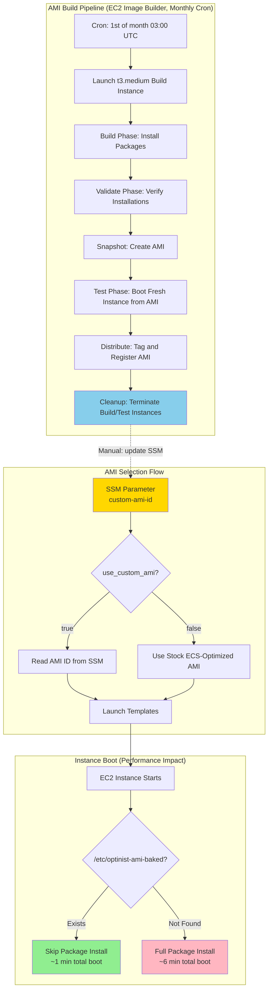

# Custom AMI: Pre-Baked Packages for Fast Instance Boot

## Executive Summary

- **Custom AMI** eliminates ~5 minutes of package installation from every EC2 instance boot
- **Dedicated swap EBS volume** eliminates ~4.5 minutes of swap file creation — `mkswap` on a block device takes <1 second vs `dd if=/dev/zero` writing 32GB at gp3 baseline throughput (125 MiB/s)
- Combined effect: startup reduced from **~10 minutes to ~1 minute** (custom AMI + swap volume)
- **Pre-baked packages** (yum packages, AWS CLI v2, Docker, CloudWatch agent) are installed once at AMI build time instead of on every first boot
- **EC2 Image Builder** is used as the build pipeline — automated monthly rebuilds keep the AMI patched with security updates
- **Bake marker** (`/etc/optinist-ami-baked`) lets the user-data script detect a pre-baked AMI and skip package installation at boot
- **Feature-flagged** via `var.use_custom_ami` (default `false`) — switching back to the stock AMI requires only a single variable change

## Key Architectural Principles

1. **Zero-Impact Feature Flag**
   - All custom AMI resources (Image Builder pipeline, IAM, SSM parameter) use `count = var.use_custom_ami ? 1 : 0`
   - When disabled, launch templates use the stock Amazon ECS-optimized AMI (`data.aws_ami.ecs_optimized`)
   - Switching back to stock AMI requires only setting `use_custom_ami = false` and running `terraform apply`

2. **SSM Parameter as AMI ID Registry**
   - The active AMI ID is stored in SSM Parameter Store (`/${environment}/optinist/custom-ami-id`)
   - Launch templates read the AMI ID from SSM at `terraform plan` time via `data.aws_ssm_parameter`
   - Terraform creates the SSM parameter with `ignore_changes = [value]`, so pipeline updates do not conflict with Terraform state
   - **Note (provisional):** SSM parameter update is currently manual after each build; future automation via EventBridge + Lambda is planned

3. **Single User-Data Script for Both AMI Types**
   - `ecs-user-data.sh` detects the bake marker file and branches:
     - Pre-baked AMI: skips package installation, adds `/usr/local/bin` to PATH
     - Stock AMI: runs full `yum update` + `yum install` + AWS CLI v2 standalone install
   - All runtime-specific steps (ECS config, swap, CloudWatch, Docker, git clone, ECR pull, EFS mount) remain unchanged regardless of AMI type

4. **Immutable Build Components and Recipes**
   - EC2 Image Builder components and recipes are immutable in AWS — content changes require a version bump
   - `local.custom_ami_version` (in `image_builder.tf`) controls all version strings; bumping it forces Terraform to create new resources via `create_before_destroy`. It is defined in git-tracked code, not tfvars, so every developer applies the same version

5. **Encrypted AMI with Same-Account Distribution**
   - Recipe specifies `encrypted = true` (AWS-managed CMK) for the root EBS volume
   - Distribution configuration has no `launch_permission` block — same-account AMIs are automatically available without explicit permissions
   - Explicit `launch_permission` triggers AWS "sharing" logic, which is incompatible with AWS-managed CMK encrypted snapshots

---

## Architecture Overview



### Responsibility Matrix

| Concern | Owner | Key Resource / File |
|---------|-------|---------------------|
| Custom AMI selection at deploy time | Terraform local | `local.effective_ami_id` in `compute.tf` |
| Bake-aware boot logic (skip packages) | User-data script | `ecs-user-data.sh` |
| ECS agent checkpoint clear (every boot) | User-data systemd unit | `ecs-clear-checkpoint.service` in `ecs-user-data.sh` |
| Swap volume (instant swap setup) | Launch template EBS | `block_device_mappings` `/dev/xvds` in `compute.tf` |
| AMI ID storage | SSM Parameter Store | `/${environment}/optinist/custom-ami-id` |
| AMI build orchestration | EC2 Image Builder pipeline | `image_builder.tf` |
| Package installation (bake time) | Build component YAML | `optinist-packages.yml` |
| Installation validation (bake time) | Validate component YAML | `optinist-validate.yml` |
| Old AMI cleanup | Lifecycle policy | `image_builder.tf` |
| Build log retention | S3 lifecycle rule | `infrastructure.tf` |

---

## Implementation Details

### 1. AMI Selection Logic (`compute.tf`)

**File:** `infrastructure/terraform/compute.tf`
**Purpose:** Conditionally read the custom AMI ID from SSM and expose as `local.effective_ami_id` for all launch templates

```hcl
data "aws_ssm_parameter" "custom_ami_id" {
  count      = var.use_custom_ami ? 1 : 0
  name       = "/${var.environment}/optinist/custom-ami-id"
  depends_on = [aws_ssm_parameter.custom_ami_id]
}

locals {
  effective_ami_id = (
    var.use_custom_ami
    ? data.aws_ssm_parameter.custom_ami_id[0].value
    : data.aws_ami.ecs_optimized.id
  )
}
```

**Launch templates using `local.effective_ami_id`:**

| Launch Template | File | Tier |
|----------------|------|------|
| `aws_launch_template.ecs` | `compute.tf` | Free tier (ASG) |
| `aws_launch_template.premium` | `compute.tf` | Premium tier (Lambda-managed) |
| `aws_launch_template.background` | `background_service.tf` | Background service |

### 2. User-Data Bake Detection (`ecs-user-data.sh`)

**File:** `infrastructure/scripts/ecs-user-data.sh`
**Purpose:** Detect a pre-baked custom AMI and skip package installation — this is where the boot time improvement is realized

```bash
if [ -f /etc/optinist-ami-baked ]; then
    echo "$(date): Pre-baked AMI detected, skipping package installation"
    cat /etc/optinist-ami-baked
    export PATH="/usr/local/bin:$PATH"
else
    echo "$(date): Stock AMI detected, installing packages"
    yum update -y
    yum install -y amazon-ssm-agent mariadb105 amazon-efs-utils nc git docker amazon-cloudwatch-agent
    curl -sL "https://awscli.amazonaws.com/awscli-exe-linux-x86_64.zip" -o /tmp/awscliv2.zip
    cd /tmp && unzip -qo awscliv2.zip
    /tmp/aws/install --update
    rm -rf /tmp/aws /tmp/awscliv2.zip
    echo "$(date): Package installation complete"
fi
```

**Package fix notes (also applied to stock AMI path):**
- `mariadb105` provides the MySQL client binary (`/usr/bin/mysql`) — Amazon Linux 2023 has no `mysql` or `mysql-client` package
- `awscli` v1 replaced — yum package not available; standalone AWS CLI v2 installer used instead
- `export PATH="/usr/local/bin:$PATH"` — required for pre-baked AMI because AWS CLI v2 installs to `/usr/local/bin`, which is not in the default PATH at user-data execution time

**Swap setup optimization (dedicated EBS volume):**

The original `dd if=/dev/zero of=/swapfile bs=1M count=32768` approach writes 32 GB of zeros to the root EBS volume. At gp3 baseline throughput (125 MiB/s), this takes ~4.5 minutes — the single largest boot-time bottleneck after package installation was eliminated by the custom AMI.

`fallocate` was considered as a faster alternative (`fallocate -l 32G /swapfile` completes in <1 second) but is **not usable for swap on XFS**. The ECS-optimized AMI uses XFS for the root filesystem, and `fallocate` creates "unwritten extents" on XFS. The Linux kernel rejects swap files containing unwritten extents (`swapon` fails with `Invalid argument`). This is a kernel-level restriction, not a workaround-able limitation.

The solution is a **dedicated EBS block device** for swap. `mkswap` on a raw block device writes only a swap header (a few KB), not the full 32 GB. The kernel treats the entire block device as swap space on demand. Since there is no filesystem involved, the unwritten-extents restriction does not apply.

The swap section of `ecs-user-data.sh` uses a two-strategy approach:

1. **Dedicated swap volume** (free and premium tiers): A 32GB gp3 EBS volume is attached at `/dev/xvds` via the launch template. The script runs `mkswap` + `swapon` on the block device, which takes <1 second (writes only a header). On Nitro instances (t3, m5, etc.), the device may appear as an NVMe path; the script falls back to `ebsnvme-id` scanning to locate the correct device.

2. **File-based swap fallback** (background tier or instances without dedicated volume): Creates a swap file via `dd if=/dev/zero` on the root volume. Used for the background tier where 1.5GB swap takes only ~1 second to create.

| Tier | Swap Method | Volume | Setup Time |
|------|-------------|--------|------------|
| Free | Block device | 32GB gp3 at `/dev/xvds` | <1 second |
| Premium | Block device | 32GB gp3 at `/dev/xvds` | <1 second |
| Background | File-based (dd) | 1.5GB on root volume | ~1 second |

### 3. Build Component (`optinist-packages.yml`)

**File:** `infrastructure/image_builder/components/optinist-packages.yml`
**Purpose:** Define which packages are pre-installed into the custom AMI at bake time

**Build phase steps:**

| Step | Action | Notes |
|------|--------|-------|
| `SystemUpdate` | `yum update -y` | Apply latest patches |
| `InstallYumPackages` | `yum install -y amazon-ssm-agent mariadb105 amazon-efs-utils nc git docker amazon-cloudwatch-agent` | Core packages |
| `InstallAWSCLIv2` | Remove awscli v1, install standalone v2, verify with `grep -q "aws-cli/2"` | Replaces broken v1 yum package |
| `EnableDockerService` | `systemctl enable docker` | Enabled but NOT started (instance shuts down for snapshot) |
| `CreateBakeMarker` | Write `/etc/optinist-ami-baked` with timestamp and package list | Detected by user-data at boot |
| `CleanupYumCache` | `yum clean all` + `rm -rf /var/cache/yum` | Reduces AMI snapshot size |
| `CleanEcsAgentState` | Stop `ecs`, remove `agent.db` + `ecs_agent_data.json` | AMI artifact carries no container-instance identity (see Edge Case 6) |

**AWSTOE error handling:** Each step uses a single `|` block with `set -e` at the top. This prevents error masking — AWSTOE evaluates the exit code of the **last** item in `commands`, so trailing `echo` statements would mask failures in preceding commands.

### 4. Validate Component (`optinist-validate.yml`)

**File:** `infrastructure/image_builder/components/optinist-validate.yml`
**Purpose:** Verify all installations before and after AMI snapshot

**Build phase (pre-snapshot validation):**

| Step | Validation |
|------|------------|
| `ValidateYumPackages` | `rpm -q` / `which` for each package |
| `ValidateAWSCLIv2` | Diagnostic `ls`/`which` + version check `grep -q "aws-cli/2"` |
| `ValidateDockerEnabled` | `systemctl is-enabled docker` |
| `ValidateBakeMarker` | `test -f /etc/optinist-ami-baked` |
| `ValidateEFSUtils` | Check `/usr/bin/mount.efs` or `/sbin/mount.efs` |
| `ValidateEcsAgentStateCleaned` | Fail the build if `agent.db` / `ecs_agent_data.json` persist |

**Test phase (fresh instance from AMI):**

| Step | Validation |
|------|------------|
| `TestBakeMarkerPersisted` | Confirm marker survived snapshot |
| `TestDockerStarts` | `systemctl start docker`, check version, then stop |
| `TestAWSCLIFunctional` | `aws sts get-caller-identity` (warn-only, no instance role during test) |

---

## Edge Case Handling

### 1. AWSTOE Error Masking

**Problem:** AWSTOE evaluates the exit code of the **last** item in a step's `commands` array. A trailing `echo` (always exit 0) masks failures in preceding shell blocks.

**Solution:** Each step uses a single `|` block with `set -e`. All commands within one block share a single exit code, and `set -e` aborts on the first non-zero exit.

### 2. AWS-Managed CMK Encrypted Snapshot Sharing

**Problem:** Distribution fails with `Snapshots encrypted with the AWS Managed CMK can't be shared` when `launch_permission` includes explicit `user_ids`.

**Solution:** Remove `launch_permission` entirely. AMIs are automatically available to the account that creates them. Even specifying the same account's ID triggers AWS "sharing" logic, which conflicts with AWS-managed CMK encryption.

### 3. Component Version Immutability

**Problem:** Changing YAML content without bumping the version causes Terraform to fail because Image Builder components and recipes are immutable.

**Solution:** Always bump `custom_ami_version` before `terraform apply` when component YAML files change. `create_before_destroy` lifecycle ensures the old resources remain until new ones are ready.

### 4. Parent AMI Drift

**Problem:** Amazon regularly publishes new ECS-optimized AMIs. Without protection, Terraform would force-recreate the recipe on every `plan`.

**Solution:** Recipe uses `ignore_changes = [parent_image]`. To pick up a newer base AMI, bump `custom_ami_version` — this creates a new recipe referencing the latest base AMI.

### 5. Stock AMI Fallback on Build Failure

**Problem:** If the Image Builder pipeline fails, no custom AMI is available.

**Solution:** The SSM parameter is initially set to the stock ECS-optimized AMI ID. Until a successful build overwrites it, all launch templates use the stock AMI. The user-data `else` branch handles stock AMI boot correctly.

### 6. Stale ECS Agent Checkpoint on Stop/Start

**Problem:** A stopped instance keeps `/var/lib/ecs/data/agent.db` across stop/start, but ECS deregisters the disconnected container instance while the instance is stopped. On restart the agent would resume the now-deregistered identity and never re-register, so its ECS task never places. This affects every tier that is stopped and started rather than terminated — notably the **background** instance (stopped nightly/weekends by the dev scheduler) and **premium** standby instances, neither of which is covered by a one-time bake-time clear alone.

**Solution:** Two layers. At runtime, `ecs-user-data.sh` installs `ecs-clear-checkpoint.service`, a oneshot systemd unit ordered `Before=ecs.service` that removes `agent.db` (and the legacy `ecs_agent_data.json`) on **every boot**, so the agent always registers fresh. It is host-side and needs no orchestrator, which is why it covers the background instance (which has no managing Lambda). At bake time, `CleanEcsAgentState` removes the same files from the AMI artifact so a freshly built image carries no container-instance identity, and `ValidateEcsAgentStateCleaned` fails the build if they persist.

---

## Operational Procedures

### Procedure A: Pre-Deployment Version Check

Before bumping `custom_ami_version` or running `terraform apply`, confirm the currently active version using the methods below. This check is referenced by [Procedure B](#procedure-b-initial-setup-first-time-deployment) and [Procedure C](#procedure-c-ami-content-fix--rebuild).

#### Method 1: Check image_builder.tf (Git Source of Truth)

The `local.custom_ami_version` map in `image_builder.tf` holds the per-environment version that Terraform will use on next `apply`.

```bash
grep -A3 'custom_ami_version = {' infrastructure/terraform/image_builder.tf
# Example output:
#   custom_ami_version = {
#     development = "2.0.0"
#     subscr      = "2.0.0"
#   }[var.environment]
```

#### Method 2: Query Image Builder Pipeline (AWS Source of Truth)

Retrieve the version currently deployed in AWS by inspecting the pipeline's recipe.

```bash
# 1. Get pipeline ARN from Terraform output
PIPELINE_ARN=$(terraform output -raw image_builder_pipeline_arn)

# 2. Get the recipe ARN linked to the pipeline
RECIPE_ARN=$(aws imagebuilder get-image-pipeline \
  --image-pipeline-arn "$PIPELINE_ARN" \
  --region ap-northeast-1 \
  --query 'imagePipeline.imageRecipeArn' --output text)

# 3. Get the recipe version
aws imagebuilder get-image-recipe \
  --image-recipe-arn "$RECIPE_ARN" \
  --region ap-northeast-1 \
  --query 'imageRecipe.version' --output text
# Example output: 1.0.2
```

#### Method 3: List All Component Versions

View all component versions that have been created (useful for audit or identifying stale versions).

```bash
aws imagebuilder list-components \
  --owner Self \
  --region ap-northeast-1 \
  --query 'componentVersionList[].name' --output table
# Example output:
# |        name                         |
# | dev-optinist-packages-v1-0-0        |
# | dev-optinist-packages-v1-0-1        |
# | dev-optinist-validate-v1-0-0        |
# | dev-optinist-validate-v1-0-1        |
```

The version is encoded in the component name suffix (dots replaced with hyphens: `v1-0-1` → version `1.0.1`).

#### Method 4: AWS Console

1. **EC2 Image Builder** → **Image pipelines** → `{env_prefix}-ami-pipeline`
2. Click the pipeline → **Image Recipe** tab → version is shown in the recipe name and metadata
3. Alternatively: **Components** tab → component names include the version suffix (e.g., `{env_prefix}-packages-v1-0-1`)

#### Summary: Where to Check

| What | Where | Command / Location |
|------|-------|--------------------|
| Version to be deployed next | `image_builder.tf` locals | `grep -A3 'custom_ami_version = {' image_builder.tf` |
| Version currently active in AWS | Pipeline → Recipe | `aws imagebuilder get-image-recipe` (see Method 2) |
| All versions ever created | Components list | `aws imagebuilder list-components --owner Self` |
| Visual confirmation | AWS Console | EC2 Image Builder → Image pipelines → Recipe |

### Procedure B: Initial Setup (First-Time Deployment)

This procedure enables the custom AMI feature, builds the first AMI via Image Builder, and switches all launch templates to use it.

```
┌──────────────────────────────────────────────────────────┐
│ Step 1: Enable Feature Flag                              │
│    → Set use_custom_ami = true in terraform.tfvars       │
│    → Set local.custom_ami_version (image_builder.tf)     │
│                                                          │
│    ℹ Before setting custom_ami_version, verify the       │
│      current version state.                              │
│      See: Procedure A (Pre-Deployment Version Check)     │
└──────────────────────────────────────────────────────────┘
                         ↓
┌──────────────────────────────────────────────────────────┐
│ Step 2: terraform apply                                  │
│    → Creates: IAM roles, components, recipe,             │
│      infrastructure config, distribution config,         │
│      pipeline, lifecycle policy, SSM parameter           │
│    → SSM parameter initialized with stock AMI ID         │
│    → Launch templates still use stock AMI                 │
└──────────────────────────────────────────────────────────┘
                         ↓
┌──────────────────────────────────────────────────────────┐
│ Step 3: Trigger First AMI Build                          │
│    → Run: aws imagebuilder                               │
│        start-image-pipeline-execution                    │
│        --image-pipeline-arn <PIPELINE_ARN>               │
│        --region ap-northeast-1                           │
│    → Pipeline ARN: terraform output                      │
│        image_builder_pipeline_arn                        │
│    → Wait ~20-30 min for build + test + distribution     │
└──────────────────────────────────────────────────────────┘
                         ↓
┌──────────────────────────────────────────────────────────┐
│ Step 4: Find Built AMI ID                                │
│    → AWS Console: EC2 Image Builder > Image pipelines    │
│      > Click pipeline > Output images > AMI ID           │
│    → Or CLI: aws imagebuilder                            │
│        list-image-pipeline-images                        │
│        --image-pipeline-arn <PIPELINE_ARN>               │
└──────────────────────────────────────────────────────────┘
                         ↓
┌──────────────────────────────────────────────────────────┐
│ Step 5: Update SSM Parameter (manual) ⚠                  │
│    → Run: aws ssm put-parameter                          │
│        --name "/<environment>/optinist/custom-ami-id"    │
│        --value "ami-0xxxxxxxxxxxxxxxxx"                  │
│        --type String --overwrite                         │
│        --region ap-northeast-1                           │
│                                                          │
│    ⚠ This step is currently manual.                      │
│    Future: EventBridge + Lambda will automate this       │
│    on pipeline completion.                               │
└──────────────────────────────────────────────────────────┘
                         ↓
┌──────────────────────────────────────────────────────────┐
│ Step 6: terraform apply                                  │
│    → Launch templates pick up new AMI from SSM           │
│                                                          │
│    ⚠ A new AMI only takes effect on instances that are   │
│    recreated from the updated launch template.           │
│    terraform apply handles replacement per tier:         │
│                                                          │
│    → Free (ASG): instance_refresh triggers rolling       │
│      replacement automatically                           │
│    → Premium (Terraform-managed initial instance):       │
│      force-recreated by Terraform                        │
│    → Background: force-recreated by Terraform            │
│                                                          │
│    → Premium (Lambda-created per-user instances):        │
│      NOT replaced by terraform apply. They continue      │
│      on the old AMI until terminated. Options:           │
│      a) Wait for next user login cycle (natural          │
│         termination + Lambda creates replacement)        │
│      b) Manually terminate via Console/CLI; Lambda       │
│         creates new instances from updated template      │
│         on next user assignment                          │
└──────────────────────────────────────────────────────────┘
                         ↓
┌──────────────────────────────────────────────────────────┐
│ Step 7: Verify                                           │
│    → See "Verification Procedure" below                  │
└──────────────────────────────────────────────────────────┘
```

### Procedure C: AMI Content Fix / Rebuild

When the pre-baked package set changes (component YAML files modified), a version bump and AMI rebuild are required.

```
┌──────────────────────────────────────────────────────────┐
│ Step 1: Edit YAML and Bump Version                       │
│    → Modify component YAML files as needed               │
│    → Bump local.custom_ami_version in image_builder.tf   │
│      (e.g., "1.0.0" → "1.0.1")                          │
│                                                          │
│    ℹ Before bumping, verify the current version.         │
│      See: Procedure A (Pre-Deployment Version Check)     │
└──────────────────────────────────────────────────────────┘
                         ↓
┌──────────────────────────────────────────────────────────┐
│ Step 2: terraform apply                                  │
│    → Terraform creates new components and recipe         │
│      (create_before_destroy)                             │
│    → Pipeline references the new recipe                  │
└──────────────────────────────────────────────────────────┘
                         ↓
┌──────────────────────────────────────────────────────────┐
│ Step 3: Trigger Build                                    │
│    → Same as Procedure B Step 3                          │
└──────────────────────────────────────────────────────────┘
                         ↓
┌──────────────────────────────────────────────────────────┐
│ Step 4: Find AMI ID + Update SSM ⚠                       │
│    → Same as Procedure B Steps 4-5                       │
└──────────────────────────────────────────────────────────┘
                         ↓
┌──────────────────────────────────────────────────────────┐
│ Step 5: terraform apply                                  │
│    → Launch templates pick up new AMI                    │
│    → Instance replacement: same as Procedure B Step 6    │
│      (ASG rolling replacement, Terraform force-recreates │
│      premium-initial and background instances;           │
│      Lambda-created premium instances are NOT replaced)  │
└──────────────────────────────────────────────────────────┘
                         ↓
┌──────────────────────────────────────────────────────────┐
│ Step 6: Verify                                           │
│    → See "Verification Procedure" below                  │
└──────────────────────────────────────────────────────────┘
```

### Procedure D: Monthly Automated AMI Rebuild (Cron)

The build pipeline runs automatically on the 1st of each month at 03:00 UTC (12:00 JST) to keep the custom AMI patched.

```
┌──────────────────────────────────────────────────────────┐
│ Automatic: Pipeline executes on cron schedule            │
│    → Same base AMI, same component versions              │
│    → Picks up latest yum security patches via            │
│      yum update -y                                       │
│    → Build takes ~20-30 min                              │
└──────────────────────────────────────────────────────────┘
                         ↓
┌──────────────────────────────────────────────────────────┐
│ Manual: Find AMI ID + Update SSM ⚠                       │
│    → Same as Procedure B Steps 4-5                       │
│                                                          │
│    ⚠ Currently requires manual intervention.             │
│    The cron builds an AMI, but it is NOT automatically   │
│    activated. Until EventBridge + Lambda automation is    │
│    implemented, an operator must:                        │
│    1. Check build completion in AWS Console               │
│    2. Update SSM parameter with new AMI ID               │
│    3. Run terraform apply to update launch templates     │
└──────────────────────────────────────────────────────────┘
                         ↓
┌──────────────────────────────────────────────────────────┐
│ Manual: terraform apply                                  │
│    → Launch templates pick up new AMI                    │
│    → Instance replacement: same as Procedure B Step 6    │
│      (ASG rolling replacement, Terraform force-recreates │
│      premium-initial and background instances;           │
│      Lambda-created premium instances are NOT replaced)  │
└──────────────────────────────────────────────────────────┘
```

### Procedure E: Rollback to Stock AMI

If the custom AMI causes issues, revert to the stock ECS-optimized AMI:

```
┌──────────────────────────────────────────────────────────┐
│ Step 1: Disable Feature Flag                             │
│    → Set use_custom_ami = false in terraform.tfvars      │
└──────────────────────────────────────────────────────────┘
                         ↓
┌──────────────────────────────────────────────────────────┐
│ Step 2: terraform apply                                  │
│    → Launch templates revert to stock AMI                │
│    → Image Builder resources are destroyed               │
│    → SSM parameter is deleted                            │
└──────────────────────────────────────────────────────────┘
                         ↓
┌──────────────────────────────────────────────────────────┐
│ Step 3: Replace Running Instances                        │
│    → Free tier: ASG instance_refresh replaces instances  │
│    → Premium: terminate existing, Lambda creates new     │
│    → Background: Terraform recreates                     │
│                                                          │
│    User-data detects no bake marker and installs         │
│    packages normally (else branch)                       │
└──────────────────────────────────────────────────────────┘
```

### Verification Procedure

After switching to a new custom AMI, verify on a newly launched instance.

**Log location note:** The user-data script (`ecs-user-data.sh`) redirects all output via `exec > /var/log/ecs-setup.log 2>&1`. Therefore, user-data output (package installation messages, bake marker detection, etc.) is found in `/var/log/ecs-setup.log`, **not** in `/var/log/cloud-init-output.log`.

```bash
# 1. Confirm bake marker exists
cat /etc/optinist-ami-baked
# Expected:
#   BAKED_DATE=2026-04-21T11:16:57Z
#   BAKED_BY=ec2-image-builder
#   PACKAGES=amazon-ssm-agent,mariadb105,...

# 2. Confirm user-data skipped package installation
grep "Pre-baked AMI detected" /var/log/ecs-setup.log
# Expected: "<timestamp>: Pre-baked AMI detected, skipping package installation"

# 3. Measure boot time (user-data execution time)
systemd-analyze blame | head -5
# cloud-final.service runs the user-data script.
# Custom AMI + swap volume: ~1 min (packages skipped, block device swap)
# Custom AMI + file swap:   ~5 min (packages skipped, dd-based swap)
# Stock AMI + swap volume:  ~2 min (full yum install, block device swap)
# Stock AMI + file swap:    ~6 min (full yum install, dd-based swap)

# 4. Verify AWS CLI v2
aws --version
# Expected: aws-cli/2.x.x ...

# 5. Verify packages
rpm -q amazon-ssm-agent amazon-efs-utils amazon-cloudwatch-agent git docker mariadb105
which mysql nc

# 6. Confirm swap is on dedicated block device (free/premium tiers)
swapon --show
# Expected: /dev/xvds (or /dev/nvmeXn1 on Nitro) as TYPE=partition
grep "swap" /var/log/ecs-setup.log
# Expected: "Block device swap setup complete"

# 7. Confirm ECS agent registered
curl -s http://localhost:51678/v1/metadata | python -m json.tool
# Expected: valid JSON with Cluster name matching expected cluster

# 8. Confirm the checkpoint-clear unit is enabled (runs before ecs.service on every boot)
systemctl is-enabled ecs-clear-checkpoint.service
# Expected: enabled
```

---

## Configuration

### Terraform Variables

| Variable | Type | Default | Purpose |
|----------|------|---------|---------|
| `use_custom_ami` | `bool` | `false` | Feature flag: enable/disable Image Builder and custom AMI usage |

The component/recipe version is intentionally **not** a variable: `local.custom_ami_version` in `image_builder.tf` maps each environment to its version. It lives in git-tracked code (not tfvars) so all developers apply the same value; bump it to force new components and a new recipe.

### AMI Build Pipeline Settings (EC2 Image Builder)

| Setting | Value | Rationale |
|---------|-------|-----------|
| Build instance type | `t3.medium` | Sufficient for yum + downloads; same family as production |
| Build subnet | `aws_subnet.public1` | Public IP for internet access; avoids NAT gateway cost |
| Build security group | `aws_security_group.ecs` | Allows all egress for package downloads |
| Terminate on failure | `true` | Clean up failed build instances automatically |
| Schedule | `cron(0 3 1 * ? *)` | 1st of each month, 03:00 UTC (12:00 JST) |
| Test timeout | 60 minutes | Allows time for test phase instance boot and validation |
| AMI encryption | AWS-managed CMK | Default encryption for EBS snapshots |
| Root volume | 30 GB, gp3 | Matches production launch template configuration |

### Lifecycle Policy Settings

| Setting | Value | Rationale |
|---------|-------|-----------|
| Action | DELETE | Remove old AMIs and their snapshots |
| Age threshold | 90 days | Retains ~3 monthly builds for rollback |
| Resource selection | Tag filter: `Service=image-builder`, `Project=optinist-cloud` | Scoped to Image Builder AMIs only |

### S3 Log Retention

| Prefix | Expiration | Purpose |
|--------|-----------|---------|
| `image-builder-logs/` | 30 days (noncurrent: 7 days) | Build instance logs from Image Builder |

---

## Monitoring and Metrics

### Build Logs

**Location:** S3 bucket `{env_prefix}-optinist-cloud-storage/image-builder-logs/`
**Retention:** 30 days (auto-expire via S3 lifecycle rule)
**Content:** AWSTOE step execution output including all `echo` and command output from component YAML steps

### Monitoring AMI Build Status

```bash
# List recent pipeline executions
aws imagebuilder list-image-pipeline-images \
  --image-pipeline-arn <PIPELINE_ARN> \
  --region ap-northeast-1

# Check specific image build status
aws imagebuilder get-image \
  --image-build-version-arn <IMAGE_ARN> \
  --region ap-northeast-1 \
  --query 'image.state'
```

### Key Log Events (in `/var/log/ecs-setup.log`)

**Pre-baked AMI detected:**
```
<timestamp>: Pre-baked AMI detected, skipping package installation
BAKED_DATE=2026-04-21T03:15:22Z
BAKED_BY=ec2-image-builder
PACKAGES=amazon-ssm-agent,mariadb105,...
```

**Stock AMI fallback:**
```
<timestamp>: Stock AMI detected, installing packages
<timestamp>: Package installation complete
```

**Block device swap (dedicated EBS volume):**
```
<timestamp>: Found swap device at /dev/xvds
<timestamp>: Block device swap setup complete (/dev/xvds)
<timestamp>: Swap setup complete (32768MB, swappiness=20)
```

**Block device swap (NVMe fallback on Nitro instances):**
```
<timestamp>: /dev/xvds not found, scanning NVMe devices...
<timestamp>: Found swap device at /dev/nvme1n1 (mapped from /dev/xvds)
<timestamp>: Block device swap setup complete (/dev/nvme1n1)
```

**File-based swap fallback (background tier):**
```
<timestamp>: Using file-based swap fallback
<timestamp>: File-based swap setup complete (1536MB)
```

---

## Provisional Items and Future Improvements

The following aspects of the current implementation are provisional and planned for enhancement:

### 1. SSM Parameter Update Automation (Not Yet Implemented)

**Current state:** After each pipeline build (cron or manual), an operator must manually:
1. Find the new AMI ID from the pipeline output
2. Run `aws ssm put-parameter` to update the SSM parameter
3. Run `terraform apply` to update launch templates

**Planned automation:**
- EventBridge rule to capture Image Builder pipeline completion events
- Lambda function to extract the AMI ID and update the SSM parameter
- The IAM policy for `ssm:PutParameter` is already provisioned on the build instance role in anticipation of this automation

### 2. Active Instance Replacement

**Current state:** `terraform apply` triggers instance replacement for most tiers automatically when the AMI changes (see Procedure B Step 6 for full detail):

| Tier | Replacement Mechanism | Automatic? |
|------|-----------------------|------------|
| Free (ASG) | `instance_refresh` rolling replacement | Yes |
| Premium (Terraform-managed initial) | Terraform force-recreates (`create_before_destroy`) | Yes |
| Background | Terraform force-recreates (`create_before_destroy`) | Yes |
| Premium (Lambda-created per-user) | Not replaced by `terraform apply` | **No** |

**Lambda-created premium instances** are the only tier not automatically replaced. They continue on the old AMI until terminated. Options:
- Wait for natural termination (next user login cycle replaces the instance)
- Manually terminate via Console/CLI — Lambda creates a replacement from the updated launch template on next user assignment

**Consideration:** No forced replacement mechanism exists for Lambda-created premium instances currently in use. A future improvement could add an automated sweep that terminates idle per-user instances after an AMI update.

### 3. ECR Image Pre-Pull at Bake Time

**Current state:** Docker images are pulled from ECR at boot time in user-data. This takes ~1-2 minutes.

**Potential improvement:** Pre-pull the application Docker image during AMI bake. This would require the build instance to have ECR access and would couple AMI builds to application deployments (bake-on-deploy model).

---

## AWS Resources

All resource names are prefixed with the Terraform `environment` variable (shown here as `{env_prefix}`).

### IAM

| Resource | Name | Purpose |
|----------|------|---------|
| IAM Role | `{env_prefix}-image-builder-role` | EC2 trust policy for build instances |
| Instance Profile | `{env_prefix}-image-builder-profile` | Attached to build EC2 instances |
| IAM Role | `{env_prefix}-imagebuilder-lifecycle-role` | Lifecycle policy execution role |

**Managed policies on build role:**
- `EC2InstanceProfileForImageBuilder`
- `AmazonSSMManagedInstanceCore`

**Inline policies on build role:**
- SSM `PutParameter` + `GetParameter` on `parameter/${environment}/optinist/custom-ami-id`
- S3 `PutObject` on `{app_storage_bucket}/image-builder-logs/*`

### EC2 Image Builder

| Resource | Name | Purpose |
|----------|------|---------|
| Component | `{env_prefix}-packages-v{version}` | Build component (package installation) |
| Component | `{env_prefix}-validate-v{version}` | Validation component |
| Recipe | `{env_prefix}-ecs-recipe-v{version}` | AMI recipe (base AMI + components + EBS config) |
| Infrastructure Config | `{env_prefix}-image-builder-infra` | Build instance configuration |
| Distribution Config | `{env_prefix}-image-distribution` | AMI distribution settings |
| Pipeline | `{env_prefix}-ami-pipeline` | Monthly build orchestration |
| Lifecycle Policy | `{env_prefix}-ami-lifecycle` | 90-day AMI retention |

### SSM

| Parameter | Purpose |
|-----------|---------|
| `/{environment}/optinist/custom-ami-id` | Active custom AMI ID (initially set to stock AMI) |

### Terraform Outputs

| Output | Description | Sensitive |
|--------|-------------|-----------|
| `image_builder_pipeline_arn` | Pipeline ARN (for manual execution) | No |
| `custom_ami_ssm_parameter` | SSM parameter name | No |
| `effective_ami_id` | Currently active AMI ID | Yes |
| `ami_source` | "custom (Image Builder)" or "stock (Amazon ECS-optimized)" | No |

---

## Cost Estimate

| Resource | Monthly Cost |
|----------|-------------|
| Pipeline execution (t3.medium, ~20 min/month) | ~$0.10 |
| AMI storage (3 retained, ~8 GB snapshot each) | ~$1.20 |
| S3 build logs (auto-expire 30 days) | < $0.01 |
| **Total** | **~$1.30/month** |

---

## File Reference

| File | Purpose |
|------|---------|
| `infrastructure/terraform/compute.tf` | Custom AMI selection logic (`local.effective_ami_id`), free and premium launch templates |
| `infrastructure/scripts/ecs-user-data.sh` | Bake marker detection and conditional package installation |
| `infrastructure/terraform/image_builder.tf` | EC2 Image Builder Terraform resources (IAM, components, recipe, pipeline, lifecycle, SSM, outputs) and `local.custom_ami_version` |
| `infrastructure/image_builder/components/optinist-packages.yml` | Build component: package installation steps |
| `infrastructure/image_builder/components/optinist-validate.yml` | Validate component: installation verification |
| `infrastructure/terraform/background_service.tf` | Background launch template (uses `local.effective_ami_id`) |
| `infrastructure/terraform/main.tf` | Variable definitions (`use_custom_ami`) |
| `infrastructure/terraform/infrastructure.tf` | S3 lifecycle rule for `image-builder-logs/` |
| `infrastructure/terraform/environments/development.tfvars.example` | Example tfvars with custom AMI settings |
| `infrastructure/terraform/environments/production.tfvars.example` | Example tfvars with custom AMI settings |
