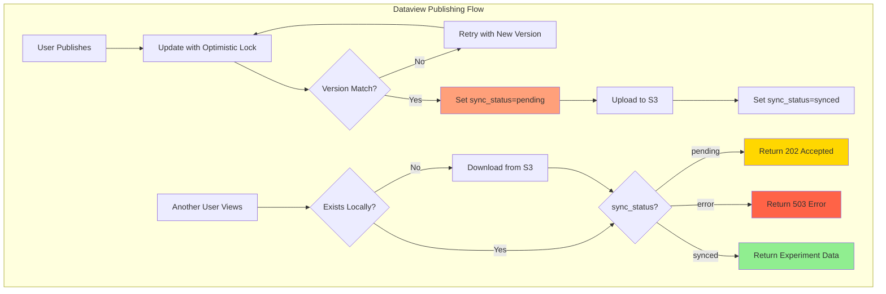

# Dataview Publishing Architecture

## Executive Summary

- **Three-state sync model** tracks publishing state: pending, synced, error
- **Optimistic locking** prevents concurrent modification conflicts during publish
- **S3 as source of truth** stores all published experiments durably
- **Lazy download** automatically fetches experiments from S3 when accessed on different instances

---

## Key Architectural Principles

1. **Three-State Sync Model**
   - **pending**: Published but not yet synced to local storage
   - **synced**: Available locally (either uploaded or downloaded)
   - **error**: Sync failed (upload/download problem)

2. **Optimistic Locking for Data Integrity**
   - Version field on ExperimentRecord prevents concurrent modifications
   - Atomic increment on version during updates
   - Retry logic handles version conflicts gracefully

3. **Lazy Loading from S3**
   - Published experiments stored in S3 as source of truth
   - Local instances download on-demand when accessed
   - Transparent to user with proper status codes (202, 503)

---

## Architecture Overview



### Key Constraints Satisfied

1. **Data Consistency** - Optimistic locking prevents publish conflicts
2. **S3 as Source of Truth** - Published experiments always available via S3
3. **User Experience** - Clear status codes and retry guidance for pending experiments

### Responsibility Matrix

| Responsibility                | Dataview Publishing |
|-------------------------------|---------------------|
| Publish experiments           | With optimistic lock|
| Track sync status             | Exclusive           |
| Upload to S3                  | After publish       |
| Download from S3              | On access           |
| Handle version conflicts      | With retry          |

---

## Implementation Details

### 1. Dataview Publishing with Sync Status

**File:** `studio/app/common/routers/dataview.py`

**Endpoint:** `POST /publish/{id}/{flag}` - Publish/unpublish with optimistic locking

```python
@router.post("/publish/{id}/{flag}")
async def publish_dataview_records(
    id: int,
    flag: PublishFlags,
    db: Session = Depends(get_db),
    current_user: User = Depends(get_current_user),
):
    """
    Publish/unpublish with optimistic locking.

    Features:
    - Retry loop (max 3 attempts) for version conflicts
    - Sets local_sync_status = "pending" when publishing
    - Atomically increments version number
    - Returns 409 Conflict on persistent version mismatch
    """
```

**Optimistic Lock Implementation:**

```python
stmt = (
    update(models.ExperimentRecord)
    .where(models.ExperimentRecord.id == record.id)
    .where(models.ExperimentRecord.version == current_version)  # Lock condition
    .values(
        publish_status=new_publish_status,
        local_sync_status=new_sync_status,
        version=models.ExperimentRecord.version + 1,  # Atomic increment
    )
)

result = db.execute(stmt)

# If rowcount == 0, version conflict detected
if result.rowcount == 0:
    # Retry or raise 409 Conflict
```

**Endpoint:** `GET /{workspace_id}/{unique_id}/reproduce` - Public access with lazy S3 download

```python
@public_router.get("/{workspace_id}/{unique_id}/reproduce")
async def public_reproduce_experiment(
    workspace_id: str,
    unique_id: str,
):
    """
    Public access with lazy S3 download.

    Returns:
    - 202 Accepted: Experiment published but not synced yet
    - 503 Service Unavailable: Sync failed or download error
    - 200 OK: Experiment data available
    """
```

**Status Code Flow:**

1. **Check Local Existence:**
   - If experiment exists locally -> Check sync_status
   - If not exists -> Download from S3

2. **sync_status = "pending":**
   - Return HTTP 202 with Retry-After header
   - Frontend shows "Publishing in progress" message
   - Auto-retry every 30 seconds (max 10 times = 5 minutes)

3. **sync_status = "error":**
   - Return HTTP 503
   - Frontend shows error message with retry button

4. **sync_status = "synced":**
   - Return HTTP 200 with experiment data
   - Normal workflow rendering

---

### 2. Experiment Record Model Updates

**File:** `studio/app/common/models/experiment.py`

**New Fields:**

```python
local_sync_status: str = Field(
    sa_column=Column(
        String(20),
        nullable=False,
        default=LocalSyncStatus.synced.value,
        comment="Sync status on local storage: pending, synced, error",
    )
)

version: int = Field(
    sa_column=Column(
        Integer(),
        nullable=False,
        default=0,
        comment="Version number for optimistic locking",
    ),
    default=0,
)
```

**LocalSyncStatus Enum:**

```python
class LocalSyncStatus(str, Enum):
    pending = "pending"  # Published, not synced yet
    synced = "synced"    # Available locally
    error = "error"      # Sync failed
```

---

### 3. Frontend Integration

**File:** `frontend/src/components/Dataview/WorkflowDetailsView.tsx`

**State Management:**

```typescript
const [syncStatus, setSyncStatus] = useState<{
  pending: boolean
  error: boolean
  message: string
}>({ pending: false, error: false, message: "" })
const [retryCount, setRetryCount] = useState(0)
```

**Auto-Retry Logic:**

```typescript
if (status === 202) {
  // Experiment is published but not yet synced
  setSyncStatus({
    pending: true,
    error: false,
    message: data?.message || "Publishing in progress, check back in a few minutes.",
  })

  // Auto-retry after 30 seconds (max 10 retries = 5 minutes)
  if (retryCount < 10) {
    setTimeout(() => {
      setRetryCount(retryCount + 1)
    }, 30000)
  }
}
```

**User Interface:**

1. **Pending State (202):**
   - HourglassEmptyIcon with warning color
   - Info alert: "Publishing in progress..."
   - Auto-retry every 30 seconds
   - Max retry: 5 minutes

2. **Error State (503):**
   - ErrorOutlineIcon with error color
   - Error alert with message
   - Manual retry button

3. **Success State (200):**
   - Normal workflow details rendering

---

## Flow Diagrams

### Dataview Publishing Flow

```
┌──────────────────────────────────────────────────────────┐
│ 1. User Clicks "Publish" in Frontend                    │
│    → PUT /api/dataview/publish/{id}/on                  │
└──────────────────────────────────────────────────────────┘
                         ↓
┌──────────────────────────────────────────────────────────┐
│ 2. Backend: Optimistic Lock Update                     │
│    → Read current version from DB                       │
│    → UPDATE experiment_record                           │
│       SET publish_status = 1,                           │
│           local_sync_status = 'pending',                │
│           version = version + 1                         │
│       WHERE id = ? AND version = ?                      │
└──────────────────────────────────────────────────────────┘
                         ↓
┌──────────────────────────────────────────────────────────┐
│ 3a. Success (rowcount = 1)                              │
│    → Return 200 OK                                      │
│    → Trigger S3 upload (background task)                │
└──────────────────────────────────────────────────────────┘
         |               ↓
         |    ┌──────────────────────────────────────────────────────────┐
         |    │ 3b. Version Conflict (rowcount = 0)                      │
         |    │    → Another user modified concurrently                  │
         |    │    → Retry (max 3 times)                                │
         |    └──────────────────────────────────────────────────────────┘
         |               ↓
         |    ┌──────────────────────────────────────────────────────────┐
         |    │ 3c. Persistent Conflict                                  │
         |    │    → Return 409 Conflict                                │
         |    │    → User must try again                                │
         |    └──────────────────────────────────────────────────────────┘
         ↓
┌──────────────────────────────────────────────────────────┐
│ 4. S3 Upload Completes                                  │
│    → UPDATE experiment_record                           │
│       SET local_sync_status = 'synced'                  │
│       WHERE id = ?                                      │
└──────────────────────────────────────────────────────────┘
```

### Public Access Flow

```
┌──────────────────────────────────────────────────────────┐
│ 1. User Visits Public Link                              │
│    → GET /api/public/dataview/{workspace_id}/{unique_id}/reproduce│
└──────────────────────────────────────────────────────────┘
                         ↓
┌──────────────────────────────────────────────────────────┐
│ 2. Check Local Storage                                  │
│    → os.path.exists(experiment_path)?                   │
└──────────────────────────────────────────────────────────┘
         |                              |
         | No                           | Yes
         ↓                              ↓
┌──────────────────────────────────────┐  ┌──────────────────────────────────────┐
│ 3a. Download from S3                 │  │ 3b. Check sync_status                │
│    → s3.download_experiment()        │  │    → Query experiment_record         │
└──────────────────────────────────────┘  └──────────────────────────────────────┘
         |                                        |
         | Success                                |
         ↓                                        ↓
┌──────────────────────────────────────┐  ┌──────────────────────────────────────┐
│ 4a. Download Failed                  │  │ 4b. Status Check                     │
│    → Return 503 Service Unavailable  │  │    → "pending"  → Return 202 Accepted│
│    → Frontend shows error            │  │    → "error"    → Return 503 Error   │
└──────────────────────────────────────┘  │    → "synced"   → Return 200 OK      │
                                          └──────────────────────────────────────┘
                                                   ↓
                                          ┌──────────────────────────────────────┐
                                          │ 5. Frontend Handling                 │
                                          │    → 202: Auto-retry every 30s       │
                                          │    → 503: Show retry button          │
                                          │    → 200: Render workflow            │
                                          └──────────────────────────────────────┘
```

---

## Edge Case Handling

### 1. Concurrent Publish Operations

**Problem:** Two users try to publish same experiment simultaneously.

**Solution:** Optimistic locking with retry:
```python
# Attempt 1: Version = 5
UPDATE ... WHERE id = ? AND version = 5  # User A succeeds
UPDATE ... WHERE id = ? AND version = 5  # User B fails (version now 6)

# Attempt 2: User B retries with version = 6
UPDATE ... WHERE id = ? AND version = 6  # User B succeeds
```

**Guarantee:** At most 3 retries, then 409 Conflict returned

### 2. S3 Upload Fails After Publishing

**Problem:** Experiment published (publish_status=1) but S3 upload fails.

**Solution:** sync_status remains "pending":
- Users accessing get HTTP 202
- Background job retries S3 upload
- Manual intervention can re-trigger upload

**User Experience:** "Publishing in progress" message, auto-retry

### 3. S3 Download Fails on Access

**Problem:** User tries to access published experiment, S3 download fails.

**Solution:** Explicit error handling:
```python
if not await s3_controller.download_experiment(workspace_id, unique_id):
    return JSONResponse(
        status_code=503,
        content={
            "status": "download_error",
            "message": "Failed to load experiment data, please try again later"
        }
    )
```

**User Experience:** Error message with manual retry button

### 4. Never-Ending Auto-Retry in Frontend

**Problem:** Frontend retries forever if experiment never syncs.

**Solution:** Max retry limit:
```typescript
// Auto-retry after 30 seconds (max 10 retries = 5 minutes)
if (retryCount < 10) {
    setTimeout(() => {
        setRetryCount(retryCount + 1)
    }, 30000)
}
```

**Guarantee:** Auto-retry stops after 5 minutes, user can manually retry

---

## Database Schema Changes

**Table:** `experiment_record` (ALTER)

```sql
ALTER TABLE experiment_record
ADD COLUMN local_sync_status VARCHAR(20) NOT NULL DEFAULT 'synced'
    COMMENT 'Sync status on local storage: pending, synced, error';

ALTER TABLE experiment_record
ADD COLUMN version INTEGER NOT NULL DEFAULT 0
    COMMENT 'Version number for optimistic locking';
```

---

## Configuration

### Environment Variables

**Required for S3 Integration:**
```bash
S3_DEFAULT_BUCKET_NAME      # S3 bucket for published experiments
AWS_ACCESS_KEY_ID           # AWS credentials (or IAM role)
AWS_SECRET_ACCESS_KEY       # AWS credentials (or IAM role)
AWS_REGION                  # AWS region (e.g., us-east-1)
```

### HTTP Status Codes

| Code | Meaning                  | User Experience                           |
|------|--------------------------|-------------------------------------------|
| 200  | Success                  | Render experiment workflow                |
| 202  | Accepted (pending sync)  | "Publishing in progress" + auto-retry     |
| 409  | Conflict (version clash) | "Concurrent modification, please retry"   |
| 503  | Service Unavailable      | "Temporarily unavailable" + retry button  |

---

## Key Functions Reference

### Backend

| Function | Purpose |
|----------|---------|
| `publish_dataview_records()` | Publish with optimistic lock |
| `public_reproduce_experiment()` | Public access with S3 download |
| `bulk_publish_dataview_records()` | Bulk publish with sync status |

### Frontend

| Component | Purpose |
|-----------|---------|
| `WorkflowDetailsView.tsx` | Handle 202/503 status codes with auto-retry |

---

## Monitoring and Logging

### CloudWatch Logs

**Key Log Messages:**
```
Published experiment {id}, sync_status=pending
Optimistic lock conflict for experiment {id}, retrying (attempt 2/3)
Downloading published experiment {workspace_id}/{unique_id} from S3
Failed to download experiment {workspace_id}/{unique_id} from S3
Experiment {workspace_id}/{unique_id} is pending sync, returning 202
```

### Metrics to Monitor

| Metric                          | Description                              | Alert Threshold     |
|---------------------------------|------------------------------------------|---------------------|
| publish_version_conflict_rate   | % of publish attempts with version clash | > 10%               |
| s3_download_failure_rate        | % of S3 downloads that fail              | > 5%                |
| pending_sync_duration_avg       | Avg time experiments stay in "pending"   | > 5 minutes         |

---

## Files Reference

### Modified
- `studio/app/common/routers/dataview.py` - Optimistic locking + S3 download
- `studio/app/common/core/dataview/dataview_services.py` - Bulk publish with sync status
- `studio/app/common/models/experiment.py` - Add local_sync_status + version fields
- `frontend/src/components/Dataview/WorkflowDetailsView.tsx` - Handle 202/503 status codes

### Added
- `studio/app/common/schemas/dataview.py` - LocalSyncStatus enum
- `studio/alembic/versions/a5b9c8d7e6f5_add_sync_logout_and_versioning.py` - Database migration

---

## Multi-Tenant S3 Bucket Architecture

### Why Bucket Lookup is Essential

In OptiNiSt Cloud, each user has their own S3 bucket for data storage. When accessing published or shared data, the system must determine **which bucket** contains the data—the **workspace owner's bucket**, not the requesting user's bucket.

**Key Insight:** Data is always stored in the workspace owner's S3 bucket, even when shared with other users.

```
Example: User B views published data from User A's workspace

  User A (workspace owner)        User B (viewer)
  ┌─────────────────────┐         ┌─────────────────────┐
  │ user-a-bucket       │         │ user-b-bucket       │
  │ ├── workspace-123/  │         │ ├── workspace-456/  │  ← User B's data
  │ │   └── exp-abc/    │         │ └── ...             │
  │ │       └── data... │         └─────────────────────┘
  │ └── ...             │
  └─────────────────────┘
            ↑
            │  Data is stored HERE (in owner's bucket)
            │
  ┌─────────┴───────────────────────────────────────────────────────────┐
  │ Backend must resolve: workspace_id → owner → owner's bucket name    │
  └─────────────────────────────────────────────────────────────────────┘
```

### Data Flow: Frontend → API → S3 Bucket

The bucket lookup process uses `workspace_id` to find the correct S3 bucket.

```
┌─────────────────────────────────────────────────────────────────────┐
│ 1. Frontend Request                                                 │
│    GET /outputs/image/{filepath}?workspace_id=123                   │
│    Headers: { Authorization: Bearer <token> }                       │
│    (or for public: DATAVIEW_PUBLIC_REQUEST: true)                   │
└─────────────────────────────────────────────────────────────────────┘
                                 ↓
┌─────────────────────────────────────────────────────────────────────┐
│ 2. FastAPI Dependency: get_outputs_remote_bucket_name()             │
│    auth_dependencies.py:358-507                                     │
│                                                                     │
│    Step 2a: Extract workspace_id from request                       │
│    ┌─────────────────────────────────────────────────────────────┐  │
│    │ Priority:                                                   │  │
│    │ 1. Query params: ?workspace_id=123                          │  │
│    │ 2. URL path parsing: /outputs/image/.../output/123/...      │  │
│    └─────────────────────────────────────────────────────────────┘  │
│                                                                     │
│    Step 2b: Validate access (for authenticated users)               │
│    ┌─────────────────────────────────────────────────────────────┐  │
│    │ Check if user has access via:                               │  │
│    │ 1. Is workspace owner? → Yes → Allow                        │  │
│    │ 2. Is shared user? → Yes → Allow                            │  │
│    │ 3. Is data published? → Yes → Allow                         │  │
│    │ 4. None of above → Fall back to user's own bucket           │  │
│    └─────────────────────────────────────────────────────────────┘  │
│                                                                     │
│    Step 2c: Return workspace owner's bucket name                    │
└─────────────────────────────────────────────────────────────────────┘
                                 ↓
┌─────────────────────────────────────────────────────────────────────┐
│ 3. Endpoint Handler: get_image()                                    │
│    outputs.py:337-393                                               │
│                                                                     │
│    Uses resolved bucket name to:                                    │
│    - On-demand sync visualization files from S3                     │
│    - Read and return data to frontend                               │
└─────────────────────────────────────────────────────────────────────┘
```

### Access Validation Logic

The `get_outputs_remote_bucket_name` function implements multi-tier access validation:

```python
# File: studio/app/common/core/auth/auth_dependencies.py

async def get_outputs_remote_bucket_name(req, current_user, db) -> str:
    """
    Resolution priority:
    1. Extract workspace_id from query params or URL path
    2. For authenticated users:
       a. Check if owner or shared user → Use owner's bucket
       b. Check if data is published → Use owner's bucket
       c. Otherwise → Fall back to requesting user's bucket
    3. For public requests (no auth):
       → Use workspace owner's bucket (access already validated)
    """
```

**Security Layers:**

| Access Type | Validation | Bucket Returned |
|-------------|------------|-----------------|
| Workspace Owner | `Workspace.user_id == current_user.id` | Owner's bucket |
| Shared User | `WorkspacesShareUser.user_id == current_user.id` | Owner's bucket |
| Published Data | `ExperimentRecord.publish_status == 1` | Owner's bucket |
| Public Dataview | `DATAVIEW_PUBLIC_REQUEST` header + publish check | Owner's bucket |
| No Access | None of above | Requesting user's bucket (fallback) |

---

## Public Dataview Request Flow

Public access (unauthenticated) to published data uses a special HTTP header.

### Header-Based Public Access

```
┌─────────────────────────────────────────────────────────────────────┐
│ Frontend: Viewing published data without login                      │
└─────────────────────────────────────────────────────────────────────┘
                                 ↓
┌─────────────────────────────────────────────────────────────────────┐
│ HTTP Request                                                        │
│   GET /outputs/image/{path}?workspace_id=123                        │
│   Headers:                                                          │
│     DATAVIEW_PUBLIC_REQUEST: true  ← Special header                 │
│     (No Authorization header)                                       │
└─────────────────────────────────────────────────────────────────────┘
                                 ↓
┌─────────────────────────────────────────────────────────────────────┐
│ Backend: DataviewService.is_dataview_public_outputs_request()       │
│   dataview_services.py:120-130                                      │
│                                                                     │
│   Checks:                                                           │
│   1. Has DATAVIEW_PUBLIC_REQUEST header?                            │
│   2. Is outputs endpoint (matches /outputs/* pattern)?              │
└─────────────────────────────────────────────────────────────────────┘
                                 ↓
┌─────────────────────────────────────────────────────────────────────┐
│ Backend: DataviewService.validate_dataview_public_outputs_request() │
│   dataview_services.py:133-192                                      │
│                                                                     │
│   Validation:                                                       │
│   1. Extract workspace_id and unique_id from URL                    │
│   2. Query: Is ExperimentRecord.publish_status == 1?                │
│   3. Allow access only if data is published                         │
└─────────────────────────────────────────────────────────────────────┘
                                 ↓
┌─────────────────────────────────────────────────────────────────────┐
│ Backend: get_current_user_for_dataview_outputs()                    │
│   auth_dependencies.py:161-189                                      │
│                                                                     │
│   Returns None for public requests (no authenticated user)          │
│   → Signals to bucket lookup that this is a public request          │
└─────────────────────────────────────────────────────────────────────┘
```

### Frontend Header Implementation

```typescript
// File: frontend/src/utils/axios.ts (axios interceptor)

// For public dataview requests, add the special header
if (isPublicDataviewRequest) {
  config.headers['DATAVIEW_PUBLIC_REQUEST'] = 'true'
}
```

---

## On-Demand Visualization Sync

Files are synced from S3 to local storage on-demand when accessed.

### Sync Modes

| Mode | Files Downloaded | Use Case |
|------|------------------|----------|
| `visualization` | JSON, TIFF | Fast initial viewing |
| `all` | JSON, TIFF, PKL, NWB | Edit ROI functionality |

### Sync Flow

```
┌─────────────────────────────────────────────────────────────────────┐
│ 1. User clicks to view experiment data                              │
│    Frontend: dispatch(getImageData({ path, workspaceId }))          │
└─────────────────────────────────────────────────────────────────────┘
                                 ↓
┌─────────────────────────────────────────────────────────────────────┐
│ 2. Backend: GET /outputs/image/{path}?workspace_id=123              │
│    Endpoint calls _ensure_visualization_synced() before reading     │
└─────────────────────────────────────────────────────────────────────┘
                                 ↓
┌─────────────────────────────────────────────────────────────────────┐
│ 3. _ensure_visualization_synced()                                   │
│    outputs.py:141-197                                               │
│                                                                     │
│    ┌─────────────────────────────────────────────────────────────┐  │
│    │ Check sync status file:                                     │  │
│    │ if RemoteSyncStatusFileUtil.check_sync_status_unsynced():   │  │
│    │     → Download visualization files from S3                  │  │
│    │     → Download input files (if needed for viewing)          │  │
│    │ else:                                                       │  │
│    │     → Already synced, skip download                         │  │
│    └─────────────────────────────────────────────────────────────┘  │
└─────────────────────────────────────────────────────────────────────┘
                                 ↓
┌─────────────────────────────────────────────────────────────────────┐
│ 4. Return data to frontend                                          │
│    Data is now available locally for fast repeated access           │
└─────────────────────────────────────────────────────────────────────┘
```

### Background Full Sync

After visualization files are loaded, a background task downloads remaining files:

```python
# File: outputs.py:37-72

async def _background_full_sync(remote_bucket_name, workspace_id, unique_id):
    """
    Background task to download PKL and NWB files.
    Prepares experiment for Edit ROI without blocking the user.
    """
    # Only runs if still unsynced (visualization-only sync doesn't mark as synced)
    if RemoteSyncStatusFileUtil.check_sync_status_unsynced(workspace_id, unique_id):
        await remote_storage_controller.download_experiment(
            workspace_id, unique_id, sync_mode="all"
        )
```

---

## Endpoint Parameter Reference

### Endpoints That Pass workspace_id

These endpoints include `workspace_id` as a parameter, enabling reliable bucket lookup:

| Endpoint | Parameter | Purpose |
|----------|-----------|---------|
| `GET /outputs/image/{filepath}` | `workspace_id` (query) | Image/ROI data |
| `GET /outputs/csv/{filepath}` | `workspace_id` (query) | CSV input data |
| `GET /outputs/matlab/{filepath}` | `workspace_id` (query) | MATLAB input data |
| `POST /outputs/sync/{workspace_id}/{unique_id}` | `workspace_id` (path) | Manual sync trigger |

### Endpoints That Extract workspace_id from Path

These endpoints extract `workspace_id` from the file path when not provided as a parameter:

| Endpoint | Path Pattern | Extraction |
|----------|--------------|------------|
| `GET /outputs/inittimedata/{dirpath}` | `.../output/{workspace_id}/{unique_id}/...` | Path parsing |
| `GET /outputs/timedata/{dirpath}` | `.../output/{workspace_id}/{unique_id}/...` | Path parsing |
| `GET /outputs/alltimedata/{dirpath}` | `.../output/{workspace_id}/{unique_id}/...` | Path parsing |
| `GET /outputs/data/{filepath}` | `.../output/{workspace_id}/{unique_id}/...` | Path parsing |

### Path Parsing Logic

```python
# File: auth_dependencies.py:386-403

# Pattern: /outputs/image//app/studio_data/output/{workspace_id}/{unique_id}/...
data_file_path = re.sub(r"^/outputs/[^/]+/", "", request_url_path)

if data_file_path.startswith(DIRPATH.OUTPUT_DIR):
    relative_path = data_file_path[len(DIRPATH.OUTPUT_DIR):].lstrip("/")
    path_parts = relative_path.split("/")
    if len(path_parts) >= 2:
        workspace_id = path_parts[0]
        unique_id = path_parts[1]
```

---

## Error Handling and Fallbacks

### Bucket Lookup Fallback Chain

```
┌─────────────────────────────────────────────────────────────────────┐
│ 1. Try to find workspace owner's bucket                             │
│    ↓ Failed                                                         │
│ 2. Fall back to authenticated user's bucket                         │
│    ↓ No authenticated user                                          │
│ 3. Fall back to default bucket (S3_DEFAULT_BUCKET_NAME)             │
└─────────────────────────────────────────────────────────────────────┘
```

### Sync Error Handling

| Scenario | Frontend Behavior |
|----------|-------------------|
| File not found after sync | Show "Click to download" button |
| S3 download fails | Show error message with retry |
| Network timeout | Show error message with retry |

### Download Button UX

When data is not yet available locally, the frontend shows a download icon:

```typescript
// File: ImagePlotSimple.tsx, RoiPlotSimple.tsx

if (error != null) {
  return (
    <Box>
      <Typography color="error">{error}</Typography>
      <Tooltip title="Download">
        <IconButton onClick={handleRetry}>
          <CloudDownloadIcon color="primary" />
        </IconButton>
      </Tooltip>
    </Box>
  )
}
```

---

## Debugging Bucket Lookup

### Log Messages

Key log messages for debugging bucket resolution:

```
# Successful owner bucket resolution
Outputs: user {id} has direct access to workspace {workspace_id}
Outputs: using owner bucket {bucket} for workspace {workspace_id}

# Published data access
Outputs: experiment {workspace_id}/{unique_id} is published, allowing access for user {id}

# Fallback scenarios
Outputs: falling back to user {id}'s bucket {bucket} for workspace {workspace_id}
Outputs: falling back to default bucket {bucket}
```

### Common Issues

| Issue | Cause | Solution |
|-------|-------|----------|
| Data loads from wrong bucket | workspace_id not passed | Ensure frontend passes workspace_id |
| Published data 403 error | publish_status not set | Check ExperimentRecord.publish_status |
| Sync never completes | Missing bucket permissions | Check S3 IAM policies |
