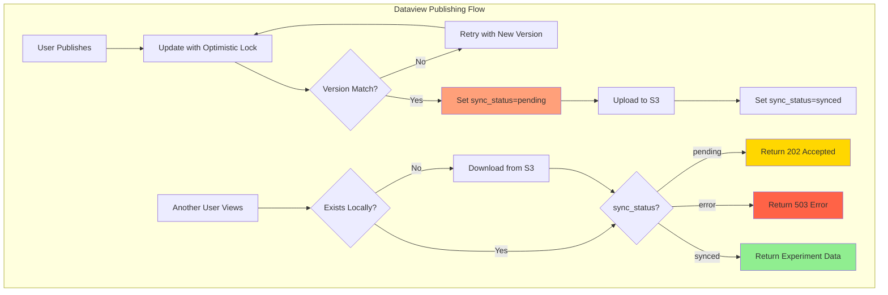
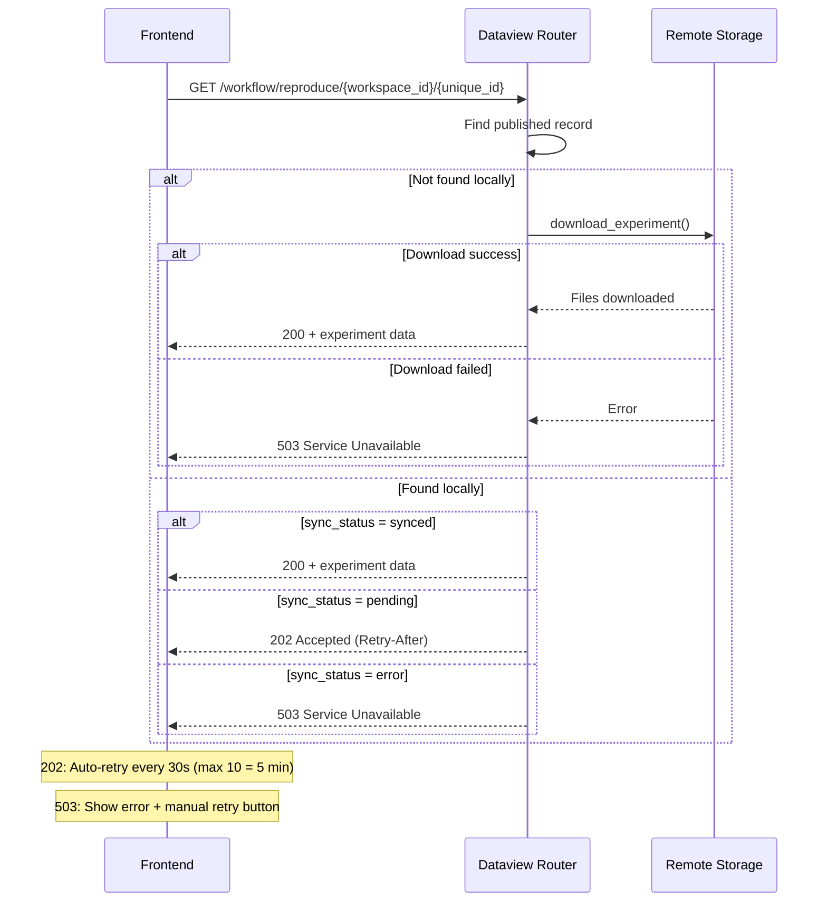

# Dataview Publishing: Optimistic Locking and Multi-Tenant S3 Access

## Executive Summary

- **Three-state sync model** tracks experiment publishing state: pending, synced, error
- **Optimistic locking** prevents concurrent modification conflicts during publish
- **Multi-tenant S3 bucket lookup** resolves the correct owner bucket for shared and published data
- **On-demand visualization sync** lazily downloads experiment files from S3 when accessed
- **Public access via header** allows unauthenticated viewing of published experiments

---

## Key Architectural Principles

1. **Three-State Sync Model**
   - **pending**: Published but not yet synced to local storage
   - **synced**: Available locally (either uploaded or downloaded)
   - **error**: Sync failed (upload/download problem)
   - `LocalSyncStatus` enum in `studio/app/common/schemas/dataview.py`

2. **Optimistic Locking for Data Integrity**
   - `version` field on `ExperimentRecord` prevents concurrent modifications
   - Atomic increment on version during updates
   - Retry loop (max 3 attempts) handles version conflicts, then returns 409

3. **Owner Bucket Resolution**
   - Data always lives in the workspace owner's S3 bucket
   - Accessing shared/published data requires resolving `workspace_id` to the owner's bucket
   - Fallback chain: owner bucket -> requesting user's bucket -> default bucket

4. **Lazy Loading from S3**
   - Published experiments stored in S3 as source of truth
   - Local instances download on-demand when accessed via `_ensure_visualization_synced()`
   - Two sync modes: `visualization` (JSON, TIFF) for fast viewing, `all` (includes PKL, NWB) for Edit ROI

---

## Architecture Overview



### Responsibility Matrix

| Responsibility                | Dataview Router     | Outputs Router      | Auth Dependencies   |
|-------------------------------|---------------------|---------------------|---------------------|
| Publish with optimistic lock  | Exclusive           | No                  | No                  |
| Track sync status             | Exclusive           | No                  | No                  |
| On-demand S3 download         | For reproduce only  | For all outputs     | No                  |
| Resolve owner S3 bucket       | No                  | No                  | Exclusive           |
| Validate public access        | No                  | No                  | Via DataviewService |

---

## Implementation Details

### publish_dataview_records()

**File:** `studio/app/common/routers/dataview.py`
**Purpose:** Publish/unpublish an experiment with optimistic locking and sync status tracking
**Input:** `id` (experiment record ID), `flag` (PublishFlags on/off), authenticated user context
**Output:** `True` on success, 409 on persistent version conflict, 404 if record not found
**Calls:** `DataviewService.find_user_owned_dataview_record()` -> SQLAlchemy `update()` with version check

### public_reproduce_experiment()

**File:** `studio/app/common/routers/dataview.py`
**Purpose:** Public access endpoint for viewing published experiments with lazy S3 download
**Input:** `workspace_id`, `unique_id` (from URL path: `GET /workflow/reproduce/{workspace_id}/{unique_id}`)
**Output:** 200 with experiment data, 202 if pending sync, 503 on download failure
**Calls:** `DataviewService.find_published_dataview_record()` -> `remote_storage_controller.download_experiment()`

### multiple_publish_dataview_records()

**File:** `studio/app/common/routers/dataview.py`
**Purpose:** Bulk publish/unpublish multiple experiments (validates all before publishing)
**Input:** List of experiment IDs, `flag` (PublishFlags on/off), authenticated user context
**Output:** `True` on success, 400 if any record cannot be published
**Calls:** `DataviewService.multiple_publish_dataview_records()`

### get_outputs_remote_bucket_name()

**File:** `studio/app/common/core/auth/auth_dependencies.py`
**Purpose:** Resolve the correct S3 bucket for outputs requests using multi-tier access validation
**Input:** HTTP request, current user (or `None` for public), database session
**Output:** S3 bucket name string (owner's bucket, requesting user's bucket, or default)
**Calls:** `get_current_user_for_dataview_outputs()` -> workspace/share/publish lookups

Resolution priority:
1. Extract `workspace_id` from query params or URL path parsing
2. For authenticated users: check if owner, shared user, or accessing published data
3. For public requests: use workspace owner's bucket (access already validated)
4. Fallback: requesting user's own bucket, then `S3_DEFAULT_BUCKET_NAME`

### _ensure_visualization_synced()

**File:** `studio/app/common/routers/outputs.py`
**Purpose:** On-demand sync of visualization files from S3 before serving output data
**Input:** `dirpath` (local directory path), `remote_bucket_name`
**Output:** Side effect - downloads visualization files if `RemoteSyncStatusFileUtil` reports unsynced
**Calls:** `RemoteSyncStatusFileUtil.check_sync_status_unsynced()` -> `remote_storage_controller.download_experiment()`

### _background_full_sync()

**File:** `studio/app/common/routers/outputs.py`
**Purpose:** Background task to download remaining PKL/NWB files after visualization sync completes
**Input:** `remote_bucket_name`, `workspace_id`, `unique_id`
**Output:** Side effect - downloads all experiment files (prepares Edit ROI without blocking user)
**Calls:** `remote_storage_controller.download_experiment()` with `sync_mode="all"`

### get_or_generate_thumbnail()

**File:** `studio/app/common/routers/outputs.py`
**Purpose:** Lazy generation fallback for legacy experiments without PNG thumbnails
**Input:** `workspace_id`, `unique_id`, `original_path`, `remote_bucket_name`, `thumb_type`
**Output:** Side effect - generates PNG thumbnail from original TIFF/JSON, uploads to S3
**Calls:** `ThumbnailGenerator` (via `dataview_services.py`)

---

## Flow Diagrams

### Publishing Flow

```
┌──────────────────────────────────────────────────────────┐
│ 1. User Clicks "Publish" in Frontend                     │
│    → POST /publish/{id}/{flag}                           │
└──────────────────────────────────────────────────────────┘
                         ↓
┌──────────────────────────────────────────────────────────┐
│ 2. Optimistic Lock Update                                │
│    → Read current version from DB                        │
│    → Atomically set publish_status, sync_status,         │
│      and increment version WHERE version matches         │
└──────────────────────────────────────────────────────────┘
                         ↓
┌──────────────────────────────────────────────────────────┐
│ 3. Version Conflict Handling                             │
│    → rowcount = 1: Success, trigger S3 upload            │
│    → rowcount = 0: Retry (max 3 attempts)                │
│    → Persistent conflict: Return 409                     │
└──────────────────────────────────────────────────────────┘
                         ↓
┌──────────────────────────────────────────────────────────┐
│ 4. S3 Upload Completes                                   │
│    → Set local_sync_status = 'synced'                    │
└──────────────────────────────────────────────────────────┘
```

### Public Access Flow



### Multi-Tenant Bucket Resolution

```
┌──────────────────────────────────────────────────────────┐
│ 1. Frontend Request                                      │
│    → GET /api/visualizations/image/{filepath}?workspace_id=123      │
│    → Headers: Authorization or DATAVIEW_PUBLIC_REQUEST    │
└──────────────────────────────────────────────────────────┘
                         ↓
┌──────────────────────────────────────────────────────────┐
│ 2. get_outputs_remote_bucket_name()                      │
│    → Extract workspace_id (query param or URL path)      │
│    → Validate: owner / shared user / published data      │
│    → Return workspace owner's S3 bucket name             │
└──────────────────────────────────────────────────────────┘
                         ↓
┌──────────────────────────────────────────────────────────┐
│ 3. Endpoint Handler                                      │
│    → _ensure_visualization_synced() if needed            │
│    → Read and return data from local storage             │
│    → Trigger _background_full_sync() for Edit ROI        │
└──────────────────────────────────────────────────────────┘
```

### Public Dataview Request Chain

Public (unauthenticated) access to published outputs uses a header-based approach:

1. Frontend detects public dataview URL via `isDataviewPublicOutputsRequest()` in `frontend/src/utils/DataviewUtils.ts`
2. Axios interceptor adds `DATAVIEW_PUBLIC_REQUEST` header (key from `DATAVIEW_PUBLIC_REQUEST_KEY` constant)
3. Backend `DataviewService.is_dataview_public_outputs_request()` checks for the header
4. `DataviewService.validate_dataview_public_outputs_request()` verifies `ExperimentRecord.publish_status == 1`
5. `get_current_user_for_dataview_outputs()` returns `None` (signals public access to bucket lookup)

---

## Edge Case Handling

### 1. Concurrent Publish Operations

**Problem:** Two users try to publish the same experiment simultaneously.

**Solution:** Optimistic locking with version field:
- Each update includes `WHERE version = current_version`
- If another user modified first, `rowcount = 0` triggers retry
- Max 3 retries, then 409 Conflict returned to the user

### 2. S3 Upload Fails After Publishing

**Problem:** Experiment marked as published but S3 upload fails.

**Solution:** `local_sync_status` remains "pending":
- Users accessing the experiment get HTTP 202 with Retry-After header
- Frontend auto-retries every 30 seconds (max 10 retries = 5 minutes)
- Manual intervention can re-trigger upload

### 3. S3 Download Fails on Access

**Problem:** User accesses published experiment but S3 download fails.

**Solution:** Return HTTP 503 with descriptive error:
- Frontend shows error message with manual retry button
- `CloudDownloadIcon` in `ImagePlotSimple` and `RoiPlotSimple` components for retry

### 4. Bucket Lookup Failure

**Problem:** Cannot determine workspace owner's S3 bucket.

**Solution:** Three-tier fallback chain:
- Try workspace owner's bucket (primary)
- Fall back to authenticated user's own bucket
- Fall back to `S3_DEFAULT_BUCKET_NAME` (default)

---

## Experiment Record Model

**File:** `studio/app/common/models/experiment.py`

Key fields for publishing:

| Field                | Type        | Description                                      |
|----------------------|-------------|--------------------------------------------------|
| `publish_status`     | INTEGER     | 0 = unpublished, 1 = published                   |
| `local_sync_status`  | VARCHAR(20) | Sync state: pending, synced, error                |
| `version`            | INTEGER     | Optimistic locking version counter (default: 0)   |
| `thumbnails`         | JSON        | Paths to `input_thumb.png` and `roi_thumb.png`    |

**Enum:** `LocalSyncStatus` defined in `studio/app/common/schemas/dataview.py`

---

## Configuration

| Variable | Purpose | Default |
|----------|---------|---------|
| `S3_DEFAULT_BUCKET_NAME` | S3 bucket for published experiments | None (required) |
| `AWS_ACCESS_KEY_ID` | Optional static AWS credentials (local/dev only; unset in ECS, which uses the Task Role) | None |
| `AWS_SECRET_ACCESS_KEY` | Optional static AWS credentials (local/dev only; unset in ECS, which uses the Task Role) | None |
| `AWS_REGION` | AWS region | None |

### HTTP Status Codes

| Code | Meaning                  | User Experience                           |
|------|--------------------------|-------------------------------------------|
| 200  | Success                  | Render experiment workflow                 |
| 202  | Accepted (pending sync)  | "Publishing in progress" + auto-retry      |
| 409  | Conflict (version clash) | "Concurrent modification, please retry"    |
| 503  | Service Unavailable      | "Temporarily unavailable" + retry button   |

### On-Demand Sync Modes

| Mode | Files Downloaded | Use Case |
|------|------------------|----------|
| `visualization` | JSON, TIFF | Fast initial viewing |
| `thumbnails_only` | Thumbnail PNGs | Dataview grid display |
| `essential_only` | Minimal files for display | Fallback when full sync unavailable |
| `all` | JSON, TIFF, PKL, NWB | Edit ROI functionality |

---

## Key Functions Reference

### Backend

| Function | Purpose |
|----------|---------|
| `publish_dataview_records()` | Publish with optimistic lock (max 3 retries) |
| `multiple_publish_dataview_records()` | Bulk publish with pre-validation |
| `public_reproduce_experiment()` | Public access with lazy S3 download |
| `get_outputs_remote_bucket_name()` | Resolve owner S3 bucket for outputs |
| `get_current_user_for_dataview_outputs()` | Return user or None for public access |
| `_ensure_visualization_synced()` | On-demand sync before serving output data |
| `_background_full_sync()` | Background download of PKL/NWB for Edit ROI |
| `get_or_generate_thumbnail()` | Lazy PNG thumbnail generation for legacy experiments |
| `DataviewService.is_dataview_public_outputs_request()` | Check for public access header |
| `DataviewService.validate_dataview_public_outputs_request()` | Verify experiment is published |

### Frontend

| Component | Purpose |
|-----------|---------|
| `WorkflowDetailsView.tsx` | Handle 202/503 status codes with auto-retry |
| `DataviewRecords.tsx` | Thumbnail rendering (PNG vs legacy TIFF detection) |
| `ImagePlotSimple.tsx` | Image display with download retry on error |
| `RoiPlotSimple.tsx` | ROI display with download retry on error |
| `DataviewUtils.ts` | `DATAVIEW_PUBLIC_REQUEST_KEY` constant and URL detection |

---

## Monitoring and Metrics

### Key Log Messages

```
Published experiment {id}, sync_status=pending
Optimistic lock conflict for experiment {id}, retrying (attempt {n}/{max})
Downloading published experiment {workspace_id}/{unique_id} from remote bucket {bucket}
Syncing visualization files for {workspace_id}/{unique_id} from remote storage
On-demand sync for visualization: {workspace_id}/{unique_id}
Outputs: using owner bucket {bucket} for workspace {workspace_id}
Outputs: falling back to user {id}'s bucket {bucket} for workspace {workspace_id}
```

### Metrics to Monitor

| Metric                          | Description                              | Alert Threshold     |
|---------------------------------|------------------------------------------|---------------------|
| publish_version_conflict_rate   | % of publish attempts with version clash  | > 10%               |
| s3_download_failure_rate        | % of S3 downloads that fail               | > 5%                |
| pending_sync_duration_avg       | Avg time experiments stay in "pending"     | > 5 minutes         |

### Access Validation

| Access Type | Validation | Bucket Returned |
|-------------|------------|-----------------|
| Workspace Owner | `Workspace.user_id == current_user.id` | Owner's bucket |
| Shared User | `WorkspacesShareUser.user_id == current_user.id` | Owner's bucket |
| Published Data | `ExperimentRecord.publish_status == 1` | Owner's bucket |
| Public Dataview | `DATAVIEW_PUBLIC_REQUEST` header + publish check | Owner's bucket |
| No Access | None of above | Requesting user's bucket (fallback) |

### Common Issues

| Issue | Cause | Solution |
|-------|-------|----------|
| Data loads from wrong bucket | `workspace_id` not passed | Ensure frontend passes `workspace_id` |
| Published data 403 error | `publish_status` not set | Check `ExperimentRecord.publish_status` |
| Sync never completes | Missing bucket permissions | Check S3 IAM policies |
