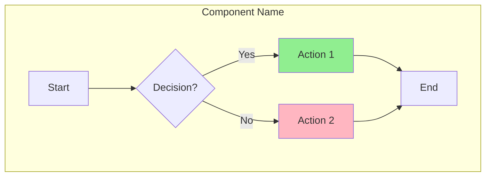
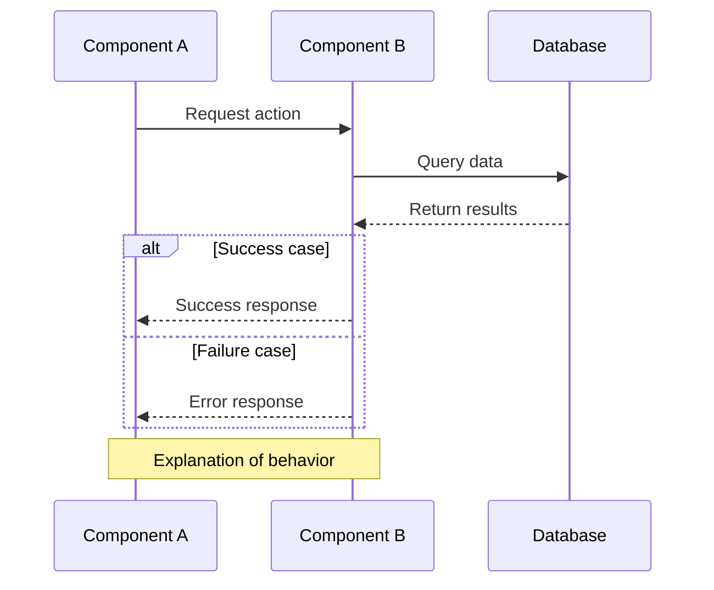

# Architecture Documentation Style Guide

## Purpose

This guide establishes standards for architecture documentation in `infrastructure/documentation/`. Following these conventions ensures consistency, readability, and maintainability across all technical documentation.

**Audience:** Internal developers who will maintain and extend the system.

---

## Document Structure

Every architecture document should follow this structure:

```
# Title: Descriptive Name

## Executive Summary
## Key Architectural Principles
## Architecture Overview
## Implementation Details
## Edge Case Handling
## Monitoring and Metrics
## Configuration
## Testing
## Key Functions Reference
## AWS Resources
```

### Required Sections

| Section | Purpose | Length |
|---------|---------|--------|
| Executive Summary | Quick orientation (what, why, key benefits) | 4-6 bullet points |
| Key Architectural Principles | Design decisions and constraints | 3-5 numbered items |
| Architecture Overview | Visual diagram + responsibility matrix | 1 diagram + 1 table |
| Implementation Details | How it works (function signatures + flow diagrams) | As needed |
| Edge Case Handling | Common failure scenarios and solutions | Roughly 3-5 cases |
| Monitoring and Metrics | CloudWatch metrics, logs, dashboards | 1-2 tables |
| Configuration | Environment variables, triggers, schemas | Tables preferred |
| Key Functions Reference | Function purpose lookup table | 1 table per component |

### Optional Sections

- **Testing** - Include if manual test procedures are valuable
- **AWS Resources** - Include if multiple AWS resources are involved
- **Comparison Tables** - Include when contrasting approaches (e.g., Free vs Premium tier)
- **Flow Diagrams** - Include for complex multi-step processes

---

## Executive Summary Format

Start every document with a concise executive summary using bullet points:

```markdown
## Executive Summary

- **Component Name** handles [primary responsibility]
- **Key feature 1** provides [benefit]
- **Key feature 2** ensures [guarantee]
- **Key feature 3** prevents [problem]
```

**Example:**
```markdown
## Executive Summary

- **Free Manager** handles auto-scaling and load rebalancing for free tier users
- **ASG-based architecture** using Auto Scaling Groups instead of individual EC2 instances
- **Proactive scaling** based on active user count (threshold: 5 users)
- **Workflow protection** ensures users with active jobs are never migrated
```

---

## Key Architectural Principles Format

Document the fundamental design decisions as numbered items with explanations:

```markdown
## Key Architectural Principles

1. **Principle Name**
   - What it means
   - Why it matters
   - How it's enforced

2. **Another Principle**
   - Explanation...
```

**Example:**
```markdown
## Key Architectural Principles

1. **Single Responsibility for Scaling**
   - Premium Manager has exclusive control over EC2 instance states (start/stop)
   - Premium Cleanup NEVER starts or stops instances
   - Prevents conflicting scaling decisions and race conditions

2. **Data Hygiene vs Compute Management**
   - Premium Cleanup removes stale database records and orphaned ALB resources
   - Premium Manager makes scaling decisions based on clean data
   - Clear division: data cleaning vs capacity management
```

---

## Diagrams

### When to Use Each Type

| Diagram Type | Use Case | Complexity |
|--------------|----------|------------|
| ASCII boxes | Simple linear flows (3-5 steps) | Low |
| Mermaid `graph TB` | Architecture overviews, decision trees | Medium |
| Mermaid `sequenceDiagram` | Multi-component interactions with timing | High |

### ASCII Box Diagrams

Use for simple, linear flows where timing doesn't matter:

```
┌──────────────────────────────────────────────────────────┐
│ 1. Step Description                                      │
└──────────────────────────────────────────────────────────┘
                         ↓
┌──────────────────────────────────────────────────────────┐
│ 2. Next Step                                             │
│    → Sub-action 1                                        │
│    → Sub-action 2                                        │
└──────────────────────────────────────────────────────────┘
                         ↓
┌──────────────────────────────────────────────────────────┐
│ 3. Final Step                                            │
└──────────────────────────────────────────────────────────┘
```

**Formatting rules:**
- Box width: 58 characters (consistent)
- Use `→` for sub-actions within a box
- Use `↓` between boxes for flow direction
- Number steps for reference

### Mermaid Graph Diagrams

Use for architecture overviews with branching logic:

```markdown

```

**Formatting rules:**
- Use `subgraph` to group related components
- Use descriptive labels in brackets: `A[Clear Description]`
- Use `-->|Label|` for conditional branches
- Apply colors for visual distinction:
  - `#90EE90` (light green) - Success/happy path
  - `#FFB6C1` (light pink) - Warning/fallback
  - `#87CEEB` (light blue) - Info/intermediate
  - `#FFD700` (gold) - Important/highlight
  - `#DDA0DD` (plum) - Shared/common

### Mermaid Sequence Diagrams

Use for multi-component interactions where timing and order matter:

```markdown

```

**Formatting rules:**
- Define participants with aliases: `participant A as Component A`
- Use `->>`  for synchronous calls
- Use `-->>` for responses
- Use `alt`/`else` for conditional flows
- Use `Note over` for explanations
- Limit to 5-7 participants per diagram

---

## Tables

### Responsibility Matrix

Use for showing ownership between components:

```markdown
| Responsibility          | Component A           | Component B           |
|-------------------------|-----------------------|-----------------------|
| Action 1                | Yes - Exclusive        | No                   |
| Action 2                | No                     | Yes - Exclusive      |
| Shared action           | Yes - Primary          | Yes - Secondary      |
```

### Configuration Tables

Use for environment variables:

```markdown
| Variable | Purpose | Default |
|----------|---------|---------|
| `VAR_NAME` | Description of what it controls | `default_value` |
```

### Metrics Tables

Use for CloudWatch metrics:

```markdown
| Metric Name | Description | Unit | Trigger |
|-------------|-------------|------|---------|
| `MetricName` | What it measures | Count/None/Percent | When published |
```

### Function Reference Tables

Use for quick lookup of key functions:

```markdown
| Function | Purpose |
|----------|---------|
| `function_name()` | Brief description of what it does |
```

**Note:** Avoid line numbers in tables - they become stale. Use function names only.

---

## Function Documentation

### Docstring-Style Format

Document functions using abstract descriptions, not implementation
pseudocode. Pseudocode drifts from implementation and creates false
confidence. Function names and contracts are more stable than logic
details, and developers should read actual code for specifics.

**Format:**

```markdown
### function_name()

**File:** `path/to/file.py`
**Purpose:** What it does and why
**Input:** Parameters and their meaning
**Output:** Return value and side effects
**Calls:** other_function() -> another_function()
```

**Example:**

```markdown
### assign_premium_user()

**File:** `infrastructure/terraform/premium_manager_package/premium_manager.py`
**Purpose:** Assign a premium instance using 5-tier priority fallback
**Input:** user_id (from JWT), event context (API Gateway)
**Output:** Assignment result with instance_id and routing headers, or 202 retry
**Calls:** try_reserve_instance() -> create_target_group() -> create_alb_rule() -> store_user_assignment()
```

Use these blocks in the **Implementation Details** section for key
functions. The **Key Functions Reference** table provides a quick
lookup; docstring blocks add depth for the most important functions.

### When to Use Each Level of Detail

| Level | Where | Content |
|-------|-------|---------|
| One-line | Key Functions Reference table | `function_name()` + brief purpose |
| Docstring block | Implementation Details section | File, purpose, input/output, call chain |
| Flow diagram | Architecture Overview / Flow Diagrams | How functions connect across components |

### SQL Constraints

Use SQL only to document key constraints and safety mechanisms:

```sql
-- Key constraint: only migrate idle users
WHERE active_workflow_count = 0
```

Avoid full queries -- they go stale. Document the constraint, not
the full statement.

### Bash/CLI Examples

For commands, include expected output:

```bash
# Check ECS service status
aws ecs describe-services \
  --cluster my-cluster \
  --services my-service \
  --query 'services[0].desiredCount'

# Expected: 3
```

---

## Edge Case Documentation

Document common failure scenarios using Problem/Solution format:

```markdown
### 1. Descriptive Name

**Problem:** Brief description of what can go wrong.

**Solution:** How the system handles it:
- Protection mechanism 1
- Protection mechanism 2
```

**Example:**
```markdown
### 1. Frontend Logout Fails (Browser Closed)

**Problem:** User closes browser before logout API completes.

**Solution:** Cleanup Lambda acts as safety net:
- Runs hourly to find stale assignments (>2 hours inactive)
- Deletes stale assignments and ALB rules
- Manager's next monitoring run stops idle instances
```

Focus on common cases. For exhaustive edge case coverage, reference the source code.

---

## File References

### Referencing Source Files

Use relative paths from repository root:

```markdown
**File:** `infrastructure/terraform/premium_manager_package/premium_manager.py`
```

**Do not include:**
- Absolute paths
- Line numbers (they become stale)
- Full file contents

### Referencing Functions

Use function name with brief description:

```markdown
**Function:** `assign_premium_user()` - Main assignment handler with priority logic
```

---

## Formatting Conventions

### Text Formatting

| Element | Format | Example |
|---------|--------|---------|
| File paths | Backticks | `infrastructure/terraform/main.tf` |
| Function names | Backticks with parens | `my_function()` |
| Environment variables | Backticks, uppercase | `CLUSTER_NAME` |
| Database tables | Backticks, lowercase | `free_user_assignments` |
| AWS resources | Backticks | `subscr-premium-manager` |
| Key terms (first use) | Bold | **routing_id** |
| Configuration values | Backticks | `desired_count=1` |

### Section Dividers

Use horizontal rules (`---`) between major sections:

```markdown
## Section 1

Content...

---

## Section 2

Content...
```

### Lists

Use numbered lists for sequential steps:

```markdown
1. First step
2. Second step
3. Third step
```

Use bullet points for non-sequential items:

```markdown
- Feature one
- Feature two
- Feature three
```

### Emphasis

- Use **bold** for key terms and important concepts
- Use `code formatting` for technical identifiers
- Use "Yes" and "No" in tables for yes/no columns
- Avoid italics (poor readability in terminals)
- Avoid use of emoji

---

## Document Naming

### File Naming Convention

```
{COMPONENT}_{TOPIC}_ARCHITECTURE.md
```

**Examples:**
- `PREMIUM_MANAGER_ARCHITECTURE.md`
- `FREE_MANAGER_ARCHITECTURE.md`
- `PREMIUM_USER_TEST_RESULTS.md`
  - Note names other than _ARCHITECTURE.md are acceptable in certain circumstances
  but are not expected to be kept in the codebase indefinitely.

### Title Convention

Match the filename but more readable:

```markdown
# Premium Manager Provisioning: Multi-Tier Assignment Strategy
# Free Manager: Auto-Scaling and Load Rebalancing
# ALB Security Enhancement: Non-Reversible Routing IDs
```

---

## Verification Checklist

Before committing documentation, verify:

- [ ] Executive Summary has 4-6 bullet points
- [ ] Key Architectural Principles are numbered (3-5 items)
- [ ] At least one diagram (ASCII or Mermaid) in Architecture Overview
- [ ] Tables use consistent column alignment
- [ ] Functions use docstring-style format (purpose, input/output, call chain)
- [ ] File paths are relative to repository root
- [ ] Edge cases use Problem/Solution format
- [ ] Environment variables are documented
- [ ] No absolute paths or machine-specific content

---

## Examples of Well-Structured Documents

Reference these documents as examples:

| Document | Notable For |
|----------|-------------|
| `FREE_MANAGER_ARCHITECTURE.md` | Excellent Mermaid diagrams, clear algorithm explanation |
| `ALB_ROUTING_ARCHITECTURE.md` | Clear following of style guide |
| `PREMIUM_USER_ASSIGNMENT.md` | Comprehensive priority matrix, sequence diagrams |
| `BACKGROUND_JOB_ARCHITECTURE.md` | Full style guide compliance, edge case handling, configuration table |

---

## Maintenance

### Keeping Docs Current

1. **Update when code changes** - Documentation is part of the PR
2. **Avoid line numbers** - They become stale immediately
3. **Use function names** - They're searchable and more stable
4. **Verify accuracy** - Run `grep` to confirm function names exist

### Documentation Review

When reviewing documentation PRs:

1. Can a new team member understand the component from this doc?
2. Are diagrams clear without reading the text?
3. Do function descriptions capture purpose and contracts, not implementation details?
4. Are configuration options complete?
