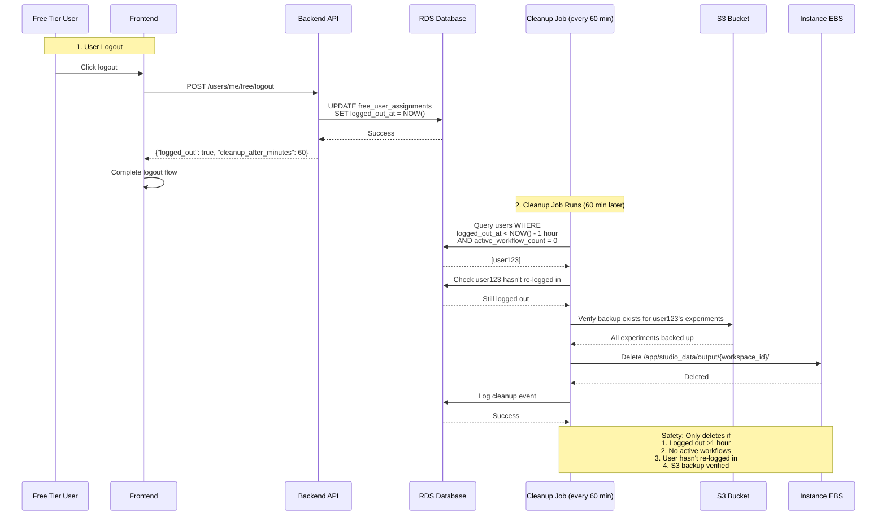

# EBS Storage

## Executive Summary

- **EBS provides fast local storage** for Snakemake workflow execution with S3 as durable backup
- **Background sync job** validates experiments in S3, updates DB status, and triggers proactive download on API instances every 5 minutes
- **Data cleanup job** removes local data for logged-out users (1-hour grace period)
- **Workflow protection** ensures cleanup only happens when `active_workflow_count = 0`
- **S3 verification** guarantees backup exists before any local deletion

---

## Key Architectural Constraints

These are the fundamental constraints that the EBS implementation satisfies:

1. **Multi-instance data accessibility**
   - Public visitors have no sticky session and can be routed to ANY instance by ALB
   - Published experiment data must be accessible from all instances simultaneously
   - Solution: Background job validates S3, triggers proactive download via ALB; remaining instances use on-demand download

2. **User rebalancing requires data portability**
   - Free Manager Lambda can migrate users between instances at any time
   - Users must be able to access their data immediately after migration
   - Solution: S3 as source of truth, local EBS as cache

3. **Storage durability and backup**
   - S3 is the source of truth for all user data (durable backup)
   - Local storage can be lost (instance termination)
   - Solution: All data uploaded to S3, verified before local deletion

4. **Performance requirements**
   - Snakemake workflow execution requires fast file I/O
   - Users expect immediate access to experiments and uploaded files
   - Solution: Local EBS provides fast I/O, S3 sync happens in background

5. **Cost constraints**
   - Free-tier storage costs for 10 users (2 instances):
     - **With proper cleanup:** $35-51/month (EFS + EBS + S3)
     - **Current state (no cleanup):** $86-96/month (accumulated garbage data)
   - Solution: Automated cleanup on logout reduces EBS usage, eliminates EFS costs

## Architecture Overview

### Key Constraints Satisfied

1. **Multi-instance accessibility** - Public visitors routed to any instance by ALB
2. **User rebalancing** - Free Manager Lambda migrates users between instances
3. **Storage durability** - S3 as source of truth, EBS as performance cache
4. **Cost optimization** - Automated cleanup prevents data accumulation

### Data Flow

```
┌─────────────────┐
│ User Publishes  │ → S3 upload → DB: local_sync_status='pending'
└─────────────────┘
         ↓
┌─────────────────┐
│ Background Sync │ → Validate in S3 → DB: local_sync_status='synced'
│ (every 5 min)   │   → Trigger proactive download on API instance via ALB
└─────────────────┘
         ↓
┌─────────────────┐
│ Public Access   │ → Check sync status → Return 200/202/503
└─────────────────┘

┌─────────────────┐
│ User Logout     │ → DB: logged_out_at=NOW()
└─────────────────┘
         ↓
┌─────────────────┐
│ Cleanup Job     │ → Verify: logged_out >1hr, workflows=0, S3 backup exists
│ (every 60 min)  │ → Delete local EBS data
└─────────────────┘
```

### Safety Guarantees

| Guarantee                | Mechanism                                        |
|--------------------------|--------------------------------------------------|
| No data loss             | S3 backup verified before local deletion         |
| No workflow interruption | Cleanup only when `active_workflow_count = 0`    |
| No user disruption       | 1-hour grace period after logout                 |
| Eventual consistency     | Published experiments available within 5 minutes |
| Graceful degradation     | Frontend handles 202/503 responses               |
| Re-login detection       | Cleanup aborts if user logs back in during run    |

---

## Details

### 1. Workflow Tracking

**Files:** `studio/app/common/core/workflow/workflow_tracking.py`, `studio/app/common/core/workflow/workflow_runner.py`, `studio/app/common/core/snakemake/snakemake_executor.py`

**Functionality:**
- Increments `active_workflow_count` on workflow start
- Decrements on completion/failure
- Prevents cleanup during active workflows

### 2. Background Sync (Validation + Proactive Download)

**File:** `studio/app/common/core/background/sync_job.py`

**Functionality:**
- **Periodic validation:** Validates pending experiments exist in S3 via `ListObjectsV2` (50 per run, 10 concurrency). No file downloads on background instance
- **Proactive download trigger:** After validation, triggers download on an API instance via ALB (`POST /system-internal/sync-experiment`)
- **Startup sync:** One-time two-phase download at container startup via `run_startup_sync()` — thumbnails first (10 concurrency), then metadata (3 concurrency)
- Uses persistent retry tracking across runs (max 9 attempts before alerting)

### 3. Logout Integration

**Backend:**
- `studio/app/common/routers/users_me.py` - `/api/users/me/free/logout` endpoint
- Updates `logged_out_at` timestamp in `free_user_assignments` table

**Frontend:**
- `frontend/src/api/users/UsersMe.ts` - Added `logoutFreeUserApi()`
- `frontend/src/utils/auth/AuthUtils.ts` - Integrated API call (fire-and-forget)

**Behavior:**
- Calls `/api/users/me/free/logout` on logout
- Updates `logged_out_at` timestamp in DB
- Proceeds even if API call fails (non-blocking)

### 4. Frontend 202/503 Response Handling

**File Modified:** `frontend/src/components/Dataview/WorkflowDetailsView.tsx`

**Response Handling:**

| Status | UI Display | Behavior |
|--------|-----------|----------|
| 202 (Pending) | Hourglass icon + info alert | Auto-retry every 30s (max 10 retries) |
| 503 (Error) | Error icon + error alert | Manual retry button |
| 200 (Synced) | Normal experiment display | Standard workflow view |

---

## Edge Case Handling

### 1. S3 Validation Failures

**Implementation:** Exponential backoff retry (3 attempts with 1s, 2s backoff delays)

**Monitoring:**
- CloudWatch metrics: `ExperimentsSynced`, `SyncErrors`, `SyncErrorRate`
- Operator alerts when error rate > 50%


### 2. Instance Termination During Cleanup

**Implementation:** Orphaned data detection on every cleanup run

**Behavior:**
- Verifies EC2 instance state before cleanup
- Automatically cleans data from terminated instances
- Only when `active_workflow_count = 0`


### 3. Re-login During Cleanup

**Implementation:** Re-login check before each user's data deletion

**Behavior:**
- Cleanup job calls `_check_user_relogin()` before deleting data
- If user logged back in since cleanup started, skip that user
- Prevents race condition where cleanup deletes data for an active user


### 4. Concurrent Publish/Unpublish

**Implementation:** Optimistic locking with version field

**Behavior:**
- Automatic retry on concurrent modification (max 3 attempts)
- Returns 409 Conflict if retries exhausted
- Prevents lost updates and race conditions


---

## Monitoring and Metrics

---

## Configuration

---

## Key Functions Reference

---

## Testing Summary

### Test Coverage

| Component | Tests | File |
|-----------|-------|------|
| Workflow Tracking | 13 | `test_workflow_tracking.py` |
| Sync Job | 23 | `test_sync_job.py` |
| Cleanup Job | 11 | `test_cleanup_job.py` |
| Cleanup Re-login | 8 | `test_cleanup_job_relogin.py` |
| Dataview Publish | 10 | `test_dataview_publish.py` |
| Logout Endpoint | 5 | `test_users_me_logout.py` |
| CLI Scripts | 18 | `test_cli_scripts.py` |
| **Total** | **88** | **7 files** |

### Key Test Scenarios

**Backend:**
-  Workflow count increment/decrement
-  Exponential backoff on S3 validation failures
-  S3 backup verification before cleanup
-  Orphaned data cleanup from terminated instances
-  Optimistic locking on concurrent publish/unpublish
-  Re-login detection during cleanup
-  202/503 responses based on sync status

**Frontend:**
-  Logout API call integration
-  202 response auto-retry (30s intervals)
-  503 response manual retry
-  Graceful error handling

### CI/CD Integration

**File:** `.github/workflows/tests.yml`

**Triggers:** Push/PR events

**Note:** Test suite can be run locally with `pytest` in the studio directory

---

## Architecture Diagram

### Public Dataview Access Flow (EBS + Background Sync)

```mermaid
sequenceDiagram
    participant User as Logged-in User
    participant Visitor as Public Visitor
    participant API1 as API Instance 1 (EBS)
    participant API2 as API Instance 2 (EBS)
    participant BG as Background Service
    participant S3 as S3 Bucket
    participant DB as RDS Database

    Note over User,API1: 1. Publish Flow
    User->>API1: POST /dataview/publish/123/on
    API1->>S3: Upload experiment files
    API1->>DB: SET publish_status=1,<br/>local_sync_status='pending'
    API1-->>User: Success

    Note over BG,S3: 2. Background Validation + Proactive Download (every 5 min)
    BG->>DB: Query WHERE local_sync_status='pending'
    DB-->>BG: [exp123, exp456]
    BG->>S3: Validate exp123 exists (ListObjectsV2)
    BG->>DB: SET local_sync_status='synced'
    BG->>API1: POST /system-internal/sync-experiment (via ALB)
    Note over API1: Downloads thumbnails + metadata from S3<br/>(single ALB-selected instance; others use startup sync or on-demand)

    Note over Visitor,API2: 3. Visitor Access (ALB routes to any API instance)
    Visitor->>API2: GET /api/public/dataview/.../exp123
    API2->>DB: Check publish_status & local_sync_status

    alt Files exist locally (proactive download or startup sync)
        API2->>API2: Read from local EBS
        API2-->>Visitor: 200 Display experiment
    else Files missing locally (status='synced' but no local files)
        API2->>S3: On-demand download
        API2-->>Visitor: 200 Display experiment
    else Sync Pending (local_sync_status='pending')
        API2-->>Visitor: 202 Accepted - "Publishing in progress..."
        Note over Visitor: Frontend shows loading state<br/>Auto-retries every 30 seconds
    else Sync Error (local_sync_status='error')
        API2-->>Visitor: 503 Service Unavailable - "Temporarily unavailable"
        Note over Visitor: Frontend shows error with retry button
    end

    Note over Visitor,S3: Solution: No EFS cost, eventual consistency (5 min)
```

### Data Cleanup Flow on Logout



---

## Files

### Backend
- `studio/app/common/core/workflow/workflow_tracking.py` - Workflow count tracking
- `studio/app/common/core/background/sync_job.py` - Background S3 validation + proactive download trigger (every 5 min)
- `studio/app/common/core/background/cleanup_job.py` - Data cleanup (every 60 min)
- `studio/app/common/routers/dataview.py` - Publish/access endpoints
- `studio/app/common/routers/users_me.py` - Logout endpoint
- `studio/alembic/versions/a5b9c8d7e6f5_add_sync_logout_and_versioning.py` - Database migration
- `studio/alembic/versions/f801f8250020_create_free_user_tracking_system.py` - Database migration

### Frontend
- `frontend/src/api/users/UsersMe.ts`
- `frontend/src/utils/auth/AuthUtils.ts`
- `frontend/src/components/Dataview/WorkflowDetailsView.tsx`

### Testing
- `studio/tests/app/common/core/workflow/test_workflow_tracking.py` (13 tests)
- `studio/tests/app/common/core/background/test_sync_job.py` (23 tests)
- `studio/tests/app/common/core/background/test_cleanup_job.py` (11 tests)
- `studio/tests/app/common/core/background/test_cleanup_job_relogin.py` (8 tests)
- `studio/tests/app/common/core/background/test_cli_scripts.py` (18 tests)
- `studio/tests/app/common/routers/test_dataview_publish.py` (10 tests)
- `studio/tests/app/common/routers/test_users_me_logout.py` (5 tests)
- `.github/workflows/tests.yml` - CI/CD integration
