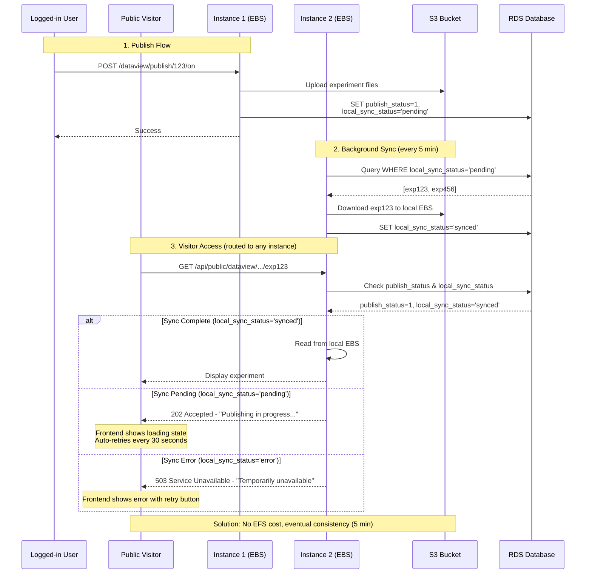
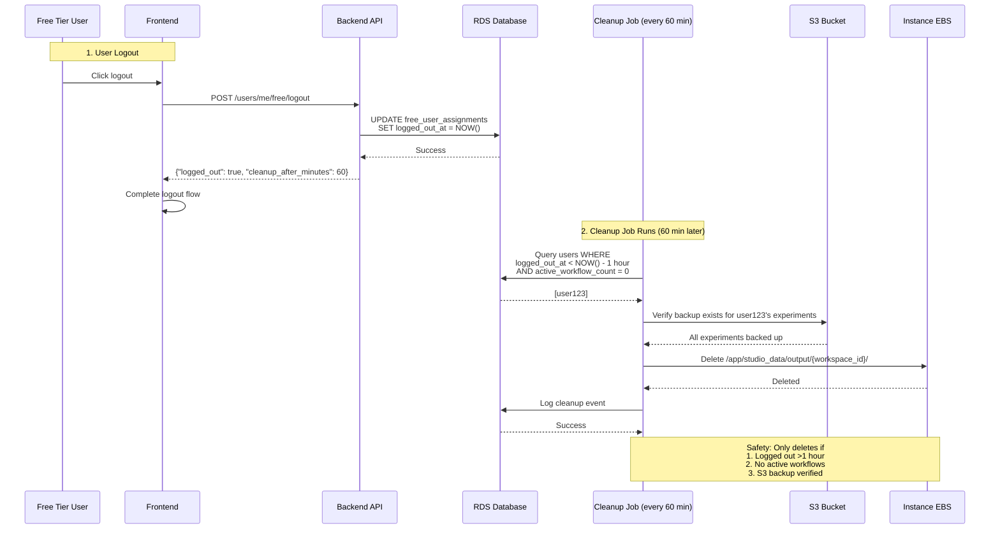

# EBS Storage

## Executive Summary

## Key Architectural Constraints

These are the fundamental constraints that the EBS implementation satisfies:

1. **Multi-instance data accessibility**
   - Public visitors have no sticky session and can be routed to ANY instance by ALB
   - Published experiment data must be accessible from all instances simultaneously
   - Solution: Background sync job downloads published experiments to all instances

2. **User rebalancing requires data portability**
   - Free Manager Lambda can migrate users between instances at any time
   - Users must be able to access their data immediately after migration
   - Solution: S3 as source of truth, local EBS as cache

3. **Storage durability and backup**
   - S3 is the source of truth for all user data (durable backup)
   - Local storage can be lost (instance termination)
   - Solution: All data uploaded to S3, verified before local deletion

4. **Performance requirements**
   - Snakemake workflow execution requires fast file I/O
   - Users expect immediate access to experiments and uploaded files
   - Solution: Local EBS provides fast I/O, S3 sync happens in background

5. **Cost constraints**
   - Free-tier storage costs for 10 users (2 instances):
     - **With proper cleanup:** $35-51/month (EFS + EBS + S3)
     - **Current state (no cleanup):** $86-96/month (accumulated garbage data)
   - Solution: Automated cleanup on logout reduces EBS usage, eliminates EFS costs

## Architecture Overview

### Key Constraints Satisfied

1. **Multi-instance accessibility** - Public visitors routed to any instance by ALB
2. **User rebalancing** - Free Manager Lambda migrates users between instances
3. **Storage durability** - S3 as source of truth, EBS as performance cache
4. **Cost optimization** - Automated cleanup prevents data accumulation

### Data Flow

```
┌─────────────────┐
│ User Publishes  │ → S3 upload → DB: local_sync_status='pending'
└─────────────────┘
         ↓
┌─────────────────┐
│ Background Sync │ → Download to all instances → DB: local_sync_status='synced'
│ (every 5 min)   │
└─────────────────┘
         ↓
┌─────────────────┐
│ Public Access   │ → Check sync status → Return 200/202/503
└─────────────────┘

┌─────────────────┐
│ User Logout     │ → DB: logged_out_at=NOW()
└─────────────────┘
         ↓
┌─────────────────┐
│ Cleanup Job     │ → Verify: logged_out >1hr, workflows=0, S3 backup exists
│ (every 60 min)  │ → Delete local EBS data
└─────────────────┘
```

### Safety Guarantees

| Guarantee                | Mechanism                                        |
|--------------------------|--------------------------------------------------|
| No data loss             | S3 backup verified before local deletion         |
| No workflow interruption | Cleanup only when `active_workflow_count = 0`    |
| No user disruption       | 1-hour grace period after logout                 |
| Eventual consistency     | Published experiments available within 5 minutes |
| Graceful degradation     | Frontend handles 202/503 responses               |

---

## Details

### 1. Workflow Tracking

**Files:** `workflow_tracking.py`, `workflow_runner.py`, `snakemake_executor.py`

**Functionality:**
- Increments `active_workflow_count` on workflow start
- Decrements on completion/failure
- Prevents cleanup during active workflows

### 2. Frontend Logout Integration

**Files Modified:**
- `frontend/src/api/users/UsersMe.ts` - Added `logoutFreeUserApi()`
- `frontend/src/utils/auth/AuthUtils.ts` - Integrated API call (fire-and-forget)

**Behavior:**
- Calls `/api/users/me/free/logout` on logout
- Updates `logged_out_at` timestamp in DB
- Proceeds even if API call fails

### 3. Frontend 202/503 Response Handling

**File Modified:** `frontend/src/components/Dataview/WorkflowDetailsView.tsx`

**Response Handling:**

| Status | UI Display | Behavior |
|--------|-----------|----------|
| 202 (Pending) | Hourglass icon + info alert | Auto-retry every 30s (max 10 retries) |
| 503 (Error) | Error icon + error alert | Manual retry button |
| 200 (Synced) | Normal experiment display | Standard workflow view |

---

## Edge Case Handling

### 1. S3 Download Failures

**Implementation:** Exponential backoff retry (3 attempts: 1s, 2s, 4s delays)

**Monitoring:**
- CloudWatch metrics: `ExperimentsSynced`, `SyncErrors`, `SyncErrorRate`
- Operator alerts when error rate > 50%

### 2. Instance Termination During Cleanup

**Implementation:** Orphaned data detection on every cleanup run

**Behavior:**
- Verifies EC2 instance state before cleanup
- Automatically cleans data from terminated instances
- Only when `active_workflow_count = 0`

### 3. Concurrent Publish/Unpublish

**Implementation:** Optimistic locking with version field

**Behavior:**
- Automatic retry on concurrent modification (max 3 attempts)
- Returns 409 Conflict if retries exhausted
- Prevents lost updates and race conditions

---

## Testing Summary

### Test Coverage

| Component | Tests | File |
|-----------|-------|------|
| Workflow Tracking | 11 | `test_workflow_tracking.py` |
| Sync Job | 3 | `test_sync_job.py` |
| Cleanup Job | 10 | `test_cleanup_job.py` |
| Dataview Publish | 9 | `test_dataview_publish.py` |
| Logout Endpoint | 5 | `test_users_me_logout.py` |
| **Total** | **38** | **5 files** |

### Key Test Scenarios

**Backend:**
-  Workflow count increment/decrement
-  Exponential backoff on S3 failures
-  S3 backup verification before cleanup
-  Orphaned data cleanup from terminated instances
-  Optimistic locking on concurrent publish/unpublish
-  202/503 responses based on sync status

**Frontend:**
-  Logout API call integration
-  202 response auto-retry (30s intervals)
-  503 response manual retry
-  Graceful error handling

### CI/CD Integration

**File:** `.github/workflows/test_new_features.yml`

**Triggers:** Push/PR to main/develop branches

**Jobs:** workflow-tracking, background-jobs, dataview-endpoints, integration-tests, edge-cases

---

## Architecture Diagram

### Public Dataview Access Flow (EBS + Background Sync)



### Data Cleanup Flow on Logout



---

## Files

### Backend
- `studio/app/common/core/workflow/workflow_tracking.py`
- `studio/app/common/core/background/sync_job.py`
- `studio/app/common/core/background/cleanup_job.py`
- `studio/app/common/routers/dataview.py`
- `studio/alembic/versions/a5b9c8d7e6f5_*.py`

### Frontend
- `frontend/src/api/users/UsersMe.ts`
- `frontend/src/utils/auth/AuthUtils.ts`
- `frontend/src/components/Dataview/WorkflowDetailsView.tsx`

### Testing
- `studio/tests/app/common/core/workflow/test_workflow_tracking.py`
- `studio/tests/app/common/core/background/test_sync_job.py`
- `studio/tests/app/common/core/background/test_cleanup_job.py`
- `studio/tests/app/common/routers/test_dataview_publish.py`
- `studio/tests/app/common/routers/test_users_me_logout.py`
- `studio/tests/README.md`
- `.github/workflows/test_new_features.yml`
