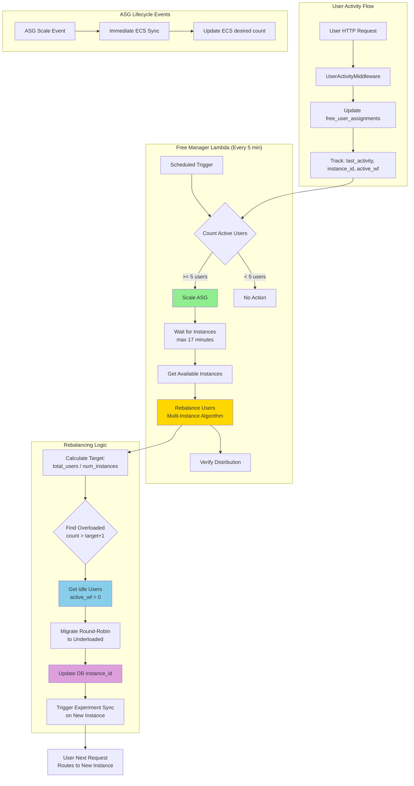
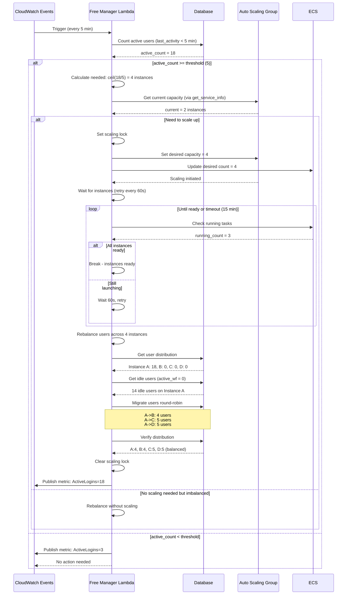
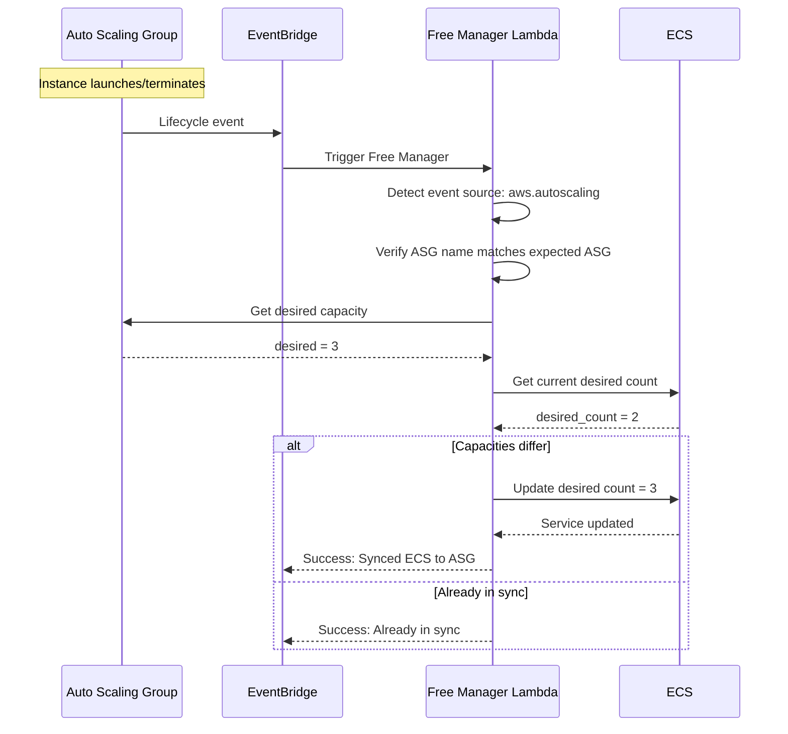
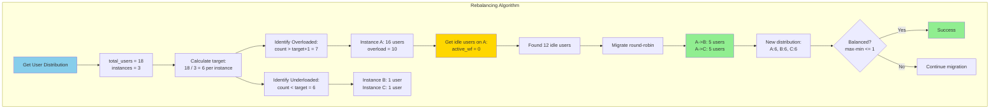

# Free Manager: Auto-Scaling and Load Rebalancing for Free Tier Users

## Executive Summary
- **Free Manager** handles auto-scaling and load rebalancing for free tier users
- **ASG-based architecture** using Auto Scaling Groups instead of individual EC2 instances
- **Proactive scaling** based on active user count (threshold: 5 users)
- **Multi-instance rebalancing** distributes load evenly across ALL instances
- **Workflow protection** ensures users with active jobs are never migrated
- **Experiment sync** automatically syncs experiment metadata after migration

## Key Architectural Principles

1. **Activity-Based Scaling**
   - Monitors active user count (activity within 5 minutes)
   - Scales ASG when threshold reached (default: 5 users)
   - Calculates instances needed: `ceil(active_users / 5)`
   - Maximum instances: 10 (configurable)

2. **Proactive Rebalancing**
   - Distributes users evenly across ALL instances (not just most/least loaded)
   - Also rebalances when distribution is imbalanced without scaling
   - Waits for new instances with retry (max 17 min in code, Lambda timeout 15 min)
   - Migrates idle users via round-robin distribution
   - Verifies distribution is balanced after migration (max-min <= 1)

3. **Job Preservation (Triple Protection)**
   - Database field: `active_workflow_count` tracks running jobs
   - SQL constraint: Migration query includes `WHERE active_workflow_count = 0`
   - Atomic updates: Users with jobs cannot be migrated (SQL-level guarantee)

4. **Sticky Session Compatibility**
   - Works with ALB sticky sessions (5-minute cookies)
   - Users migrate within 5 minutes after rebalancing (cookie expires)
   - No user-visible disruption during migration

5. **Post-Migration Experiment Sync**
   - After successful migration, triggers experiment metadata sync on new instance
   - Calls internal API endpoint (`/system-internal/sync-experiments/{user_id}`)
   - Fire-and-forget: migration succeeds even if sync fails

## Architecture Overview



### Scaling Strategy Matrix

Formula: `instances = min(max(1, ceil(active_users / 5)), 10)`

| Active Users | Instances Needed | Action |
|-------------|------------------|--------|
| 0-5 | 1 | Below threshold or 1 instance sufficient |
| 6-10 | 2 | Scale to 2, rebalance |
| 11-15 | 3 | Scale to 3, rebalance |
| 16-20 | 4 | Scale to 4, rebalance |
| 21-25 | 5 | Scale to 5, rebalance |
| 26-30 | 6 | Scale to 6, rebalance |
| 31-35 | 7 | Scale to 7, rebalance |
| 36-40 | 8 | Scale to 8, rebalance |
| 41-45 | 9 | Scale to 9, rebalance |
| 46+ | 10 | Maximum instances (cap) |

Note: Scaling triggers at >= 5 active users, but 5 users only
needs 1 instance (`ceil(5/5) = 1`). Actual scale-up starts at 6 users.

### Motivation: Sticky Session Overload

Without Free Manager, all users in a burst (e.g., 20 during a demo) get
sticky session cookies to the same instance. ASG launches new instances
but existing users remain stuck on the overloaded one. The only
workaround is asking users to log out and back in.

Free Manager solves this by tracking activity in the database, proactively
scaling the ASG, waiting for instances to be ready, then rebalancing idle
users across all instances via round-robin migration. Users with active
workflows are protected by atomic SQL constraints, and experiment metadata
is synced to new instances after migration.

### Flow Diagrams

#### Scheduled Monitoring Flow (Every 5 Minutes)



#### ASG Lifecycle Event Flow



#### Multi-Instance Rebalancing Algorithm



---

## Implementation Details

### 1. Middleware: Activity Tracking

#### UserActivityMiddleware

**File:** `studio/app/common/core/middleware/user_activity_middleware.py`
**Purpose:** Track user activity and instance assignment for both
free and premium tiers. Aliased as `FreeUserActivityMiddleware`
for backwards compatibility.
**Input:** ASGI scope (HTTP request with JWT Authorization header)
**Output:** Updates `free_user_assignments` or
`premium_user_assignments` table via async background task
**Calls:** `extract_uid_from_firebase_jwt()` ->
`_get_user_id_and_tier()` ->
`_update_free_user_activity_async()` or
`_update_premium_user_activity_async()`

Performance optimizations:
- In-memory cache (60s TTL) throttles DB writes to once/min/user
- User tier cache (5 min TTL) avoids repeated subscription lookups
- Instance ID cached at startup (fetched once from EC2 metadata)

**Instance ID Resolution:**
The middleware first checks the `INSTANCE_ID` environment variable,
then falls back to IMDSv2 metadata service (with IMDSv1 fallback).
The result is cached at startup. Returns "local" in development
(skips DB update).

### 2. Free Manager Lambda

**File:** `infrastructure/terraform/free_manager_package/free_manager.py`

#### handler()

**File:** `infrastructure/terraform/free_manager_package/free_manager.py`
**Purpose:** Main Lambda entry point supporting dual triggers
(CloudWatch scheduled events and ASG lifecycle events)
**Input:** Lambda event dict and context; routes on
`event["source"]`
**Output:** Dict with statusCode and JSON body describing
actions taken
**Calls:** `handle_asg_event()` or
`handle_scheduled_monitoring()` based on event source

#### handle_scheduled_monitoring()

**File:** `infrastructure/terraform/free_manager_package/free_manager.py`
**Purpose:** Periodic monitoring (every 5 minutes) -- counts
active users, scales ASG if threshold reached, rebalances
users across instances, publishes CloudWatch metrics
**Input:** Lambda event and context (scheduled trigger)
**Output:** Dict with scaling/rebalancing results
**Calls:** `count_active_free_users()` ->
`publish_active_user_metric()` -> `scale_and_rebalance()`

#### scale_and_rebalance()

**File:** `infrastructure/terraform/free_manager_package/free_manager.py`
**Purpose:** Scale ECS service and rebalance idle users.
Handles three scenarios: scale up (with instance wait loop),
conservative scale down (only if overprovisioned by >= 2),
and rebalance-only when distribution is imbalanced.
**Input:** `active_user_count`, `max_instances`
**Output:** Dict with scaling action, migrated users, and
balance status. Uses CloudWatch metric lock to prevent
concurrent operations.
**Calls:** `is_scaling_in_progress()` -> `get_service_info()`
-> `scale_service()` -> `get_available_instance_ids()` ->
`rebalance_idle_users_multi()` -> `is_distribution_balanced()`

Key formula:
```python
desired = min(max(1, (active_users + 4) // 5), max_instances)
```

Wait loop retries every 60s. Code sets `max_wait_time = 1020s`
(17 min) but Lambda timeout is 900s (15 min), so effective
timeout is 15 minutes. Rebalancing retried on next Lambda run
if not completed.

#### scale_service()

**File:** `infrastructure/terraform/free_manager_package/free_manager.py`
**Purpose:** Scale ASG and ECS service together. Sets ASG
desired capacity directly (`HonorCooldown=False` for immediate
scaling), then updates ECS desired count to match. This manual
approach prevents runaway scaling from ECS managed scaling
(CPU spike cascades).
**Input:** `cluster_name`, `service_name`, `desired_count`
**Output:** None (side effect: ASG and ECS capacity updated)
**Calls:** `autoscaling_client.set_desired_capacity()` ->
`ecs_client.update_service()`

#### get_service_info()

**File:** `infrastructure/terraform/free_manager_package/free_manager.py`
**Purpose:** Get current ASG and ECS service information.
Returns ASG desired capacity as source of truth for scaling,
plus ECS running/pending counts.
**Input:** `cluster_name`, `service_name`
**Output:** Dict with `desired_count` (from ASG),
`running_count` and `pending_count` (from ECS)
**Calls:** `autoscaling_client.describe_auto_scaling_groups()`
-> `ecs_client.describe_services()`

#### get_available_instance_ids()

**File:** `infrastructure/terraform/free_manager_package/free_manager.py`
**Purpose:** Get list of RUNNING EC2 instance IDs from ECS
cluster. Three-step verification: list container instances
(ACTIVE, DRAINING, REGISTERING), filter for connected ECS
agents, verify EC2 state is 'running'.
**Input:** `cluster_name`, `service_name`
**Output:** List of EC2 instance IDs that are fully ready to
handle traffic
**Calls:** `ecs_client.list_container_instances()` ->
`ecs_client.describe_container_instances()` ->
`ec2_client.describe_instances()`

### 3. Multi-Instance Rebalancing

#### rebalance_idle_users_multi()

**File:** `infrastructure/terraform/free_manager_package/free_manager.py`
**Purpose:** Rebalance idle users across ALL available
instances using round-robin distribution from overloaded
to underloaded instances
**Input:** `available_instances` (list of instance IDs)
**Output:** List of migrated user IDs
**Calls:** `get_users_per_instance()` ->
`get_idle_users_for_instance()` ->
`migrate_user_to_instance()`

Algorithm:
1. Calculate target users per instance (even distribution)
2. Identify overloaded instances (count > target + 1)
3. Identify underloaded instances (count < target)
4. Migrate idle users from overloaded to underloaded
   (round-robin)

Key constraint:
```python
# Only users with no active workflows can be migrated
idle_users = get_idle_users_for_instance(source_inst)
# active_workflow_count = 0
```

### 4. Workflow Protection and Migration

#### migrate_user_to_instance()

**File:** `infrastructure/terraform/free_manager_package/free_user_utils.py`
**Purpose:** Atomic user migration with triple workflow
protection. After successful migration, triggers experiment
metadata sync on the new instance (fire-and-forget).
**Input:** `user_id`, `new_instance_id`
**Output:** True if migration succeeded, False if user has
active workflows or does not exist
**Calls:** SQL UPDATE with constraint ->
`trigger_experiment_sync()`

Key constraint:
```sql
-- Only migrate idle users (atomic protection)
WHERE user_id = %s AND active_workflow_count = 0
```

#### trigger_experiment_sync()

**File:** `infrastructure/terraform/free_manager_package/free_user_utils.py`
**Purpose:** Trigger experiment metadata sync for user on
their new instance. Calls internal API to ensure experiment
metadata is downloaded from S3. Fire-and-forget: migration
succeeds even if sync fails.
**Input:** `user_id` (int)
**Output:** True if sync initiated, False on failure
**Calls:** POST to
`/system-internal/sync-experiments/{user_id}` via ALB

#### get_idle_users_for_instance()

**File:** `infrastructure/terraform/free_manager_package/free_user_utils.py`
**Purpose:** Get list of idle users on a specific instance.
Idle = no active workflows (`active_workflow_count = 0`).
No time-based restriction: users without workflows can be
migrated regardless of last activity time.
**Input:** `instance_id`
**Output:** List of user IDs safe to migrate

#### get_users_per_instance()

**File:** `infrastructure/terraform/free_manager_package/free_user_utils.py`
**Purpose:** Get count of active users per instance. Only
counts users with activity within threshold (filters by
`last_activity >= cutoff`). Inactive users are not counted
in distribution calculations.
**Input:** `activity_threshold_minutes` (default: 10)
**Output:** Dict mapping `instance_id` -> user count

### 5. Workflow Tracking

#### increment_workflow_count()

**File:** `studio/app/common/core/workflow/workflow_tracking.py`
**Purpose:** Increment `active_workflow_count` when a workflow
starts. Determines user tier (free/premium), then updates the
appropriate assignment table. Falls back to alternative table
if primary does not have a record.
**Input:** `user_id`
**Output:** None (side effect: count incremented in DB)

#### decrement_workflow_count()

**File:** `studio/app/common/core/workflow/workflow_tracking.py`
**Purpose:** Decrement `active_workflow_count` when a workflow
completes. Uses `GREATEST(0, count - 1)` to prevent going
below zero, avoiding race conditions.
**Input:** `user_id`
**Output:** None (side effect: count decremented in DB)

---

## Edge Case Handling

### 1. Concurrent Scaling Operations

**Problem:** Multiple Lambda invocations could try to scale simultaneously.

**Solution:** CloudWatch metrics-based locking via
`is_scaling_in_progress()` and `set_scaling_lock()`:
- Checks `ScalingInProgress` metric (15-min window, Maximum stat)
- Set before scaling, cleared in `finally` block
- Fails open: returns False if check fails (allows scaling)

### 2. Instances Not Ready in Time

**Problem:** New instances take 6-8 minutes to launch (lifecycle hooks ~5 min, EC2 boot ~5 min, ECS tasks ~7 min).

**Solution:** Retry logic with timeout. The scale_and_rebalance() function
retries every 60 seconds. Code sets max_wait_time = 1020s (17 min) but
Lambda timeout is 900s (15 min), so effective timeout is 15 minutes.
Rebalancing will be retried on the next 5-minute Lambda run if not completed.


### 3. Users With Active Workflows

**Problem:** Migrating a user with running workflow would disrupt their work.

**Solution:** SQL-level protection (atomic check):

```sql
-- Key constraint: only migrate idle users
WHERE user_id = %s
  AND active_workflow_count = 0  -- Atomic protection
```


### 4. ASG and ECS Out of Sync

**Problem:** Manual ASG scaling or alarm-driven scaling changes ASG capacity but not ECS.

**Solution:** Dual triggers -- ASG events sync ECS immediately
via `handle_asg_event()`:
- EventBridge rule triggers on launch/terminate events
- Verifies the event is for the expected ASG before acting
- Reads ASG desired capacity and updates ECS desired count
  to match


### 5. Unbalanced Distribution After Migration

**Problem:** Migration might not achieve perfect balance (users with active workflows can't be moved).

**Solution:** Verification after migration via
`is_distribution_balanced()`:
- Checks `max(counts) - min(counts) <= tolerance`
- Default tolerance: 1
- If still imbalanced, will retry on next Lambda run


### 6. Conservative Scale-Down

**Problem:** Frequent scale up/down oscillation wastes resources.

**Solution:** Only scales down when overprovisioned by >= 2 instances.
This prevents thrashing when user count hovers near a boundary.


---

## Monitoring and Metrics

### CloudWatch Metrics Published

**By Free Manager** (every 5 minutes):

| Metric Name | Description | Unit | Namespace |
|-------------|-------------|------|-----------|
| `ActiveLogins` | Users with activity in last 5 minutes | Count | OptiNiSt/FreeUsers |
| `ScalingInProgress` | Lock to prevent concurrent operations | None (0 or 1) | OptiNiSt/FreeManager |

**Dashboard:** `subscr-optinist-monitoring` (integrated with premium tier monitoring)

### Key Log Events

**Free Manager Logs** (`/aws/lambda/subscr-free-manager`):

```
============================================================
SCHEDULED MONITORING
============================================================
Active free tier users: 18
User threshold reached (18 >= 5), initiating scaling

============================================================
SCALE AND REBALANCE
============================================================
Active users: 18
Max instances: 10
Calculated desired instances: 4
Formula: min(max(1, (18 + 4) // 5), 10)

Scaling up from 2 to 4 instances
Scaling ASG subscr-optinist-asg to desired capacity: 4
Successfully set ASG desired capacity to 4
Successfully updated ECS service to 4 tasks

Waiting for new instances to launch and become ECS-ready (up to 17 minutes)
[Attempt 1] Checking instance readiness (elapsed: 0s / 1020s)
Found 3/4 running instances
[Attempt 2] Checking instance readiness (elapsed: 60s / 1020s)
Found 4/4 running instances
All instances ready! Attempting rebalancing

============================================================
MULTI-INSTANCE REBALANCING
============================================================
Available instances: ['i-abc123', 'i-def456', 'i-ghi789', 'i-jkl012']
User distribution: {'i-abc123': 18, 'i-def456': 0, 'i-ghi789': 0, 'i-jkl012': 0}
Target distribution: 4 users per instance (18 users / 4 instances)

Overloaded instances: [('i-abc123', 18)]
Underloaded instances: [('i-def456', 0), ('i-ghi789', 0), ('i-jkl012', 0)]

Processing overloaded instance i-abc123: 18 users (need to move 14)
Found 14 idle users, migrating 14

14 users migrated successfully
New distribution: {'i-abc123': 4, 'i-def456': 5, 'i-ghi789': 5, 'i-jkl012': 4}
Distribution check: max=5, min=4, diff=1, tolerance=1, balanced=True
Rebalancing successful - distribution is balanced!

Scaling lock CLEARED
Published CloudWatch metric: ActiveLogins=18
```

**ASG Event Logs:**

```
============================================================
ASG EVENT HANDLER
============================================================
Event Type: EC2 Instance Launch Successful
ASG Name: subscr-optinist-asg
ASG desired capacity: 3
ECS desired count: 2

Syncing ECS from 2 to 3
Successfully synced ECS to 3
```

---

## Configuration

### Environment Variables

**Free Manager Lambda:**
```bash
# Database
RDS_HOST                        # Database endpoint (host:port format)
RDS_USER                        # Database username
RDS_PASSWORD                    # Database password
RDS_DATABASE                    # Database name

# ECS & ASG
CLUSTER_NAME                    # ECS cluster name
FREE_SERVICE_NAME               # ECS service name for free tier
ASG_NAME                        # Auto Scaling Group name

# Scaling Configuration
FREE_USER_THRESHOLD             # Users to trigger scaling (default: 5)
FREE_IDLE_THRESHOLD_MINUTES     # Activity threshold minutes (production: 5)
MAX_FREE_INSTANCES              # Maximum instances (default: 10)

# Internal API (for experiment sync after migration)
ALB_DNS_NAME                    # ALB DNS name for internal API calls
INTERNAL_API_SECRET             # Secret for internal API authentication

# Lambda Configuration
# Timeout: 900 seconds (15 minutes)
# Runtime: Python 3.11
```

### Triggers

| Lambda | Trigger | Frequency | EventBridge Rule |
|--------|---------|-----------|------------------|
| Free Manager | Scheduled monitoring | Every 5 minutes | `subscr-free-manager-schedule` |
| Free Manager | ASG lifecycle events | On ASG events | `subscr-free-manager-asg-events` |

### Database Schema

**Table:** `free_user_assignments`

```sql
CREATE TABLE free_user_assignments (
    id BIGINT UNSIGNED AUTO_INCREMENT PRIMARY KEY,
    user_id BIGINT UNSIGNED NOT NULL UNIQUE,
    instance_id VARCHAR(20) NOT NULL,
    assigned_at TIMESTAMP NOT NULL DEFAULT CURRENT_TIMESTAMP,
    last_activity TIMESTAMP NOT NULL DEFAULT CURRENT_TIMESTAMP,
    active_workflow_count INT NOT NULL DEFAULT 0,
    last_workflow_start TIMESTAMP NULL,
    last_workflow_end TIMESTAMP NULL,
    migration_count INT NOT NULL DEFAULT 0,
    last_migration TIMESTAMP NULL,
    logged_out_at TIMESTAMP NULL,

    FOREIGN KEY (user_id) REFERENCES users(id)
);
```

**ORM Model:** `studio/app/common/models/free_user.py` (`FreeUserAssignment`)

---

## Testing

### Test Files

**Unit tests:** `studio/tests/infrastructure/test_free_manager.py`
- Mocked unit tests for Lambda handler routing, scaling logic, etc.
- Run with pytest: `pytest studio/tests/infrastructure/test_free_manager.py`

**Integration tests:** `infrastructure/scripts/test_free_manager.py`
- E2E tests against real AWS resources (requires AWS credentials)
- Tests activity tracking, scaling, rebalancing, workflow protection

**What the integration tests cover:**

1. **Activity Tracking** - Verify middleware updates last_activity
2. **Active User Count** - Verify Lambda counts users correctly
3. **Proactive Scaling** - Verify ASG scales when threshold reached
4. **Instance Readiness** - Verify Lambda waits for new instances
5. **User Rebalancing** - Verify even distribution across instances
6. **Workflow Protection** - Verify users with jobs are NOT migrated
7. **CloudWatch Metrics** - Verify metrics are published
8. **JSON Serialization** - Verify Decimal types from DB serialize properly

**Running integration tests:**

```bash
cd infrastructure/scripts

# Run all tests
python test_free_manager.py

# Specify terraform directory
python test_free_manager.py --terraform-dir /path/to/terraform

# Specify AWS region
python test_free_manager.py --region ap-northeast-1
```

### Manual Testing Scenarios

**Scenario 1: Simulate Demo Rush (20 users)**

```bash
# 1. Cleanup existing state
python test_free_manager.py --action cleanup

# 2. Create 20 test users
python test_free_manager.py --action simulate_users --count 20

# 3. Trigger Free Manager
aws lambda invoke \
  --function-name subscr-free-manager \
  --payload '{}' \
  /dev/stdout

# Expected: Scales to 4 instances, distributes 5 users per instance
```

**Scenario 2: Verify Workflow Protection**

```bash
# 1. Create test user with workflow
python test_free_manager.py --action simulate_workflow --user test_user_1

# 2. Trigger rebalancing
aws lambda invoke \
  --function-name subscr-free-manager \
  --payload '{}' \
  /dev/stdout

# 3. Check user assignment
python test_free_manager.py --action check_assignment --user test_user_1

# Expected: User NOT migrated (still on original instance)
```

**Scenario 3: ASG Manual Scaling**

```bash
# 1. Manually scale ASG
aws autoscaling set-desired-capacity \
  --auto-scaling-group-name subscr-optinist-asg \
  --desired-capacity 3

# Expected: EventBridge triggers Free Manager, ECS syncs to 3

# 2. Verify ECS synced
aws ecs describe-services \
  --cluster subscr-optinist-cloud-cluster \
  --services subscr-optinist-cloud-service \
  --query 'services[0].desiredCount'

# Expected: 3
```

---

## Key Functions Reference

### Free Manager Lambda (`free_manager.py`)

| Function | Purpose |
|----------|---------|
| `handler()` | Main Lambda handler (dual triggers) |
| `handle_scheduled_monitoring()` | 5-minute monitoring loop |
| `handle_asg_event()` | ASG lifecycle event handler |
| `scale_and_rebalance()` | Main scaling and rebalancing logic |
| `get_service_info()` | Get ASG capacity and ECS task counts |
| `scale_service()` | Scale ASG and ECS service |
| `rebalance_idle_users_multi()` | Multi-instance rebalancing algorithm |
| `get_available_instance_ids()` | Discover running EC2 instances |
| `is_scaling_in_progress()` | Check CloudWatch metric lock |
| `set_scaling_lock()` | Set/clear CloudWatch metric lock |
| `publish_active_user_metric()` | Publish ActiveLogins metric |

### Free User Utils (`free_user_utils.py`)

| Function | Purpose |
|----------|---------|
| `count_active_free_users()` | Count users with recent activity |
| `get_users_per_instance()` | Get user distribution map (activity-filtered) |
| `get_idle_users_for_instance()` | Get idle users on specific instance |
| `migrate_user_to_instance()` | Atomic user migration with workflow protection |
| `trigger_experiment_sync()` | Sync experiment metadata after migration |
| `is_user_idle()` | Check if user is safe to migrate |
| `is_distribution_balanced()` | Verify even distribution (max-min <= tolerance) |

### Workflow Tracking (`workflow_tracking.py`)

| Function | Purpose |
|----------|---------|
| `increment_workflow_count()` | Increment active_workflow_count on start |
| `decrement_workflow_count()` | Decrement active_workflow_count on end |
| `get_active_workflow_count()` | Query current workflow count |

---

## AWS Resources

- **Free Manager Lambda:** `subscr-free-manager`
- **Free Cleanup Lambda:** `subscr-free-cleanup` (test data cleanup)
- **Auto Scaling Group:** `subscr-optinist-asg`
- **ECS Service:** `subscr-optinist-cloud-service`
- **EventBridge Rules:**
  - `subscr-free-manager-schedule` (5 min monitoring)
  - `subscr-free-manager-asg-events` (ASG lifecycle)
- **CloudWatch Dashboard:** `subscr-optinist-monitoring` (unified free & premium monitoring)
- **RDS Table:** `free_user_assignments`

---

## Comparison: Free Tier vs Premium Tier

| Aspect | Free Tier | Premium Tier |
|--------|-----------|--------------|
| **Architecture** | Auto Scaling Group (ASG) | Individual EC2 instances |
| **Scaling Trigger** | Active user count (>= 5) | Per-user assignment |
| **Scaling Unit** | 1 instance per 5 users | 1 instance per user |
| **Load Balancing** | Proactive rebalancing | User assignment at login |
| **Sticky Sessions** | 5-minute ALB cookies | Target group per user |
| **Max Instances** | 10 (configurable) | Unlimited (cost-limited) |
| **Cost Model** | Shared resources | Dedicated resources |
| **Monitoring** | Every 5 minutes | Every 15 minutes |
| **Migration** | Multi-instance rebalancing | Autoscaling pool -> dedicated |
| **Workflow Protection** | SQL-level (active_wf = 0) | User stays on dedicated instance |
| **Post-Migration** | Experiment sync via internal API | N/A |
