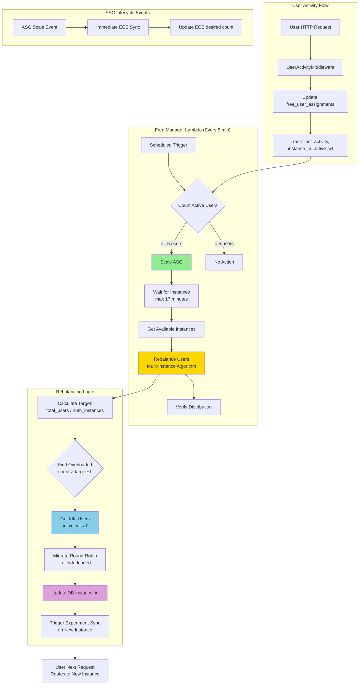
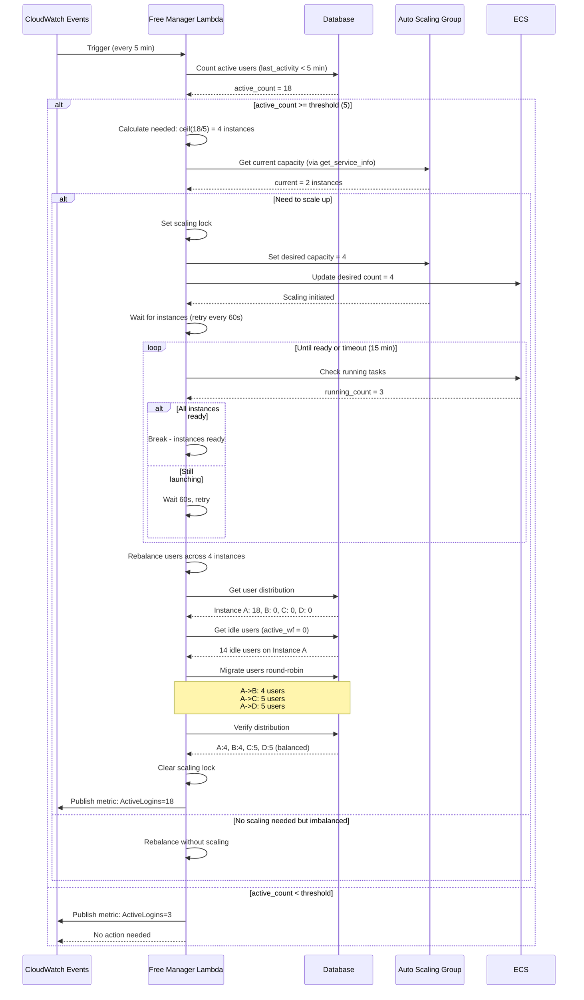
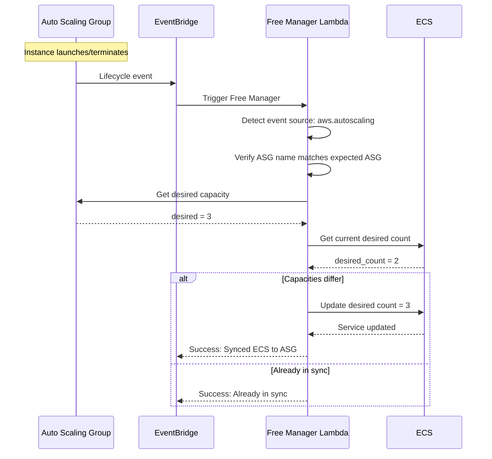
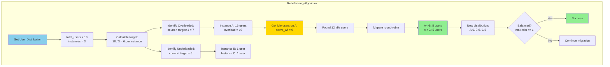

# Free Manager: Auto-Scaling and Load Rebalancing for Free Tier Users

## Executive Summary
- **Free Manager** handles auto-scaling and load rebalancing for free tier users
- **ASG-based architecture** using Auto Scaling Groups instead of individual EC2 instances
- **Proactive scaling** based on active user count (threshold: 5 users)
- **Two scaling triggers** act on the same ASG: this Lambda (user count) and CloudWatch CPU/memory alarms (instance load)
- **ASG bounds are authoritative** — the instance target is clamped to the group's own `MinSize`/`MaxSize`, so capacity is adjusted on the ASG, not in this Lambda
- **Traffic distribution is the ALB's**, not this Lambda's — round robin plus sticky sessions; rebalancing only updates the assignment records
- **Workflow protection** ensures users with active jobs are never migrated
- **Experiment sync** automatically syncs experiment metadata after migration

> **Scope note:** this document covers the free tier's *instance count*. How
> much work a single instance can absorb is a separate concern.

## Key Architectural Principles

1. **Activity-Based Scaling**
   - Monitors active user count (activity within 5 minutes)
   - Scales ASG when threshold reached (default: 5 users)
   - Calculates instances needed: `ceil(active_users / 5)`
   - Clamped to the ASG's `MinSize`/`MaxSize`, read from the group on every run

2. **Proactive Rebalancing**
   - Distributes users evenly across ALL instances (not just most/least loaded)
   - Also rebalances when distribution is imbalanced without scaling
   - Waits for new instances with retry (max 17 min in code, Lambda timeout 15 min)
   - Updates the `instance_id` on idle users' assignment records, round-robin
   - Verifies distribution is balanced after migration (max-min <= 1)
   - **This does not move traffic** — see
     [What rebalancing does and does not do](#what-rebalancing-does-and-does-not-do)

3. **Job Preservation (Triple Protection)**
   - Database field: `active_workflow_count` tracks running jobs
   - SQL constraint: Migration query includes `WHERE active_workflow_count = 0`
   - Atomic updates: Users with jobs cannot be migrated (SQL-level guarantee)

4. **Sticky Session Compatibility**
   - Works with ALB sticky sessions (5-minute cookies)
   - Users migrate within 5 minutes after rebalancing (cookie expires)
   - No user-visible disruption during migration

5. **Post-Migration Experiment Sync**
   - After successful migration, triggers experiment metadata sync on new instance
   - Calls internal API endpoint (`/system-internal/sync-experiments/{user_id}`)
   - Fire-and-forget: migration succeeds even if sync fails

6. **ASG Configuration as the Single Source of Truth**
   - The instance floor and ceiling are **not** held in this Lambda's
     environment; they are read via `describe_auto_scaling_groups` each run
   - `SetDesiredCapacity` rejects any value outside the group's bounds, and a
     rejection aborts the invocation, so a target computed against stale
     configuration would also cost that cycle's rebalancing and metrics
   - Capacity can therefore be adjusted on the ASG (Terraform, console or CLI)
     without redeploying this function

## Architecture Overview


```mermaid
graph TB
    subgraph "User Activity Flow"
        A[User HTTP Request] --> B[UserActivityMiddleware]
        B --> C[Update free_user_assignments]
        C --> D[Track: last_activity, instance_id, active_wf]
    end

    subgraph "Free Manager Lambda (Every 5 min)"
        E[Scheduled Trigger] --> F{Count Active Users}
        F -->|>= 5 users| G[Scale ASG]
        F -->|< 5 users| H[No Action]

        G --> I[Wait for Instances<br/>max 17 minutes]
        I --> J[Get Available Instances]
        J --> K[Rebalance Users<br/>Multi-Instance Algorithm]
        K --> L[Verify Distribution]
    end

    subgraph "ASG Lifecycle Events"
        M[ASG Scale Event] --> N[Immediate ECS Sync]
        N --> O[Update ECS desired count]
    end

    subgraph "Rebalancing Logic"
        K --> P[Calculate Target:<br/>total_users / num_instances]
        P --> Q{Find Overloaded<br/>count > target+1}
        Q --> R[Get Idle Users<br/>active_wf = 0]
        R --> S[Migrate Round-Robin<br/>to Underloaded]
        S --> T[Update DB instance_id]
        T --> V[Trigger Experiment Sync<br/>on New Instance]
    end

    D --> F
    V --> U[User Next Request<br/>Routes to New Instance]

    style G fill:#90EE90
    style K fill:#FFD700
    style R fill:#87CEEB
    style T fill:#DDA0DD
```

### Two Triggers on One ASG

The free ASG's desired capacity has **two independent writers**. This document
is mostly about the first; the second is defined in `monitoring.tf` and is easy
to overlook when reading the Lambda alone.

| | Trigger A — user count | Trigger B — instance load |
|---|---|---|
| Driven by | This Lambda, on a 5-minute schedule | CloudWatch alarms on the free ECS service |
| Input | Active user count from `free_user_assignments` | `AWS/ECS` `CPUUtilization` / `MemoryUtilization` |
| Mechanism | `SetDesiredCapacity` to a computed target | `scale_up` / `scale_down` simple scaling policies, +/-1 |
| Defined in | `free_manager.tf`, `free_manager.py` | `monitoring.tf`, `compute.tf` |

Three things follow from there being two:

1. **They do not coordinate.** An alarm-driven adjustment survives only until
   the next scheduled run, which recomputes the target from the user count
   alone and may undo it. Which component should own desired capacity is an
   open design question, not a settled model.
2. **The load metrics are service-level, not host-level.** For an
   EC2-launch-type service, `CPUUtilization` is utilization of the CPU units
   *reserved by the task*, averaged across the service. Work that stalls on
   I/O rather than CPU does not move it; the `high-iowait` alarm notifies but
   does not scale.
3. **Nothing else moves the ASG.** The ECS capacity provider's
   `managed_scaling` is `DISABLED`, and ECS Application Auto Scaling is left
   commented out in `compute.tf` because it raced against this Lambda.

Both triggers are bounded by the group's `MinSize`/`MaxSize`, so neither can
drive capacity outside the configured range.

### Scaling Strategy Matrix

Formula: `instances = min(max(MinSize, ceil(active_users / 5)), MaxSize)`

`MinSize` and `MaxSize` are the ASG's own, read from the group on every run.
The table below shows the user-count term alone; the actual target is that
value pulled up to `MinSize` or down to `MaxSize`.

| Active Users | User-count term | Action |
|-------------|------------------|--------|
| 0-5 | 1 | Below threshold or 1 instance sufficient |
| 6-10 | 2 | Scale to 2, rebalance |
| 11-15 | 3 | Scale to 3, rebalance |
| 16-20 | 4 | Scale to 4, rebalance |
| 21-25 | 5 | Scale to 5, rebalance |
| 26-30 | 6 | Scale to 6, rebalance |
| 31+ | `ceil(users / 5)` | Scale up, rebalance |

Notes:
- Scaling triggers at >= 5 active users, but 5 users only needs 1 instance
  (`ceil(5/5) = 1`). Actual scale-up by user count starts at 6 users.
- A `MinSize` above the user-count term holds the target there: with
  `MinSize = 3`, five active users still target 3 instances, not 1.
- A user-count term above `MaxSize` is capped, not requested. The group's
  maximum is the real ceiling on free-tier capacity.

### Motivation: Sticky Session Overload

Without Free Manager, a burst of users all land on the instances that exist
at that moment and hold sticky session cookies to them. The ASG may launch
more instances, but nothing provisions them *ahead* of the burst, so the
capacity arrives after the congestion.

Free Manager addresses the capacity half of that: it tracks activity in the
database and raises the ASG's desired capacity before the user count has
overwhelmed the running instances. Users with active workflows are protected
from reassignment by atomic SQL constraints, and experiment metadata is
synced to new instances after reassignment.

### What rebalancing does and does not do

**Traffic distribution is the load balancer's job, not this Lambda's.**

- Free-tier requests reach the free target group through a single shared
  listener rule (the `Authorization: Bearer *` catch-all). Unlike premium,
  there are **no per-user routing rules** for free users.
- The target group sets no `load_balancing_algorithm_type`, so the AWS default
  **round robin** applies, with `lb_cookie` stickiness. Every healthy instance
  is in the rotation, registered automatically by the ASG.
- `migrate_user_to_instance` **only updates `free_user_assignments.instance_id`**.
  It does not change ALB routing, and `UserActivityMiddleware` overwrites that
  column with whichever instance actually served the user's next request.

So the Lambda's rebalancing step is bookkeeping plus the experiment-sync
trigger. Actual redistribution happens when a session is new, or when its
sticky cookie lapses.

**The cookie's duration is an inactivity window, not a lifetime.** The ALB
refreshes it on each response, so a client that keeps polling never expires
it. Two consequences worth knowing:

- An **already-active user is not moved onto newly added instances.** New
  sessions, and users who go idle past the cookie duration and return, are
  the ones that land on new capacity.
- Capacity is therefore most effective when raised **before** a burst
  arrives, not during it. Instance boot time applies on top (see
  `CUSTOM_AMI_ARCHITECTURE.md`).

What raising capacity buys is a larger rotation, which lowers the chance that
concurrent heavy work shares one instance. It is not a per-instance quota:
round robin counts requests rather than users, and each ALB node keeps its own
rotation, so a small number of sessions spreads evenly in expectation rather
than exactly.

### Procedure: Pre-provisioning Capacity for an Expected Burst

When a larger-than-usual number of free users is expected at a known time,
raise the ASG's minimum ahead of it. **Pre-provisioning is the primary
mechanism; reactive scaling is a backstop** — the 5-minute polling interval,
instance boot time and sticky sessions mean reactive scaling serves late
arrivals, not the first wave.

**1. Size it.** The Lambda's model is one instance per
`USERS_PER_INSTANCE` (5) *concurrently active* users, where "active" means a
request within `FREE_IDLE_THRESHOLD_MINUTES`.

- Target minimum = `ceil(expected concurrent users / 5)`.
- **Raise `asg_max_size` too if the target exceeds it.** The maximum is a
  silent cap: the Lambda clamps to it and never reports wanting more.
- `MinSize <= MaxSize` must hold or the update is rejected.

**2. Allow lead time — at least 30 minutes before the audience connects.**
6-10 minutes of instance boot while `use_custom_ami = false` (about 1 minute
once the custom AMI is enabled), then task placement and two health checks at
60-second intervals. Raising capacity *during* a burst does not help users
whose sticky cookie is already held.

**3. Choose a route.**

| | Terraform (`asg_min_size` in tfvars) | Console / CLI |
|---|---|---|
| Takes effect | After an apply | Immediately |
| Persistence | Durable | **Reverted by the next `terraform apply`** (`min_size` is not under `ignore_changes`) |
| Use for | A permanent baseline change | A time-boxed window |

Either way, freeze applies for the window or re-apply the override afterwards.

**4. Check the whole chain** once the instances settle. All four numbers must
agree:

```
ASG DesiredCapacity == ASG InService == ECS runningCount == healthy free targets
```

`HEALTH-03` and `HEALTH-05` in the e2e health lane assert exactly this, and
`free-manager-errors` should read `OK`.

**5. Restoring is not symmetric.** Lowering `min_size` does **not** lower
desired capacity, because `desired_capacity` is under `ignore_changes` and
nothing re-reads it. Capacity then drains only by `-1` steps from the
`cpu-low` / `memory-low` alarms, or by Lambda scale-down, which needs five or
more active users *and* a gap of two or more. **Set desired capacity
explicitly when restoring**, or accept a gradual drain and its cost:

```bash
aws autoscaling update-auto-scaling-group --auto-scaling-group-name <asg> \
  --min-size <original> --desired-capacity <original> --region <region>
```

### Flow Diagrams

#### Scheduled Monitoring Flow (Every 5 Minutes)


```mermaid
sequenceDiagram
    participant CW as CloudWatch Events
    participant FM as Free Manager Lambda
    participant DB as Database
    participant ASG as Auto Scaling Group
    participant ECS

    CW->>FM: Trigger (every 5 min)
    FM->>DB: Count active users (last_activity < 5 min)
    DB-->>FM: active_count = 18

    alt active_count >= threshold (5)
        FM->>FM: Calculate needed: ceil(18/5) = 4 instances
        FM->>ASG: Get current capacity (via get_service_info)
        ASG-->>FM: current = 2 instances

        alt Need to scale up
            FM->>FM: Set scaling lock
            FM->>ASG: Set desired capacity = 4
            FM->>ECS: Update desired count = 4
            ASG-->>FM: Scaling initiated

            FM->>FM: Wait for instances (retry every 60s)
            loop Until ready or timeout (15 min)
                FM->>ECS: Check running tasks
                ECS-->>FM: running_count = 3
                alt All instances ready
                    FM->>FM: Break - instances ready
                else Still launching
                    FM->>FM: Wait 60s, retry
                end
            end

            FM->>FM: Rebalance users across 4 instances
            FM->>DB: Get user distribution
            DB-->>FM: Instance A: 18, B: 0, C: 0, D: 0

            FM->>DB: Get idle users (active_wf = 0)
            DB-->>FM: 14 idle users on Instance A

            FM->>DB: Migrate users round-robin
            Note over FM,DB: A->B: 4 users<br/>A->C: 5 users<br/>A->D: 5 users

            FM->>DB: Verify distribution
            DB-->>FM: A:4, B:4, C:5, D:5 (balanced)

            FM->>FM: Clear scaling lock
            FM->>CW: Publish metric: ActiveLogins=18

        else No scaling needed but imbalanced
            FM->>FM: Rebalance without scaling
        end
    else active_count < threshold
        FM->>CW: Publish metric: ActiveLogins=3
        FM-->>CW: No action needed
    end
```

#### ASG Lifecycle Event Flow


```mermaid
sequenceDiagram
    participant ASG as Auto Scaling Group
    participant EB as EventBridge
    participant FM as Free Manager Lambda
    participant ECS

    Note over ASG: Instance launches/terminates

    ASG->>EB: Lifecycle event
    EB->>FM: Trigger Free Manager

    FM->>FM: Detect event source: aws.autoscaling
    FM->>FM: Verify ASG name matches expected ASG
    FM->>ASG: Get desired capacity
    ASG-->>FM: desired = 3

    FM->>ECS: Get current desired count
    ECS-->>FM: desired_count = 2

    alt Capacities differ
        FM->>ECS: Update desired count = 3
        ECS-->>FM: Service updated
        FM-->>EB: Success: Synced ECS to ASG
    else Already in sync
        FM-->>EB: Success: Already in sync
    end
```

#### Multi-Instance Rebalancing Algorithm


```mermaid
graph TB
    subgraph "Rebalancing Algorithm"
        A[Get User Distribution] --> B[total_users = 18<br/>instances = 3]
        B --> C[Calculate target:<br/>18 / 3 = 6 per instance]

        C --> D[Identify Overloaded:<br/>count > target+1 = 7]
        D --> E[Instance A: 16 users<br/>overload = 10]

        C --> F[Identify Underloaded:<br/>count < target = 6]
        F --> G[Instance B: 1 user<br/>Instance C: 1 user]

        E --> H[Get idle users on A:<br/>active_wf = 0]
        H --> I[Found 12 idle users]

        I --> J[Migrate round-robin]
        J --> K[A->B: 5 users<br/>A->C: 5 users]

        K --> L[New distribution:<br/>A:6, B:6, C:6]
        L --> M{Balanced?<br/>max-min <= 1}
        M -->|Yes| N[Success]
        M -->|No| O[Continue migration]
    end

    style A fill:#87CEEB
    style H fill:#FFD700
    style K fill:#90EE90
    style N fill:#90EE90
```

---

## Implementation Details

### 1. Middleware: Activity Tracking

#### UserActivityMiddleware

**File:** `studio/app/common/core/middleware/user_activity_middleware.py`
**Purpose:** Track user activity and instance assignment for both
free and premium tiers. Aliased as `FreeUserActivityMiddleware`
for backwards compatibility.
**Input:** ASGI scope (HTTP request with JWT Authorization header)
**Output:** Updates `free_user_assignments` or
`premium_user_assignments` table via async background task
**Calls:** `extract_uid_from_firebase_jwt()` ->
`_get_user_id_and_tier()` ->
`_update_free_user_activity_async()` or
`_update_premium_user_activity_async()`

Performance optimizations:
- In-memory cache (60s TTL) throttles DB writes to once/min/user
- User tier cache (5 min TTL) avoids repeated subscription lookups
- Instance ID cached at startup (fetched once from EC2 metadata)

**Instance ID Resolution:**
The middleware first checks the `INSTANCE_ID` environment variable,
then falls back to IMDSv2 metadata service (with IMDSv1 fallback).
The result is cached at startup. Returns "local" in development
(skips DB update).

### 2. Free Manager Lambda

**File:** `infrastructure/terraform/free_manager_package/free_manager.py`

#### handler()

**File:** `infrastructure/terraform/free_manager_package/free_manager.py`
**Purpose:** Main Lambda entry point supporting dual triggers
(CloudWatch scheduled events and ASG lifecycle events)
**Input:** Lambda event dict and context; routes on
`event["source"]`
**Output:** Dict with statusCode and JSON body describing
actions taken
**Calls:** `handle_asg_event()` or
`handle_scheduled_monitoring()` based on event source

#### handle_scheduled_monitoring()

**File:** `infrastructure/terraform/free_manager_package/free_manager.py`
**Purpose:** Periodic monitoring (every 5 minutes) -- counts
active users, scales ASG if threshold reached, rebalances
users across instances, publishes CloudWatch metrics
**Input:** Lambda event and context (scheduled trigger)
**Output:** Dict with scaling/rebalancing results
**Calls:** `count_active_free_users()` ->
`publish_active_user_metric()` -> `scale_and_rebalance()`

#### scale_and_rebalance()

**File:** `infrastructure/terraform/free_manager_package/free_manager.py`
**Purpose:** Scale ECS service and rebalance idle users.
Handles three scenarios: scale up (with instance wait loop),
conservative scale down (only if overprovisioned by >= 2),
and rebalance-only when distribution is imbalanced.
**Input:** `active_user_count`
**Output:** Dict with scaling action, migrated users, and
balance status. Uses CloudWatch metric lock to prevent
concurrent operations.
**Calls:** `is_scaling_in_progress()` -> `get_service_info()`
-> `calculate_desired_instances()` -> `scale_service()` ->
`get_available_instance_ids()` -> `rebalance_idle_users_multi()`
-> `is_distribution_balanced()`

The bounds are not an input: they come from `get_service_info()`,
which reads them off the ASG.

#### calculate_desired_instances()

**File:** `infrastructure/terraform/free_manager_package/free_manager.py`
**Purpose:** Turn an active user count into a target instance
count, clamped to the ASG's bounds. Pure function, no AWS calls.
**Input:** `active_user_count`, `asg_min_size`, `asg_max_size`
**Output:** Target instance count within `[asg_min_size, asg_max_size]`

```python
desired = min(max(asg_min_size, ceil(active_users / USERS_PER_INSTANCE)), asg_max_size)
```

`SetDesiredCapacity` rejects anything outside the group's bounds,
and a rejection aborts the invocation, so clamping here is what
keeps a cycle's rebalancing and metrics from being lost as well.

Wait loop retries every 60s. Code sets `max_wait_time = 1020s`
(17 min) but Lambda timeout is 900s (15 min), so effective
timeout is 15 minutes. Rebalancing retried on next Lambda run
if not completed.

#### scale_service()

**File:** `infrastructure/terraform/free_manager_package/free_manager.py`
**Purpose:** Scale ASG and ECS service together. Sets ASG
desired capacity directly (`HonorCooldown=False` for immediate
scaling), then updates ECS desired count to match. This manual
approach prevents runaway scaling from ECS managed scaling
(CPU spike cascades).
**Input:** `cluster_name`, `service_name`, `desired_count`
**Output:** None (side effect: ASG and ECS capacity updated)
**Calls:** `autoscaling_client.set_desired_capacity()` ->
`ecs_client.update_service()`

#### get_service_info()

**File:** `infrastructure/terraform/free_manager_package/free_manager.py`
**Purpose:** Get current ASG and ECS service information.
Returns ASG desired capacity as source of truth for scaling,
plus ECS running/pending counts.
**Input:** `cluster_name`, `service_name`
**Output:** Dict with `desired_count` (from ASG),
`running_count` and `pending_count` (from ECS)
**Calls:** `autoscaling_client.describe_auto_scaling_groups()`
-> `ecs_client.describe_services()`

#### get_available_instance_ids()

**File:** `infrastructure/terraform/free_manager_package/free_manager.py`
**Purpose:** Get list of RUNNING EC2 instance IDs from ECS
cluster. Three-step verification: list container instances
(ACTIVE, DRAINING, REGISTERING), filter for connected ECS
agents, verify EC2 state is 'running'.
**Input:** `cluster_name`, `service_name`
**Output:** List of EC2 instance IDs that are fully ready to
handle traffic
**Calls:** `ecs_client.list_container_instances()` ->
`ecs_client.describe_container_instances()` ->
`ec2_client.describe_instances()`

### 3. Multi-Instance Rebalancing

#### rebalance_idle_users_multi()

**File:** `infrastructure/terraform/free_manager_package/free_manager.py`
**Purpose:** Rebalance idle users across ALL available
instances using round-robin distribution from overloaded
to underloaded instances
**Input:** `available_instances` (list of instance IDs)
**Output:** List of migrated user IDs
**Calls:** `get_users_per_instance()` ->
`get_idle_users_for_instance()` ->
`migrate_user_to_instance()`

Algorithm:
1. Calculate target users per instance (even distribution)
2. Identify overloaded instances (count > target + 1)
3. Identify underloaded instances (count < target)
4. Migrate idle users from overloaded to underloaded
   (round-robin)

Key constraint:
```python
# Only users with no active workflows can be migrated
idle_users = get_idle_users_for_instance(source_inst)
# active_workflow_count = 0
```

### 4. Workflow Protection and Migration

#### migrate_user_to_instance()

**File:** `infrastructure/terraform/free_manager_package/free_user_utils.py`
**Purpose:** Atomic user migration with triple workflow
protection. After successful migration, triggers experiment
metadata sync on the new instance (fire-and-forget).
**Input:** `user_id`, `new_instance_id`
**Output:** True if migration succeeded, False if user has
active workflows or does not exist
**Calls:** SQL UPDATE with constraint ->
`trigger_experiment_sync()`

Key constraint:
```sql
-- Only migrate idle users (atomic protection)
WHERE user_id = %s AND active_workflow_count = 0
```

#### trigger_experiment_sync()

**File:** `infrastructure/terraform/free_manager_package/free_user_utils.py`
**Purpose:** Trigger experiment metadata sync for user on
their new instance. Calls internal API to ensure experiment
metadata is downloaded from S3. Fire-and-forget: migration
succeeds even if sync fails.
**Input:** `user_id` (int)
**Output:** True if sync initiated, False on failure
**Calls:** POST to
`/system-internal/sync-experiments/{user_id}` via ALB

#### get_idle_users_for_instance()

**File:** `infrastructure/terraform/free_manager_package/free_user_utils.py`
**Purpose:** Get list of idle users on a specific instance.
Idle = no active workflows (`active_workflow_count = 0`).
No time-based restriction: users without workflows can be
migrated regardless of last activity time.
**Input:** `instance_id`
**Output:** List of user IDs safe to migrate

> **Terminology note.** "Idle" on the free tier means `active_workflow_count = 0`
> -- a migration-safety check, not an activity cutoff. The premium tier uses
> "idle" in four distinct senses (idle instance, idle premium user, idle /
> stale assignment, idle browser tab), none of which match this definition.
> See the "Disambiguation" section in
> [PREMIUM_USER_ASSIGNMENT.md](./PREMIUM_USER_ASSIGNMENT.md) when reading
> across both documents.

#### get_users_per_instance()

**File:** `infrastructure/terraform/free_manager_package/free_user_utils.py`
**Purpose:** Get count of active users per instance. Only
counts users with activity within threshold (filters by
`last_activity >= cutoff`). Inactive users are not counted
in distribution calculations.
**Input:** `activity_threshold_minutes` (default: 10)
**Output:** Dict mapping `instance_id` -> user count

### 5. Workflow Tracking

#### increment_workflow_count()

**File:** `studio/app/common/core/workflow/workflow_tracking.py`
**Purpose:** Increment `active_workflow_count` when a workflow
starts. Determines user tier (free/premium), then updates the
appropriate assignment table. Falls back to alternative table
if primary does not have a record.
**Input:** `user_id`
**Output:** None (side effect: count incremented in DB)

#### decrement_workflow_count()

**File:** `studio/app/common/core/workflow/workflow_tracking.py`
**Purpose:** Decrement `active_workflow_count` when a workflow
completes. Uses `GREATEST(0, count - 1)` to prevent going
below zero, avoiding race conditions.
**Input:** `user_id`
**Output:** None (side effect: count decremented in DB)

---

## Edge Case Handling

### 1. Concurrent Scaling Operations

**Problem:** Multiple Lambda invocations could try to scale simultaneously.

**Solution:** CloudWatch metrics-based locking via
`is_scaling_in_progress()` and `set_scaling_lock()`:
- Checks `ScalingInProgress` metric (15-min window, Maximum stat)
- Set before scaling, cleared in `finally` block
- Fails open: returns False if check fails (allows scaling)

### 2. Instances Not Ready in Time

**Problem:** New instances take 6-8 minutes to launch (lifecycle hooks ~5 min, EC2 boot ~5 min, ECS tasks ~7 min).

**Solution:** Retry logic with timeout. The scale_and_rebalance() function
retries every 60 seconds. Code sets max_wait_time = 1020s (17 min) but
Lambda timeout is 900s (15 min), so effective timeout is 15 minutes.
Rebalancing will be retried on the next 5-minute Lambda run if not completed.


### 3. Users With Active Workflows

**Problem:** Migrating a user with running workflow would disrupt their work.

**Solution:** SQL-level protection (atomic check):

```sql
-- Key constraint: only migrate idle users
WHERE user_id = %s
  AND active_workflow_count = 0  -- Atomic protection
```


### 4. ASG and ECS Out of Sync

**Problem:** Manual ASG scaling or alarm-driven scaling changes ASG capacity but not ECS.

**Solution:** Dual triggers -- ASG events sync ECS immediately
via `handle_asg_event()`:
- EventBridge rule triggers on launch/terminate events
- Verifies the event is for the expected ASG before acting
- Reads ASG desired capacity and updates ECS desired count
  to match


### 5. Unbalanced Distribution After Migration

**Problem:** Migration might not achieve perfect balance (users with active workflows can't be moved).

**Solution:** Verification after migration via
`is_distribution_balanced()`:
- Checks `max(counts) - min(counts) <= tolerance`
- Default tolerance: 1
- If still imbalanced, will retry on next Lambda run


### 6. Conservative Scale-Down

**Problem:** Frequent scale up/down oscillation wastes resources.

**Solution:** Only scales down when overprovisioned by >= 2 instances.
This prevents thrashing when user count hovers near a boundary.


---

## Monitoring and Metrics

### CloudWatch Metrics Published

**By Free Manager** (every 5 minutes):

| Metric Name | Description | Unit | Namespace |
|-------------|-------------|------|-----------|
| `ActiveLogins` | Users with activity in last 5 minutes | Count | OptiNiSt/FreeUsers |
| `ScalingInProgress` | Lock to prevent concurrent operations | None (0 or 1) | OptiNiSt/FreeManager |

**Dashboard:** `subscr-optinist-monitoring` (integrated with premium tier monitoring)

### Alarms

| Alarm | Metric | Condition | Why |
|---|---|---|---|
| `free-manager-errors` | `AWS/Lambda` `Errors` | Sum > 0 in each of 3 consecutive 5-minute periods | The Lambda is the only user-count writer of free-tier capacity and runs unattended. A failure leaves capacity where it is and skips that cycle's rebalancing and metric publication. Three periods distinguishes a condition the Lambda cannot get past from a self-healing transient. |

**The alarm has a precondition in the code.** `AWS/Lambda` `Errors` counts only
invocations that end in an **unhandled exception**, so the handlers log the
traceback and then re-raise. A handler that returned an error body instead
would read as a success to Lambda and leave this alarm permanently blind — the
same arrangement, and the same reason, as `public_cleanup`. Because EventBridge
invokes asynchronously, `maximum_retry_attempts = 0` stops Lambda from retrying
a raised invocation twice and stacking copies of the 15-minute scale-up wait;
the next scheduled run five minutes later is the retry this function should get.
`TestHandlerFailsTheInvocation` pins the re-raise.

Note that the free tier's CPU/memory alarms (`cpu-high`, `cpu-low`,
`memory-high`, `memory-low`) are **scaling triggers rather than notifications**
-- see [Two Triggers on One ASG](#two-triggers-on-one-asg). An idle
environment holds a `-low` alarm in ALARM by design.

### Key Log Events

**Free Manager Logs** (`/aws/lambda/subscr-free-manager`):

```
============================================================
SCHEDULED MONITORING
============================================================
Active free tier users: 18
User threshold reached (18 >= 5), initiating scaling

============================================================
SCALE AND REBALANCE
============================================================
Active users: 18
- ASG bounds: min=1, max=10
Calculated desired instances: 4
Formula: min(max(1, ceil(18 / 5)), 10)

Scaling up from 2 to 4 instances
Scaling ASG subscr-optinist-asg to desired capacity: 4
Successfully set ASG desired capacity to 4
Successfully updated ECS service to 4 tasks

Waiting for new instances to launch and become ECS-ready (up to 17 minutes)
[Attempt 1] Checking instance readiness (elapsed: 0s / 1020s)
Found 3/4 running instances
[Attempt 2] Checking instance readiness (elapsed: 60s / 1020s)
Found 4/4 running instances
All instances ready! Attempting rebalancing

============================================================
MULTI-INSTANCE REBALANCING
============================================================
Available instances: ['i-abc123', 'i-def456', 'i-ghi789', 'i-jkl012']
User distribution: {'i-abc123': 18, 'i-def456': 0, 'i-ghi789': 0, 'i-jkl012': 0}
Target distribution: 4 users per instance (18 users / 4 instances)

Overloaded instances: [('i-abc123', 18)]
Underloaded instances: [('i-def456', 0), ('i-ghi789', 0), ('i-jkl012', 0)]

Processing overloaded instance i-abc123: 18 users (need to move 14)
Found 14 idle users, migrating 14

14 users migrated successfully
New distribution: {'i-abc123': 4, 'i-def456': 5, 'i-ghi789': 5, 'i-jkl012': 4}
Distribution check: max=5, min=4, diff=1, tolerance=1, balanced=True
Rebalancing successful - distribution is balanced!

Scaling lock CLEARED
Published CloudWatch metric: ActiveLogins=18
```

**ASG Event Logs:**

```
============================================================
ASG EVENT HANDLER
============================================================
Event Type: EC2 Instance Launch Successful
ASG Name: subscr-optinist-asg
ASG desired capacity: 3
ECS desired count: 2

Syncing ECS from 2 to 3
Successfully synced ECS to 3
```

---

## Configuration

### Environment Variables

**Free Manager Lambda:**
```bash
# Database
RDS_HOST                        # Database endpoint (host:port format)
RDS_USER                        # Database username
RDS_PASSWORD                    # Database password
RDS_DATABASE                    # Database name

# ECS & ASG
CLUSTER_NAME                    # ECS cluster name
FREE_SERVICE_NAME               # ECS service name for free tier
ASG_NAME                        # Auto Scaling Group name

# Scaling Configuration
FREE_USER_THRESHOLD             # Users to trigger scaling (default: 5)
FREE_IDLE_THRESHOLD_MINUTES     # Activity threshold minutes (production: 5)

# The instance count floor and ceiling are deliberately NOT here. They are
# read from the ASG's MinSize/MaxSize (var.asg_min_size / var.asg_max_size)
# on every run, so the group's configuration cannot drift from what the
# Lambda will request, and capacity can be adjusted without a redeploy.

# Internal API (for experiment sync after migration)
ALB_DNS_NAME                    # ALB DNS name for internal API calls
INTERNAL_API_SECRET             # Secret for internal API authentication

# Lambda Configuration
# Timeout: 900 seconds (15 minutes)
# Runtime: Python 3.11
```

### Triggers

| Lambda | Trigger | Frequency | EventBridge Rule |
|--------|---------|-----------|------------------|
| Free Manager | Scheduled monitoring | Every 5 minutes | `subscr-free-manager-schedule` |
| Free Manager | ASG lifecycle events | On ASG events | `subscr-free-manager-asg-events` |

### Database Schema

**Table:** `free_user_assignments`

```sql
CREATE TABLE free_user_assignments (
    id BIGINT UNSIGNED AUTO_INCREMENT PRIMARY KEY,
    user_id BIGINT UNSIGNED NOT NULL UNIQUE,
    instance_id VARCHAR(20) NOT NULL,
    assigned_at TIMESTAMP NOT NULL DEFAULT CURRENT_TIMESTAMP,
    last_activity TIMESTAMP NOT NULL DEFAULT CURRENT_TIMESTAMP,
    active_workflow_count INT NOT NULL DEFAULT 0,
    last_workflow_start TIMESTAMP NULL,
    last_workflow_end TIMESTAMP NULL,
    migration_count INT NOT NULL DEFAULT 0,
    last_migration TIMESTAMP NULL,
    logged_out_at TIMESTAMP NULL,

    FOREIGN KEY (user_id) REFERENCES users(id)
);
```

**ORM Model:** `studio/app/common/models/free_user.py` (`FreeUserAssignment`)

---

## Testing

### Test Files

**Unit tests:** `studio/tests/infrastructure/test_free_manager.py`
- Mocked unit tests for Lambda handler routing, scaling logic, etc.
- Run with pytest: `pytest studio/tests/infrastructure/test_free_manager.py`

**Integration tests:** `infrastructure/scripts/test_free_manager.py`
- E2E tests against real AWS resources (requires AWS credentials)
- Tests activity tracking, scaling, rebalancing, workflow protection

**What the integration tests cover:**

1. **Activity Tracking** - Verify middleware updates last_activity
2. **Active User Count** - Verify Lambda counts users correctly
3. **Proactive Scaling** - Verify ASG scales when threshold reached
4. **Instance Readiness** - Verify Lambda waits for new instances
5. **User Rebalancing** - Verify even distribution across instances
6. **Workflow Protection** - Verify users with jobs are NOT migrated
7. **CloudWatch Metrics** - Verify metrics are published
8. **JSON Serialization** - Verify Decimal types from DB serialize properly

**Running integration tests:**

```bash
cd infrastructure/scripts

# Run all tests
python test_free_manager.py

# Specify terraform directory
python test_free_manager.py --terraform-dir /path/to/terraform

# Specify AWS region
python test_free_manager.py --region ap-northeast-1
```

### Manual Testing Scenarios

**Scenario 1: Simulate Demo Rush (20 users)**

```bash
# 1. Cleanup existing state
python test_free_manager.py --action cleanup

# 2. Create 20 test users
python test_free_manager.py --action simulate_users --count 20

# 3. Trigger Free Manager
aws lambda invoke \
  --function-name subscr-free-manager \
  --payload '{}' \
  /dev/stdout

# Expected: Scales to 4 instances, distributes 5 users per instance
```

**Scenario 2: Verify Workflow Protection**

```bash
# 1. Create test user with workflow
python test_free_manager.py --action simulate_workflow --user test_user_1

# 2. Trigger rebalancing
aws lambda invoke \
  --function-name subscr-free-manager \
  --payload '{}' \
  /dev/stdout

# 3. Check user assignment
python test_free_manager.py --action check_assignment --user test_user_1

# Expected: User NOT migrated (still on original instance)
```

**Scenario 3: ASG Manual Scaling**

```bash
# 1. Manually scale ASG
aws autoscaling set-desired-capacity \
  --auto-scaling-group-name subscr-optinist-asg \
  --desired-capacity 3

# Expected: EventBridge triggers Free Manager, ECS syncs to 3

# 2. Verify ECS synced
aws ecs describe-services \
  --cluster subscr-optinist-cloud-cluster \
  --services subscr-optinist-cloud-service \
  --query 'services[0].desiredCount'

# Expected: 3
```

---

## Key Functions Reference

### Free Manager Lambda (`free_manager.py`)

| Function | Purpose |
|----------|---------|
| `handler()` | Main Lambda handler (dual triggers) |
| `handle_scheduled_monitoring()` | 5-minute monitoring loop |
| `handle_asg_event()` | ASG lifecycle event handler |
| `scale_and_rebalance()` | Main scaling and rebalancing logic |
| `calculate_desired_instances()` | Target instance count, clamped to the ASG's bounds (pure) |
| `get_service_info()` | Get ASG capacity and bounds, plus ECS task counts |
| `scale_service()` | Scale ASG and ECS service |
| `rebalance_idle_users_multi()` | Multi-instance rebalancing algorithm |
| `get_available_instance_ids()` | Discover running EC2 instances |
| `is_scaling_in_progress()` | Check CloudWatch metric lock |
| `set_scaling_lock()` | Set/clear CloudWatch metric lock |
| `publish_active_user_metric()` | Publish ActiveLogins metric |

### Free User Utils (`free_user_utils.py`)

| Function | Purpose |
|----------|---------|
| `count_active_free_users()` | Count users with recent activity |
| `get_users_per_instance()` | Get user distribution map (activity-filtered) |
| `get_idle_users_for_instance()` | Get idle users on specific instance |
| `migrate_user_to_instance()` | Repoint an assignment record's `instance_id`, with workflow protection. Does not move traffic |
| `trigger_experiment_sync()` | Sync experiment metadata after migration |
| `is_user_idle()` | Check if user is safe to migrate |
| `is_distribution_balanced()` | Verify even distribution (max-min <= tolerance) |

### Workflow Tracking (`workflow_tracking.py`)

| Function | Purpose |
|----------|---------|
| `increment_workflow_count()` | Increment active_workflow_count on start |
| `decrement_workflow_count()` | Decrement active_workflow_count on end |
| `get_active_workflow_count()` | Query current workflow count |

---

## AWS Resources

- **Free Manager Lambda:** `subscr-free-manager`
- **Free Cleanup Lambda:** `subscr-free-cleanup` (test data cleanup)
- **Auto Scaling Group:** `subscr-optinist-asg`
- **ECS Service:** `subscr-optinist-cloud-service`
- **EventBridge Rules:**
  - `subscr-free-manager-schedule` (5 min monitoring)
  - `subscr-free-manager-asg-events` (ASG lifecycle)
- **CloudWatch Dashboard:** `subscr-optinist-monitoring` (unified free & premium monitoring)
- **RDS Table:** `free_user_assignments`

---

## Comparison: Free Tier vs Premium Tier

Detailed premium-side mechanics are in
[PREMIUM_USER_ASSIGNMENT.md](./PREMIUM_USER_ASSIGNMENT.md)
(5-tier assignment, standby pool, migration) and
[PREMIUM_MANAGER_ARCHITECTURE.md](./PREMIUM_MANAGER_ARCHITECTURE.md)
(Manager vs Cleanup split, frontend lifecycle, log playbook).

| Aspect | Free Tier | Premium Tier |
|--------|-----------|--------------|
| **Architecture** | Auto Scaling Group (ASG) | Individual EC2 instances |
| **Scaling Trigger** | Active user count (>= 5) | Per-user assignment |
| **Scaling Unit** | 1 instance per 5 users | 1 instance per user |
| **Load Balancing** | Proactive rebalancing | User assignment at login |
| **Sticky Sessions** | 5-minute ALB cookies | Target group per user |
| **Max Instances** | 10 (configurable) | Unlimited (cost-limited) |
| **Cost Model** | Shared resources | Dedicated resources |
| **Monitoring** | Every 5 minutes | Every 15 minutes |
| **Migration** | Multi-instance rebalancing | 5-tier priority cascade; autoscaling pool → dedicated (see [Priority Matrix](./PREMIUM_USER_ASSIGNMENT.md#assignment-priority-matrix)) |
| **Workflow Protection** | SQL-level (active_wf = 0) | User stays on dedicated instance |
| **Post-Migration** | Experiment sync via internal API | N/A |
