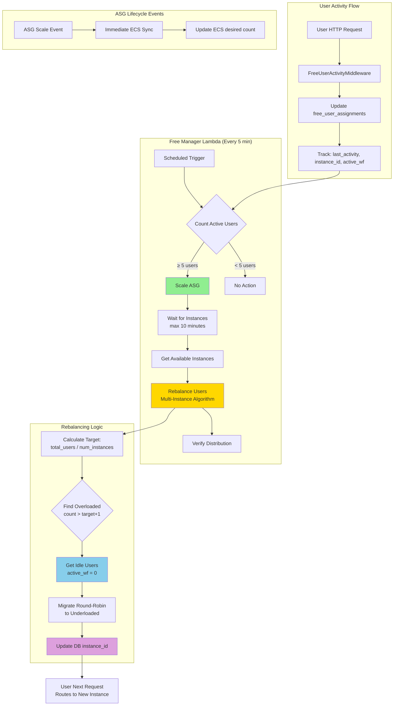
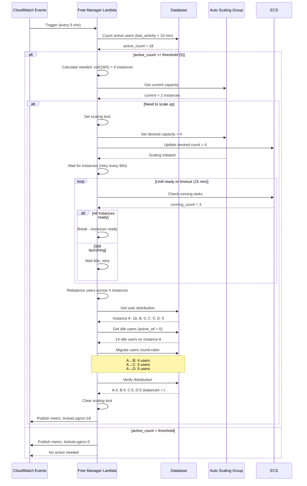
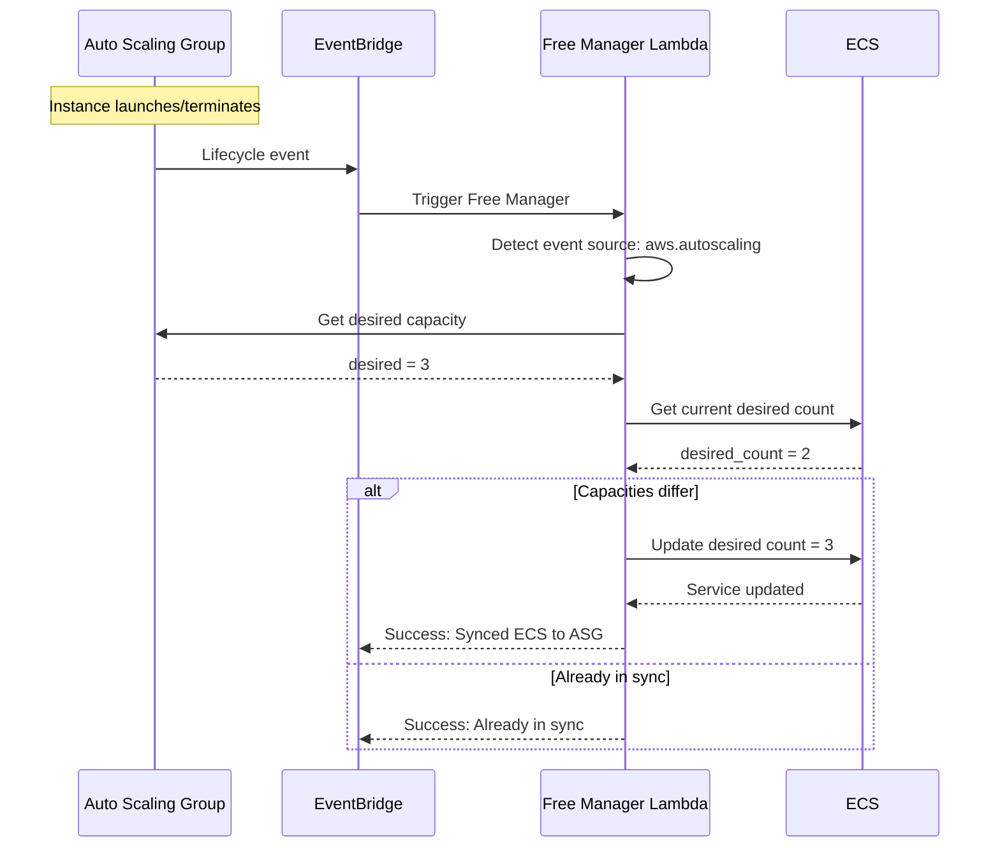
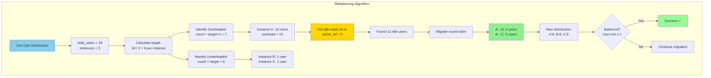

# Free Manager: Auto-Scaling and Load Rebalancing for Free Tier Users

## Executive Summary
- **Free Manager** handles auto-scaling and load rebalancing for free tier users
- **ASG-based architecture** using Auto Scaling Groups instead of individual EC2 instances
- **Proactive scaling** based on active user count (threshold: 5 users)
- **Multi-instance rebalancing** distributes load evenly across ALL instances
- **Workflow protection** ensures users with active jobs are never migrated

## Key Architectural Principles

1. **Activity-Based Scaling**
   - Monitors active user count (activity within 10 minutes)
   - Scales ASG when threshold reached (default: 5 users)
   - Calculates instances needed: `ceil(active_users / 5)`
   - Maximum instances: 10 (configurable)

2. **Proactive Rebalancing**
   - Distributes users evenly across ALL instances (not just most/least loaded)
   - Waits for new instances with retry (max 17 min in code, Lambda timeout 15 min)
   - Migrates idle users via round-robin distribution
   - Verifies distribution is balanced after migration (max-min ≤ 1)

3. **Job Preservation (Triple Protection)**
   - Database field: `active_workflow_count` tracks running jobs
   - SQL constraint: Migration query includes `WHERE active_workflow_count = 0`
   - Atomic updates: Users with jobs cannot be migrated (SQL-level guarantee)

4. **Sticky Session Compatibility**
   - Works with ALB sticky sessions (5-minute cookies)
   - Users migrate within 5 minutes after rebalancing (cookie expires)
   - No user-visible disruption during migration

## Architecture Overview



### Scaling Strategy Matrix

| Active Users | Instances Needed | Rationale | Action |
|-------------|------------------|-----------|--------|
| 0-4 | 1 | Below threshold | No scaling |
| 5-9 | 2 | Threshold reached | Scale to 2, rebalance |
| 10-14 | 2 | Within capacity | No scaling |
| 15-19 | 3 | Need more capacity | Scale to 3, rebalance |
| 20-24 | 4 | Need more capacity | Scale to 4, rebalance |
| 45-49 | 9 | Near max | Scale to 9, rebalance |
| 50+ | 10 | Maximum instances | Scale to 10 (cap) |

---

## Problem & Solution

### Problem: Sticky Session Overload

**Before Free Manager:**
1. 20 users log in during demo → All get sticky session cookies to Instance A
2. Instance A becomes overloaded → ASG launches Instance B
3. **Problem:** All 20 users stuck on Instance A due to 5-minute sticky cookies
4. New users (21+) go to Instance B, but original 20 have poor experience
5. **Workaround:** Ask users to log out and back in (unprofessional)

**After Free Manager:**
1. 20 users log in → Activity tracked in database by middleware
2. Free Manager detects threshold reached (≥5 users)
3. Lambda launches Instance B immediately (proactive scaling)
4. **Lambda waits for Instance B to become ready** (retry every 60s, timeout 15 min)
5. Lambda uses **multi-instance rebalancing** to distribute evenly
6. Lambda identifies idle users (no active workflows)
7. Lambda migrates idle users using round-robin distribution
8. **Lambda verifies distribution is balanced** after migration
9. Users with running workflows stay on Instance A (atomic SQL protection)
10. Load distributed evenly: Instance A=10, Instance B=10
11. **Result:** Professional demo experience, no manual intervention

---

## Flow Diagrams

### Scheduled Monitoring Flow (Every 5 Minutes)



### ASG Lifecycle Event Flow



### Multi-Instance Rebalancing Algorithm



---

## Implementation Details

### 1. Middleware: Activity Tracking

**File:** `studio/app/common/core/middleware/free_user_activity_middleware.py`

**Purpose:** Track user activity and instance assignment

```python
class FreeUserActivityMiddleware:
    """
    Middleware to track free tier user activity.

    For each HTTP request from a free tier user:
    1. Extract user_id from auth token
    2. Check subscription_status = "Free"
    3. Update free_user_assignments table:
       - last_activity = NOW()
       - instance_id = current_instance
    """

    async def __call__(self, request: Request):
        # Extract user from auth token
        user = get_authenticated_user(request)

        if user and user.subscription_status == "Free":
            # Get current instance ID
            instance_id = os.environ.get("INSTANCE_ID")

            # Update activity tracking
            update_free_user_activity(
                user_id=user.id,
                instance_id=instance_id,
                last_activity=datetime.now()
            )

        return await self.app(request)
```

### 2. Free Manager Lambda

**File:** `studio/config/terraform/free_manager_package/free_manager.py`

**Handler:** `handler(event, context)` (lines 86-118)

```python
def handler(event, context):
    """
    Main Lambda handler - supports dual triggers.

    Triggered by:
    1. CloudWatch Event (every 5 minutes) - full monitoring and scaling
    2. ASG lifecycle events - immediate ECS sync
    """
    event_source = event.get("source", "")

    if event_source == "aws.autoscaling":
        # ASG event - quick sync only
        return handle_asg_event(event, context)
    else:
        # Scheduled event - full monitoring
        return handle_scheduled_monitoring(event, context)
```

**Scheduled Monitoring:** `handle_scheduled_monitoring(event, context)` (lines 121-176)

```python
def handle_scheduled_monitoring(event, context):
    """
    Handle periodic monitoring (every 5 minutes).

    Responsibilities:
    - Count active users
    - Scale ASG if needed
    - Rebalance users across instances
    - Publish metrics
    """
    # Get configuration
    user_threshold = int(os.environ.get("FREE_USER_THRESHOLD", "5"))
    activity_threshold = int(os.environ.get("FREE_IDLE_THRESHOLD_MINUTES", "10"))
    max_instances = int(os.environ.get("MAX_FREE_INSTANCES", "10"))

    # Count active users
    active_user_count = count_active_free_users(
        activity_threshold_minutes=activity_threshold
    )

    # Publish metric
    publish_active_user_metric(active_user_count)

    # Scale and rebalance if threshold reached
    if active_user_count >= user_threshold:
        result = scale_and_rebalance(
            active_user_count=active_user_count,
            max_instances=max_instances
        )
    else:
        result = {"status": "no_action_needed"}

    return {"statusCode": 200, "body": json.dumps(result)}
```

**Scale and Rebalance:** `scale_and_rebalance(active_user_count, max_instances)` (lines 333-597)

```python
def scale_and_rebalance(active_user_count: int, max_instances: int):
    """
    Scale ECS service and rebalance idle users to new instances.

    Flow:
    1. Check if scaling already in progress (prevent concurrent operations)
    2. Calculate instances needed: ceil(active_users / 5)
    3. Scale ASG if needed
    4. Wait for new instances to become ready (retry every 60s, Lambda timeout 15 min)
    5. Rebalance users across all instances
    6. Verify distribution is balanced
    """
    # Prevent concurrent scaling operations
    if is_scaling_in_progress():
        return {"status": "scaling_in_progress"}

    set_scaling_lock(True)

    try:
        # Calculate instances needed
        instances_needed = (active_user_count + 4) // 5  # Ceil division
        instances_needed = min(instances_needed, max_instances)

        # Get current capacity
        cluster_name = os.environ.get("CLUSTER_NAME")
        service_name = os.environ.get("FREE_SERVICE_NAME")

        current_capacity = get_current_ecs_capacity(cluster_name, service_name)

        # Scale if needed
        if instances_needed > current_capacity:
            print(f"Scaling from {current_capacity} to {instances_needed}")
            scale_service(cluster_name, service_name, instances_needed)

            # Wait for instances to be ready
            # Embedded retry logic with 60-second intervals
            # Note: Code has max_wait_time = 1020 (17 min) but Lambda timeout is 900s (15 min)
            max_wait_time = 1020  # 17 minutes (code value)
            available_instances = []

            while time.time() - start_time < max_wait_time:
                available_instances = get_available_instance_ids(
                    cluster_name, service_name
                )
                if len(available_instances) >= instances_needed:
                    break
                time.sleep(60)  # Check every 60 seconds

            if available_instances:
                # Rebalance users across all instances
                migrated = rebalance_idle_users_multi(available_instances)

                # Verify distribution
                is_balanced = is_distribution_balanced()

                return {
                    "status": "scaled_and_rebalanced",
                    "instances": instances_needed,
                    "users_migrated": len(migrated),
                    "balanced": is_balanced
                }

        return {"status": "no_scaling_needed"}

    finally:
        set_scaling_lock(False)
```

**ASG Scaling:** `scale_service(cluster_name, service_name, desired_count)` (lines 599-645)

```python
def scale_service(cluster_name: str, service_name: str, desired_count: int):
    """
    Scale ASG and ECS service.

    Unlike premium tier which uses individual EC2 instances, free tier
    uses an Auto Scaling Group (ASG) with ECS. We need to scale the ASG
    directly, not just the ECS service desired count.

    This prevents the runaway scaling issue that occurs with ECS managed
    scaling (where instance startup CPU spikes trigger additional scaling).
    """
    asg_name = os.environ.get("ASG_NAME")

    # Set ASG desired capacity
    autoscaling_client.set_desired_capacity(
        AutoScalingGroupName=asg_name,
        DesiredCapacity=desired_count,
        HonorCooldown=False  # Immediate scaling
    )

    # Update ECS service to match
    ecs_client.update_service(
        cluster=cluster_name,
        service=service_name,
        desiredCount=desired_count
    )
```

### 3. Multi-Instance Rebalancing

**File:** `studio/config/terraform/free_manager_package/free_manager.py`

**Function:** `rebalance_idle_users_multi(available_instances)` (lines 648-776)

```python
def rebalance_idle_users_multi(available_instances: List[str]) -> List[str]:
    """
    Rebalance idle users across ALL available instances.

    Algorithm:
    1. Calculate target users per instance (even distribution)
    2. Identify overloaded instances (count > target + 1)
    3. Identify underloaded instances (count < target)
    4. Migrate users from overloaded to underloaded in round-robin
    5. Verify balanced distribution (max - min ≤ 1)

    Idle users = active_workflow_count = 0
    """
    if len(available_instances) < 2:
        return []  # Cannot rebalance with < 2 instances

    # Get current distribution
    users_per_instance = get_users_per_instance()

    # Build complete map (includes instances with 0 users)
    instance_user_counts = {inst: 0 for inst in available_instances}
    instance_user_counts.update(users_per_instance)

    total_users = sum(instance_user_counts.values())
    target_per_instance = total_users // len(available_instances)

    # Identify overloaded (> target + 1)
    overloaded = [
        (inst, count)
        for inst, count in instance_user_counts.items()
        if count > target_per_instance + 1
    ]

    # Identify underloaded (< target)
    underloaded = [
        (inst, count)
        for inst, count in instance_user_counts.items()
        if count < target_per_instance
    ]

    if not overloaded or not underloaded:
        return []  # Already balanced

    # Sort by severity
    overloaded.sort(key=lambda x: x[1], reverse=True)
    underloaded.sort(key=lambda x: x[1])

    migrated = []
    underloaded_idx = 0  # Round-robin index

    # Migrate users from each overloaded instance
    for source_inst, source_count in overloaded:
        users_to_move = source_count - target_per_instance

        # Get idle users (active_workflow_count = 0)
        idle_users = get_idle_users_for_instance(source_inst)

        if not idle_users:
            continue

        # Migrate round-robin to underloaded instances
        idle_users_to_migrate = idle_users[:users_to_move]

        for user_id in idle_users_to_migrate:
            if underloaded_idx >= len(underloaded):
                break

            dest_inst, _ = underloaded[underloaded_idx]

            if migrate_user_to_instance(user_id, dest_inst):
                migrated.append(user_id)

                # Update underloaded count
                underloaded[underloaded_idx] = (dest_inst, _ + 1)

                # Move to next underloaded instance (round-robin)
                if underloaded[underloaded_idx][1] >= target_per_instance:
                    underloaded_idx += 1

    return migrated
```

### 4. Workflow Protection

**File:** `studio/config/terraform/free_manager_package/free_user_utils.py`

**Function:** `migrate_user_to_instance(user_id, new_instance_id)` (lines 211-258)

```python
def migrate_user_to_instance(user_id: str, new_instance_id: str) -> bool:
    """
    Migrate a user to a new instance.

    CRITICAL: Triple protection against migrating users with active workflows:
    1. Database field: active_workflow_count tracks running jobs
    2. SQL constraint: WHERE active_workflow_count = 0
    3. Atomic update: Users with jobs cannot be migrated (SQL guarantee)

    This updates the database record and the user's next request
    will be routed to the new instance via load balancer (sticky session expires).
    """
    with get_db_connection() as conn:
        with conn.cursor() as cursor:
            # Atomic migration with workflow protection
            query = """
                UPDATE free_user_assignments
                SET instance_id = %s,
                    migration_count = migration_count + 1,
                    last_migration = NOW()
                WHERE user_id = %s
                  AND active_workflow_count = 0  # CRITICAL: Only idle users
            """
            cursor.execute(query, (new_instance_id, user_id))
            conn.commit()

            if cursor.rowcount > 0:
                print(f"Migrated user {user_id} to {new_instance_id}")
                return True
            else:
                print(f"Cannot migrate user {user_id}: has active workflows")
                return False
```

**Idle User Detection:** `get_idle_users_for_instance(instance_id)` (lines 108-140)

```python
def get_idle_users_for_instance(instance_id: str) -> List[str]:
    """
    Get list of idle users on a specific instance.

    Idle users = logged in but NO active workflows.
    They are safe to migrate without disrupting work.
    """
    with get_db_connection() as conn:
        with conn.cursor() as cursor:
            # No time-based restriction - users without workflows
            # can be migrated regardless of last activity time
            query = """
                SELECT user_id
                FROM free_user_assignments
                WHERE instance_id = %s
                  AND active_workflow_count = 0
            """
            cursor.execute(query, (instance_id,))
            results = cursor.fetchall()

            return [row["user_id"] for row in results]
```

---

## Edge Case Handling

### 1. Concurrent Scaling Operations

**Problem:** Multiple Lambda invocations could try to scale simultaneously.

**Solution:** CloudWatch metrics-based locking:

```python
def is_scaling_in_progress() -> bool:
    """Check if a scaling operation is currently in progress."""
    response = cloudwatch_client.get_metric_data(
        MetricDataQueries=[{
            "Id": "scaling_lock",
            "MetricStat": {
                "Metric": {
                    "Namespace": "OptiNiSt/FreeManager",
                    "MetricName": "ScalingInProgress"
                },
                "Period": 900,  # 15 minutes
                "Stat": "Maximum"
            }
        }],
        StartTime=datetime.now() - timedelta(minutes=15),
        EndTime=datetime.now()
    )

    values = response["MetricDataResults"][0].get("Values", [])
    return values and values[0] > 0

def set_scaling_lock(in_progress: bool):
    """Set or clear the scaling lock."""
    cloudwatch_client.put_metric_data(
        Namespace="OptiNiSt/FreeManager",
        MetricData=[{
            "MetricName": "ScalingInProgress",
            "Value": 1.0 if in_progress else 0.0,
            "Unit": "None"
        }]
    )
```

### 2. Instances Not Ready in Time

**Problem:** New instances take 6-8 minutes to launch (includes lifecycle hooks ~5 min, EC2 boot ~5 min, ECS tasks ~7 min).

**Solution:** Retry logic with timeout:

```python
# Embedded in scale_and_rebalance() function (lines 399-476)
# Note: Code sets max_wait_time = 1020s (17 min) but Lambda timeout is 900s (15 min)
# Effective timeout is 15 minutes (Lambda timeout)
max_wait_time = 1020  # 17 minutes in code
check_interval = 60  # Check every 60 seconds
start_time = time.time()

while time.time() - start_time < max_wait_time:
        # Get running tasks
        response = ecs_client.list_tasks(
            cluster=cluster_name,
            serviceName=service_name,
            desiredStatus='RUNNING'
        )

        task_arns = response.get('taskArns', [])

        if len(task_arns) >= desired_count:
            # Get container instances
            tasks = ecs_client.describe_tasks(
                cluster=cluster_name,
                tasks=task_arns
            )

            # Extract instance IDs
            container_instance_arns = [
                task['containerInstanceArn']
                for task in tasks['tasks']
            ]

            instances = ecs_client.describe_container_instances(
                cluster=cluster_name,
                containerInstances=container_instance_arns
            )

            instance_ids = [
                ci['ec2InstanceId']
                for ci in instances['containerInstances']
            ]

            print(f"All {len(instance_ids)} instances ready")
            return instance_ids

        elapsed = time.time() - start_time
        print(f"Waiting for instances ({elapsed:.0f}s / {timeout_seconds}s)")
        time.sleep(retry_interval)

    print("Timeout waiting for instances")
    return []
```

### 3. Users With Active Workflows

**Problem:** Migrating a user with running workflow would disrupt their work.

**Solution:** SQL-level protection (atomic check):

```sql
-- This query ONLY migrates users with NO active workflows
UPDATE free_user_assignments
SET instance_id = %s,
    migration_count = migration_count + 1,
    last_migration = NOW()
WHERE user_id = %s
  AND active_workflow_count = 0  -- Atomic protection
```

**Workflow tracking** (middleware updates):

```python
# When workflow starts
def on_workflow_start(user_id, workflow_id):
    conn.execute("""
        UPDATE free_user_assignments
        SET active_workflow_count = active_workflow_count + 1,
            last_workflow_start = NOW()
        WHERE user_id = %s
    """, (user_id,))

# When workflow ends
def on_workflow_end(user_id, workflow_id):
    conn.execute("""
        UPDATE free_user_assignments
        SET active_workflow_count = GREATEST(0, active_workflow_count - 1),
            last_workflow_end = NOW()
        WHERE user_id = %s
    """, (user_id,))
```

### 4. ASG and ECS Out of Sync

**Problem:** Manual ASG scaling or alarm-driven scaling changes ASG capacity but not ECS.

**Solution:** Dual triggers - ASG events sync ECS immediately:

```python
def handle_asg_event(event, context):
    """
    Handle ASG lifecycle events - sync ECS to ASG immediately.

    EventBridge rule triggers this when ASG scales up/down.
    Ensures ECS desired count matches ASG desired capacity.
    """
    detail = event.get("detail", {})
    asg_name = detail.get("AutoScalingGroupName")

    # Get ASG desired capacity
    asg_response = autoscaling_client.describe_auto_scaling_groups(
        AutoScalingGroupNames=[asg_name]
    )
    asg_desired = asg_response["AutoScalingGroups"][0]["DesiredCapacity"]

    # Get ECS desired count
    ecs_response = ecs_client.describe_services(
        cluster=cluster_name,
        services=[service_name]
    )
    ecs_desired = ecs_response["services"][0]["desiredCount"]

    # Sync if different
    if asg_desired != ecs_desired:
        ecs_client.update_service(
            cluster=cluster_name,
            service=service_name,
            desiredCount=asg_desired
        )
        print(f"Synced ECS from {ecs_desired} to {asg_desired}")
```

### 5. Unbalanced Distribution After Migration

**Problem:** Migration might not achieve perfect balance.

**Solution:** Verification and logging:

```python
def is_distribution_balanced() -> bool:
    """
    Verify that user distribution is balanced.

    Balanced = max(user_counts) - min(user_counts) <= 1
    """
    users_per_instance = get_users_per_instance()

    if not users_per_instance:
        return True  # No users = balanced

    counts = list(users_per_instance.values())
    max_count = max(counts)
    min_count = min(counts)

    is_balanced = (max_count - min_count) <= 1

    if is_balanced:
        print(f"✓ Distribution balanced: {users_per_instance}")
    else:
        print(f"⚠ Distribution unbalanced: {users_per_instance}")
        print(f"  Max: {max_count}, Min: {min_count}, Diff: {max_count - min_count}")

    return is_balanced
```

---

## Monitoring and Metrics

### CloudWatch Metrics Published

**By Free Manager** (every 5 minutes):

| Metric Name | Description | Unit | Namespace |
|-------------|-------------|------|-----------|
| `ActiveLogins` | Users with activity in last 10 minutes | Count | OptiNiSt/FreeUsers |
| `ScalingInProgress` | Lock to prevent concurrent operations | None (0 or 1) | OptiNiSt/FreeManager |
| `InstanceCount` | Number of ECS instances running | Count | OptiNiSt/FreeManager |
| `RebalancedUsers` | Users migrated in last operation | Count | OptiNiSt/FreeManager |

**Dashboard:** `subscr-free-tier-monitoring`

### Key Log Events

**Free Manager Logs** (`/aws/lambda/subscr-free-manager`):

```
============================================================
SCHEDULED MONITORING
============================================================
Active free tier users: 18
User threshold reached (18 >= 5), initiating scaling

============================================================
SCALE AND REBALANCE
============================================================
Instances needed: ceil(18 / 5) = 4
Current capacity: 2
Scaling from 2 to 4 instances

Scaling ASG subscr-free-tier-asg to 4
Successfully set ASG desired capacity to 4
Successfully updated ECS service to 4 tasks

Waiting for instances to become ready...
[60s / 600s] Found 3 running tasks, need 4
[120s / 600s] Found 4 running tasks, need 4
All 4 instances ready: ['i-abc123', 'i-def456', 'i-ghi789', 'i-jkl012']

============================================================
MULTI-INSTANCE REBALANCING
============================================================
Available instances: ['i-abc123', 'i-def456', 'i-ghi789', 'i-jkl012']
User distribution: {'i-abc123': 18, 'i-def456': 0, 'i-ghi789': 0, 'i-jkl012': 0}
Target distribution: 4 users per instance (18 users / 4 instances)

Overloaded instances: [('i-abc123', 18)]
Underloaded instances: [('i-def456', 0), ('i-ghi789', 0), ('i-jkl012', 0)]

Processing overloaded instance i-abc123: 18 users (need to move 14)
Found 14 idle users, migrating 14

Migrating user user_1 from i-abc123 to i-def456
Migrating user user_2 from i-abc123 to i-ghi789
Migrating user user_3 from i-abc123 to i-jkl012
Migrating user user_4 from i-abc123 to i-def456
Migrating user user_5 from i-abc123 to i-ghi789
... (14 migrations total)

Rebalancing complete: 14 users migrated
Final distribution: {'i-abc123': 4, 'i-def456': 5, 'i-ghi789': 5, 'i-jkl012': 4}
✓ Distribution balanced (max-min = 1)

Clearing scaling lock
Published metric: ActiveLogins=18
```

**ASG Event Logs:**

```
============================================================
ASG EVENT HANDLER
============================================================
Event Type: EC2 Instance Launch Successful
ASG Name: subscr-free-tier-asg
ASG desired capacity: 3
ECS desired count: 2

Syncing ECS from 2 to 3
Successfully synced ECS to 3
```

---

## Configuration

### Environment Variables

**Free Manager Lambda:**
```bash
# Database
RDS_HOST                        # Database endpoint
RDS_USER                        # Database username
RDS_PASSWORD                    # Database password
RDS_DATABASE                    # Database name

# ECS & ASG
CLUSTER_NAME                    # ECS cluster name
FREE_SERVICE_NAME               # ECS service name for free tier
ASG_NAME                        # Auto Scaling Group name

# Scaling Configuration
FREE_USER_THRESHOLD             # Users to trigger scaling (default: 5)
FREE_IDLE_THRESHOLD_MINUTES     # Activity threshold minutes (default: 10)
MAX_FREE_INSTANCES              # Maximum instances (default: 10)

# Lambda Configuration
# Timeout: 900 seconds (15 minutes)
# Runtime: Python 3.9
```

### Triggers

| Lambda | Trigger | Frequency | EventBridge Rule |
|--------|---------|-----------|------------------|
| Free Manager | Scheduled monitoring | Every 5 minutes | `subscr-free-manager-schedule` |
| Free Manager | ASG lifecycle events | On ASG events | `subscr-free-manager-asg-events` |

### Database Schema

**Table:** `free_user_assignments`

```sql
CREATE TABLE free_user_assignments (
    user_id VARCHAR(255) PRIMARY KEY,
    instance_id VARCHAR(20) NOT NULL,
    assigned_at TIMESTAMP NOT NULL DEFAULT CURRENT_TIMESTAMP,
    last_activity TIMESTAMP NOT NULL DEFAULT CURRENT_TIMESTAMP ON UPDATE CURRENT_TIMESTAMP,
    active_workflow_count INT NOT NULL DEFAULT 0,
    last_workflow_start TIMESTAMP NULL,
    last_workflow_end TIMESTAMP NULL,
    migration_count INT NOT NULL DEFAULT 0,
    last_migration TIMESTAMP NULL,

    INDEX idx_last_activity (last_activity),
    INDEX idx_instance_id (instance_id),
    INDEX idx_active_workflows (active_workflow_count)
);
```

---

## Testing

### Test Suite

**File:** `studio/scripts/test_free_manager.py`

**What it Tests:**

1. **Activity Tracking** - Verify middleware updates last_activity
2. **Active User Count** - Verify Lambda counts users correctly
3. **Proactive Scaling** - Verify ASG scales when threshold reached
4. **Instance Readiness** - Verify Lambda waits for new instances
5. **User Rebalancing** - Verify even distribution across instances
6. **Workflow Protection** - Verify users with jobs are NOT migrated
7. **CloudWatch Metrics** - Verify metrics are published
8. **JSON Serialization** - Verify Decimal types from DB serialize properly

**Running the Tests:**

```bash
cd studio/scripts

# Run all tests
python test_free_manager.py

# Specify terraform directory
python test_free_manager.py --terraform-dir /path/to/terraform

# Specify AWS region
python test_free_manager.py --region ap-northeast-1
```

**Expected Output:**

```
============================================================
FREE MANAGER LAMBDA TESTS
============================================================
Initialized FreeManagerTester
Free Manager Lambda: subscr-free-manager
Free Cleanup Lambda: subscr-free-cleanup
ECS Cluster: subscr-cluster
Free Service: subscr-optinist-cloud-service

TEST 1: Cleanup existing test data
Invoking cleanup Lambda...
✓ Cleaned up 5 test user sessions

TEST 2: Setup test users (simulate 7 active users)
Creating user activity for 7 test users...
✓ Successfully created activity for 7 users

TEST 3: Invoke Free Manager Lambda
Invoking Free Manager Lambda...
Response: {
  "status": "scaled_and_rebalanced",
  "active_users": 7,
  "instances_needed": 2,
  "users_migrated": 3,
  "balanced": true
}
✓ Lambda executed successfully

TEST 4: Verify ECS scaling
Current ECS desired count: 2
✓ ECS scaled to 2 instances (from 1)

TEST 5: Verify user distribution
Instance i-abc123: 4 users
Instance i-def456: 3 users
Distribution balanced: True (max-min = 1)
✓ Users distributed evenly

TEST 6: Verify workflow protection
Creating workflow for test user...
Attempting to migrate user with active workflow...
✓ User with active workflow was NOT migrated

TEST 7: Verify CloudWatch metrics
Metric: ActiveLogins = 7 (timestamp: 2025-11-18 10:00:00)
✓ CloudWatch metrics published correctly

TEST 8: Verify JSON serialization
Database returned Decimal types
✓ Successfully serialized to JSON

============================================================
ALL TESTS PASSED (8/8)
============================================================
```

### Manual Testing Scenarios

**Scenario 1: Simulate Demo Rush (20 users)**

```bash
# 1. Cleanup existing state
python test_free_manager.py --action cleanup

# 2. Create 20 test users
python test_free_manager.py --action simulate_users --count 20

# 3. Trigger Free Manager
aws lambda invoke \
  --function-name subscr-free-manager \
  --payload '{}' \
  /dev/stdout

# Expected: Scales to 4 instances, distributes 5 users per instance
```

**Scenario 2: Verify Workflow Protection**

```bash
# 1. Create test user with workflow
python test_free_manager.py --action simulate_workflow --user test_user_1

# 2. Trigger rebalancing
aws lambda invoke \
  --function-name subscr-free-manager \
  --payload '{}' \
  /dev/stdout

# 3. Check user assignment
python test_free_manager.py --action check_assignment --user test_user_1

# Expected: User NOT migrated (still on original instance)
```

**Scenario 3: ASG Manual Scaling**

```bash
# 1. Manually scale ASG
aws autoscaling set-desired-capacity \
  --auto-scaling-group-name subscr-free-tier-asg \
  --desired-capacity 3

# Expected: EventBridge triggers Free Manager, ECS syncs to 3

# 2. Verify ECS synced
aws ecs describe-services \
  --cluster subscr-cluster \
  --services subscr-optinist-cloud-service \
  --query 'services[0].desiredCount'

# Expected: 3
```

---

## Key Functions Reference

### Free Manager Lambda

| Function | Line | Purpose |
|----------|------|---------|
| `handler()` | 86 | Main Lambda handler (dual triggers) |
| `handle_scheduled_monitoring()` | 121 | 5-minute monitoring loop |
| `handle_asg_event()` | 179 | ASG lifecycle event handler |
| `scale_and_rebalance()` | 333 | Main scaling and rebalancing logic |
| `scale_service()` | 599 | Scale ASG and ECS service |
| `rebalance_idle_users_multi()` | 648 | Multi-instance rebalancing algorithm |
| `is_scaling_in_progress()` | 273 | Check CloudWatch metric lock |
| `set_scaling_lock()` | 310 | Set/clear CloudWatch metric lock |
| `publish_active_user_metric()` | 1011 | Publish ActiveLogins metric |

### Free User Utils

| Function | Line | Purpose |
|----------|------|---------|
| `count_active_free_users()` | 143 | Count users with recent activity |
| `get_users_per_instance()` | 178 | Get user distribution map |
| `get_idle_users_for_instance()` | 108 | Get idle users on specific instance |
| `migrate_user_to_instance()` | 211 | Atomic user migration with workflow protection |
| `is_user_idle()` | 67 | Check if user is safe to migrate |
| `is_distribution_balanced()` | 258 | Verify even distribution (max-min ≤ 1) |

---

## AWS Resources

- **Free Manager Lambda:** `subscr-free-manager`
- **Free Cleanup Lambda:** `subscr-free-cleanup` (test data cleanup)
- **Auto Scaling Group:** `subscr-free-tier-asg`
- **ECS Service:** `subscr-optinist-cloud-service`
- **EventBridge Rules:**
  - `subscr-free-manager-schedule` (5 min monitoring)
  - `subscr-free-manager-asg-events` (ASG lifecycle)
- **CloudWatch Dashboard:** `subscr-free-tier-monitoring`
- **RDS Table:** `free_user_assignments`

---

## Comparison: Free Tier vs Premium Tier

| Aspect | Free Tier | Premium Tier |
|--------|-----------|--------------|
| **Architecture** | Auto Scaling Group (ASG) | Individual EC2 instances |
| **Scaling Trigger** | Active user count (≥5) | Per-user assignment |
| **Scaling Unit** | 1 instance per 5 users | 1 instance per user |
| **Load Balancing** | Proactive rebalancing | User assignment at login |
| **Sticky Sessions** | 5-minute ALB cookies | Target group per user |
| **Max Instances** | 10 (configurable) | Unlimited (cost-limited) |
| **Cost Model** | Shared resources | Dedicated resources |
| **Monitoring** | Every 5 minutes | Every 15 minutes |
| **Migration** | Multi-instance rebalancing | Autoscaling pool → dedicated |
| **Workflow Protection** | SQL-level (active_wf = 0) | User stays on dedicated instance |
