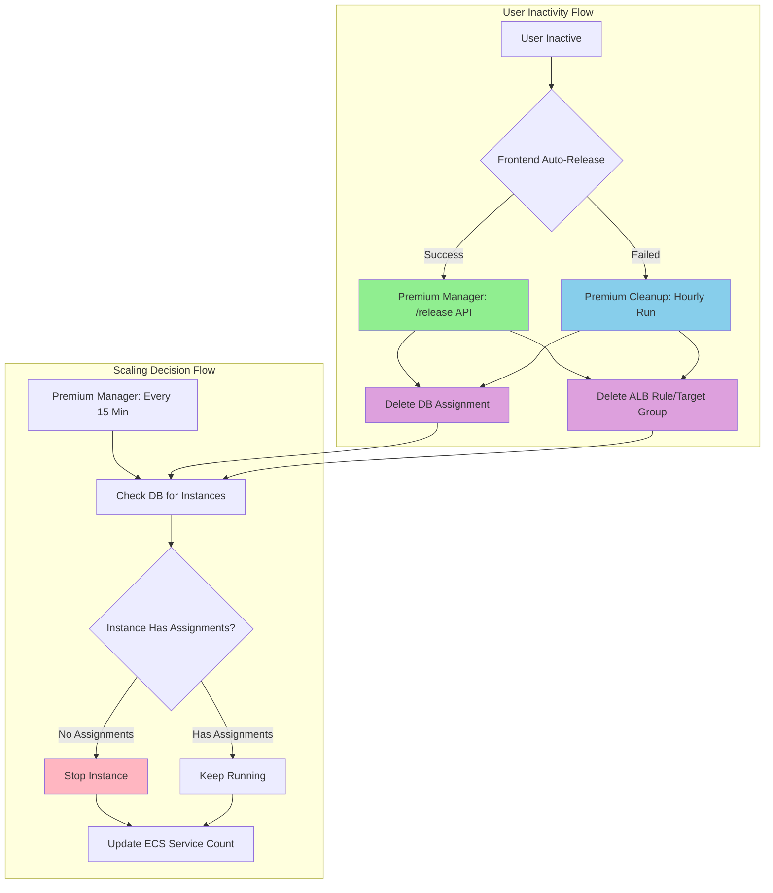

# Premium Manager Refactoring: Separation of Concerns

## Executive Summary
- **Premium Manager** = All compute and capacity decisions (scaling, instance management), plus some infrastructure cleanup (ghost ECS registrations, orphaned EC2 instances)
- **Premium Cleanup** = Data and resource hygiene (stale records, orphaned ALB resources, instance state reconciliation)

## Key Architectural Principles

These are the fundamental principles that guide the separation:

1. **Single Responsibility for Scaling**
   - Premium Manager has exclusive control over EC2 instance states (start/stop)
   - Premium Cleanup NEVER starts or stops instances
   - Prevents conflicting scaling decisions and race conditions

2. **Data Hygiene vs Compute Management**
   - Premium Cleanup removes stale database records and orphaned ALB resources
   - Premium Manager makes scaling decisions based on clean data
   - Note: Some overlap exists -- Manager also cleans up failed standby DB entries and ghost ECS registrations during its 15-min monitoring cycle

3. **Scheduled Monitoring for Cost Optimization**
   - Premium Manager checks every 15 minutes for idle instances
   - Conservative scaling algorithm: keeps `active_users + 1` instances running, requires `idle_instances >= 2` before scaling down
   - Ensures instances scale down even if frontend logout fails

4. **Coordination Through Clean Data**
   - Cleanup runs hourly to remove stale assignments (configurable via `PREMIUM_IDLE_TIMEOUT_HOURS`, default 2h, currently set to 3h in Terraform)
   - Manager's 15-minute monitoring uses cleaned data for scaling decisions
   - No direct coordination needed - unidirectional data flow

## Architecture Overview



### Key Constraints Satisfied

1. **No Race Conditions** - Only manager stops/starts instances
2. **Cost Optimization** - Idle instances stopped within 15 minutes
3. **Data Accuracy** - Cleanup ensures DB reflects reality
4. **Fault Tolerance** - Cleanup acts as safety net when frontend fails

### Responsibility Matrix

| Responsibility                   | Premium Manager          | Premium Cleanup        |
|----------------------------------|--------------------------|------------------------|
| Stop/start instances             | Yes - Exclusive          | No                     |
| Update ECS service count         | Yes - Exclusive          | No                     |
| Delete stale DB assignments      | No                       | Yes - Exclusive        |
| Delete orphaned ALB resources    | No                       | Yes - Exclusive        |
| Reconcile instance states (DB)   | No                       | Yes - Exclusive        |
| Cleanup failed standby DB entries| Yes                      | No                     |
| Cleanup ghost ECS registrations  | Yes                      | No                     |
| Cleanup orphaned EC2 instances   | Yes                      | No                     |
| User assignment/release (API)    | Yes - Real-time          | No                     |
| Activity update (API)            | Yes - Real-time          | No                     |
| Shared-to-dedicated migration    | Yes                      | No                     |
| Scheduled monitoring             | Yes - Every 15 min       | Yes - Every 60 min     |
| Manual actions (test cleanup)    | No                       | Yes                    |
| Manual actions (user migration)  | No                       | Yes                    |

---

## Implementation Details

### 1. Premium Manager

**File:** `infrastructure/terraform/premium_manager_package/premium_manager.py`

#### Handler Routing

The `handler()` function routes events based on type:

| Event Type | Route | Description |
|---|---|---|
| `{"action": "migrate_shared_users"}` | `_handle_migrate_shared_users()` | Async migration under distributed lock |
| `{"action": "fix_shared_flags"}` | `fix_incorrect_is_shared_flags()` | One-time data cleanup |
| CloudWatch Scheduled Event | `handle_scheduled_monitoring()` | 15-min monitoring cycle |
| `GET` (API Gateway) | `get_premium_user_status()` | Status check |
| `POST action=assign` | `assign_premium_user()` | User assignment |
| `POST action=release` | `release_premium_user()` | User release |
| `POST action=update_activity` | `handle_activity_update()` | Heartbeat/activity update |

#### Scheduled Monitoring: `handle_scheduled_monitoring()`

Runs every 15 minutes. Performs these operations in order:

```
1.  Check scaling lock (prevent concurrent operations)
2.  Set scaling lock
3.  Get current state (active users, running instances, idle instances)
4.  Publish CloudWatch metrics
5.  scale_down_if_possible() - Stop idle instances
6.  update_premium_service_desired_count() - Sync ECS desired count
7.  cleanup_failed_standby_instances() - Remove DB entries for terminated instances
8.  cleanup_ghost_ecs_registrations() - Deregister orphaned ECS container instances
9.  cleanup_orphaned_ec2_instances() - Stop EC2 instances not in ECS cluster
10. process_shared_instance_optimization() - Migrate shared users to dedicated instances
```

Always clears scaling lock in `finally` block, even on error.

#### scale_down_if_possible()

**File:** `infrastructure/terraform/premium_manager_package/premium_manager.py`
**Purpose:** Scale down premium instances by stopping idle ones
**Input:** None (reads state from DB and EC2)
**Output:** Stops idle EC2 instances, deregisters from ECS
**Calls:** get_dynamic_max_capacity() -> count_active_premium_users()
-> get_all_premium_instances_with_states()

Key scaling constraint:

```python
# Keep active_users + 1 instances; require 2 idle before
# stopping any; always retain at least 1 idle after
min_running_needed = max(1, active_users + 1)
```

Guards:
- Requires `idle_instances >= 2` before scaling down
- Always retains at least 1 idle instance after scale-down
- Only stops instances with ZERO assigned users
- Deregisters from ECS before stopping to prevent ghost
  registrations

#### Terraform Configuration

```hcl
resource "aws_cloudwatch_event_rule" "premium_manager_schedule" {
  schedule_expression = "rate(15 minutes)"
  description         = "Trigger premium manager every 15 minutes for monitoring and scaling"
}
```

### 2. Premium Cleanup

**File:** `infrastructure/terraform/premium_cleanup_package/premium_cleanup.py`

#### Handler Routing

The `handler()` function supports both scheduled and manual invocations:

| Event Type | Route | Description |
|---|---|---|
| `{"action": "cleanup_test_users", "user_emails": [...]}` | `cleanup_test_user_assignments()` | Manual test user cleanup |
| `{"action": "get_user_assignment", "user_email": "..."}` | `get_user_assignment()` | Look up user assignment |
| `{"action": "migrate_user", "user_email": "...", "target_instance_id": "..."}` | `migrate_user()` | Migrate user to different instance |
| Scheduled (default) | Normal cleanup flow | 5-step cleanup process |

#### Scheduled Cleanup Flow

All 5 steps run sequentially on each hourly invocation:

1. `cleanup_stale_assignments()` -- remove idle assignments
2. `cleanup_orphaned_alb_resources()` -- delete orphaned ALB
3. `cleanup_duplicate_alb_rules()` -- remove duplicate rules
4. `reconcile_instance_states()` -- sync DB with AWS
5. `ensure_standby_pool_capacity()` -- monitor standby health

Note: `cleanup_stale_assignments()` uses the
`@with_transaction` decorator which automatically injects a
database connection and manages commit/rollback.

#### Stale Assignment Timeout

The timeout is configurable via the `PREMIUM_IDLE_TIMEOUT_HOURS` environment variable:
- **Code default:** 2 hours (`DEFAULT_STALE_ASSIGNMENT_TIMEOUT_HOURS = 2`)
- **Terraform override:** 3 hours (`PREMIUM_IDLE_TIMEOUT_HOURS = "3"`)
- **Production behavior:** Assignments idle for >3 hours are cleaned up

---

## Flow Diagrams

### User Logout and Scaling Flow

```
+----------------------------------------------------------+
| 1. User Inactive (frontend auto-release: 2h)             |
+----------------------------------------------------------+
                         |
+----------------------------------------------------------+
| 2. Frontend Auto-Release (or Cleanup as Safety Net)      |
|    -> Deletes assignment from premium_user_assignments    |
|    -> Deletes ALB rule and target group                   |
+----------------------------------------------------------+
                         |
+----------------------------------------------------------+
| 3. Premium Manager Monitoring (Every 15 Minutes)         |
|    -> Queries DB for instances with assigned users        |
|    -> Finds instances with NO assigned users              |
+----------------------------------------------------------+
                         |
+----------------------------------------------------------+
| 4. Scaling Decision (scale_down_if_possible)             |
|    -> Conservative: Keep max(1, active_users + 1)        |
|    -> Require idle_instances >= 2 before scaling down     |
|    -> Stop instances with 0 assignments                   |
+----------------------------------------------------------+
                         |
+----------------------------------------------------------+
| 5. Update ECS Service Count                              |
|    -> ECS desired_count = number of running instances     |
+----------------------------------------------------------+
```

### Cleanup Lambda Flow (Safety Net)

```
+----------------------------------------------------------+
| Premium Cleanup Lambda (Runs Every Hour)                  |
+----------------------------------------------------------+
                         |
+----------------------------------------------------------+
| 1. cleanup_stale_assignments() [@with_transaction]       |
|    -> Find assignments where last_activity > 3 hours     |
|    -> Delete from premium_user_assignments table          |
|    -> Delete associated ALB rules/target groups           |
|    -> Skip deletion of shared autoscaling target group    |
+----------------------------------------------------------+
                         |
+----------------------------------------------------------+
| 2. cleanup_orphaned_alb_resources()                      |
|    -> Find ALB rules with no matching DB entry            |
|    -> Delete orphaned target groups and rules             |
+----------------------------------------------------------+
                         |
+----------------------------------------------------------+
| 3. cleanup_duplicate_alb_rules()                         |
|    -> Group ALB rules by routing_id                       |
|    -> Keep rule matching database entry                   |
|    -> Delete all duplicate rules                          |
+----------------------------------------------------------+
                         |
+----------------------------------------------------------+
| 4. reconcile_instance_states()                           |
|    -> Query AWS for actual instance states                |
|    -> Update DB to match reality                          |
|    -> Fix discrepancies (e.g., terminated instances)      |
+----------------------------------------------------------+
                         |
+----------------------------------------------------------+
| 5. ensure_standby_pool_capacity() [Read-Only]            |
|    -> Check if standby pool has minimum capacity          |
|    -> Log warnings if capacity is low                     |
|    -> Does NOT create or terminate instances              |
+----------------------------------------------------------+
```

### Premium Manager Monitoring Flow (Every 15 Minutes)

```
+----------------------------------------------------------+
| Premium Manager Monitoring (Every 15 Minutes)            |
+----------------------------------------------------------+
                         |
+----------------------------------------------------------+
| 1-2. Check/Set Scaling Lock (CloudWatch metrics-based)   |
|    -> Skip if another operation is in progress            |
+----------------------------------------------------------+
                         |
+----------------------------------------------------------+
| 3-4. Get State & Publish Metrics                         |
|    -> Count active users, running instances, idle         |
|    -> Publish to CloudWatch OptiNiSt/PremiumManager      |
+----------------------------------------------------------+
                         |
+----------------------------------------------------------+
| 5. scale_down_if_possible()                              |
|    -> Stop idle instances if conditions are met           |
|    -> Deregister from ECS before stopping                 |
+----------------------------------------------------------+
                         |
+----------------------------------------------------------+
| 6. update_premium_service_desired_count()                |
|    -> Sync ECS desired count with running instances       |
+----------------------------------------------------------+
                         |
+----------------------------------------------------------+
| 7. cleanup_failed_standby_instances()                    |
|    -> Remove DB entries for terminated standby instances  |
+----------------------------------------------------------+
                         |
+----------------------------------------------------------+
| 8. cleanup_ghost_ecs_registrations()                     |
|    -> Deregister ECS container instances where agent is   |
|       disconnected or EC2 is stopped/terminated           |
+----------------------------------------------------------+
                         |
+----------------------------------------------------------+
| 9. cleanup_orphaned_ec2_instances()                      |
|    -> Stop premium-tagged EC2 instances not in ECS        |
|    -> 15-minute grace period for booting instances        |
+----------------------------------------------------------+
                         |
+----------------------------------------------------------+
| 10. process_shared_instance_optimization()               |
|    -> Find users on shared instances                      |
|    -> Migrate to dedicated if instances available         |
|    -> Trigger async migration if no instances ready       |
+----------------------------------------------------------+
                         |
+----------------------------------------------------------+
| Finally: Clear Scaling Lock                              |
+----------------------------------------------------------+
```

---

## Edge Case Handling

### 1. Frontend Logout Fails (Browser Closed, Network Error)

**Problem:** User closes browser before logout API completes.

**Solution:** Premium Cleanup acts as safety net:
- Runs hourly to find assignments with `last_activity > PREMIUM_IDLE_TIMEOUT_HOURS` (currently 3 hours)
- Deletes stale assignments and ALB rules
- Manager's next monitoring run (within 15 min) stops idle instances


### 2. Concurrent Scaling Operations

**Problem:** Multiple triggers could cause manager to run concurrently.

**Solution:** CloudWatch metrics-based locking:

#### is_premium_scaling_in_progress()

**File:** `infrastructure/terraform/premium_manager_package/premium_manager.py`
**Purpose:** Check if a scaling operation is already running
**Input:** None (reads CloudWatch metric)
**Output:** True if lock set within last 15 minutes

#### set_premium_scaling_lock()

**File:** `infrastructure/terraform/premium_manager_package/premium_manager.py`
**Purpose:** Set or clear the scaling lock via CloudWatch
**Input:** `in_progress` (bool) -- True to set, False to clear
**Output:** Publishes CloudWatch metric (0 or 1)

**Behavior:**
- Monitoring checks lock before starting
- Skips run if lock is set (another operation in progress)
- Lock automatically clears after 15 minutes
  (metric window expiry)
- `finally` block always clears the lock, even on error


### 3. Instance State Discrepancies (DB vs AWS)

**Problem:** DB shows instance as "running" but AWS shows "terminated".

**Solution:** Premium Cleanup reconciliation:

#### reconcile_instance_states()

**File:** `infrastructure/terraform/premium_cleanup_package/premium_cleanup.py`
**Purpose:** Sync DB instance states with actual AWS states
**Input:** None (reads from AWS EC2 and database)
**Output:** Updates DB records; cleans terminated entries
**Calls:** get_all_premium_instances_with_states()

**Frequency:** Runs hourly to keep DB accurate


### 4. Ghost ECS Container Instances

**Problem:** EC2 instances stopped/terminated outside normal flow leave orphaned ECS registrations that confuse the ECS scheduler.

**Solution:** Premium Manager's `cleanup_ghost_ecs_registrations()`:
- Finds container instances with disconnected agents or stopped/terminated EC2
- Force-deregisters them from the ECS cluster
- Runs every 15 minutes as part of scheduled monitoring


### 5. Orphaned EC2 Instances

**Problem:** EC2 instances tagged as premium are running but not registered in ECS (wasting resources and inflating desiredCount).

**Solution:** Premium Manager's `cleanup_orphaned_ec2_instances()`:
- Finds premium-tagged EC2 instances not in the ECS cluster
- 15-minute grace period (`ORPHAN_GRACE_PERIOD_MINUTES = 15`) to avoid stopping still-booting instances
- Stops orphaned instances


### 6. Race Condition Between Manager and Cleanup

**Problem:** Could manager and cleanup conflict when operating on same instance?

**Solution:** Clear division of labor minimizes race conditions:
- **Manager** = Touches instance states (start/stop) and ECS registrations
- **Cleanup** = Touches database records and ALB resources
- Cleanup uses `@with_transaction` decorator with `SELECT FOR UPDATE` to prevent concurrent DB modifications


### 7. Shared Instance Users

**Problem:** Users may be assigned to shared instances when no dedicated instance is available.

**Solution:** `process_shared_instance_optimization()` in the manager's 15-min cycle:
- Finds users with `is_shared = true` assignments
- Attempts migration to dedicated instances if available
- If no instances ready, triggers `invoke_migration_async()` which runs `_handle_migrate_shared_users()` under a distributed MySQL lock (`GET_LOCK`)


---

## Monitoring and Metrics

### CloudWatch Metrics Published

**By Premium Manager** (every 15 minutes):

| Metric Name | Description | Unit |
|-------------|-------------|------|
| `ActivePremiumUsers` | Users with active assignments | Count |
| `IdlePremiumUsers` | Total premium users - active users | Count |
| `RunningInstances` | EC2 instances in "running" state | Count |
| `IdleInstances` | Running instances with 0 assignments | Count |
| `ScalingInProgress` | Lock to prevent concurrent operations | None (0 or 1) |

**Namespace:** `OptiNiSt/PremiumManager`

### CloudWatch Logs

**Premium Manager:**
- `/aws/lambda/subscr-premium-manager`
- Retention: 30 days

**Premium Cleanup:**
- `/aws/lambda/subscr-premium-cleanup`
- Retention: 30 days

---

## Configuration

### Environment Variables

**Premium Manager:**
```bash
# Network / ALB
VPC_ID                       # VPC ID for target group creation
SUBNET_IDS                   # Comma-separated subnet IDs
SECURITY_GROUP_ID            # ECS security group
ALB_ARN                      # Application Load Balancer ARN
ALB_LISTENER_ARN             # ALB HTTPS listener ARN
ALB_DNS_NAME                 # ALB DNS name
AUTOSCALING_TARGET_GROUP_ARN # Shared autoscaling target group ARN

# Compute
PREMIUM_INSTANCE_IDS         # Comma-separated EC2 instance IDs
PREMIUM_LAUNCH_TEMPLATE_ID   # Launch template for creating instances
CLUSTER_NAME                 # ECS cluster name
PREMIUM_SERVICE_NAME         # ECS service name for premium tier

# Database
RDS_HOST                     # Database endpoint (via RDS Proxy)
RDS_USER                     # Database username
RDS_PASSWORD                 # Database password
RDS_DATABASE                 # Database name

# Security
ROUTING_SECRET_KEY           # HMAC secret for generating routing IDs
INTERNAL_API_SECRET          # Secret for internal API authentication

# Capacity tuning
PREMIUM_STANDBY_POOL_SIZE    # Standby instances to maintain (default: 1)
PREMIUM_EXTRA_CAPACITY       # Extra capacity buffer for scaling (default: 2, not set in Terraform)

# Set in Terraform but only read by Cleanup Lambda:
# PREMIUM_SAFETY_BUFFER      # (Terraform: 1, not read by Manager code)
# PREMIUM_IDLE_TIMEOUT_HOURS # (Terraform: 3, not read by Manager code)
```

**Premium Cleanup:**
```bash
# Network / ALB
VPC_ID                       # VPC ID
SUBNET_IDS                   # Comma-separated subnet IDs
SECURITY_GROUP_ID            # ECS security group
ALB_ARN                      # Application Load Balancer ARN
ALB_LISTENER_ARN             # ALB HTTPS listener ARN

# Compute
PREMIUM_INSTANCE_IDS         # Comma-separated EC2 instance IDs
PREMIUM_LAUNCH_TEMPLATE_ID   # Launch template ID
CLUSTER_NAME                 # ECS cluster name
PREMIUM_SERVICE_NAME         # ECS service name

# Database
RDS_HOST                     # Database endpoint (via RDS Proxy)
RDS_USER                     # Database username
RDS_PASSWORD                 # Database password
RDS_DATABASE                 # Database name

# Cleanup tuning
PREMIUM_IDLE_TIMEOUT_HOURS   # Hours before stale assignment cleanup (code default: 2, Terraform: 3)
```

### Triggers

| Lambda          | Trigger              | Frequency        | EventBridge Rule                  |
|-----------------|----------------------|------------------|-----------------------------------|
| Premium Manager | Scheduled monitoring | Every 15 minutes | `subscr-premium-manager-schedule` |
| Premium Manager | User assign/release  | On-demand (API)  | N/A                               |
| Premium Cleanup | Scheduled cleanup    | Every 60 minutes | `subscr-premium-cleanup-schedule` |

### AWS Resources

- **Premium Manager Lambda:** `subscr-premium-manager` (timeout: 600s)
- **Premium Cleanup Lambda:** `subscr-premium-cleanup` (timeout: 300s)
- **EventBridge Rules:**
  - `subscr-premium-manager-schedule` (15 min)
  - `subscr-premium-cleanup-schedule` (60 min)
- **CloudWatch Log Groups:**
  - `/aws/lambda/subscr-premium-manager` (30 day retention)
  - `/aws/lambda/subscr-premium-cleanup` (30 day retention)

### Key Functions Reference

**In Premium Manager:**

| Function | Description |
|---|---|
| `handler()` | Main entry point, routes events by type |
| `handle_scheduled_monitoring()` | 15-min monitoring cycle (10 operations) |
| `scale_down_if_possible()` | Conservative scaling algorithm |
| `update_premium_service_desired_count()` | Sync ECS desired count |
| `assign_premium_user()` | Real-time user assignment (API) |
| `release_premium_user()` | Real-time user release (API) |
| `handle_activity_update()` | Heartbeat/activity timestamp update (API) |
| `get_premium_user_status()` | Get user assignment status (API) |
| `cleanup_failed_standby_instances()` | Remove DB entries for terminated standbys |
| `cleanup_ghost_ecs_registrations()` | Deregister orphaned ECS container instances |
| `cleanup_orphaned_ec2_instances()` | Stop premium EC2 not in ECS cluster |
| `process_shared_instance_optimization()` | Migrate shared users to dedicated |
| `invoke_migration_async()` | Trigger async migration Lambda invocation |
| `_handle_migrate_shared_users()` | Migration loop under distributed lock |
| `create_running_instance()` | Create and start a new premium instance |
| `start_standby_instance()` | Start a stopped standby instance |
| `convert_idle_instances_to_standby_immediate()` | Stop idle instances to standby |
| `publish_premium_metrics()` | Publish CloudWatch monitoring metrics |
| `is_premium_scaling_in_progress()` | Check CloudWatch-based scaling lock |
| `set_premium_scaling_lock()` | Set/clear CloudWatch-based scaling lock |
| `migrate_user_to_dedicated_instance()` | Migrate user between instances |

**In Premium Cleanup:**

| Function | Description |
|---|---|
| `handler()` | Main entry, routes scheduled vs manual actions |
| `cleanup_stale_assignments()` | Remove idle assignments (>3h, `@with_transaction`) |
| `cleanup_orphaned_alb_resources()` | Delete ALB rules with no DB entry |
| `cleanup_duplicate_alb_rules()` | Remove redundant rules with same routing_id |
| `reconcile_instance_states()` | Sync DB with AWS reality |
| `ensure_standby_pool_capacity()` | Monitor standby health (read-only) |
| `cleanup_test_user_assignments()` | Manual: clean up test user assignments |
| `get_user_assignment()` | Manual: look up user assignment by email |
| `migrate_user()` | Manual: migrate user to specific instance |
| `check_instance_readiness()` | Check if instance has running ECS task |

---

## Premium Frontend Architecture

The frontend components handle premium user experience including instance assignment, inactivity monitoring, and user notifications.

### Component Overview

```
+-----------------------------------------------------------------------+
|                           App.tsx                                      |
+-----------------------------------------------------------------------+
|                                                                       |
|  +---------------------------------------------------------------+   |
|  |         PremiumAssignmentProvider (Context)                    |   |
|  |   - Single source of truth for premium state                  |   |
|  |   - Auto-assignment on login                                  |   |
|  |   - Inactivity monitoring (1hr warning, 2hr release)          |   |
|  |   - Heartbeat management with retry logic                     |   |
|  |   - Browser close/refresh handling (sendBeacon)               |   |
|  |   - Exponential backoff polling for dedicated instance         |   |
|  |   - Leader tab election for polling                           |   |
|  +---------------------------------------------------------------+   |
|  |                                                               |   |
|  |  +-------------------------+  +-----------------------------+ |   |
|  |  | PremiumAssignment       |  | PremiumNotificationManager | |   |
|  |  | Manager                 |  |                             | |   |
|  |  |                         |  | - Success notifications    | |   |
|  |  | - Cleanup on unmount    |  | - Preparation info toast   | |   |
|  |  | - Debug logging         |  | - Error notifications      | |   |
|  |  +-------------------------+  +-----------------------------+ |   |
|  |                                                               |   |
|  |  +-----------------------------------------------------------+|   |
|  |  |                InactivityWarning                           ||   |
|  |  |   - Shows after 1 hour of inactivity                      ||   |
|  |  |   - Minute-resolution countdown timer                     ||   |
|  |  |   - "Stay Active" button sends heartbeat (with retry)     ||   |
|  |  |   - Session expired state (401 -> auto-logout)            ||   |
|  |  +-----------------------------------------------------------+|   |
|  |                                                               |   |
|  +---------------------------------------------------------------+   |
|                                                                       |
+-----------------------------------------------------------------------+
```

### PremiumAssignmentContext

**File:** `frontend/src/contexts/PremiumAssignmentContext.tsx`

The context provider serves as the single source of truth for premium assignment state, eliminating duplicate API calls from multiple hook instances.

#### State Management

```typescript
interface PremiumAssignmentState {
  isAssigning: boolean
  isReleasing: boolean
  assignmentResult: PremiumAssignmentResult | null
  statusResult: PremiumStatusResult | null
  routingInfo: RoutingInfo | null
  error: string | null
  isPremiumUser: boolean
  showInactivityWarning: boolean
  lastActivityTime: number
  heartbeatFailing: boolean
}
```

#### Context Value (Exported Functions)

```typescript
// Functions exposed via usePremiumAssignment() hook:
assign, release, getStatus, updateRoutingInfo,
autoReleaseOnLogout, dismissInactivityWarning, recordActivity
// Plus all PremiumAssignmentState fields via spread
```

Note: `autoAssignOnLogin()` is internal only -- triggered by a `useEffect` when `isPremiumUser && currentUser`, not exposed via context.

#### Key Features

| Feature | Description |
|---------|-------------|
| **Auto-assignment** | Automatically assigns premium instance on login |
| **Inactivity monitoring** | Checks every 30 seconds for user activity |
| **Warning at 1 hour** | Shows InactivityWarning component |
| **Auto-release at 2 hours** | Releases instance after extended inactivity |
| **Heartbeat with retry** | `recordActivity()` retries up to 3 times with 1s delay |
| **Browser close handling** | Uses `navigator.sendBeacon` on `beforeunload` event |
| **Polling with backoff** | If on shared instance, polls for dedicated with exponential backoff (1.5x multiplier, 30s initial, 60s max, 40 attempts max, leader tab only) |

#### Auto-Assignment Flow

```
+-----------------------------------------------------------------------+
| 1. Premium user logs in                                               |
|    isPremiumUser = true (from subscription state)                     |
+-----------------------------------------------------------------------+
                              |
+-----------------------------------------------------------------------+
| 2. autoAssignOnLogin() triggered via useEffect                        |
|    - Check hasAttemptedAutoAssignment flag (prevent duplicates)        |
|    - Set flag immediately                                             |
+-----------------------------------------------------------------------+
                              |
+-----------------------------------------------------------------------+
| 3. Check existing assignment                                          |
|    GET /users/me/premium/status                                       |
|    If already assigned -> update state and return                      |
+-----------------------------------------------------------------------+
                              |
+-----------------------------------------------------------------------+
| 4. Request new assignment                                             |
|    POST /users/me/premium/assign                                      |
|    -> Premium Lambda assigns to dedicated or shared instance           |
+-----------------------------------------------------------------------+
                              |
+-----------------------------------------------------------------------+
| 5. Update state with result                                           |
|    - assignmentResult stored                                          |
|    - PremiumNotificationManager shows appropriate notification        |
|    - If is_shared, start polling with exponential backoff             |
+-----------------------------------------------------------------------+
```

#### Inactivity Monitoring

**File:** `frontend/src/contexts/PremiumAssignmentContext.tsx`
**Purpose:** Detect idle premium users and release instances
**Input:** `lastActivityTime` from context state
**Output:** Shows warning at 1h; auto-releases at 2h
**Mechanism:** `useEffect` with 30-second `setInterval`

Key thresholds:
- **1 hour idle:** Sets `showInactivityWarning: true`
- **2 hours idle:** Calls `autoReleaseOnLogout()`

Note: The frontend inactivity timeout (2 hours) is separate
from the backend cleanup timeout (3 hours). The frontend
acts as the primary mechanism; the backend cleanup is a
safety net.

### PremiumNotificationManager

**File:** `frontend/src/components/Premium/PremiumNotificationManager.tsx`

Handles user notifications for premium assignment events using notistack.

#### Notification Types

| Event | Variant | Message | Behavior |
|-------|---------|---------|----------|
| Dedicated instance assigned | `success` | "Premium instance assigned successfully!" | Auto-dismiss |
| No dedicated instance yet | `info` | "Please wait while your dedicated premium resource is being prepared." | Persistent |
| Assignment error (non-scaling) | `warning` | "Premium assignment issue: {error}" | Auto-dismiss |
| Scaling/retry errors | (suppressed) | N/A | Silently ignored |

Note: Errors containing "scaling" or "retry" substrings are suppressed to avoid noisy notifications during normal scaling operations.

### InactivityWarning

**File:** `frontend/src/components/Premium/InactivityWarning.tsx`

Displays a warning when premium users have been inactive for 1 hour.

#### Component Behavior

- **Appears:** After 1 hour of inactivity
- **Position:** Snackbar with Alert (severity="warning")
- **Countdown:** Minute-resolution countdown (updates every 60 seconds)
- **"Stay Active" button:** Calls `recordActivity()` (heartbeat with retry) and dismisses warning
- **Session expired state:** If heartbeat returns 401, switches to `severity="error"` showing "Session Expired" and auto-redirects to logout after 2 seconds

### Premium API Functions

**File:** `frontend/src/api/premium/PremiumAssignmentApi.ts`

| Function | Endpoint | Purpose |
|----------|----------|---------|
| `getRoutingInfo()` | GET /users/me/routing-info | Get ALB routing headers |
| `assignPremiumInstance()` | POST /users/me/premium/assign | Request instance assignment |
| `releasePremiumInstance()` | DELETE /users/me/premium/assign | Release current assignment |
| `getPremiumStatus()` | GET /users/me/premium/status | Get current assignment status |
| `sendPremiumHeartbeat()` | POST /users/me/premium/heartbeat | Update activity timestamp |
| `getBeaconTokenApi()` | GET /users/me/premium/beacon-token | Get token for sendBeacon release |

### Frontend Files Summary

| File | Purpose |
|------|---------|
| `frontend/src/contexts/PremiumAssignmentContext.tsx` | State management, auto-assignment, inactivity, polling |
| `frontend/src/components/Premium/PremiumAssignmentManager.tsx` | Cleanup on unmount, debug logging |
| `frontend/src/components/Premium/PremiumNotificationManager.tsx` | User notifications via notistack |
| `frontend/src/components/Premium/InactivityWarning.tsx` | Inactivity warning UI with countdown |
| `frontend/src/api/premium/PremiumAssignmentApi.ts` | API client functions (6 endpoints) |
| `frontend/src/contexts/__tests__/PremiumHeartbeatRetry.test.ts` | Tests for heartbeat retry logic |
| `frontend/src/contexts/__tests__/PremiumPollingBackoff.test.ts` | Tests for polling backoff behavior |
| `frontend/src/contexts/__tests__/PremiumSleepDetection.test.ts` | Tests for sleep/wake detection |
