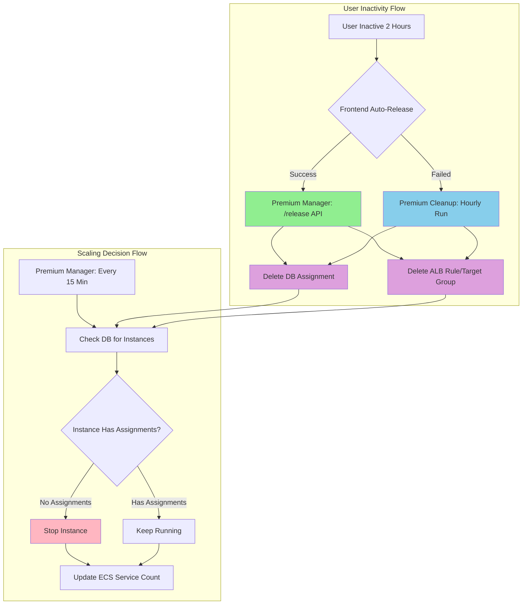

# Premium Manager Refactoring: Separation of Concerns

## Executive Summary
- **Premium Manager** = All compute and capacity decisions (scaling, instance management)
- **Premium Cleanup** = Only data and resource hygiene (stale records, orphaned resources)

## Key Architectural Principles

These are the fundamental principles that guide the separation:

1. **Single Responsibility for Scaling**
   - Premium Manager has exclusive control over EC2 instance states (start/stop)
   - Premium Cleanup NEVER starts or stops instances
   - Prevents conflicting scaling decisions and race conditions

2. **Data Hygiene vs Compute Management**
   - Premium Cleanup removes stale database records and orphaned ALB resources
   - Premium Manager makes scaling decisions based on clean data
   - Clear division: data cleaning vs capacity management

3. **Scheduled Monitoring for Cost Optimization**
   - Premium Manager checks every 15 minutes for idle instances
   - Conservative scaling algorithm: keeps `active_users + 1` instances running
   - Ensures instances scale down even if frontend logout fails

4. **Coordination Through Clean Data**
   - Cleanup runs hourly to remove stale assignments (>2 hours inactive)
   - Manager's 15-minute monitoring uses cleaned data for scaling decisions
   - No direct coordination needed - unidirectional data flow

## Architecture Overview



### Key Constraints Satisfied

1. **No Race Conditions** - Only manager stops/starts instances
2. **Cost Optimization** - Idle instances stopped within 15 minutes
3. **Data Accuracy** - Cleanup ensures DB reflects reality
4. **Fault Tolerance** - Cleanup acts as safety net when frontend fails

### Responsibility Matrix

| Responsibility                | Premium Manager         | Premium Cleanup       |
|-------------------------------|-------------------------|-----------------------|
| Stop/start instances          | ✅ Exclusive ownership  | ❌ Never               |
| Update ECS service count      | ✅ Exclusive ownership  | ❌ Never               |
| Delete stale DB assignments   | ❌ Never                | ✅ Exclusive ownership |
| Delete orphaned ALB resources | ❌ Never                | ✅ Exclusive ownership |
| Reconcile instance states     | ❌ Never                | ✅ Exclusive ownership |
| User assignment/release (API) | ✅ Real-time operations | ❌ Never               |
| Scheduled monitoring          | ✅ Every 15 minutes     | ✅ Every 60 minutes    |

---

## Implementation Details

### 1. Premium Manager Enhancements

**File:** `studio/config/terraform/premium_manager_package/premium_manager.py`

**Scheduled Monitoring Handler** (lines 1429-1525):

```python
def handle_scheduled_monitoring(event, context):
    """
    Runs every 15 minutes to make scaling decisions.

    Operations:
    1. Check scaling lock (prevent concurrent operations)
    2. Get current state (active users, running instances)
    3. Publish CloudWatch metrics
    4. scale_down_if_possible() - Stop idle instances
    5. update_premium_service_desired_count() - Sync ECS
    6. cleanup_failed_standby_instances() - Remove orphaned DB entries
    """
```

**Scaling Algorithm** (`scale_down_if_possible()`):
- Conservative approach: keeps `max(1, active_users + 1)` instances running
- Only stops instances with ZERO assigned users
- Uses CloudWatch metrics-based locking to prevent concurrent operations

**Updated Docstring** (lines 1-34):
```python
"""
Premium Manager Lambda Function - Compute & Capacity Management

PRIMARY RESPONSIBILITIES:
- Real-time assignment of premium users to instances (API-triggered)
- Real-time release of premium users from instances (API-triggered)
- Scaling and instance management (both real-time and scheduled)
- ALB routing rule creation and deletion
- Scheduled monitoring (every 15 min) to make scaling decisions
- Standby pool management (ensure capacity, cleanup excess)

SCALING STRATEGY:
- Triggered by: User logout, scheduled monitoring (every 15 min)
- Algorithm: scale_down_if_possible() - conservative (keeps active_users + 1)
- Coordinates with: premium_cleanup (which cleans data, not compute)
"""
```

**Terraform Configuration:**
```hcl
# EventBridge rule for scheduled monitoring
resource "aws_cloudwatch_event_rule" "premium_manager_schedule" {
  schedule_expression = "rate(15 minutes)"
  description         = "Trigger premium manager every 15 minutes for monitoring and scaling"
}
```

### 2. Premium Cleanup Simplification

**File:** `studio/config/terraform/premium_cleanup_package/premium_cleanup.py`

**Handler** (lines 949-1034):

```python
def handler(event, context):
    """
    Premium Cleanup Lambda - Data & Resource Hygiene
    Runs hourly to maintain database accuracy.

    Operations:
    1. cleanup_stale_assignments() - Remove >2hr inactive assignments
    2. cleanup_orphaned_alb_resources() - Delete ALB rules with no DB entry
    3. reconcile_instance_states() - Update DB to match AWS reality
    4. ensure_standby_pool_capacity() - Monitor standby health (read-only)

    Does NOT stop/start instances - that's premium_manager's job.
    """
    results = {}

    results["cleanup_stats"] = cleanup_stale_assignments()
    results["orphaned_cleanup_stats"] = cleanup_orphaned_alb_resources()
    results["reconciliation_stats"] = reconcile_instance_states()
    results["capacity_check"] = ensure_standby_pool_capacity()

    return {
        "statusCode": 200,
        "body": json.dumps({
            "message": "Premium cleanup completed successfully",
            "results": results
        })
    }
```

**Docstring** (lines 1-17):
```python
"""
Premium Cleanup Lambda - Data & Resource Hygiene

Responsibilities:
- Remove stale assignments from database (>2 hours inactive)
- Clean up orphaned ALB resources (rules/target groups with no DB entry)
- Reconcile instance states (ensure DB matches AWS reality)
- Monitor standby pool health (read-only)

Does NOT:
- Make scaling decisions (premium_manager handles that)
- Stop or start instances (premium_manager handles that)
- Update ECS service count (premium_manager handles that)

Triggered by CloudWatch Events hourly.
Coordinates with premium_manager which handles all compute/capacity decisions.
"""
```

---

## Flow Diagrams

### User Logout and Scaling Flow

```
┌──────────────────────────────────────────────────────────┐
│ 1. User Inactive for 2 Hours                            │
└──────────────────────────────────────────────────────────┘
                         ↓
┌──────────────────────────────────────────────────────────┐
│ 2. Frontend Auto-Release (or Cleanup as Safety Net)     │
│    → Deletes assignment from premium_user_assignments   │
│    → Deletes ALB rule and target group                  │
└──────────────────────────────────────────────────────────┘
                         ↓
┌──────────────────────────────────────────────────────────┐
│ 3. Premium Manager Monitoring (Every 15 Minutes)        │
│    → Queries DB: SELECT * WHERE user_id IS NOT NULL     │
│    → Finds instances with NO assigned users             │
└──────────────────────────────────────────────────────────┘
                         ↓
┌──────────────────────────────────────────────────────────┐
│ 4. Scaling Decision (scale_down_if_possible)            │
│    → Conservative: Keep max(1, active_users + 1)        │
│    → Stop instances with 0 assignments                  │
└──────────────────────────────────────────────────────────┘
                         ↓
┌──────────────────────────────────────────────────────────┐
│ 5. Update ECS Service Count                             │
│    → ECS desired_count = number of running instances    │
└──────────────────────────────────────────────────────────┘
```

### Cleanup Lambda Flow (Safety Net)

```
┌──────────────────────────────────────────────────────────┐
│ Premium Cleanup Lambda (Runs Every Hour)                │
└──────────────────────────────────────────────────────────┘
                         ↓
┌──────────────────────────────────────────────────────────┐
│ 1. cleanup_stale_assignments()                          │
│    → Find assignments where last_activity > 2 hours     │
│    → Delete from premium_user_assignments table         │
│    → Delete associated ALB rules/target groups          │
└──────────────────────────────────────────────────────────┘
                         ↓
┌──────────────────────────────────────────────────────────┐
│ 2. cleanup_orphaned_alb_resources()                     │
│    → Find ALB rules with no matching DB entry           │
│    → Delete orphaned target groups and rules            │
└──────────────────────────────────────────────────────────┘
                         ↓
┌──────────────────────────────────────────────────────────┐
│ 3. reconcile_instance_states()                          │
│    → Query AWS for actual instance states               │
│    → Update DB to match reality                         │
│    → Fix discrepancies (e.g., terminated instances)     │
└──────────────────────────────────────────────────────────┘
                         ↓
┌──────────────────────────────────────────────────────────┐
│ 4. ensure_standby_pool_capacity() [Read-Only]          │
│    → Check if standby pool has minimum capacity         │
│    → Log warnings if capacity is low                    │
│    → Does NOT create or terminate instances             │
└──────────────────────────────────────────────────────────┘
```

---

## Edge Case Handling

### 1. Frontend Logout Fails (Browser Closed, Network Error)

**Problem:** User closes browser before logout API completes.

**Solution:** Premium Cleanup acts as safety net:
- Runs hourly to find assignments with `last_activity > 2 hours`
- Deletes stale assignments and ALB rules
- Manager's next monitoring run (within 15 min) stops idle instances

**Guarantee:** Maximum cleanup delay = 1 hour (cleanup) + 15 min (manager) = 75 minutes

### 2. Concurrent Scaling Operations

**Problem:** Multiple triggers could cause manager to run concurrently.

**Solution:** CloudWatch metrics-based locking:
```python
def is_premium_scaling_in_progress():
    # Check CloudWatch metric for lock
    # Returns True if operation in progress

def set_premium_scaling_lock(in_progress: bool):
    # Set/clear CloudWatch metric
```

**Behavior:**
- Monitoring checks lock before starting
- Skips run if lock is set (another operation in progress)
- Lock automatically clears after 15 minutes (max operation time)

### 3. Instance State Discrepancies (DB vs AWS)

**Problem:** DB shows instance as "running" but AWS shows "terminated".

**Solution:** Premium Cleanup reconciliation:
```python
def reconcile_instance_states():
    # Query AWS for actual instance states
    # Update DB to match AWS reality
    # Clean up entries for terminated instances
```

**Frequency:** Runs hourly to keep DB accurate

### 4. Race Condition Between Manager and Cleanup

**Problem:** Could manager and cleanup conflict when operating on same instance?

**Solution:** Clear division of labor eliminates race conditions:
- **Manager** = ONLY touches instance states (start/stop)
- **Cleanup** = ONLY touches database records and ALB resources
- **No overlap** = No race condition possible

**Example:**
- Cleanup deletes assignment at 10:00:00
- Manager queries DB at 10:00:05 → sees no assignment
- Manager stops instance at 10:00:10
- **Result:** Clean handoff, no conflict

---

## Monitoring and Metrics

### CloudWatch Metrics Published

**By Premium Manager** (every 15 minutes):

| Metric Name | Description | Unit |
|-------------|-------------|------|
| `ActivePremiumUsers` | Users with active assignments | Count |
| `IdlePremiumUsers` | Total premium users - active users | Count |
| `RunningInstances` | EC2 instances in "running" state | Count |
| `IdleInstances` | Running instances with 0 assignments | Count |
| `ScalingInProgress` | Lock to prevent concurrent operations | None (0 or 1) |

**Dashboard:** `subscr-premium-tier-monitoring`

### CloudWatch Logs

**Premium Manager:**
- `/aws/lambda/subscr-premium-manager`
- Retention: 14 days
- Key logs: Scaling decisions, instances stopped/started, user assignments

**Premium Cleanup:**
- `/aws/lambda/subscr-premium-cleanup`
- Retention: 14 days
- Key logs: Stale assignments deleted, ALB resources cleaned, reconciliation stats

---

## Configuration

### Environment Variables

**Premium Manager:**
```bash
RDS_HOST                    # Database endpoint (via RDS Proxy)
RDS_USER                    # Database username
RDS_PASSWORD                # Database password
RDS_DATABASE                # Database name
CLUSTER_NAME                # ECS cluster name
PREMIUM_SERVICE_NAME        # ECS service name for premium tier
PREMIUM_STANDBY_POOL_SIZE   # Number of standby instances to maintain (default: 1)
```

**Premium Cleanup:**
```bash
RDS_HOST                    # Database endpoint (via RDS Proxy)
RDS_USER                    # Database username
RDS_PASSWORD                # Database password
RDS_DATABASE                # Database name
PREMIUM_INSTANCE_IDS        # Comma-separated EC2 instance IDs
```

### Triggers

| Lambda          | Trigger              | Frequency               | EventBridge Rule                    |
|-----------------|----------------------|-------------------------|-------------------------------------|
| Premium Manager | Scheduled monitoring | Every 15 minutes        | `subscr-premium-manager-schedule`   |
| Premium Manager | User assign/release  | On-demand (API)         | N/A                                 |
| Premium Manager | ASG lifecycle events | On EC2 launch/terminate | `subscr-premium-manager-asg-events` |
| Premium Cleanup | Scheduled cleanup    | Every 60 minutes        | `subscr-premium-cleanup-schedule`   |

---

### AWS Resources

- **Premium Manager Lambda:** `subscr-premium-manager`
- **Premium Cleanup Lambda:** `subscr-premium-cleanup`
- **EventBridge Rules:**
  - `subscr-premium-manager-schedule` (15 min)
  - `subscr-premium-manager-asg-events` (EC2 lifecycle)
  - `subscr-premium-cleanup-schedule` (60 min)
- **CloudWatch Dashboard:** `subscr-premium-tier-monitoring`

### Key Functions Reference

**In Premium Manager:**
- `handle_scheduled_monitoring()` - Main 15-min monitoring loop
- `scale_down_if_possible()` - Conservative scaling algorithm
- `update_premium_service_desired_count()` - ECS count sync
- `cleanup_failed_standby_instances()` - DB orphan cleanup
- `assign_premium_user()` - Real-time user assignment (API)
- `release_premium_user()` - Real-time user release (API)

**In Premium Cleanup:**
- `cleanup_stale_assignments()` - Remove >2hr inactive assignments
- `cleanup_orphaned_alb_resources()` - Delete ALB rules with no DB entry
- `reconcile_instance_states()` - Sync DB with AWS reality
- `ensure_standby_pool_capacity()` - Monitor standby health (read-only)
