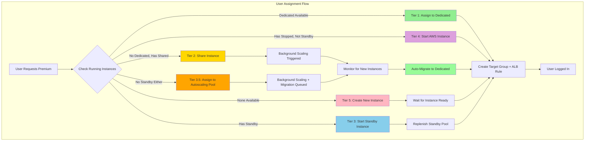
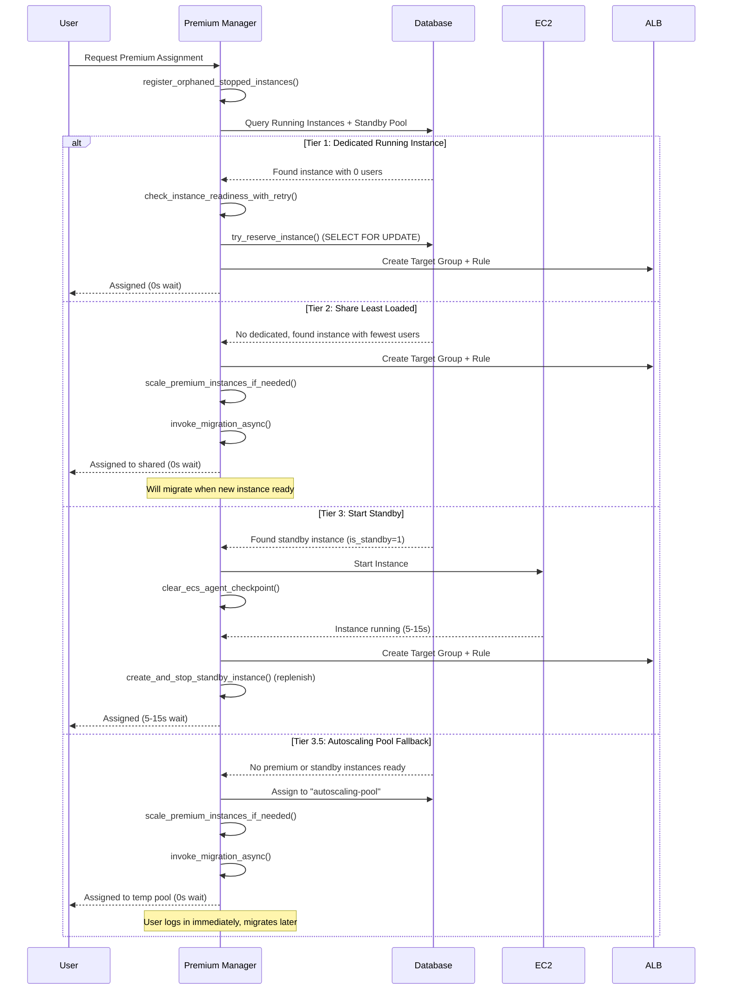
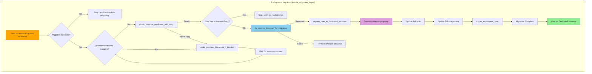

# Premium Manager Provisioning: Multi-Tier Assignment Strategy

## Executive Summary
- **Premium Manager** handles all instance provisioning and user assignment
- **5-tier prioritization** (with a 3.5 sub-tier fallback) optimizes user experience and cost
- **Standby pool** ensures fast cold starts via stopped instances
- **Automatic migration** moves users from shared to dedicated instances, inline when possible and async otherwise
- **Workflow safety** prevents migration of users with active workflows

## Key Architectural Principles

1. **Priority-Based Assignment**
   - Tier 1: Dedicated running instances (0s wait)
   - Tier 2: Shared instances for immediate login (0s wait)
   - Tier 3: Standby instances (5-15s startup)
   - Tier 3.5: Autoscaling pool as temporary fallback (0s wait, only if no standby)
   - Tier 4: AWS stopped instances fallback (60-90s startup)
   - Tier 5: Scale new instances (4-8 minutes)

2. **User Experience First**
   - Users get dedicated instance from standby pool when available (5-15s)
   - Falls back to autoscaling pool only when no standby instances exist
   - Background migration to dedicated premium instance from shared/pool
   - No user-visible delays or retry loops

3. **Standby Pool Management**
   - Maintains pool of stopped instances for fast startup
   - Tracked via `is_standby = 1` flag in `premium_user_assignments` table
   - Distributed locking (MySQL `GET_LOCK`) prevents duplicate creations
   - Automatic replenishment when standby consumed
   - Orphaned stopped instances auto-registered as standby

4. **Intelligent Scaling**
   - Conservative algorithm: keeps `active_users + 1` instances
   - Shared assignments trigger background scaling
   - Checks distributed locks to avoid duplicate scaling
   - Auto-migration when new instances become ready
   - Workflow-safe: skips users with active workflows

## Architecture Overview



### Assignment Priority Matrix

| Tier | Source | Wait Time | User Experience | Cost | Use Case |
|------|--------|-----------|-----------------|------|----------|
| 1 | Dedicated Running | 0s | Best (exclusive) | Highest | Active user pool |
| 2 | Shared Instance | 0s | Good (shared) | Medium | Burst capacity |
| 3 | Standby (Stopped) | 5-15s | Good (warming) | Low | Premium provisioning / re-login |
| 3.5 | Autoscaling Pool | 0s | Temporary (migrates) | Low | Last-resort fallback (no standby) |
| 4 | AWS Stopped | 60s-6min | Acceptable | Low | Fallback recovery |
| 5 | New Instance | 4-8 min | Poor (scaling) | Highest | Last resort |

### Responsibility Matrix

This document covers one Lambda -- the Premium Manager -- acting across several subsystems. The table below maps each concern to the function family that owns it, to make it clear where to look for a given behavior.

| Concern                              | Owning subsystem                              | Key functions                                                                           |
|--------------------------------------|-----------------------------------------------|-----------------------------------------------------------------------------------------|
| Real-time user assignment            | Assignment handler                            | `assign_premium_user()`, `try_reserve_instance()`, `store_user_assignment()`            |
| Standby pool lifecycle               | Standby pool management                       | `create_and_stop_standby_instance()`, `start_standby_instance()`, `register_orphaned_stopped_instances()` |
| Capacity scaling (up)                | Scaling system                                | `scale_premium_instances_if_needed()`, `_create_running_instances_locked()`             |
| Shared-to-dedicated migration        | Background migration                          | `process_shared_instance_optimization()`, `migrate_user_to_dedicated_instance()`, `invoke_migration_async()` |
| Concurrency / race prevention        | Locking                                       | `distributed_lock()` (MySQL `GET_LOCK`), `try_reserve_instance_transaction()` (`SELECT FOR UPDATE`), `is_creation_lock_held()` |
| Scale-down + ghost / orphan cleanup  | Scheduled monitoring (see `PREMIUM_MANAGER_ARCHITECTURE.md`) | `handle_scheduled_monitoring()`, `scale_down_if_possible()`                             |
| Stale assignment + ALB rule hygiene  | Premium Cleanup Lambda (separate)             | See `PREMIUM_MANAGER_ARCHITECTURE.md`                                                   |

## Provisioning Flow Diagrams

### Priority 1-3: Fast Path (< 15 seconds)



### Priority 4-5: Slow Path (> 60 seconds)

```mermaid
sequenceDiagram
    participant User
    participant PM as Premium Manager
    participant DB as Database
    participant EC2

    User->>PM: Request Premium Assignment
    PM->>DB: Query All Instances

    alt Tier 4: AWS Stopped Instance
        DB-->>PM: Found stopped instance (not standby)
        PM->>EC2: Start Instance
        EC2-->>PM: Instance running (typically 60-90s; waiter caps at 6 min)
        PM->>PM: Create Target Group + Rule
        PM-->>User: Assigned (60s-6min wait)
    else Tier 5: Scale New Instance
        DB-->>PM: No instances available
        PM->>PM: Check launching instances + creation locks

        alt Already scaling
            PM-->>User: 202 - Scaling in progress, retry in 2-3 min
        else No pending scaling
            PM->>PM: scale_premium_instances_if_needed()
            PM-->>User: 202 - Scaling initiated, retry in 2-3 min
        end
    end
```

### Background Migration Flow



---

## Implementation Details

### 1. User Assignment Handler

### assign_premium_user()

**File:** `infrastructure/terraform/premium_manager_package/premium_manager.py`
**Purpose:** Assign a premium instance using 5-tier priority fallback
**Input:** user_id (int), event (API Gateway dict), optional user_uid (str)
**Output:** Dict with `statusCode` and a body containing `instance_id`, `target_group_arn`, `rule_arn`, `is_shared`, `assignment_source`; or `statusCode: 202` when scaling is in progress
**Calls:** restore_pending_release() -> get_existing_user_assignment() -> register_orphaned_stopped_instances() -> check_instance_readiness_with_retry() -> try_reserve_instance() -> create_or_get_target_group() -> store_user_assignment()

**Pre-assignment Steps:**
1. Restore any `pending_release` assignment (beacon fired but the user is back) -- returns with `assignment_source: "restored_from_pending_release"`
2. Check for existing assignment:
   - If the EC2 is `stopped`/`stopping`, restart it, clear the ECS checkpoint, wait up to 120s for ECS readiness, and return `assignment_source: "restarted_instance"`
   - If the EC2 is `terminated`/`shutting-down`/gone, remove the stale DB entry and fall through to fresh assignment
   - If the assignment is on `autoscaling-pool` or a shared instance, attempt an **inline migration** to a ready dedicated instance first (`assignment_source: "inline_migration"`); fall back to `invoke_migration_async()` if no instance is ready
   - Otherwise return the existing assignment (`assignment_source: "existing"`)
3. Register orphaned stopped instances as standby
4. Get comprehensive instance state (running, launching, stopped, standby)

**Priority Evaluation:**

- **Tier 1 (Dedicated):** Loop running instances, check ECS readiness,
  reserve first instance with 0 users via `SELECT FOR UPDATE`
- **Tier 2 (Shared):** Use least-loaded running instance, trigger
  scaling if `launching == 0 and running < active_users + 1`
- **Tier 3 (Standby):** Start a stopped standby instance
  (`is_standby=1`), replenish pool immediately. This runs BEFORE
  autoscaling pool to ensure returning users get a dedicated instance
  instead of being stuck in the shared pool.
- **Tier 3.5 (Autoscaling Pool):** Assign to `"autoscaling-pool"` as
  temporary fallback only when no standby instances exist, always
  trigger scaling
- **Tier 4 (AWS Stopped):** Start non-standby stopped instance,
  wait up to 6 minutes for running state (typical cold start is 60-90s)
- **Tier 5 (Scale New):** If launching instances exist, return 202;
  otherwise call `scale_premium_instances_if_needed()` and return 202

**Post-assignment Steps:**
1. Create target group (or use autoscaling target group for pool)
2. Generate routing ID via HMAC-SHA256
3. Clean up duplicate ALB rules for this routing ID
4. Create ALB listener rule with routing headers
5. Clean up standby/reservation placeholders from DB
6. If `needs_scaling`: call `scale_premium_instances_if_needed()` + `invoke_migration_async()`
7. Store assignment via `store_user_assignment()`
8. Initialize activity tracking

**Error Recovery:**
On any failure after partial resource creation, the handler cleans up:
- ALB rule (if created)
- Target group (if created)
- Instance reservation (if held)
- DB assignment (if stored)

### 2. Standby Pool Management

**Storage:** Standby instances are tracked in the `premium_user_assignments` table with:
- `is_standby = 1`
- `user_id = NULL` (no real user)
- `target_group_arn = 'standby'`
- `alb_rule_arn = 'standby'`

### create_and_stop_standby_instance()

**File:** `infrastructure/terraform/premium_manager_package/premium_manager.py`
**Purpose:** Create a new EC2 instance and stop it for standby pool
**Input:** None (reads env vars for launch template, subnets, pool size)
**Output:** instance_id (str) or None if pool full / lock not acquired
**Calls:** distributed_lock() -> get_standby_count() -> ec2.run_instances() -> store_user_assignment()

**Key behaviors:**
- Acquires `CREATE_STANDBY_LOCK` via MySQL `GET_LOCK`
- Double-checks pool size after lock acquisition
- Tries each subnet (multi-AZ) until one succeeds
- On `InsufficientInstanceCapacity`, tries next AZ
- Waits for running, then stops, then waits for stopped
- Registers with `is_standby=1` in DB

### start_standby_instance()

**File:** `infrastructure/terraform/premium_manager_package/premium_manager.py`
**Purpose:** Start a stopped standby instance and prepare for user assignment
**Input:** instance_id (str)
**Output:** True on success, False on failure
**Calls:** ec2.start_instances() -> clear_ecs_agent_checkpoint()

**Key behaviors:**
- Waits for running state (delay=5s, max 24 attempts)
- Clears stale ECS agent checkpoint so it re-registers
- Updates `instance_state` to `'running'` for non-standby assignments

```sql
-- Key constraint: only update non-standby assignments
WHERE instance_id = %s AND is_standby = 0
```

### 3. Orphaned Instance Registration

### register_orphaned_stopped_instances()

**File:** `infrastructure/terraform/premium_manager_package/premium_manager.py`
**Purpose:** Find stopped EC2 instances not tracked in DB and register as standby
**Input:** None
**Output:** Count of newly registered instances (int)
**Calls:** get_all_premium_instances_with_states() -> get_available_standby_instances() -> get_assigned_users_for_instance() -> store_user_assignment()

Called at the start of every `assign_premium_user()` invocation to
ensure maximum standby availability. Only registers instances that
are both untracked in the standby pool and unassigned to any user.

### 4. Background Migration System

### process_shared_instance_optimization()

**File:** `infrastructure/terraform/premium_manager_package/premium_manager.py`
**Purpose:** Find users on shared/autoscaling instances and migrate to dedicated
**Input:** None
**Output:** Dict with migration stats (migrated count, errors)
**Calls:** get_assigned_users_for_instance() -> check_instance_readiness_with_retry() -> migrate_user_to_dedicated_instance() -> scale_premium_instances_if_needed()

**Trigger:** Called by `handle_scheduled_monitoring()` every 15 minutes,
and via `invoke_migration_async()` after shared/autoscaling assignments.

**Flow:**

1. **Identify users needing migration:** Users on autoscaling pool
   (all migrate) and users on shared instances (those with
   `is_shared=1` flag, or all-but-first if no flag set)
2. **Find available instances:** Running instances with 0 real users
   that pass `check_instance_readiness_with_retry()`
3. **Ensure capacity:** If available < needed, call
   `scale_premium_instances_if_needed()`
4. **Perform migration:** Try each available instance until one
   succeeds per user; workflow-safe via `can_migrate_user()`

```sql
-- Key constraint: only migrate idle users
WHERE active_workflow_count = 0
```

### migrate_user_to_dedicated_instance()

**File:** `infrastructure/terraform/premium_manager_package/premium_manager.py`
**Purpose:** Migrate one user from shared/autoscaling to a dedicated instance
**Input:** user_id (int), new_instance_id (str)
**Output:** True on success, False if blocked or failed
**Calls:** can_migrate_user() -> try_reserve_instance_for_migration() -> create_or_get_target_group() -> trigger_experiment_sync()

**Key behaviors:**
- Checks `can_migrate_user()` from `premium_user_utils` first
- Reserves target with `SELECT FOR UPDATE`
- Double-checks `active_workflow_count` from DB
- Autoscaling-pool migration: creates new target group, modifies
  or creates ALB rule, updates DB
- Normal migration: swaps instance registration in existing
  target group, updates DB with `is_shared=0`
- Triggers experiment metadata sync on new instance

### 5. Scaling System

### scale_premium_instances_if_needed()

**File:** `infrastructure/terraform/premium_manager_package/premium_manager.py`
**Purpose:** Scale up premium instances based on active assignment demand
**Input:** None
**Output:** True if scaling initiated, False if blocked or unnecessary
**Calls:** get_dynamic_max_capacity() -> count_active_premium_users() -> is_creation_lock_held() -> _create_running_instances_locked() -> invoke_migration_async() -> update_premium_service_desired_count()

Scales based on **active assignments** (logged-in users), not total
subscribers.

**Key behaviors:**
- Blocked if launching instances exist or `CREATE_RUNNING_LOCK` held
- No-op if `running_count >= active_users` (sufficient capacity). Note this is distinct from `scale_down_if_possible()`, which keeps `max(1, active_users + 1)` -- scale-up has no `+ 1` safety margin, so the scale-down headroom only exists after a full monitor cycle runs
- Prefers starting stopped instances (fastest) over creating new
- Clears ECS agent checkpoints after starting stopped instances
- Falls back to `_create_running_instances_locked()` under
  distributed lock
- Always calls `invoke_migration_async()` and
  `update_premium_service_desired_count()` after scaling

---

## Edge Case Handling

### 1. Race Condition: Multiple Users Requesting Simultaneously

**Problem:** Two users request premium assignment at the same time,
both see same available instance.

**Solution:** Database-level locking with `SELECT FOR UPDATE`:

### try_reserve_instance_transaction()

**File:** `infrastructure/terraform/premium_manager_package/premium_manager.py`
**Purpose:** Atomically reserve an instance using row-level locking
**Input:** connection, instance_id (str), user_id (int)
**Output:** True if reserved, False if already claimed
**Calls:** Uses `@with_transaction` decorator for auto-commit/rollback

Locks the instance row with `SELECT ... FOR UPDATE`, checks for
existing assignment, and inserts a reservation with marker values
(`PremiumAssignment.RESERVING`) if unclaimed.

### 2. Standby Pool Exhaustion

**Problem:** Multiple users arrive, consume all standby instances.

**Solution:** Automatic replenishment + fallback chain:
- On standby consumption: immediately call
  `create_and_stop_standby_instance()` to replenish
- If standby pool empty: fall back to Tier 3.5
  (autoscaling pool for immediate login)
- Then Tier 4 (start non-standby stopped instances)
- If nothing stopped: fall back to Tier 5
  (`scale_premium_instances_if_needed()`, return 202)

### 3. Instance Fails to Start

**Problem:** Standby instance fails health checks after starting.

**Solution:** Timeout with cleanup and fallback:
- `check_instance_readiness_with_retry()` uses short timeout
  (30s during assignment, 10s retry interval)
- On failure: skip instance, try next priority tier
- `release_instance_reservation()` cleans up the DB
- `cleanup_failed_standby_instances()` handles DB orphans
  (runs every 15 min via scheduled monitoring)

### 4. Migration Loop Prevention

**Problem:** User keeps getting migrated back and forth.

**Solution:** Strict migration direction rules:
- `autoscaling-pool` -> dedicated (always migrate all)
- shared (>1 user or `is_shared=1`) -> dedicated (0 users)
- Single user with incorrect `is_shared` flag -> fix flag
- Never migrate from dedicated to anything

### 5. Scaling Stampede Prevention

**Problem:** Multiple Lambda invocations try to scale simultaneously.

**Solution:** Distributed locks + launch state checks:
- `distributed_lock(CREATE_STANDBY_LOCK)` prevents concurrent
  standby creation
- `is_creation_lock_held(CREATE_RUNNING_LOCK)` checks without
  blocking to detect running creation in progress
- `launching_count > 0` check blocks redundant scaling

### 6. Workflow Safety During Migration

**Problem:** Migrating a user while they have active workflows
could cause data loss.

**Solution:** Two-layer check via `can_migrate_user()` from
`premium_user_utils` plus a DB-level double-check:

```sql
-- Key constraint: only migrate idle users
WHERE active_workflow_count = 0
```

If the user has active workflows, migration is skipped and
retried on the next attempt.

---

## Database Schema

### `premium_user_assignments` Table

The single table that tracks all premium instance assignments,
including standby pool entries.

**Sources:** Created in `studio/alembic/versions/e701e7250019_create_premium_management_system.py`; the conditional `idx_unique_user_assignment` index and nullable `user_id` were added by `h901h9270022_add_standby_sentinel_user.py`; `heartbeat_failures` was added by `j901j9290024_add_alert_fix_tables_and_columns.py`.

| Column | Type | Description |
|--------|------|-------------|
| `id` | BIGINT UNSIGNED | Primary key (auto-increment) |
| `user_id` | BIGINT UNSIGNED | FK to users.id (NULL for standby entries) |
| `instance_id` | VARCHAR(20) | EC2 instance ID or "autoscaling-pool" |
| `target_group_arn` | VARCHAR(512) | ALB target group ARN or "standby"/"reserving" |
| `alb_rule_arn` | VARCHAR(512) | ALB rule ARN or "standby"/"reserving" |
| `assigned_at` | TIMESTAMP | Assignment creation time |
| `status` | ENUM | `'active'`, `'migrating'`, `'terminating'`. The soft-release "pending_release" state reuses `'terminating'` rather than being a distinct ENUM value -- the code-level `PremiumAssignment.PENDING_RELEASE` constant resolves to the string `"terminating"` (see `infrastructure/aws_constants.py`) |
| `last_activity` | TIMESTAMP | Last user activity (auto-updates) |
| `instance_state` | ENUM | 'launching', 'running', 'stopping', 'stopped', 'terminating' |
| `is_shared` | BOOLEAN | Whether instance is shared with other users |
| `assignment_attempts` | INTEGER | Number of assignment retry attempts |
| `last_state_check` | TIMESTAMP | Last instance state verification |
| `is_standby` | BOOLEAN | Standby pool entry (user_id=NULL) |
| `standby_created_at` | TIMESTAMP | When standby entry was created |
| `active_workflow_count` | INTEGER | Active workflows (migration safety) |
| `last_workflow_start` | TIMESTAMP | Last workflow start time |
| `last_workflow_end` | TIMESTAMP | Last workflow completion time |
| `heartbeat_failures` | INTEGER | Consecutive heartbeat failures for grace period tracking (default: 0) |

**Key Indexes:**
- `idx_unique_user_assignment` (conditional UNIQUE on user_id WHERE user_id IS NOT NULL)
- `idx_instance_id`, `idx_status`, `idx_last_activity`
- `idx_instance_state`, `idx_is_shared`, `idx_is_standby`
- `idx_workflow_recovery` (active_workflow_count, last_workflow_start)

**Marker Values:**
- `instance_id = "autoscaling-pool"` -- user on shared autoscaling pool
- `target_group_arn = "standby"` / `alb_rule_arn = "standby"` -- standby pool entry
- `target_group_arn = "reserving"` / `alb_rule_arn = "reserving"` -- in-progress reservation

---

## Monitoring and Metrics

### CloudWatch Metrics Published

**By Premium Manager** (published every 15 minutes by `publish_premium_metrics()`, invoked inside `handle_scheduled_monitoring()`):

| Metric Name | Description | Unit |
|-------------|-------------|------|
| `ActivePremiumUsers` | Users with active assignments | Count |
| `IdlePremiumUsers` | Premium users without assignments | Count |
| `RunningInstances` | EC2 instances in "running" state | Count |
| `IdleInstances` | Running instances with 0 users | Count |
| `ScalingInProgress` | Lock to prevent concurrent operations | None (0 or 1) |

**Namespace:** `OptiNiSt/PremiumManager/{env_prefix}` where `env_prefix` is the Terraform `environment` variable (e.g. `staging`, `prod`).

### Key Log Events

**Premium Manager Logs** (`/aws/lambda/{env_prefix}-premium-manager`):

```
=== PREMIUM USER ASSIGNMENT START ===
Target user: 42
 Assignment context:
- Running instances: 2
- Launching instances: 0
- Active users: 3
- Standby available: 1
- Total instances: 3

PRIORITY 1: Evaluating 2 running instances for immediate assignment
[1/2] Evaluating instance i-abc123
Checking readiness for instance i-abc123...
Readiness result: True
Found 0 assigned users
Reserved dedicated instance: i-abc123
PRIORITY 1 SUCCESS: Using dedicated running instance i-abc123

=== ASSIGNMENT SUCCESS ===
- Instance ID: i-abc123
- Assignment source: dedicated
- Is shared: False
```

**Standby Creation Logs:**

```
Acquired distributed lock '${lock_name}'
Standby pool has capacity (0/1), proceeding with creation
Attempting to launch standby instance in subnet ${subnet_id} (attempt 1/2)
Successfully created standby instance ${instance_id}...
Waiting for instance to start...
Instance running, stopping for standby...
Instance stopped successfully
Registered instance ${instance_id} as standby
```

**Migration Logs:**

```
Checking for shared instance optimization opportunities
Found 1 users on autoscaling pool needing migration
Instance i-ghi789 is available for migration
Migrating ALL 1 users from autoscaling pool
Migrated user 42 from autoscaling-pool to i-ghi789
trigger_experiment_sync called for user 42
Shared instance optimization complete: 1 users migrated
```

---

## Configuration

### Environment Variables

**Premium Manager Lambda:**

| Variable | Purpose | Default |
|----------|---------|---------|
| `ENV_PREFIX` | Terraform `environment` value; used for resource naming and the CloudWatch metric namespace | Required |
| `RDS_HOST` | Database endpoint (via RDS Proxy, format: host:port) | Required |
| `RDS_USER` | Database username | Required |
| `RDS_PASSWORD` | Database password | Required |
| `RDS_DATABASE` | Database name | Required |
| `CLUSTER_NAME` | ECS cluster name | Required |
| `PREMIUM_SERVICE_NAME` | ECS service name for premium tier | Required |
| `VPC_ID` | VPC ID for target groups | Required |
| `SUBNET_IDS` | Comma-separated subnet IDs (for multi-AZ) | Required |
| `SECURITY_GROUP_ID` | ECS security group | Required |
| `ALB_ARN` | Application Load Balancer ARN | Required |
| `ALB_LISTENER_ARN` | ALB HTTPS listener for routing rules | Required |
| `ALB_DNS_NAME` | ALB DNS name (for experiment sync) | Required |
| `AUTOSCALING_TARGET_GROUP_ARN` | Shared pool target group | Required |
| `PREMIUM_INSTANCE_IDS` | Comma-separated base EC2 instance IDs | Required |
| `PREMIUM_LAUNCH_TEMPLATE_ID` | EC2 launch template for dynamic premium instances | Required |
| `PREMIUM_INSTANCE_TYPE` | EC2 instance type for dynamically-created premium instances | Required |
| `PREMIUM_STANDBY_POOL_SIZE` | Desired standby pool size | `1` |
| `PREMIUM_EXTRA_CAPACITY` | Extra capacity buffer for scaling decisions | `1` |
| `PREMIUM_STOPPED_MAX_AGE_HOURS` | Terminate stopped standby instances older than this | `4` |
| `ROUTING_SECRET_KEY` | HMAC secret for generating routing IDs | Required |
| `INTERNAL_API_SECRET` | Secret for internal API authentication | Required |

`PREMIUM_IDLE_TIMEOUT_HOURS` is set in the Manager's Terraform block but is only read by the Cleanup Lambda; it does not influence Manager behavior.

### Triggers

| Lambda          | Trigger              | Frequency        | EventBridge Rule                       |
|-----------------|----------------------|------------------|----------------------------------------|
| Premium Manager | User assign/release  | On-demand (API)  | N/A                                    |
| Premium Manager | Scheduled monitoring | Every 15 minutes | `{env_prefix}-premium-manager-schedule` |
| Premium Manager | Migration check      | After assignment | N/A (async self-invocation)            |

---

## Key Functions Reference

### Assignment & Provisioning

| Function | Purpose |
|----------|---------|
| `assign_premium_user()` | Main 5-tier assignment handler |
| `try_reserve_instance()` | Atomic instance reservation (SELECT FOR UPDATE) |
| `try_reserve_instance_for_migration()` | Reserve instance for migration (WITH TRANSACTION) |
| `check_instance_readiness()` | Check if instance has running ECS task |
| `check_instance_readiness_with_retry()` | Readiness check with configurable retry |
| `get_assigned_users_for_instance()` | Query users assigned to instance |
| `get_existing_user_assignment()` | Get user's current assignment |
| `store_user_assignment()` | Store assignment in DB |
| `release_instance_reservation()` | Clean up failed reservation |

### Standby Pool Management

| Function | Purpose |
|----------|---------|
| `create_and_stop_standby_instance()` | Create instance, stop for pool (distributed lock) |
| `start_standby_instance()` | Start standby + clear ECS checkpoint |
| `get_available_standby_instances()` | Query standby pool (is_standby=1) |
| `register_orphaned_stopped_instances()` | Auto-register stopped instances as standby |
| `get_standby_count()` | Count current standby pool size |
| `get_standby_pool_count()` | Count standby instances by state |

### Migration & Scaling

| Function | Purpose |
|----------|---------|
| `process_shared_instance_optimization()` | Find and migrate shared/autoscaling users |
| `migrate_user_to_dedicated_instance()` | Migrate single user (workflow-safe) |
| `invoke_migration_async()` | Trigger async migration Lambda invocation |
| `_handle_migrate_shared_users()` | Migration loop under distributed lock |
| `scale_premium_instances_if_needed()` | Start stopped or create new instances |
| `_create_running_instances_locked()` | Create running instances under lock |
| `create_running_instance()` | Create and leave running for assignment |
| `update_premium_service_desired_count()` | Sync ECS desired count |
| `trigger_experiment_sync()` | Sync experiment metadata after migration |

### Locking & Concurrency

| Function | Purpose |
|----------|---------|
| `distributed_lock()` | MySQL GET_LOCK context manager |
| `try_reserve_instance_transaction()` | DB transaction lock for reservation |
| `is_creation_lock_held()` | Check if another Lambda holds a lock |
| `is_premium_scaling_in_progress()` | Check CloudWatch metric lock |
| `set_premium_scaling_lock()` | Set/clear CloudWatch scaling lock |

### Monitoring & Cleanup

| Function | Purpose |
|----------|---------|
| `publish_premium_metrics()` | Publish CloudWatch metrics |
| `cleanup_failed_standby_instances()` | Remove DB entries for terminated instances |
| `cleanup_ghost_ecs_registrations()` | Deregister orphaned ECS container instances |
| `cleanup_orphaned_ec2_instances()` | Stop premium EC2 not in ECS cluster |
| `handle_scheduled_monitoring()` | 15-minute monitoring loop (12 steps: scale-down, ECS sync, standby-pool hygiene, pending-release finalization, ghost/orphan cleanup, shared-instance optimization -- see `PREMIUM_MANAGER_ARCHITECTURE.md`) |

---

## AWS Resources

All resource names are prefixed with the Terraform `environment` variable (shown here as `{env_prefix}`, e.g. `staging-premium-manager`).

- **Premium Manager Lambda:** `{env_prefix}-premium-manager` (timeout: 600s)
- **EventBridge Rules:**
  - `{env_prefix}-premium-manager-schedule` (rate(15 minutes) monitoring)
- **CloudWatch Log Group:** `/aws/lambda/{env_prefix}-premium-manager` (30 day retention)
- **Launch Template:** Defined by `PREMIUM_LAUNCH_TEMPLATE_ID`
- **RDS Table:** `premium_user_assignments` (assignments + standby pool)
