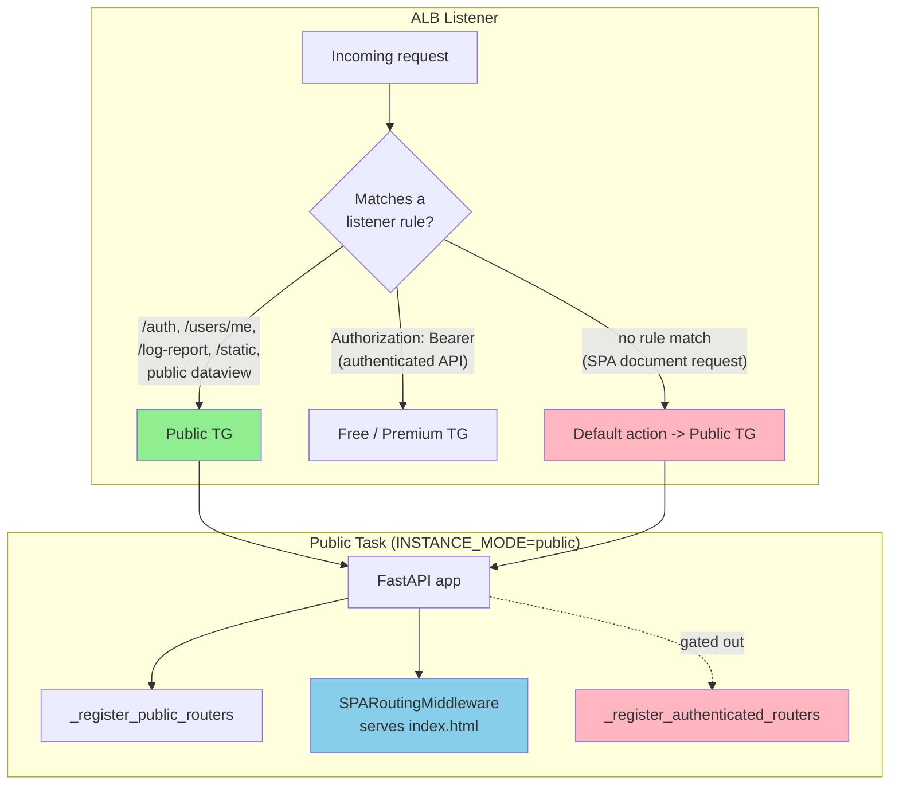

# Public Instance: SPA Shell and Bootstrap-Survival Tier

## Executive Summary

- **Public tier** is a dedicated always-on ECS service that runs the same image as the free/premium tiers with `INSTANCE_MODE=public`, serving the static SPA shell and a minimal API subset.
- **Router gating** drops the heavy workflow/optinist routers in public mode, keeping only the routers needed to load the app and authenticate.
- **Outage survival** means the SPA can boot and a user can log in even when the free tier is scaled to zero or unhealthy, instead of seeing a raw ALB 503.
- **Published-dataview reads** and the startup cache warm are served from public, decoupling unauthenticated visualization traffic from the authenticated tiers.
- **Shared task-definition values** are duplicated across `compute.tf`, `public_service.tf`, and `background_service.tf`; a shared value must be changed in all three.

---

## Key Architectural Principles

1. **One Image, Mode-Selected Behavior**
   - Every tier runs the identical container image.
   - The `INSTANCE_MODE` environment variable selects behavior at startup; only public tasks set `INSTANCE_MODE=public`.
   - Free, premium, and background tasks leave it unset and resolve to `default` (all routers registered).

2. **Public Is a Reduced API Surface, Not a Different App**
   - Public mode mounts only the routers required to bootstrap and authenticate the SPA plus the public-dataview reads.
   - Workflow, optinist, admin, and subscription routers are gated out, so unauthenticated traffic can never reach them on this tier.

3. **Bootstrap Survives a Free-Tier Outage**
   - `auth`, `users_me`, and `log-report` are served from public so login, the post-login bootstrap calls, and client-error reporting keep working when free is down.
   - The SPA shell loads from public regardless of the requested route, so the user gets the app frame and a graceful in-app error rather than a blank ALB 503.

4. **Static Delivery Is Coupled to Compute (Known Limitation)**
   - The SPA shell and static assets are baked into the image and served by the FastAPI process via `SPARoutingMiddleware`.
   - This is a pragmatic choice, not the long-term target; see Edge Case 5 and the future-work note.

---

## Architecture Overview



### Responsibility Matrix

| Responsibility | Public Tier | Free / Premium Tier | Background Tier |
|---|---|---|---|
| Serve SPA shell (`index.html`) | Yes - via default action | Yes - if request lands there | No |
| `auth` / `users_me` bootstrap | Yes - Primary (outage-safe) | Yes | No |
| `log-report` write | Yes - Exclusive (routed here) | No | No |
| Public dataview reads | Yes - Exclusive | No | No |
| Authenticated workflow/optinist API | No - Gated out | Yes - Exclusive | No |
| `/logs` viewer read | No | Yes - Owning tier only | No |
| Startup published-experiment cache warm | Yes - Exclusive (leader-elected) | No | No |
| Background scheduler jobs | No - Disabled | No | Yes - Exclusive |

---

## Implementation Details

### Instance mode selection

**File:** `studio/app/common/core/instance_mode.py`

Defines the `INSTANCE_MODE` env var name and its values. `INSTANCE_MODE_PUBLIC` (`"public"`) is set only on public tasks; everything else resolves to `INSTANCE_MODE_DEFAULT` (`"default"`).

### _register_public_routers()

**File:** `studio/__main_unit__.py`
**Purpose:** Mount the routers present on every tier so the SPA can bootstrap during a free-tier outage
**Input:** the `FastAPI` app
**Output:** `dataview.public_router`, `internal.router`, `outputs.router`, `auth.router`, `users_me.router`, `users_me.beacon_router`, `log_report.router` registered

### _register_authenticated_routers()

**File:** `studio/__main_unit__.py`
**Purpose:** Mount the workflow/optinist routers that are gated out of the public tier
**Input:** the `FastAPI` app
**Output:** algolist, experiment, files, logs, params, run, workspace, dataview, subscriptions, admin, hdf5/mat/nwb/roi, etc. registered

### _register_routers()

**File:** `studio/__main_unit__.py`
**Purpose:** Orchestrate registration by mode
**Input:** the `FastAPI` app, `instance_mode`
**Output:** always calls `_register_public_routers()`; returns early when mode is public, otherwise also calls `_register_authenticated_routers()`
**Calls:** `_register_public_routers()` -> `_register_authenticated_routers()`

### SPARoutingMiddleware

**File:** `studio/app/common/core/middleware/spa_routing_middleware.py`
**Purpose:** Serve `index.html` for browser document navigation (`Accept: text/html`) so React Router can handle client-side routes
**Input:** ASGI scope; intercepts when the request accepts `text/html` and is not a static/docs/health path
**Output:** `index.html` response with no-cache headers; otherwise passes through to API routes

### _should_run_startup_sync()

**File:** `studio/__main_unit__.py`
**Purpose:** Restrict the published-experiment cache warm to the public tier
**Input:** `instance_mode`, `is_standalone`
**Output:** `True` only when mode is public and not standalone; the warm itself is leader-elected across the ASG via `startup_sync_leader_lock()`

---

## Edge Case Handling

### 1. Free Tier Scaled to Zero During Login

**Problem:** A user opens the app while the free tier is down; login and the post-login bootstrap calls would 503.

**Solution:** Auth and bootstrap routes are served from public:
- `/auth/*` and `/users/me/*` route to the public TG (ALB priorities 305, 306).
- The user logs in and the SPA bootstraps; premium users then provision via the normal assignment cascade.

### 2. SPA Document Request Lands on Public

**Problem:** A browser reload on `/workspaces/15` records a `GET /workspaces/15` on a public task, which looks like leaked authenticated traffic.

**Solution:** This is expected and serves only the static shell:
- Document navigation requests carry `Accept: text/html` and no `Authorization` header, so they miss every listener rule and fall through to the default action (public TG).
- `workspace.router` is not mounted on public, so `SPARoutingMiddleware` returns `index.html` (HTTP 200) with no user data.
- The booted SPA then issues authenticated XHR calls that carry the Bearer token and route to the owning tier.

### 3. Log Reporting vs Log Viewing

**Problem:** During a free outage, client-side errors would be lost and the log viewer would 503.

**Solution:** Split by direction:
- `/log-report/*` (write) routes to public so client errors still reach CloudWatch (ALB priority 307).
- `/logs` (read) stays on the owning tier so a user only ever sees their own tier's logs.

### 4. Public vs Own-Data Dataview Reads

**Problem:** `/outputs/*` is used both for public visualization reads and authenticated own-data reads.

**Solution:** Header-based carve-out:
- The frontend sets `DATAVIEW_PUBLIC_REQUEST: true` on reads originating from public pages; those route to public (ALB priority 280).
- Own-data reads fall through to the authenticated free rule (ALB priority 315).

### 5. Static Assets Served by Compute

**Problem:** A full FastAPI process sits in the request path purely to return static files (`index.html`, `/static/*`, `manifest.json`).

**Solution (current):** Static assets route to public via dedicated ALB rules, and the SPA shell is served by `SPARoutingMiddleware`. This works but is not optimal; the canonical pattern (future work) is S3 + CloudFront for the shell and static assets with CloudFront mapping 403/404 to `/index.html`, leaving the ALB/ECS tiers for API traffic only.

---

## Monitoring and Metrics

| Signal | Source | Notes |
|---|---|---|
| Public access logs | `uvicorn.access` in `/ecs/<env>-public-optinist-cloud-taskdef` | Includes SPA shell document fetches, which resemble API hits |
| Target health | `aws_lb_target_group.public` health check on `/health` | ASG uses ELB health checks with a 900s grace period |
| Startup sync | application logs on the elected leader task | Non-leader tasks log "Startup sync deferred to leader task" |

Verify public targets are healthy after apply:

```bash
aws elbv2 describe-target-health \
  --target-group-arn <public_tg_arn> \
  --query 'TargetHealthDescriptions[*].[Target.Id,TargetHealth.State]' \
  --output table

# Expected: targets in "healthy" state
```

---

## Configuration

| Variable | Purpose | Value on Public |
|---|---|---|
| `INSTANCE_MODE` | Selects tier behavior at startup | `public` |
| `DISABLE_BACKGROUND_SCHEDULER` | Disables the in-process scheduler | `1` |
| `SQLALCHEMY_POOL_SIZE` | DB connection pool size (small host) | `2` |
| `SQLALCHEMY_MAX_OVERFLOW` | DB pool overflow | `2` |
| `UVICORN_WORKERS` | Worker processes | `1` |
| `DB_HOST` | Database endpoint (via RDS Proxy) | `aws_db_proxy.main.endpoint` |

Stripe variables are intentionally omitted because the subscriptions router is gated out on public. The duplicated environment block is also present in `compute.tf` and `background_service.tf`; a shared value must be changed in all three task definitions.

---

## Key Functions Reference

| Function | File | Purpose |
|---|---|---|
| `_register_public_routers()` | `__main_unit__.py` | Mount routers present on every tier |
| `_register_authenticated_routers()` | `__main_unit__.py` | Mount routers gated out of public |
| `_register_routers()` | `__main_unit__.py` | Orchestrate registration by mode |
| `_should_run_startup_sync()` | `__main_unit__.py` | Restrict cache warm to the public tier |
| `SPARoutingMiddleware` | `spa_routing_middleware.py` | Serve `index.html` for browser navigation |

---

## AWS Resources

| Resource | Terraform | Notes |
|---|---|---|
| Target group | `aws_lb_target_group.public` | `/health` check, 600s deregistration delay |
| Launch template | `aws_launch_template.public` | `var.public_instance_type`, 30 GB gp3 root |
| Auto Scaling Group | `aws_autoscaling_group.public` | ELB health check, 900s grace, `OldestInstance` policy |
| Task definition | `aws_ecs_task_definition.public` | EC2/bridge, EFS published-data mount |
| ECS service | `aws_ecs_service.public` | EC2 launch type, `tier == public` placement constraint |
| Log group | `aws_cloudwatch_log_group.public_optinist` | `/ecs/<env>-public-optinist-cloud-taskdef`, 30-day retention |

Public-bound ALB listener rules live in `infrastructure/terraform/public_alb_rules.tf`; see `ALB_ROUTING_ARCHITECTURE.md` for the full priority band.
