# Storage Tracking: Incremental Tracking and OOM Mitigation

## Executive Summary

- **Incremental storage tracking** replaces full S3 scans with cheap SQL add/subtract on every upload/delete
- **Threshold-based reconciliation** only triggers full S3 scans when drift exceeds 5% or 200 MB
- **Generator-based streaming** uses manual continuation tokens instead of boto3 paginator to maintain O(1) memory
- **Batch processing** in the background reconciliation job processes 10 users at a time to prevent OOM
- **MySQL advisory locks** prevent duplicate concurrent scans of the same user
- **Idempotent storage operations** track each increment/decrement via `StorageOperation` records to prevent double-counting

---

## Key Architectural Principles

1. **Incremental First, Scan as Fallback**
   - 99.9% of storage updates are atomic SQL increments/decrements (no S3 calls)
   - Full S3 scans only happen when drift thresholds are exceeded or during hourly reconciliation
   - Reduces per-workflow S3 API calls from ~10,000 to zero for most operations

2. **Idempotent Operations**
   - Every storage change is tracked via `StorageOperation` with an idempotency key
   - Retries and crash recovery cannot double-count bytes
   - Failed operations are recovered by background reconciliation

3. **Memory-Bounded Processing**
   - Generator pattern yields one S3 page at a time (O(1) memory vs O(n) with boto3 paginator)
   - Background job processes users in batches of 10 with rate limiting
   - Prevents OOM even for users with millions of S3 objects

4. **Distributed Lock Coordination**
   - MySQL `GET_LOCK()` with per-user lock names prevents concurrent scans
   - Non-blocking lock attempts (timeout=0) allow graceful skip when another process is scanning
   - Lock released in `finally` block within a single `session_scope()` context

---

## Architecture Overview

```mermaid
graph TB
    subgraph "Real-time Operations"
        A[Upload Files] --> B[increment_storage_idempotent]
        B --> C[increment_user_storage]
        C --> D[SQL: storage_usage_bytes += N<br/>delta_since_last_scan += N]

        E[Delete Files] --> F[decrement_storage_idempotent]
        F --> G[decrement_user_storage]
        G --> H[SQL: storage_usage_bytes -= N<br/>delta_since_last_scan += N]
    end

    subgraph "Workflow Completion"
        I[Workflow Complete] --> J{Delta > 5%<br/>OR > 200MB<br/>OR > 60 min?}
        J -->|No| K[Skip Scan<br/>Use DB Value]
        J -->|Yes| L[Full S3 Scan<br/>+ Reset Delta]
    end

    subgraph "Background Reconciliation (Hourly)"
        M[StorageReconciliationJob] --> N[Query Users with<br/>delta > 0 or never scanned]
        N --> O[Process in Batches of 10]
        O --> P[Acquire Advisory Lock]
        P --> Q{Lock?}
        Q -->|No| R[Skip]
        Q -->|Yes| S[Full S3 Scan + Reset Delta]
        S --> T[Release Lock]
    end

    style K fill:#90EE90
    style L fill:#87CEEB
    style R fill:#FFB6C1
    style S fill:#87CEEB
```



| Responsibility | Real-time Path | Background Job |
|----------------|----------------|----------------|
| Update storage bytes | Yes - SQL increment/decrement | Yes - Full S3 scan |
| Trigger S3 scan | Only when thresholds exceeded | Always (for dirty users) |
| Prevent duplicate scans | No (cheap SQL, no risk) | Yes - Advisory locks |
| Batch processing | No (single user per request) | Yes - 10 users per batch |

---

## Implementation Details

### Database Schema: Delta Tracking

**Migration:** `g901g9260021_add_storage_delta_tracking.py`

Two columns added to `user_storage_usage`:

```sql
-- Track cumulative bytes changed since last full S3 scan
ALTER TABLE user_storage_usage
  ADD COLUMN delta_since_last_scan BIGINT NOT NULL DEFAULT 0,
  ADD COLUMN last_full_scan DATETIME NULL;
```

- `delta_since_last_scan`: Absolute sum of all byte changes (uploads + deletes) since last reconciliation
- `last_full_scan`: Timestamp of last full S3 scan; `NULL` triggers first-time scan

### Incremental Tracking Functions

#### increment_user_storage()

**File:** `studio/app/common/core/cloud/storage_tracking.py`
**Purpose:** Atomic increment of storage usage during upload
**Input:** `user_id` (int), `bytes_added` (int)
**Output:** `True` on success; creates storage record if none exists
**Key constraint:** Uses SQL `storage_usage_bytes + bytes_added` for atomic update

#### decrement_user_storage()

**File:** `studio/app/common/core/cloud/storage_tracking.py`
**Purpose:** Atomic decrement of storage usage during delete
**Input:** `user_id` (int), `bytes_removed` (int)
**Output:** `True` on success
**Key constraint:** `func.greatest(0, storage_usage_bytes - bytes_removed)` prevents negative values

#### update_user_storage_after_workflow()

**File:** `studio/app/common/core/cloud/storage_tracking.py`
**Purpose:** Smart reconciliation after workflow completion -- only scans if thresholds exceeded
**Input:** `workspace_id` (str)
**Output:** None; triggers full scan and delta reset if needed
**Calls:** `_should_trigger_full_scan()` -> `_perform_full_scan_and_reset_delta()`

#### _should_trigger_full_scan()

**File:** `studio/app/common/core/cloud/storage_tracking.py`
**Purpose:** Determine if a full S3 scan is needed based on drift thresholds
**Input:** `user_id` (int)
**Output:** `True` if scan needed

Triggers scan when any condition is met:
1. `last_full_scan` is `NULL` (never scanned)
2. Delta > 5% of current storage OR delta > 200 MB
3. Last scan > 60 minutes ago (and delta > 0)

#### _perform_full_scan_and_reset_delta()

**File:** `studio/app/common/core/cloud/storage_tracking.py`
**Purpose:** Perform full S3 scan with MySQL advisory lock protection
**Input:** `user_id` (int)
**Output:** None; updates `storage_usage_bytes`, resets `delta_since_last_scan`, updates `last_full_scan`
**Calls:** `_calculate_live_storage_usage()`

Lock, scan, update, and release all happen within a single `session_scope()` context. If another process holds the lock, returns early.

#### _calculate_live_storage_usage()

**File:** `studio/app/common/core/cloud/storage_tracking.py`
**Purpose:** Calculate actual storage by scanning S3
**Input:** `user_id` (int)
**Output:** Total storage in bytes (int)

### Idempotent Storage Operations

**File:** `studio/app/common/core/cloud/storage_operations.py`

The S3 storage controller does not call `increment_user_storage()` / `decrement_user_storage()` directly. Instead, it uses idempotent wrappers that track each operation via the `StorageOperation` model.

#### increment_storage_idempotent()

**File:** `studio/app/common/core/cloud/storage_operations.py`
**Purpose:** Idempotent increment that prevents double-counting during retries
**Input:** `user_id` (int), `bytes_delta` (int), `idempotency_key` (str)
**Output:** `True` if increment applied or already completed; `False` if pending
**Calls:** `increment_user_storage()`

Flow: Check completed -> check pending -> create pending record -> delegate to base function -> mark completed/failed

`decrement_storage_idempotent()` follows the same pattern.

#### Recovery Functions

| Function | Purpose |
|----------|---------|
| `get_pending_storage_operations()` | Find operations stuck in pending |
| `cleanup_old_storage_operations()` | Delete completed ops older than 7 days |
| `process_failed_storage_operations()` | Retry failed ops with max retry limit (5) |
| `process_stale_pending_operations()` | Mark stuck pending ops as failed for reconciliation |

### S3 Storage Controller Integration

**File:** `studio/app/common/core/storage/s3_storage_controller.py`

The controller calls idempotent wrappers during upload and delete:
- Upload: accumulates `total_bytes_uploaded`, calls `increment_storage_idempotent()`
- Delete: accumulates `total_bytes_deleted`, calls `decrement_storage_idempotent()`

### Memory-Efficient S3 Streaming

**File:** `studio/app/common/core/cloud/s3_storage_monitor.py`

#### _stream_s3_objects()

**Purpose:** Generator that yields S3 pages one at a time using manual continuation tokens
**Input:** `s3_client`, `bucket` (str), `prefix` (str)
**Output:** Yields individual `list_objects_v2` response pages

Uses `MaxKeys=1000` and manual `ContinuationToken` handling instead of boto3 paginator. Each page is garbage collected after processing, maintaining O(1) memory.

#### get_user_s3_storage_size_streaming()

**Purpose:** Calculate total S3 storage size using streaming generator
**Input:** `user_id` (int)
**Output:** Total storage in bytes (int)
**Calls:** `_stream_s3_objects()` for each workspace prefix

| Aspect | boto3 Paginator | Manual Generator |
|--------|----------------|------------------|
| Memory per page | Accumulates | Constant |
| Total memory (10K pages) | ~100 MB | ~100 KB |
| Garbage collection | After iteration | After each page |

### Background Reconciliation Job

**File:** `studio/app/common/core/background/storage_reconciliation_job.py`

#### StorageReconciliationJob.run()

**Purpose:** Periodically reconcile incremental tracking with actual S3 storage
**Input:** None (queries `UserStorageUsage` records with `delta_since_last_scan > 0` or `last_full_scan IS NULL`)
**Output:** Updates storage values, resets deltas, logs drift warnings
**Calls:** `_perform_full_scan_and_reset_delta()` for each user

Processing flow:
1. Query users needing reconciliation (delta > 0 or never scanned)
2. Process in batches of 10 with LIMIT/OFFSET
3. For each user: acquire advisory lock, full S3 scan, update DB, release lock
4. Rate limit: 0.5s delay between users to avoid S3 throttling
5. Log drift warnings when difference exceeds 5% or 100 MB

### MySQL Advisory Locks

**File:** `studio/app/common/core/cloud/storage_tracking.py`

Lock name scheme: `storage_scan_{ADVISORY_LOCK_NAMESPACE}_{user_id}` (e.g., `storage_scan_12345_42`)

- Non-blocking: `GET_LOCK(lock_name, 0)` returns immediately
- Per-user: different users can scan concurrently
- Session-scoped: released when connection closes (safety net)
- Explicit release: `RELEASE_LOCK()` in `finally` block

---

## Edge Case Handling

### 1. Drift Detection and Correction

**Problem:** Incremental tracking drifts from actual S3 due to failed operations, manual S3 changes, or race conditions.

**Solution:** Background reconciliation compares DB vs S3:
- Logs warning when drift exceeds 5% or 100 MB
- Always updates DB to S3 value (source of truth)
- Runs hourly to bound maximum drift window

### 2. Concurrent Upload/Delete During Scan

**Problem:** User uploads/deletes while background job scans, causing delta updates during scan.

**Solution:** Advisory locks prevent scan interference:
- Scan acquires lock, performs scan, resets delta, releases lock
- Upload/delete increments delta concurrently (uses different code path)
- If delta > 0 after scan reset, next hourly job reconciles

### 3. Storage Never Goes Negative

**Problem:** Delete more bytes than exist in database (e.g., due to drift).

**Solution:** SQL constraint in `decrement_user_storage()`:
```sql
-- Ensures storage_usage_bytes >= 0
storage_usage_bytes = GREATEST(0, storage_usage_bytes - bytes_removed)
```

### 4. First-Time User (Never Scanned)

**Problem:** New user with `last_full_scan = NULL` has no baseline.

**Solution:** Reconciliation query includes `OR last_full_scan IS NULL`:
- First hourly reconciliation triggers full scan
- Sets `last_full_scan` timestamp
- Future reconciliations use threshold logic

### 5. Database Transaction Failures

**Problem:** Increment/decrement SQL fails mid-operation.

**Solution:** Graceful degradation:
- Returns `True` even on failure (does not block upload/delete)
- Logs warning for investigation
- Next reconciliation corrects the drift

---

## Monitoring and Metrics

### Application Logs

Storage tracking relies on application-level logging rather than CloudWatch metrics:

| Log Level | Event | Source |
|-----------|-------|--------|
| WARNING | Significant drift corrected (>5% or >100 MB) | `StorageReconciliationJob` |
| DEBUG | Normal reconciliation (no significant drift) | `StorageReconciliationJob` |
| INFO | Batch progress (batch N of M, users processed) | `StorageReconciliationJob` |
| INFO | Scan skipped (lock held by another process) | `_perform_full_scan_and_reset_delta()` |
| WARNING | Storage increment/decrement SQL failure | `increment_user_storage()` / `decrement_user_storage()` |
| ERROR | Full scan failure for a user | `_perform_full_scan_and_reset_delta()` |

### Background Job Monitoring

The background ECS service that runs `StorageReconciliationJob` is monitored via CloudWatch alarms defined in `BACKGROUND_JOB_ARCHITECTURE.md`:

| Alarm | Metric | Threshold |
|-------|--------|-----------|
| `subscr-background-task-stopped` | `RunningTaskCount` | < 1 |
| `subscr-background-cpu-high` | `CpuUtilized` | > 400 (80% of 512 CPU) |
| `subscr-background-memory-high` | `MemoryUtilized` | > 600 (80% of 768 MB) |

---

## Configuration

| Variable | Purpose | Default |
|----------|---------|---------|
| `S3_DEFAULT_BUCKET_NAME` | S3 bucket for user storage | Required |
| `DISABLE_BACKGROUND_SCHEDULER` | Disable in-process scheduler (for multi-worker deployments) | `0` |
| `SKIP_STORAGE_CHECKS` | Skip storage usage lookup (test mode) | Not set |

### Constants

**File:** `studio/app/common/core/subscription/constants.py`

| Class | Constant | Value | Purpose |
|-------|----------|-------|---------|
| `StorageQuota` | `FREE` | `5` | Free plan storage limit (GB) |
| `StorageQuota` | `PREMIUM` | `200` | Premium plan storage limit (GB) |
| `StorageQuota` | `CRITICAL_THRESHOLD_PERCENT` | `90` | Alert threshold (warning) |
| `StorageQuota` | `DANGER_THRESHOLD_PERCENT` | `100` | Alert threshold (danger) |
| `StorageReconciliation` | `INTERVAL_MINUTES` | `60` | Background job interval |
| `StorageReconciliation` | `BATCH_SIZE` | `10` | Users per batch |
| `StorageReconciliation` | `RATE_LIMIT_DELAY_SECONDS` | `0.5` | Delay between users |
| `StorageReconciliation` | `DRIFT_THRESH_PERCENT` | `5.0` | Drift warning threshold |
| `StorageReconciliation` | `DRIFT_THRESH_BYTES` | `100 MB` | Drift warning threshold |
| `StorageReconciliation` | `ADVISORY_LOCK_NAMESPACE` | `12345` | MySQL lock namespace |
| `StorageScanTriggers` | `DELTA_THRESHOLD_PERCENT` | `5.0` | Scan trigger threshold |
| `StorageScanTriggers` | `DELTA_THRESHOLD_BYTES` | `200 MB` | Scan trigger threshold |
| `StorageScanTriggers` | `SCAN_INTERVAL_MINUTES` | `60` | Time-based scan interval |
| `S3Pagination` | `PAGE_SIZE` | `1000` | Objects per S3 page |

### Job Scheduling

**File:** `studio/__main_unit__.py`

```python
BackgroundScheduler.add_job(
    func=StorageReconciliationJob.run,
    interval_minutes=StorageReconciliation.INTERVAL_MINUTES,  # 60
    job_id="storage_reconciliation",
)
```

For multi-worker deployments, disable the in-process scheduler and use cron or systemd timers. See `BACKGROUND_JOB_ARCHITECTURE.md` for deployment options.

---

## Testing

### Unit Tests

- **Incremental tracking**: Verify `increment_user_storage()` updates both `storage_usage_bytes` and `delta_since_last_scan`
- **Threshold triggers**: Verify `_should_trigger_full_scan()` returns `True` when delta > 5% and `False` when below
- **Advisory locks**: Verify second lock attempt fails when first lock is held
- **Negative protection**: Verify `decrement_user_storage()` never produces negative values

### Integration Tests

- **Full workflow**: Upload -> verify increment -> trigger reconciliation -> verify delta reset
- **Idempotency**: Retry with same idempotency key -> verify no double-counting

### Load Tests

- **Streaming memory**: Scan user with 10M objects, verify memory stays under 200 MB (O(1) not O(n))

---

## Key Functions Reference

### Storage Tracking (`studio/app/common/core/cloud/storage_tracking.py`)

| Function | Purpose |
|----------|---------|
| `increment_user_storage()` | Atomic SQL increment of storage bytes and delta |
| `decrement_user_storage()` | Atomic SQL decrement with floor at zero |
| `update_user_storage_after_workflow()` | Smart reconciliation: scan only if thresholds exceeded |
| `_should_trigger_full_scan()` | Check delta/time thresholds to decide if scan needed |
| `_perform_full_scan_and_reset_delta()` | Lock-protected full S3 scan with delta reset |
| `_calculate_live_storage_usage()` | Calculate actual S3 storage for a user |

### Idempotent Operations (`studio/app/common/core/cloud/storage_operations.py`)

| Function | Purpose |
|----------|---------|
| `increment_storage_idempotent()` | Idempotent increment with `StorageOperation` tracking |
| `decrement_storage_idempotent()` | Idempotent decrement with `StorageOperation` tracking |
| `get_pending_storage_operations()` | Find operations stuck in pending state |
| `cleanup_old_storage_operations()` | Delete completed operations older than 7 days |
| `process_failed_storage_operations()` | Retry failed operations (max 5 retries) |
| `process_stale_pending_operations()` | Mark stuck pending operations as failed |

### S3 Storage Monitor (`studio/app/common/core/cloud/s3_storage_monitor.py`)

| Function | Purpose |
|----------|---------|
| `_stream_s3_objects()` | Generator yielding S3 pages with manual continuation tokens |
| `get_user_s3_storage_size_streaming()` | Memory-efficient total storage calculation |
| `calculate_storage_alert_level()` | Determine alert severity from usage percentage |
| `get_alert_message()` | Generate user-facing alert message |
| `format_bytes()` | Convert bytes to human-readable string |

### Background Reconciliation (`studio/app/common/core/background/storage_reconciliation_job.py`)

| Function | Purpose |
|----------|---------|
| `StorageReconciliationJob.run()` | Batch reconciliation of all dirty users |
| `reconcile_user_storage()` | Single-user reconciliation for manual triggers |

### S3 Storage Controller (`studio/app/common/core/storage/s3_storage_controller.py`)

| Function | Purpose |
|----------|---------|
| Upload path | Calls `increment_storage_idempotent()` after upload |
| Delete path | Calls `decrement_storage_idempotent()` after delete |

---

## Storage Alerts System

### Overview

The storage alerts system monitors user storage usage and notifies users when they approach or exceed their quota.

```
┌──────────────────────────────────────────────────────────┐
│ Storage Alerts Architecture                              │
├──────────────────────────────────────────────────────────┤
│                                                          │
│  Backend APIs:                                           │
│  → GET  /storage-limit-alerts/me     (user alert)        │
│  → GET  /storage-limit-alerts/usage  (usage stats)       │
│  → POST /storage-limit-alerts/refresh (force refresh)    │
│  → GET  /storage-limit-alerts/limit-warning (grace)      │
│  → GET  /storage-limit-alerts/all    (admin)             │
│                                                          │
│  S3StorageMonitor:                                       │
│  → calculate_storage_alert_level()                       │
│  → Thresholds: 90% critical, 100% danger                 │
│                                                          │
└──────────────────────────────────────────────────────────┘
```

### Alert Levels

| Level | Threshold | UI Severity | User Message |
|-------|-----------|-------------|--------------|
| `danger` | >= 100% | error (red) | "Storage quota exceeded" |
| `critical` | >= 90% | warning (orange) | "Approaching storage limit" |
| (none) | < 90% | (no alert) | Normal usage |

### Backend Endpoints

**File:** `studio/app/common/routers/storage_limit_alerts.py`

| Endpoint | Method | Purpose |
|----------|--------|---------|
| `/storage-limit-alerts/me` | GET | Get alert for current user |
| `/storage-limit-alerts/usage` | GET | Get detailed usage statistics |
| `/storage-limit-alerts/refresh` | POST | Force refresh usage calculation |
| `/storage-limit-alerts/limit-warning` | GET | Get grace period warning |
| `/storage-limit-alerts/limit-warning/check` | GET | Quick warning status check |
| `/storage-limit-alerts/all` | GET | Admin: get all user alerts |

### Limit Warning System

For users who downgrade from premium or have subscription lapses:

| Type | Trigger | Grace Period | Action |
|------|---------|--------------|--------|
| `storage` | Storage exceeds free limit | 30 days | Data deletion after grace |
| `workflow` | Workflow count exceeds limit | 30 days | Restrict new workflows |

### Frontend Components

| File | Purpose |
|------|---------|
| `frontend/src/components/common/StorageAlert.tsx` | Alert banner with usage progress bar |
| `frontend/src/hooks/useStorageAlert.ts` | Alert state management (auto-check every 5 min) |
| `frontend/src/api/storage/StorageAlerts.ts` | API client functions for all alert endpoints |
| `frontend/src/components/common/LimitAlert.tsx` | Limit/grace period warning component |
| `frontend/src/hooks/useLimitAlert.ts` | Limit warning state management |

### Run Workflow Integration

**File:** `frontend/src/components/Workspace/FlowChart/Buttons/RunButtons.tsx`

Before running a workflow, the frontend checks storage via `getMyStorageAlertApi()`:
- `danger` level: returns `StorageCheckResult.BLOCKED` (prevents execution)
- `critical` level: shows warning but allows proceed
- API failure: returns `StorageCheckResult.CONFIRM_NEEDED` (shows confirmation dialog)
