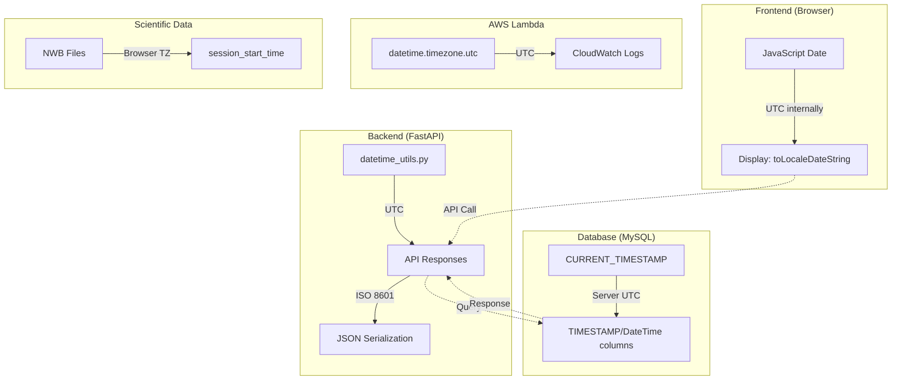

# Timezone Specifications: UTC-First Architecture

## Executive Summary

- **UTC is the standard** for all system operations, database storage, and API communication
- **User's browser timezone** is used for scientific data (NWB files, experiment logs) where lab time matters
- **Centralized utilities** in `datetime_utils.py` ensure consistent timezone handling across the backend
- **ISO 8601 format** is used for all datetime serialization in API responses
- **Naive datetime handling** includes automatic UTC timezone annotation for database-retrieved values

---

## Key Architectural Principles

1. **UTC-First Design**
   - All system timestamps (created_at, updated_at, expiration) are stored and processed in UTC
   - Prevents ambiguity across different deployment regions and user locations
   - Frontend converts UTC to local time only for display purposes

2. **Centralized Datetime Utilities**
   - All backend datetime operations use functions from `datetime_utils.py`
   - Lambda packages duplicate this logic since they deploy as isolated ZIP files
   - Changes to datetime logic require updates in both locations

3. **Timezone-Aware Objects Only**
   - All datetime objects must include timezone information (`tzinfo`)
   - Naive datetimes from databases are annotated with UTC before use
   - Prevents comparison errors between aware and naive datetimes

4. **User's Browser Timezone for Scientific Context**
   - NWB files and experiment logs use the user's browser timezone (IANA format)
   - Frontend detects timezone via `Intl.DateTimeFormat().resolvedOptions().timeZone`
   - Scientists can correlate data with their lab notes using their actual local time
   - This is the only exception to the UTC-first rule

5. **Database Server Time**
   - MySQL `CURRENT_TIMESTAMP` defaults ensure consistency at the database level
   - Application code uses UTC-aware objects for all business logic
   - Timezone conversion happens at the application boundary, not in the database

---

## Architecture Overview



### Timezone Responsibility Matrix

| Component | Timezone Used | Purpose |
|-----------|---------------|---------|
| `datetime_utils.py` | UTC (primary), Browser TZ (scientific) | Centralized datetime handling |
| Database Models | UTC via `CURRENT_TIMESTAMP` | Persistent storage |
| API Responses | UTC via `.isoformat()` | Client communication |
| Lambda Functions | UTC via `timezone.utc` | Serverless operations |
| NWB Files | Browser timezone via `ZoneInfo` | Scientific experiment timestamps |
| Frontend Display | Local via `toLocaleDateString()` | User-facing timestamps |

---

## Implementation Details

### Backend: Centralized Utilities

**File:** `studio/app/common/core/utils/datetime_utils.py`
**Purpose:** Single source of truth for all datetime operations in the backend
**Output:** All functions return timezone-aware datetime objects (UTC or user-specified)

All backend code should use these utilities rather than calling `datetime.now()` directly. See the **Key Functions Reference** section for the full function list.

### Backend: Handling Naive Datetimes from Database

**Purpose:** Annotate naive datetimes from MySQL with UTC before any comparison
**Files:** `crud_users.py`, `auth_dependencies.py`, `cloud_utils.py`, `subscriptions.py`, `storage_tracking.py`

When retrieving datetime values from the database, they may lack timezone info. The codebase checks `tzinfo is None` and applies `replace(tzinfo=timezone.utc)` before use. The `ensure_utc()` utility centralizes this pattern.

### TimestampMixin

**File:** `studio/app/common/models/base.py`
**Purpose:** Provides `created_at` and `updated_at` columns to all models via inheritance
**Output:** Server-side `CURRENT_TIMESTAMP` defaults; `updated_at` auto-updates on row modification

### ExperimentRecord

**File:** `studio/app/common/models/experiment.py`
**Purpose:** Stores experiment metadata including timezone-aware `analyzed_at` column
**Output:** `analyzed_at` uses `DateTime(timezone=True)` -- the only model column that explicitly stores timezone info

### Subscription Models

**File:** `studio/app/common/models/subscription.py`
**Purpose:** Subscription lifecycle timestamps across `UserSubscription`, `SubscriptionUserPurchase`, and `SubscriptionCancellation` models
**Output:** Mix of server-side defaults (`current_timestamp()`) and application-side defaults (`get_current_datetime`)

### Database: All Timestamp Columns

| Table | Column | Type | Default Mechanism |
|-------|--------|------|-------------------|
| All tables (via mixin) | `created_at` | TIMESTAMP | `CURRENT_TIMESTAMP` (server) |
| All tables (via mixin) | `updated_at` | TIMESTAMP | `CURRENT_TIMESTAMP ON UPDATE` |
| `experiment_records` | `analyzed_at` | DateTime(timezone=True) | Application code |
| `subscription_users` | `expiration` | DateTime | Application code |
| `subscription_users` | `last_synced` | TIMESTAMP | `CURRENT_TIMESTAMP` |
| `premium_user_assignments` | `assigned_at` | TIMESTAMP | `CURRENT_TIMESTAMP` |
| `premium_user_assignments` | `last_activity` | TIMESTAMP | `CURRENT_TIMESTAMP` |
| `premium_user_assignments` | `last_state_check` | TIMESTAMP | `CURRENT_TIMESTAMP` |
| `premium_user_assignments` | `standby_created_at` | TIMESTAMP | Nullable |
| `premium_user_assignments` | `last_workflow_start` | TIMESTAMP | Nullable |
| `premium_user_assignments` | `last_workflow_end` | TIMESTAMP | Nullable |
| `free_user_assignments` | `assigned_at` | TIMESTAMP | `CURRENT_TIMESTAMP` |
| `free_user_assignments` | `last_activity` | TIMESTAMP | `CURRENT_TIMESTAMP` |
| `free_user_assignments` | `last_workflow_start` | TIMESTAMP | Nullable |
| `free_user_assignments` | `last_workflow_end` | TIMESTAMP | Nullable |
| `free_user_assignments` | `last_migration` | TIMESTAMP | Nullable |
| `free_user_assignments` | `logged_out_at` | TIMESTAMP | Nullable |
| `subscription_user_purchases` | `created_at` | TIMESTAMP | `get_current_datetime` + `current_timestamp()` |
| `subscription_cancellations` | `cancelled_at` | TIMESTAMP | `get_current_datetime` + `current_timestamp()` |
| `user_storage_usage` | `last_updated` | DateTime | `get_current_datetime` + `current_timestamp()` |
| `user_storage_usage` | `created_at` | DateTime | `get_current_datetime` + `current_timestamp()` |
| `user_storage_usage` | `last_full_scan` | DateTime | Nullable |

### API Response Serialization

**File:** `studio/app/common/schemas/subscriptions.py`
**Purpose:** Serialize all datetime fields to ISO 8601 format with timezone offset
**Output:** Pydantic `Config.json_encoders` calls `.isoformat()` on all datetime values, producing strings like `"2024-01-15T10:30:45+00:00"`

### WebhookService (Stripe Integration)

**File:** `studio/app/common/core/subscription/webhook_service.py`
**Purpose:** Convert Stripe Unix timestamps (integers) to UTC-aware datetimes
**Input:** Stripe event payloads containing `current_period_end`, `period_end`, etc.
**Output:** UTC-aware datetime objects via `datetime_from_timestamp()`
**Calls:** `datetime_from_timestamp()` -> `.isoformat()` for API responses

### getAccurateTimeUTC()

**File:** `frontend/src/utils/subscriptions/SubscriptionUtils.ts`
**Purpose:** Fetch authoritative UTC time to avoid reliance on potentially incorrect client clocks
**Input:** None
**Output:** JavaScript `Date` object from `worldtimeapi.org`, falling back to `new Date()` on failure

Frontend displays timestamps locally using `toLocaleDateString()` for user-facing values and raw `getTime()` arithmetic for duration calculations.

### Lambda Functions

All Lambda functions use `datetime.now(timezone.utc)` directly since they cannot import from `datetime_utils.py`. Each package duplicates the UTC pattern independently.

**Lambda packages requiring UTC handling:**

| Package | File |
|---------|------|
| `free_manager_package` | `free_manager.py`, `free_user_utils.py` |
| `premium_manager_package` | `premium_manager.py` |
| `cost_tracker_package` | `cost_tracker.py` |
| `free_cleanup_package` | `free_cleanup.py` |
| `common_user_manager_package` | `common_user_manager.py` |

### getBrowserTimezone() (Scientific Data Exception)

**File:** `frontend/src/store/slice/Run/RunSelectors.ts`
**Purpose:** Detect user's IANA timezone (e.g., "America/New_York") for NWB files and experiment logs
**Input:** None (reads from `Intl.DateTimeFormat().resolvedOptions().timeZone`)
**Output:** IANA timezone string, falling back to `TIMEZONE_UTC` constant
**Calls:** Injected into `nwbParam` via `selectRunPostData()` using the `TIMEZONE_KEY` constant

Constants `TIMEZONE_UTC` and `TIMEZONE_KEY` mirror the backend equivalents in `datetime_utils.py` and must be kept in sync.

### NWBCreater.acquisition()

**File:** `studio/app/optinist/core/nwb/nwb_creater.py`
**Purpose:** Create NWB files with `session_start_time` in the user's local timezone
**Input:** Config dict containing `TIMEZONE_KEY` (IANA timezone string from browser)
**Output:** `NWBFile` with timezone-aware `session_start_time` via `get_datetime_for_timezone()`
**Calls:** `get_datetime_for_timezone()` from `datetime_utils.py`

**Rationale:** Scientists correlate NWB data with their lab notebooks, equipment logs, and other records that use local time. Using UTC would create confusion when reviewing experiment data.

---

## Edge Case Handling

### 1. Naive Datetime from Database

**Problem:** MySQL returns naive datetime objects without timezone information when using `CURRENT_TIMESTAMP`.

**Solution:** Application code annotates naive datetimes with UTC:
- Check `if dt.tzinfo is None`
- Apply `dt.replace(tzinfo=timezone.utc)`
- Pattern used consistently in `crud_users.py`, `auth_dependencies.py`, `cloud_utils.py`, `subscriptions.py`, `storage_tracking.py`

**Guarantee:** All datetime comparisons use timezone-aware objects.

### 2. Client Time Discrepancy

**Problem:** User's browser clock may be incorrect, affecting subscription expiration checks.

**Solution:** Frontend fetches authoritative UTC time:
- Primary: `worldtimeapi.org/api/timezone/UTC`
- Fallback: JavaScript `new Date()` (UTC internally)
- Server provides `server_time` endpoint for validation

**Guarantee:** Subscription status reflects server time, not client time.

### 3. Stripe Timestamp Conversion

**Problem:** Stripe webhooks provide Unix timestamps (integers), not datetime objects.

**Solution:** Use `datetime_from_timestamp()` utility:
- Converts Unix timestamp to UTC-aware datetime
- Preserves timezone information through serialization

**Guarantee:** All Stripe-derived dates are UTC-aware.

### 4. Lambda Package Isolation

**Problem:** Lambda functions cannot import from main application code.

**Solution:** Lambda packages duplicate timezone handling logic:
- Use `datetime.now(timezone.utc)` directly
- Follow same patterns as `datetime_utils.py`

**Guarantee:** Lambda operations use consistent UTC handling.

### 5. Daylight Saving Time for Scientific Data

**Problem:** Timezone transitions (DST) during long experiments.

**Solution:** `ZoneInfo` from Python's standard library handles DST:
- Uses IANA timezone database (e.g., "America/New_York")
- Captures correct offset at time of call based on user's browser timezone
- NWB files preserve the actual local time with correct DST offset

**Guarantee:** Scientific timestamps reflect the user's real local time including DST.

---

## Configuration

### Docker Environment Variables

All Docker Compose files set the container timezone:

| File | Variable | Value |
|------|----------|-------|
| `docker-compose.yml` | `TZ` | `UTC` |
| `docker-compose.dev.yml` | `TZ` | `UTC` |
| `docker-compose.dev.multiuser.yml` | `TZ` | `UTC` |
| `docker-compose.build.yml` | `TZ` | `UTC` |
| `docker-compose.test.yml` | `TZ` | `UTC` |

### Database Configuration

MySQL server should be configured with:

```sql
SET GLOBAL time_zone = '+00:00';
```

Or via configuration:

```ini
[mysqld]
default-time-zone = '+00:00'
```

---

## Key Functions Reference

### datetime_utils.py

| Function | Purpose |
|----------|---------|
| `get_current_datetime()` | Returns current UTC datetime with timezone info |
| `get_current_timestamp()` | Returns current UTC time as Unix timestamp (float) |
| `get_current_datetime_formatted()` | Returns UTC datetime as formatted string |
| `datetime_from_timestamp()` | Converts Unix timestamp to UTC-aware datetime |
| `get_datetime_for_timezone(tz)` | Returns current datetime in specified IANA timezone |
| `get_datetime_for_timezone_formatted(tz)` | Returns formatted datetime in specified IANA timezone |
| `format_date_for_display()` | Formats datetime with UTC indicator for user display |
| `ensure_utc()` | Ensures a datetime is UTC-aware (annotates naive, converts aware) |
| `is_datetime_aware()` | Checks if a datetime has timezone information |

### datetime_utils.py Constants

| Constant | Purpose |
|----------|---------|
| `TIMEZONE_UTC` | Default fallback timezone string ("UTC") |
| `TIMEZONE_KEY` | Config key for user timezone ("timezone") |
| `TZ_UTC` | UTC timezone object (`timezone.utc`) |

### Pydantic Serialization

| Pattern | Location | Purpose |
|---------|----------|---------|
| `json_encoders = {datetime: lambda v: v.isoformat()}` | `schemas/subscriptions.py` | Serialize datetime to ISO 8601 |

### Database Defaults

| Pattern | Purpose |
|---------|---------|
| `server_default=current_timestamp()` | Set creation timestamp at database level |
| `server_default=text("CURRENT_TIMESTAMP ON UPDATE CURRENT_TIMESTAMP")` | Auto-update timestamp on row modification |
| `default_factory=get_current_datetime` | Set UTC timestamp in Python before insert |

---

## Testing

### Verifying UTC Behavior

- All values from `get_current_datetime()` should have `tzinfo == timezone.utc`
- All values from `datetime_from_timestamp()` should have `tzinfo == timezone.utc`
- See `studio/tests/app/common/core/utils/test_datetime_utils.py` for unit tests

### Common Test Patterns

- Mock `datetime.now` via `patch('studio.app.common.core.utils.datetime_utils.datetime')` to control time in tests
- Use `datetime(..., tzinfo=timezone.utc)` for fixed test times to ensure timezone awareness

---

## Summary Table

| Category | Standard | Exception |
|----------|----------|-----------|
| System timestamps | UTC | None |
| Database storage | UTC (via CURRENT_TIMESTAMP) | None |
| API responses | UTC (ISO 8601) | None |
| Lambda functions | UTC | None |
| Scientific data (NWB) | User's browser timezone | Intentional |
| Experiment logs | User's browser timezone | Intentional |
| Frontend display | Convert to local | None |
