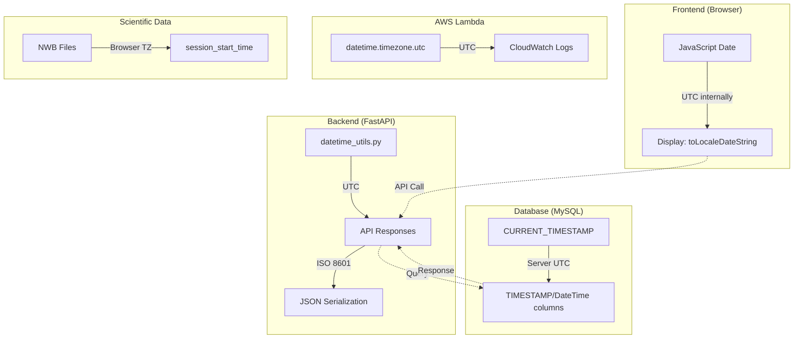

# Timezone Specifications: UTC-First Architecture

## Executive Summary

- **UTC is the standard** for all system operations, database storage, and API communication
- **User's browser timezone** is used for scientific data (NWB files, experiment logs) where lab time matters
- **Centralized utilities** in `datetime_utils.py` ensure consistent timezone handling across the backend
- **ISO 8601 format** is used for all datetime serialization in API responses
- **Naive datetime handling** includes automatic UTC timezone annotation for database-retrieved values

---

## Key Architectural Principles

1. **UTC-First Design**
   - All system timestamps (created_at, updated_at, expiration) are stored and processed in UTC
   - Prevents ambiguity across different deployment regions and user locations
   - Frontend converts UTC to local time only for display purposes

2. **Centralized Datetime Utilities**
   - All backend datetime operations use functions from `datetime_utils.py`
   - Lambda packages duplicate this logic since they deploy as isolated ZIP files
   - Changes to datetime logic require updates in both locations

3. **Timezone-Aware Objects Only**
   - All datetime objects must include timezone information (`tzinfo`)
   - Naive datetimes from databases are annotated with UTC before use
   - Prevents comparison errors between aware and naive datetimes

4. **User's Browser Timezone for Scientific Context**
   - NWB files and experiment logs use the user's browser timezone (IANA format)
   - Frontend detects timezone via `Intl.DateTimeFormat().resolvedOptions().timeZone`
   - Scientists can correlate data with their lab notes using their actual local time
   - This is the only exception to the UTC-first rule

5. **Database Server Time**
   - MySQL `CURRENT_TIMESTAMP` defaults ensure consistency at the database level
   - Application code uses UTC-aware objects for all business logic
   - Timezone conversion happens at the application boundary, not in the database

---

## Architecture Overview



### Timezone Responsibility Matrix

| Component | Timezone Used | Purpose |
|-----------|---------------|---------|
| `datetime_utils.py` | UTC (primary), Browser TZ (scientific) | Centralized datetime handling |
| Database Models | UTC via `CURRENT_TIMESTAMP` | Persistent storage |
| API Responses | UTC via `.isoformat()` | Client communication |
| Lambda Functions | UTC via `timezone.utc` | Serverless operations |
| NWB Files | Browser timezone via `ZoneInfo` | Scientific experiment timestamps |
| Frontend Display | Local via `toLocaleDateString()` | User-facing timestamps |

---

## Implementation Details

### Backend: Centralized Utilities

**File:** `studio/app/common/core/utils/datetime_utils.py`

All backend code should use these utilities for datetime operations:

```python
# Get current UTC datetime
now = get_current_datetime()  # Returns datetime with timezone.utc

# Get current UTC timestamp (for file operations)
ts = get_current_timestamp()  # Returns float (seconds since epoch)

# Convert Unix timestamp to UTC-aware datetime
dt = datetime_from_timestamp(1705312245.0)  # Returns UTC-aware datetime

# Get datetime in user's timezone (for scientific data)
user_tz = "America/New_York"  # From browser: Intl.DateTimeFormat().resolvedOptions().timeZone
local_now = get_datetime_for_timezone(user_tz)  # Returns datetime with ZoneInfo

# Format datetime in user's timezone
formatted = get_datetime_for_timezone_formatted(user_tz)  # e.g., "2024/01/15 10:30:45"

# Format for user display
display = format_date_for_display(dt)  # Returns "2024-01-15 (UTC)"
```

### Backend: Handling Naive Datetimes from Database

When retrieving datetime values from the database, they may be naive (no timezone info). The codebase handles this consistently:

```python
# Pattern used in crud_users.py, auth_dependencies.py, cloud_utils.py
if expiration_time.tzinfo is None:
    expiration_time = expiration_time.replace(tzinfo=timezone.utc)
```

This ensures all datetime comparisons use timezone-aware objects.

### Database: Model Definitions

**TimestampMixin (Base Model)**

**File:** `studio/app/common/models/base.py`

```python
class TimestampMixin:
    created_at = Column(TIMESTAMP, nullable=False, server_default=current_timestamp())
    updated_at = Column(
        TIMESTAMP,
        nullable=False,
        server_default=text("CURRENT_TIMESTAMP ON UPDATE CURRENT_TIMESTAMP"),
    )
```

**Experiment Model with Timezone-Aware Column**

**File:** `studio/app/common/models/experiment.py`

```python
analyzed_at: Optional[datetime] = Column(DateTime(timezone=True))
```

**Subscription Models**

**File:** `studio/app/common/models/subscription.py`

| Column | Type | Default |
|--------|------|---------|
| `created_at` | TIMESTAMP | `server_default=current_timestamp()` |
| `updated_at` | TIMESTAMP | `CURRENT_TIMESTAMP ON UPDATE CURRENT_TIMESTAMP` |
| `expiration` | DateTime | Application-provided UTC value |
| `last_synced` | TIMESTAMP | `server_default=current_timestamp()` |
| `cancelled_at` | DateTime | `default_factory=get_current_datetime` |

### Database: All Timestamp Columns

| Table | Column | Type | Default Mechanism |
|-------|--------|------|-------------------|
| All tables (via mixin) | `created_at` | TIMESTAMP | `CURRENT_TIMESTAMP` (server) |
| All tables (via mixin) | `updated_at` | TIMESTAMP | `CURRENT_TIMESTAMP ON UPDATE` |
| `experiments` | `analyzed_at` | DateTime(timezone=True) | Application code |
| `user_subscription` | `expiration` | DateTime | Application code |
| `subscription_stripe_sync` | `last_synced` | TIMESTAMP | `CURRENT_TIMESTAMP` |
| `premium_user_assignments` | `assigned_at` | TIMESTAMP | `CURRENT_TIMESTAMP` |
| `premium_user_assignments` | `last_activity` | TIMESTAMP | `CURRENT_TIMESTAMP` |
| `premium_user_assignments` | `last_state_check` | TIMESTAMP | `CURRENT_TIMESTAMP` |
| `premium_user_assignments` | `standby_created_at` | TIMESTAMP | Nullable |
| `premium_user_assignments` | `last_workflow_start` | TIMESTAMP | Nullable |
| `premium_user_assignments` | `last_workflow_end` | TIMESTAMP | Nullable |
| `free_user_assignments` | `assigned_at` | TIMESTAMP | `CURRENT_TIMESTAMP` |
| `free_user_assignments` | `last_activity` | TIMESTAMP | `CURRENT_TIMESTAMP` |
| `free_user_assignments` | `last_workflow_start` | TIMESTAMP | Nullable |
| `free_user_assignments` | `last_workflow_end` | TIMESTAMP | Nullable |
| `free_user_assignments` | `last_migration_at` | TIMESTAMP | Nullable |
| `free_user_assignments` | `migration_lock_time` | TIMESTAMP | Application code |
| `subscription_user_purchase` | `created_at` | DateTime | `get_current_datetime` + `current_timestamp()` |
| `subscription_cancellation` | `cancelled_at` | DateTime | `get_current_datetime` |
| `user_storage_usage` | `last_updated` | DateTime | `current_timestamp()` |
| `user_storage_usage` | `created_at` | DateTime | `current_timestamp()` |
| `user_storage_usage` | `last_full_scan` | DateTime | Nullable |

### API Response Serialization

**Pydantic Schema Configuration**

**File:** `studio/app/common/schemas/subscriptions.py`

```python
class Config:
    json_encoders = {datetime: lambda v: v.isoformat()}
```

All datetime fields in API responses are serialized using ISO 8601 format with timezone information:

```json
{
  "created_at": "2024-01-15T10:30:45+00:00",
  "expiration": "2024-02-15T23:59:59+00:00"
}
```

### Stripe Integration

**Converting Stripe Timestamps**

Stripe uses Unix timestamps (integers). The codebase converts these to UTC-aware datetimes:

**File:** `studio/app/common/core/subscription/webhook_service.py`

```python
# Stripe provides Unix timestamps
period_end = datetime_from_timestamp(subscription.current_period_end)

# Convert to ISO format for API responses
invoice_data["period_end"] = datetime_from_timestamp(
    invoice.period_end
).isoformat()
```

### Frontend: UTC Time Handling

**Fetching Accurate UTC Time**

**File:** `frontend/src/utils/subscriptions/SubscriptionUtils.ts`

```typescript
export async function getAccurateTimeUTC(): Promise<Date> {
  try {
    const response = await fetch("http://worldtimeapi.org/api/timezone/UTC")
    const data = await response.json()
    return new Date(data.utc_datetime)
  } catch {
    // Fallback to client time (JavaScript Date is UTC internally)
    return new Date()
  }
}
```

**Displaying Timestamps Locally**

```typescript
// Display subscription expiration in user's local timezone
new Date(userSubscription.expiration).toLocaleDateString()

// Calculate duration between timestamps
const durationSeconds = (new Date(finishedAt).getTime() - new Date(startedAt).getTime()) / 1000
```

### AWS Lambda Functions

All Lambda functions use `datetime.timezone.utc` directly since they cannot import from `datetime_utils.py`:

**Pattern in Lambda code:**

```python
from datetime import datetime, timedelta, timezone

# Get current UTC time
now = datetime.now(timezone.utc)

# Return UTC time in ISO format
return {"timestamp": datetime.now(timezone.utc).isoformat()}
```

**Lambda packages requiring UTC handling:**

| Package | File |
|---------|------|
| `free_manager_package` | `free_manager.py`, `free_user_utils.py` |
| `premium_manager_package` | `premium_manager.py` |
| `cost_tracker_package` | `cost_tracker.py` |
| `free_cleanup_package` | `free_cleanup.py` |
| `common_user_manager_package` | `common_user_manager.py` |
| `storage_reconciliation_package` | `storage_reconciliation.py` |

### Scientific Data: NWB Files

**Exception to UTC Rule**

NWB files use the user's browser timezone instead of UTC. This ensures scientists see timestamps that match their actual local time when correlating data with lab notebooks and equipment logs.

**Frontend: Detecting Browser Timezone**

**File:** `frontend/src/store/slice/Run/RunSelectors.ts`

```typescript
const getBrowserTimezone = (): string => {
  try {
    return Intl.DateTimeFormat().resolvedOptions().timeZone  // e.g., "America/New_York"
  } catch {
    return "UTC"  // Fallback
  }
}

// Timezone is passed in nwbParam when starting a workflow run
const nwbParamWithTimezone = {
  ...nwbParams,
  timezone: { type: "child", value: getBrowserTimezone(), path: "timezone" },
}
```

**Backend: Using Browser Timezone**

**File:** `studio/app/optinist/core/nwb/nwb_creater.py`

```python
from studio.app.common.core.utils.datetime_utils import (
    TIMEZONE_KEY,
    get_datetime_for_timezone,
)

# Get timezone from config (passed from user's browser)
timezone_str = config.get(TIMEZONE_KEY)  # e.g., "America/New_York"
session_start_time = get_datetime_for_timezone(timezone_str)

nwbfile = NWBFile(
    session_start_time=session_start_time,  # User's local time, not UTC
    # ...
)
```

**Rationale:** Scientists correlate NWB data with their lab notebooks, equipment logs, and other records that use local time. Using UTC would create confusion when reviewing experiment data. The browser timezone ensures the timestamp reflects the user's actual location, not the server's timezone.

---

## Edge Case Handling

### 1. Naive Datetime from Database

**Problem:** MySQL returns naive datetime objects without timezone information when using `CURRENT_TIMESTAMP`.

**Solution:** Application code annotates naive datetimes with UTC:
- Check `if dt.tzinfo is None`
- Apply `dt.replace(tzinfo=timezone.utc)`
- Pattern used consistently in `crud_users.py`, `auth_dependencies.py`, `cloud_utils.py`

**Guarantee:** All datetime comparisons use timezone-aware objects.

### 2. Client Time Discrepancy

**Problem:** User's browser clock may be incorrect, affecting subscription expiration checks.

**Solution:** Frontend fetches authoritative UTC time:
- Primary: `worldtimeapi.org/api/timezone/UTC`
- Fallback: JavaScript `new Date()` (UTC internally)
- Server provides `server_time` endpoint for validation

**Guarantee:** Subscription status reflects server time, not client time.

### 3. Stripe Timestamp Conversion

**Problem:** Stripe webhooks provide Unix timestamps (integers), not datetime objects.

**Solution:** Use `datetime_from_timestamp()` utility:
- Converts Unix timestamp to UTC-aware datetime
- Preserves timezone information through serialization

**Guarantee:** All Stripe-derived dates are UTC-aware.

### 4. Lambda Package Isolation

**Problem:** Lambda functions cannot import from main application code.

**Solution:** Lambda packages duplicate timezone handling logic:
- Use `datetime.now(timezone.utc)` directly
- Follow same patterns as `datetime_utils.py`

**Guarantee:** Lambda operations use consistent UTC handling.

### 5. Daylight Saving Time for Scientific Data

**Problem:** Timezone transitions (DST) during long experiments.

**Solution:** `ZoneInfo` from Python's standard library handles DST:
- Uses IANA timezone database (e.g., "America/New_York")
- Captures correct offset at time of call based on user's browser timezone
- NWB files preserve the actual local time with correct DST offset

**Guarantee:** Scientific timestamps reflect the user's real local time including DST.

---

## Configuration

### Docker Environment Variables

All Docker Compose files set the container timezone:

| File | Variable | Value |
|------|----------|-------|
| `docker-compose.yml` | `TZ` | `UTC` |
| `docker-compose.dev.yml` | `TZ` | `UTC` |
| `docker-compose.dev.multiuser.yml` | `TZ` | `UTC` |
| `docker-compose.build.yml` | `TZ` | `UTC` |
| `docker-compose.test.yml` | `TZ` | `UTC` |

### Database Configuration

MySQL server should be configured with:

```sql
SET GLOBAL time_zone = '+00:00';
```

Or via configuration:

```ini
[mysqld]
default-time-zone = '+00:00'
```

---

## Key Functions Reference

### datetime_utils.py

| Function | Purpose |
|----------|---------|
| `get_current_datetime()` | Returns current UTC datetime with timezone info |
| `get_current_timestamp()` | Returns current UTC time as Unix timestamp (float) |
| `get_current_datetime_formatted()` | Returns UTC datetime as formatted string |
| `datetime_from_timestamp()` | Converts Unix timestamp to UTC-aware datetime |
| `get_datetime_for_timezone(tz)` | Returns current datetime in specified IANA timezone |
| `get_datetime_for_timezone_formatted(tz)` | Returns formatted datetime in specified IANA timezone |
| `format_date_for_display()` | Formats datetime with UTC indicator for user display |

### datetime_utils.py Constants

| Constant | Purpose |
|----------|---------|
| `TIMEZONE_UTC` | Default fallback timezone string ("UTC") |
| `TIMEZONE_KEY` | Config key for user timezone ("timezone") |
| `TZ_UTC` | UTC timezone object (`timezone.utc`) |

### Pydantic Serialization

| Pattern | Location | Purpose |
|---------|----------|---------|
| `json_encoders = {datetime: lambda v: v.isoformat()}` | `schemas/subscriptions.py` | Serialize datetime to ISO 8601 |

### Database Defaults

| Pattern | Purpose |
|---------|---------|
| `server_default=current_timestamp()` | Set creation timestamp at database level |
| `server_default=text("CURRENT_TIMESTAMP ON UPDATE CURRENT_TIMESTAMP")` | Auto-update timestamp on row modification |
| `default_factory=get_current_datetime` | Set UTC timestamp in Python before insert |

---

## Testing

### Verifying UTC Behavior

```python
from studio.app.common.core.utils.datetime_utils import get_current_datetime

# Verify timezone is UTC
now = get_current_datetime()
assert now.tzinfo == timezone.utc

# Verify timestamp conversion
from studio.app.common.core.utils.datetime_utils import datetime_from_timestamp
dt = datetime_from_timestamp(1705312245.0)
assert dt.tzinfo == timezone.utc
```

### Common Test Patterns

```python
# Mock current time for tests
from unittest.mock import patch
from datetime import datetime, timezone

fixed_time = datetime(2024, 1, 15, 10, 30, 0, tzinfo=timezone.utc)

with patch('studio.app.common.core.utils.datetime_utils.datetime') as mock_dt:
    mock_dt.now.return_value = fixed_time
    # Test code that uses get_current_datetime()
```

---

## Summary Table

| Category | Standard | Exception |
|----------|----------|-----------|
| System timestamps | UTC | None |
| Database storage | UTC (via CURRENT_TIMESTAMP) | None |
| API responses | UTC (ISO 8601) | None |
| Lambda functions | UTC | None |
| Scientific data (NWB) | User's browser timezone | Intentional |
| Experiment logs | User's browser timezone | Intentional |
| Frontend display | Convert to local | None |
