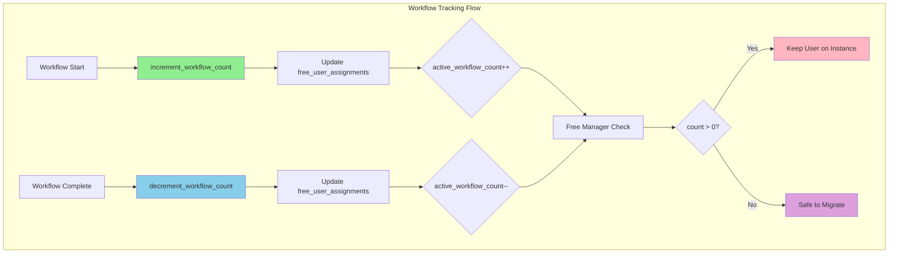

# Workflow Tracking Architecture

## Executive Summary

- **Workflow Tracking** monitors active workflows for free tier users to prevent unsafe migrations
- **Atomic counting** ensures workflow count is always accurate despite concurrent operations
- **Free Manager integration** checks workflow count before any user migration
- **Crash recovery** via Common User Manager resets stale counts after 30 minutes

---

## Key Architectural Principles

1. **Safe Free Tier Migration**
   - Track active workflow count per free tier user
   - Free Manager NEVER migrates users with active workflows (count > 0)
   - Prevents workflow interruption and data corruption

2. **Atomic Operations**
   - SQLAlchemy `update()` for atomic increment/decrement
   - Database handles concurrency, no application-level locks needed
   - `GREATEST(0, count - 1)` prevents negative counts

3. **Crash Recovery**
   - Common User Manager runs every 10 minutes
   - Resets stale workflow counts (>30 minutes old)
   - Applies to both free and premium users

---

## Architecture Overview



### Responsibility Matrix

| Responsibility                | Workflow Tracking   | Free Manager       |
|-------------------------------|---------------------|--------------------|
| Track active workflows        | Exclusive           | Never              |
| Update workflow count         | Atomic increment    | Never              |
| Check migration safety        | Never               | Reads count        |
| Decide to migrate user        | Never               | Exclusive          |

---

## Implementation Details

### 1. Workflow Tracking Module

**File:** `studio/app/common/core/workflow/workflow_tracking.py`

**Core Functions:**

```python
def increment_workflow_count(user_id: Optional[int]) -> None:
    """
    Atomically increment active_workflow_count for free tier user.

    Called when workflow starts.
    Uses SQLAlchemy update() for atomic operation (prevents race conditions).

    Updates:
    - active_workflow_count += 1
    - last_workflow_start = NOW()
    """
```

```python
def decrement_workflow_count(user_id: Optional[int]) -> None:
    """
    Atomically decrement active_workflow_count for free tier user.

    Called when workflow completes (success or failure).
    Uses func.greatest(0, count - 1) to ensure count never goes negative.

    Updates:
    - active_workflow_count = max(0, count - 1)
    - last_workflow_end = NOW()
    """
```

**Integration Points:**

- **workflow_runner.py**: Increments count in `__init__`
- **snakemake_executor.py**: Decrements count after workflow execution

**Race Condition Prevention:**

```python
# Atomic increment using SQLAlchemy's update()
stmt = (
    update(FreeUserAssignment)
    .where(FreeUserAssignment.user_id == user_id)
    .values(
        active_workflow_count=FreeUserAssignment.active_workflow_count + 1,
        last_workflow_start=func.now(),
    )
)
```

---

### 2. Free User Assignment Model

**File:** `studio/app/common/models/free_user.py`

**Schema:**

| Field                    | Type      | Description                                      |
|--------------------------|-----------|--------------------------------------------------|
| user_id                  | VARCHAR   | Primary key, user identifier                     |
| instance_id              | VARCHAR   | ECS instance ID                                  |
| assigned_at              | TIMESTAMP | When user was assigned to instance               |
| last_activity            | TIMESTAMP | Last user activity (updated by heartbeat)        |
| active_workflow_count    | INTEGER   | Number of active workflows (default: 0)          |
| last_workflow_start      | TIMESTAMP | Timestamp of last workflow start                 |
| last_workflow_end        | TIMESTAMP | Timestamp of last workflow completion            |
| migration_count          | INTEGER   | Number of migrations (for analytics)             |
| last_migration           | TIMESTAMP | Timestamp of last migration                      |
| logged_out_at            | TIMESTAMP | Explicit logout timestamp                        |

**Key Features:**
- `active_workflow_count` prevents unsafe migration (if > 0, user has running workflows)
- Timestamps enable analytics and debugging
- Migration tracking for capacity planning

---

## Flow Diagram

### Workflow Tracking Flow

```
┌──────────────────────────────────────────────────────────┐
│ 1. User Starts Workflow                                 │
│    → WorkflowRunner.__init__() called                   │
│    → increment_workflow_count(user_id)                  │
└──────────────────────────────────────────────────────────┘
                         ↓
┌──────────────────────────────────────────────────────────┐
│ 2. Atomic DB Update (SQLAlchemy)                        │
│    → UPDATE free_user_assignments                       │
│       SET active_workflow_count = active_workflow_count + 1,│
│           last_workflow_start = NOW()                   │
│       WHERE user_id = ?                                 │
└──────────────────────────────────────────────────────────┘
                         ↓
┌──────────────────────────────────────────────────────────┐
│ 3. Workflow Runs (Snakemake Execution)                  │
│    → User is "protected" from migration                 │
│    → Free Manager sees active_workflow_count > 0        │
└──────────────────────────────────────────────────────────┘
                         ↓
┌──────────────────────────────────────────────────────────┐
│ 4. Workflow Completes (Success or Failure)              │
│    → snakemake_execute() completion handler             │
│    → decrement_workflow_count(user_id)                  │
└──────────────────────────────────────────────────────────┘
                         ↓
┌──────────────────────────────────────────────────────────┐
│ 5. Atomic DB Update (with Safety)                       │
│    → UPDATE free_user_assignments                       │
│       SET active_workflow_count = GREATEST(0, count - 1),│
│           last_workflow_end = NOW()                     │
│       WHERE user_id = ?                                 │
└──────────────────────────────────────────────────────────┘
                         ↓
┌──────────────────────────────────────────────────────────┐
│ 6. Free Manager Can Migrate User (if idle)             │
│    → active_workflow_count = 0                          │
│    → No active workflows, safe to migrate               │
└──────────────────────────────────────────────────────────┘
```

---

## Edge Case Handling

### 1. Concurrent Workflow Operations (Race Condition)

**Problem:** Two workflows start/end simultaneously for same user.

**Solution:** Atomic SQL operations with database-level locking:
```python
# Database executes this atomically
UPDATE free_user_assignments
SET active_workflow_count = active_workflow_count + 1
WHERE user_id = ?
```

**Guarantee:** No race condition possible - database handles concurrency

### 2. Workflow Crashes Without Cleanup

**Problem:** Workflow crashes before calling decrement_workflow_count().

**Solution:** Common User Manager reconciliation:
- Runs every 10 minutes via scheduled Lambda
- Checks for stale active_workflow_count (>30 minutes old)
- Resets active_workflow_count = 0 for both free and premium users
- See: `infrastructure/terraform/common_user_manager_package/common_user_manager.py`

**Implementation:**
```python
def recover_stale_workflow_counts() -> Dict[str, int]:
    """Reset stale workflow counts (>30 min old) for both free and premium users."""
    # Recover free user workflow counts
    free_sql = """
        UPDATE free_user_assignments
        SET active_workflow_count = 0
        WHERE active_workflow_count > 0
        AND last_workflow_start < DATE_SUB(NOW(), INTERVAL 30 MINUTE)
    """
    # Recover premium user workflow counts
    premium_sql = """
        UPDATE premium_user_assignments
        SET active_workflow_count = 0
        WHERE active_workflow_count > 0
        AND last_workflow_start < DATE_SUB(NOW(), INTERVAL 30 MINUTE)
    """
```

---

## Database Schema

**Table:** `free_user_assignments`

```sql
CREATE TABLE free_user_assignments (
    user_id VARCHAR(255) PRIMARY KEY,
    instance_id VARCHAR(20) NOT NULL,
    assigned_at TIMESTAMP NOT NULL DEFAULT CURRENT_TIMESTAMP,
    last_activity TIMESTAMP NOT NULL DEFAULT CURRENT_TIMESTAMP,
    active_workflow_count INTEGER NOT NULL DEFAULT 0
        COMMENT 'Number of active workflows running for this user',
    last_workflow_start TIMESTAMP NULL
        COMMENT 'Timestamp of last workflow start',
    last_workflow_end TIMESTAMP NULL
        COMMENT 'Timestamp of last workflow completion',
    migration_count INTEGER NOT NULL DEFAULT 0
        COMMENT 'Number of times user has been migrated between instances',
    last_migration TIMESTAMP NULL
        COMMENT 'Timestamp of last migration event',
    logged_out_at TIMESTAMP NULL
        COMMENT 'Timestamp when user explicitly logged out'
);
```

---

## Key Functions Reference

| Function | Purpose |
|----------|---------|
| `increment_workflow_count()` | Called on workflow start |
| `decrement_workflow_count()` | Called on workflow completion |
| `get_active_workflow_count()` | Query current count |
| `recover_stale_workflow_counts()` | Reset stale counts (Common User Manager) |

---

## Monitoring and Logging

### CloudWatch Logs

**Location:** Application logs (ECS container)

**Key Log Messages:**
```
WORKFLOW START: {workflow_name} (ID: {unique_id}, User: {user_id})
Incremented workflow count for user {user_id} (free tier workflow started)
WORKFLOW COMPLETED: {workflow_name} completed in {duration}s
Decremented workflow count for user {user_id} (free tier workflow completed)
```

### Metrics to Monitor

| Metric                          | Description                              | Alert Threshold     |
|---------------------------------|------------------------------------------|---------------------|
| active_workflow_count_total     | Sum across all free tier users           | > 100 (capacity)    |
| stale_workflow_count_recovered  | Counts reset by Common User Manager      | > 10 (crash issues) |

---

## Files Reference

### Modified
- `studio/app/common/core/workflow/workflow_runner.py` - Add workflow tracking calls
- `studio/app/common/core/snakemake/snakemake_executor.py` - Decrement workflow count

### Added
- `studio/app/common/core/workflow/workflow_tracking.py` - Workflow count management
- `studio/app/common/models/free_user.py` - Free user assignment model
- `studio/alembic/versions/f801f8250020_create_free_user_tracking_system.py` - Database migration
