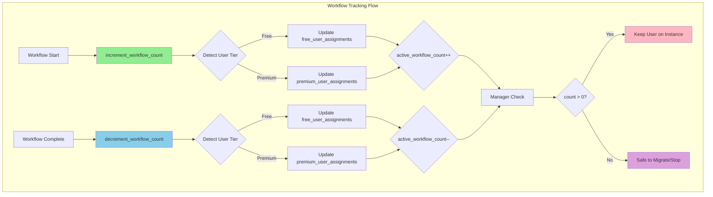

# Workflow Tracking: Active Workflow Protection for User Migration

## Executive Summary

- **Workflow Tracking** monitors active workflows for both free and premium tier users to prevent unsafe migrations
- **Atomic counting** ensures workflow count is always accurate despite concurrent operations
- **Manager integration** checks workflow count before any user migration or instance stop
- **Tier-aware routing** detects user subscription tier and updates the correct assignment table
- **Crash recovery** via Common User Manager resets stale counts using a two-condition inactivity check

---

## Key Architectural Principles

1. **Safe Migration for Both Tiers**
   - Track active workflow count per user in both `free_user_assignments` and `premium_user_assignments`
   - Managers NEVER migrate/stop users with active workflows (count > 0)
   - Prevents workflow interruption and data corruption

2. **Atomic Operations**
   - SQLAlchemy `update()` for atomic increment/decrement
   - Database handles concurrency, no application-level locks needed
   - `func.greatest(0, count - 1)` prevents negative counts

3. **Tier-Aware Tracking**
   - `_get_user_tier()` determines subscription tier via `SubscriptionService`
   - Updates the matching assignment table (free or premium)
   - Falls back to the other table if primary has no record

4. **Crash Recovery**
   - Common User Manager runs every 10 minutes
   - Resets stale workflow counts only when user is inactive 2+ hours
   - Two recovery conditions: completed workflow with stale count, or workflow started 4+ hours ago

---

## Architecture Overview



### Responsibility Matrix

| Responsibility                | Workflow Tracking   | Free Manager        | Premium Manager     |
|-------------------------------|---------------------|---------------------|---------------------|
| Track active workflows        | Exclusive           | Never               | Never               |
| Update workflow count         | Atomic increment    | Never               | Never               |
| Check migration safety        | Never               | Reads count         | Reads count         |
| Decide to migrate/stop        | Never               | Exclusive (free)    | Exclusive (premium) |

---

## Implementation Details

### increment_workflow_count()

**File:** `studio/app/common/core/workflow/workflow_tracking.py`
**Purpose:** Atomically increment active workflow count for a user (free or premium)
**Input:** `user_id` (from workflow context, `None` or standalone mode skipped)
**Output:** Side effect - increments `active_workflow_count` and sets `last_workflow_start` in the appropriate assignment table
**Calls:** `_get_user_tier()` -> SQLAlchemy `update()` on `FreeUserAssignment` or `PremiumUserAssignment`

### decrement_workflow_count()

**File:** `studio/app/common/core/workflow/workflow_tracking.py`
**Purpose:** Atomically decrement active workflow count, ensuring count never goes below 0
**Input:** `user_id` (from workflow context, `None` or standalone mode skipped)
**Output:** Side effect - decrements `active_workflow_count` using `func.greatest(0, count - 1)` and sets `last_workflow_end`
**Calls:** `_get_user_tier()` -> SQLAlchemy `update()` on `FreeUserAssignment` or `PremiumUserAssignment`

### get_active_workflow_count()

**File:** `studio/app/common/core/workflow/workflow_tracking.py`
**Purpose:** Query current active workflow count for a user across both tiers
**Input:** `user_id`
**Output:** Integer count (0 if user not found or error)
**Calls:** `_get_user_tier()` -> SQLAlchemy `select()` on `FreeUserAssignment` or `PremiumUserAssignment`

### recover_stale_workflow_counts()

**File:** `infrastructure/terraform/common_user_manager_package/common_user_manager.py`
**Purpose:** Reset stale workflow counts for both free and premium users using a two-condition check
**Input:** None (reads from database directly)
**Output:** Dict with `free_recovered` and `premium_recovered` counts
**Calls:** SQLAlchemy `update()` on both `free_user_assignments` and `premium_user_assignments`

### Integration Points

- **`workflow_runner.py`**: Calls `increment_workflow_count()` in `__init__`
- **`snakemake_executor.py`**: Calls `decrement_workflow_count()` after workflow execution completes (success or failure)

---

## Flow Diagram

### Workflow Tracking Flow

```
┌────────────────────────────────────────────────────────┐
│ 1. User Starts Workflow                                │
│    → WorkflowRunner.__init__() called                  │
│    → increment_workflow_count(user_id)                 │
└────────────────────────────────────────────────────────┘
                         ↓
┌────────────────────────────────────────────────────────┐
│ 2. Detect User Tier                                    │
│    → _get_user_tier() checks SubscriptionService       │
│    → Determines free or premium assignment table       │
└────────────────────────────────────────────────────────┘
                         ↓
┌────────────────────────────────────────────────────────┐
│ 3. Atomic DB Update (SQLAlchemy)                       │
│    → Increment active_workflow_count in correct table  │
│    → Set last_workflow_start = NOW()                   │
└────────────────────────────────────────────────────────┘
                         ↓
┌────────────────────────────────────────────────────────┐
│ 4. Workflow Runs (Snakemake Execution)                 │
│    → User is "protected" from migration                │
│    → Manager sees active_workflow_count > 0            │
└────────────────────────────────────────────────────────┘
                         ↓
┌────────────────────────────────────────────────────────┐
│ 5. Workflow Completes (Success or Failure)             │
│    → snakemake_execute() completion handler            │
│    → decrement_workflow_count(user_id)                 │
└────────────────────────────────────────────────────────┘
                         ↓
┌────────────────────────────────────────────────────────┐
│ 6. Atomic DB Update (with Safety)                      │
│    → Decrement using GREATEST(0, count - 1)            │
│    → Set last_workflow_end = NOW()                     │
└────────────────────────────────────────────────────────┘
                         ↓
┌────────────────────────────────────────────────────────┐
│ 7. Manager Can Migrate/Stop (if idle)                  │
│    → active_workflow_count = 0                         │
│    → No active workflows, safe to proceed              │
└────────────────────────────────────────────────────────┘
```

---

## Edge Case Handling

### 1. Concurrent Workflow Operations (Race Condition)

**Problem:** Two workflows start/end simultaneously for the same user.

**Solution:** Atomic SQL operations via SQLAlchemy `update()`:
- Database executes increment/decrement atomically
- No application-level locks needed
- `func.greatest(0, count - 1)` prevents negative counts on concurrent decrements

### 2. Workflow Crashes Without Cleanup

**Problem:** Workflow crashes before calling `decrement_workflow_count()`.

**Solution:** Common User Manager reconciliation:
- Runs every 10 minutes via scheduled Lambda
- Resets `active_workflow_count = 0` only when BOTH conditions are met:
  - User is inactive (`last_activity` > `WORKFLOW_USER_INACTIVITY_HOURS` ago)
  - AND either: workflow has completed (`last_workflow_end >= last_workflow_start`), OR workflow is very old (`last_workflow_start` > `WORKFLOW_VERY_OLD_HOURS` ago)
- Applies to both `free_user_assignments` and `premium_user_assignments`

### 3. Tier Detection Failure

**Problem:** `_get_user_tier()` cannot determine subscription tier (database error, missing user).

**Solution:** Fallback logic in tracking functions:
- If tier lookup fails, checks which assignment tables have records for the user
- Updates whichever table has a record (premium preferred if both exist)
- Logs warning but does not raise exception

---

## Free User Assignment Model

**File:** `studio/app/common/models/free_user.py`

| Field                    | Type             | Description                                      |
|--------------------------|------------------|--------------------------------------------------|
| id                       | BIGINT (PK)      | Auto-increment primary key                       |
| user_id                  | BIGINT (unique)  | Foreign key to `users.id`                        |
| instance_id              | VARCHAR(20)      | Assigned instance identifier                     |
| assigned_at              | TIMESTAMP        | When user was assigned to instance               |
| last_activity            | TIMESTAMP        | Last user activity (updated by heartbeat)        |
| active_workflow_count    | INTEGER          | Number of active workflows (default: 0)          |
| last_workflow_start      | TIMESTAMP        | Timestamp of last workflow start                 |
| last_workflow_end        | TIMESTAMP        | Timestamp of last workflow completion             |
| migration_count          | INTEGER          | Number of migrations (for analytics)             |
| last_migration           | TIMESTAMP        | Timestamp of last migration                      |
| logged_out_at            | TIMESTAMP        | Explicit logout timestamp                        |

---

## Configuration

| Variable | Purpose | Default |
|----------|---------|---------|
| `WORKFLOW_USER_INACTIVITY_HOURS` | User must be inactive this long before stale count recovery | `2` |
| `WORKFLOW_VERY_OLD_HOURS` | Workflows older than this are assumed crashed | `4` |

**File:** `infrastructure/terraform/common_user_manager_package/common_user_manager.py`

---

## Key Functions Reference

| Function | Purpose |
|----------|---------|
| `increment_workflow_count()` | Atomically increment count on workflow start (free or premium) |
| `decrement_workflow_count()` | Atomically decrement count on workflow completion (free or premium) |
| `get_active_workflow_count()` | Query current count for a user across both tiers |
| `_get_user_tier()` | Determine user subscription tier and check assignment records |
| `recover_stale_workflow_counts()` | Reset stale counts for both tiers (Common User Manager) |

---

## Monitoring and Metrics

### CloudWatch Logs

**Location:** Application logs (ECS container)

**Key Log Messages:**
```
Workflow count increment for user {user_id}: tier={tier}, has_free={bool}, has_premium={bool}
Incremented workflow count for user {user_id} (free tier - primary)
Incremented workflow count for user {user_id} (premium tier - primary)
Workflow count decrement for user {user_id}: tier={tier}, has_free={bool}, has_premium={bool}
Decremented workflow count for user {user_id} (free tier - primary)
Decremented workflow count for user {user_id} (premium tier - primary)
```

### Metrics to Monitor

| Metric                          | Description                                      | Alert Threshold     |
|---------------------------------|--------------------------------------------------|---------------------|
| active_workflow_count_total     | Sum across all free and premium users             | > 100 (capacity)    |
| stale_workflow_count_recovered  | Counts reset by Common User Manager               | > 10 (crash issues) |

---

## AWS Resources

| Resource | Type | Purpose |
|----------|------|---------|
| `subscr-common-user-manager-schedule` | CloudWatch Event Rule | Triggers Common User Manager every 10 minutes |
