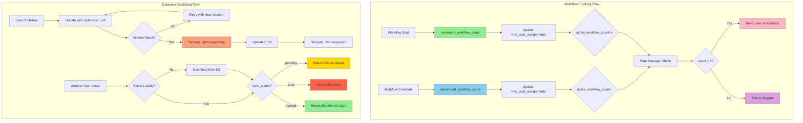

# Workflow Tracking and Dataview Publishing Enhancements

## Executive Summary
- **Workflow Tracking** = Monitor active workflows for free tier users to prevent unsafe migrations
- **Dataview Sync Status** = Track publishing state and local availability of published experiments
- **Optimistic Locking** = Prevent concurrent modification conflicts during publish operations
- **S3 Download on Demand** = Automatically fetch published experiments from S3 when accessed

## Key Architectural Principles

1. **Safe Free Tier Migration**
   - Track active workflow count per free tier user
   - Free Manager NEVER migrates users with active workflows (count > 0)
   - Prevents workflow interruption and data corruption

2. **Three-State Sync Model**
   - **pending**: Published but not yet synced to local storage
   - **synced**: Available locally (either uploaded or downloaded)
   - **error**: Sync failed (upload/download problem)

3. **Optimistic Locking for Data Integrity**
   - Version field on ExperimentRecord prevents concurrent modifications
   - Atomic increment on version during updates
   - Retry logic handles version conflicts gracefully

4. **Lazy Loading from S3**
   - Published experiments stored in S3 as source of truth
   - Local instances download on-demand when accessed
   - Transparent to user with proper status codes (202, 503)

## Architecture Overview



### Key Constraints Satisfied

1. **No Workflow Interruption** - Free Manager only migrates idle users
2. **Data Consistency** - Optimistic locking prevents publish conflicts
3. **S3 as Source of Truth** - Published experiments always available via S3
4. **User Experience** - Clear status codes and retry guidance for pending experiments

### Responsibility Matrix

| Responsibility                        | Workflow Tracking   | Dataview Publishing | Free Manager       |
|---------------------------------------|---------------------|---------------------|--------------------|
| Track active workflows                | ✅ Exclusive        | ❌ Never            | ❌ Never           |
| Update workflow count                 | ✅ Atomic increment | ❌ Never            | ❌ Never           |
| Check migration safety                | ❌ Never            | ❌ Never            | ✅ Reads count     |
| Publish experiments                   | ❌ Never            | ✅ With lock        | ❌ Never           |
| Track sync status                     | ❌ Never            | ✅ Exclusive        | ❌ Never           |
| Upload to S3                          | ❌ Never            | ✅ After publish    | ❌ Never           |
| Download from S3                      | ❌ Never            | ✅ On access        | ❌ Never           |
| Handle version conflicts              | ❌ Never            | ✅ With retry       | ❌ Never           |

---

## Implementation Details

### 1. Workflow Tracking Module

**File:** `studio/app/common/core/workflow/workflow_tracking.py` (NEW)

**Core Functions:**

```python
def increment_workflow_count(user_id: Optional[int]) -> None:
    """
    Atomically increment active_workflow_count for free tier user.

    Called when workflow starts.
    Uses SQLAlchemy update() for atomic operation (prevents race conditions).

    Updates:
    - active_workflow_count += 1
    - last_workflow_start = NOW()
    """
```

```python
def decrement_workflow_count(user_id: Optional[int]) -> None:
    """
    Atomically decrement active_workflow_count for free tier user.

    Called when workflow completes (success or failure).
    Uses func.greatest(0, count - 1) to ensure count never goes negative.

    Updates:
    - active_workflow_count = max(0, count - 1)
    - last_workflow_end = NOW()
    """
```

**Integration Points:**

- **workflow_runner.py** (lines 74-79): Increments count in `__init__`
- **snakemake_executor.py**: Decrements count after workflow execution

**Race Condition Prevention:**

```python
# Atomic increment using SQLAlchemy's update()
stmt = (
    update(FreeUserAssignment)
    .where(FreeUserAssignment.user_id == str(user_id))
    .values(
        active_workflow_count=FreeUserAssignment.active_workflow_count + 1,
        last_workflow_start=func.now(),
    )
)
```

---

### 2. Free User Assignment Model

**File:** `studio/app/common/models/free_user.py` (NEW)

**Schema:**

| Field                    | Type      | Description                                      |
|--------------------------|-----------|--------------------------------------------------|
| user_id                  | VARCHAR   | Primary key, user identifier                     |
| instance_id              | VARCHAR   | ECS instance ID                                  |
| assigned_at              | TIMESTAMP | When user was assigned to instance               |
| last_activity            | TIMESTAMP | Last user activity (updated by heartbeat)        |
| active_workflow_count    | INTEGER   | Number of active workflows (default: 0)          |
| last_workflow_start      | TIMESTAMP | Timestamp of last workflow start                 |
| last_workflow_end        | TIMESTAMP | Timestamp of last workflow completion            |
| migration_count          | INTEGER   | Number of migrations (for analytics)             |
| last_migration           | TIMESTAMP | Timestamp of last migration                      |
| logged_out_at            | TIMESTAMP | Explicit logout timestamp                        |

**Key Features:**
- `active_workflow_count` prevents unsafe migration (if > 0, user has running workflows)
- Timestamps enable analytics and debugging
- Migration tracking for capacity planning

---

### 3. Dataview Publishing with Sync Status

**File:** `studio/app/common/routers/dataview.py`

**Publish Endpoint** (lines 276-377):

```python
@router.put("/publish/{id}/{flag}")
async def publish_dataview_records(
    id: int,
    flag: PublishFlags,
    db: Session = Depends(get_db),
    current_user: User = Depends(get_current_user),
):
    """
    Publish/unpublish with optimistic locking.

    Features:
    - Retry loop (max 3 attempts) for version conflicts
    - Sets local_sync_status = "pending" when publishing
    - Atomically increments version number
    - Returns 409 Conflict on persistent version mismatch
    """
```

**Optimistic Lock Implementation:**

```python
stmt = (
    update(models.ExperimentRecord)
    .where(models.ExperimentRecord.id == record.id)
    .where(models.ExperimentRecord.version == current_version)  # Lock condition
    .values(
        publish_status=new_publish_status,
        local_sync_status=new_sync_status,
        version=models.ExperimentRecord.version + 1,  # Atomic increment
    )
)

result = db.execute(stmt)

# If rowcount == 0, version conflict detected
if result.rowcount == 0:
    # Retry or raise 409 Conflict
```

**Public Access Endpoint** (lines 196-271):

```python
@public_router.get("/{workspace_id}/{unique_id}/reproduce")
async def public_reproduce_experiment(
    workspace_id: str,
    unique_id: str,
):
    """
    Public access with lazy S3 download.

    Returns:
    - 202 Accepted: Experiment published but not synced yet
    - 503 Service Unavailable: Sync failed or download error
    - 200 OK: Experiment data available
    """
```

**Status Code Flow:**

1. **Check Local Existence:**
   - If experiment exists locally → Check sync_status
   - If not exists → Download from S3

2. **sync_status = "pending":**
   - Return HTTP 202 with Retry-After header
   - Frontend shows "Publishing in progress" message
   - Auto-retry every 30 seconds (max 10 times = 5 minutes)

3. **sync_status = "error":**
   - Return HTTP 503
   - Frontend shows error message with retry button

4. **sync_status = "synced":**
   - Return HTTP 200 with experiment data
   - Normal workflow rendering

---

### 4. Experiment Record Model Updates

**File:** `studio/app/common/models/experiment.py`

**New Fields:**

```python
local_sync_status: str = Field(
    sa_column=Column(
        String(20),
        nullable=False,
        default=LocalSyncStatus.synced.value,
        comment="Sync status on local storage: pending, synced, error",
    )
)

version: int = Field(
    sa_column=Column(
        Integer(),
        nullable=False,
        default=0,
        comment="Version number for optimistic locking",
    ),
    default=0,
)
```

**LocalSyncStatus Enum:**

```python
class LocalSyncStatus(str, Enum):
    pending = "pending"  # Published, not synced yet
    synced = "synced"    # Available locally
    error = "error"      # Sync failed
```

---

### 5. Frontend Integration

**File:** `frontend/src/components/Dataview/WorkflowDetailsView.tsx`

**State Management** (lines 66-71):

```typescript
const [syncStatus, setSyncStatus] = useState<{
  pending: boolean
  error: boolean
  message: string
}>({ pending: false, error: false, message: "" })
const [retryCount, setRetryCount] = useState(0)
```

**Auto-Retry Logic** (lines 107-130):

```typescript
if (status === 202) {
  // Experiment is published but not yet synced
  setSyncStatus({
    pending: true,
    error: false,
    message: data?.message || "Publishing in progress, check back in a few minutes.",
  })

  // Auto-retry after 30 seconds (max 10 retries = 5 minutes)
  if (retryCount < 10) {
    setTimeout(() => {
      setRetryCount(retryCount + 1)
    }, 30000)
  }
}
```

**User Interface:**

1. **Pending State (202):**
   - HourglassEmptyIcon with warning color
   - Info alert: "Publishing in progress..."
   - Auto-retry every 30 seconds
   - Max retry: 5 minutes

2. **Error State (503):**
   - ErrorOutlineIcon with error color
   - Error alert with message
   - Manual retry button

3. **Success State (200):**
   - Normal workflow details rendering

---

## Flow Diagrams

### Workflow Tracking Flow

```
┌──────────────────────────────────────────────────────────┐
│ 1. User Starts Workflow                                 │
│    → WorkflowRunner.__init__() called                   │
│    → increment_workflow_count(user_id)                  │
└──────────────────────────────────────────────────────────┘
                         ↓
┌──────────────────────────────────────────────────────────┐
│ 2. Atomic DB Update (SQLAlchemy)                        │
│    → UPDATE free_user_assignments                       │
│       SET active_workflow_count = active_workflow_count + 1,│
│           last_workflow_start = NOW()                   │
│       WHERE user_id = ?                                 │
└──────────────────────────────────────────────────────────┘
                         ↓
┌──────────────────────────────────────────────────────────┐
│ 3. Workflow Runs (Snakemake Execution)                  │
│    → User is "protected" from migration                 │
│    → Free Manager sees active_workflow_count > 0        │
└──────────────────────────────────────────────────────────┘
                         ↓
┌──────────────────────────────────────────────────────────┐
│ 4. Workflow Completes (Success or Failure)              │
│    → snakemake_execute() completion handler             │
│    → decrement_workflow_count(user_id)                  │
└──────────────────────────────────────────────────────────┘
                         ↓
┌──────────────────────────────────────────────────────────┐
│ 5. Atomic DB Update (with Safety)                       │
│    → UPDATE free_user_assignments                       │
│       SET active_workflow_count = GREATEST(0, count - 1),│
│           last_workflow_end = NOW()                     │
│       WHERE user_id = ?                                 │
└──────────────────────────────────────────────────────────┘
                         ↓
┌──────────────────────────────────────────────────────────┐
│ 6. Free Manager Can Migrate User (if idle)             │
│    → active_workflow_count = 0                          │
│    → No active workflows, safe to migrate               │
└──────────────────────────────────────────────────────────┘
```

### Dataview Publishing Flow

```
┌──────────────────────────────────────────────────────────┐
│ 1. User Clicks "Publish" in Frontend                    │
│    → PUT /api/dataview/publish/{id}/on                  │
└──────────────────────────────────────────────────────────┘
                         ↓
┌──────────────────────────────────────────────────────────┐
│ 2. Backend: Optimistic Lock Update                     │
│    → Read current version from DB                       │
│    → UPDATE experiment_record                           │
│       SET publish_status = 1,                           │
│           local_sync_status = 'pending',                │
│           version = version + 1                         │
│       WHERE id = ? AND version = ?                      │
└──────────────────────────────────────────────────────────┘
                         ↓
┌──────────────────────────────────────────────────────────┐
│ 3a. Success (rowcount = 1)                              │
│    → Return 200 OK                                      │
│    → Trigger S3 upload (background task)                │
└──────────────────────────────────────────────────────────┘
         |               ↓
         |    ┌──────────────────────────────────────────────────────────┐
         |    │ 3b. Version Conflict (rowcount = 0)                      │
         |    │    → Another user modified concurrently                  │
         |    │    → Retry (max 3 times)                                │
         |    └──────────────────────────────────────────────────────────┘
         |               ↓
         |    ┌──────────────────────────────────────────────────────────┐
         |    │ 3c. Persistent Conflict                                  │
         |    │    → Return 409 Conflict                                │
         |    │    → User must try again                                │
         |    └──────────────────────────────────────────────────────────┘
         ↓
┌──────────────────────────────────────────────────────────┐
│ 4. S3 Upload Completes                                  │
│    → UPDATE experiment_record                           │
│       SET local_sync_status = 'synced'                  │
│       WHERE id = ?                                      │
└──────────────────────────────────────────────────────────┘
```

### Public Access Flow

```
┌──────────────────────────────────────────────────────────┐
│ 1. User Visits Public Link                              │
│    → GET /api/public/dataview/{workspace_id}/{unique_id}/reproduce│
└──────────────────────────────────────────────────────────┘
                         ↓
┌──────────────────────────────────────────────────────────┐
│ 2. Check Local Storage                                  │
│    → os.path.exists(experiment_path)?                   │
└──────────────────────────────────────────────────────────┘
         |                              |
         | No                           | Yes
         ↓                              ↓
┌──────────────────────────────────────┐  ┌──────────────────────────────────────┐
│ 3a. Download from S3                 │  │ 3b. Check sync_status                │
│    → s3.download_experiment()        │  │    → Query experiment_record         │
└──────────────────────────────────────┘  └──────────────────────────────────────┘
         |                                        |
         | Success                                |
         ↓                                        ↓
┌──────────────────────────────────────┐  ┌──────────────────────────────────────┐
│ 4a. Download Failed                  │  │ 4b. Status Check                     │
│    → Return 503 Service Unavailable  │  │    → "pending"  → Return 202 Accepted│
│    → Frontend shows error            │  │    → "error"    → Return 503 Error   │
└──────────────────────────────────────┘  │    → "synced"   → Return 200 OK      │
                                          └──────────────────────────────────────┘
                                                   ↓
                                          ┌──────────────────────────────────────┐
                                          │ 5. Frontend Handling                 │
                                          │    → 202: Auto-retry every 30s       │
                                          │    → 503: Show retry button          │
                                          │    → 200: Render workflow            │
                                          └──────────────────────────────────────┘
```

---

## Edge Case Handling

### 1. Concurrent Workflow Operations (Race Condition)

**Problem:** Two workflows start/end simultaneously for same user.

**Solution:** Atomic SQL operations with database-level locking:
```python
# Database executes this atomically
UPDATE free_user_assignments
SET active_workflow_count = active_workflow_count + 1
WHERE user_id = ?
```

**Guarantee:** No race condition possible - database handles concurrency

### 2. Workflow Crashes Without Cleanup

**Problem:** Workflow crashes before calling decrement_workflow_count().

**Solution:** Free Manager reconciliation (planned):
- Periodically check for stale active_workflow_count
- If last_workflow_start > 2 hours and no running Snakemake process
- Reset active_workflow_count = 0

**Current Behavior:** User remains "protected" until manual intervention

### 3. Concurrent Publish Operations

**Problem:** Two users try to publish same experiment simultaneously.

**Solution:** Optimistic locking with retry:
```python
# Attempt 1: Version = 5
UPDATE ... WHERE id = ? AND version = 5  # User A succeeds
UPDATE ... WHERE id = ? AND version = 5  # User B fails (version now 6)

# Attempt 2: User B retries with version = 6
UPDATE ... WHERE id = ? AND version = 6  # User B succeeds
```

**Guarantee:** At most 3 retries, then 409 Conflict returned

### 4. S3 Upload Fails After Publishing

**Problem:** Experiment published (publish_status=1) but S3 upload fails.

**Solution:** sync_status remains "pending":
- Users accessing get HTTP 202
- Background job retries S3 upload
- Manual intervention can re-trigger upload

**User Experience:** "Publishing in progress" message, auto-retry

### 5. S3 Download Fails on Access

**Problem:** User tries to access published experiment, S3 download fails.

**Solution:** Explicit error handling:
```python
if not await s3_controller.download_experiment(workspace_id, unique_id):
    return JSONResponse(
        status_code=503,
        content={
            "status": "download_error",
            "message": "Failed to load experiment data, please try again later"
        }
    )
```

**User Experience:** Error message with manual retry button

### 6. Never-Ending Auto-Retry in Frontend

**Problem:** Frontend retries forever if experiment never syncs.

**Solution:** Max retry limit:
```typescript
// Auto-retry after 30 seconds (max 10 retries = 5 minutes)
if (retryCount < 10) {
    setTimeout(() => {
        setRetryCount(retryCount + 1)
    }, 30000)
}
```

**Guarantee:** Auto-retry stops after 5 minutes, user can manually retry

---

## Database Schema Changes

### Migration Required

**Table:** `free_user_assignments` (NEW)

```sql
CREATE TABLE free_user_assignments (
    user_id VARCHAR(255) PRIMARY KEY,
    instance_id VARCHAR(20) NOT NULL,
    assigned_at TIMESTAMP NOT NULL DEFAULT CURRENT_TIMESTAMP,
    last_activity TIMESTAMP NOT NULL DEFAULT CURRENT_TIMESTAMP,
    active_workflow_count INTEGER NOT NULL DEFAULT 0
        COMMENT 'Number of active workflows running for this user',
    last_workflow_start TIMESTAMP NULL
        COMMENT 'Timestamp of last workflow start',
    last_workflow_end TIMESTAMP NULL
        COMMENT 'Timestamp of last workflow completion',
    migration_count INTEGER NOT NULL DEFAULT 0
        COMMENT 'Number of times user has been migrated between instances',
    last_migration TIMESTAMP NULL
        COMMENT 'Timestamp of last migration event',
    logged_out_at TIMESTAMP NULL
        COMMENT 'Timestamp when user explicitly logged out'
);
```

**Table:** `experiment_record` (ALTER)

```sql
ALTER TABLE experiment_record
ADD COLUMN local_sync_status VARCHAR(20) NOT NULL DEFAULT 'synced'
    COMMENT 'Sync status on local storage: pending, synced, error';

ALTER TABLE experiment_record
ADD COLUMN version INTEGER NOT NULL DEFAULT 0
    COMMENT 'Version number for optimistic locking';
```

---

## Configuration

### Environment Variables

**Required for S3 Integration:**
```bash
S3_DEFAULT_BUCKET_NAME      # S3 bucket for published experiments
AWS_ACCESS_KEY_ID           # AWS credentials (or IAM role)
AWS_SECRET_ACCESS_KEY       # AWS credentials (or IAM role)
AWS_REGION                  # AWS region (e.g., us-east-1)
```

### HTTP Status Codes

| Code | Meaning                  | User Experience                           |
|------|--------------------------|-------------------------------------------|
| 200  | Success                  | Render experiment workflow                |
| 202  | Accepted (pending sync)  | "Publishing in progress" + auto-retry     |
| 409  | Conflict (version clash) | "Concurrent modification, please retry"   |
| 503  | Service Unavailable      | "Temporarily unavailable" + retry button  |

---

## Key Functions Reference

### Workflow Tracking

**In workflow_tracking.py:**
- `increment_workflow_count(user_id)` - Called on workflow start
- `decrement_workflow_count(user_id)` - Called on workflow completion
- `get_active_workflow_count(user_id)` - Query current count

### Dataview Publishing

**In dataview.py:**
- `publish_dataview_records(id, flag)` - Publish with optimistic lock (lines 276-377)
- `public_reproduce_experiment(workspace_id, unique_id)` - Public access with S3 download (lines 196-271)

**In dataview_services.py:**
- `bulk_publish_dataview_records(user_id, ids, flag)` - Bulk publish with sync status

### Frontend

**In WorkflowDetailsView.tsx:**
- Auto-retry logic (lines 107-130)
- Pending state UI (lines 251-275)
- Error state UI (lines 276-296)

---

## Testing Considerations

### Unit Tests

**New Test Files:**
- `test_workflow_tracking.py` (lines 163) - Tests increment/decrement/race conditions
- `test_dataview_publish.py` (lines 285) - Tests optimistic locking scenarios

**Key Test Cases:**
1. Concurrent workflow start/end (race condition)
2. Optimistic lock version conflict
3. S3 download failure handling
4. Sync status transitions (pending → synced → error)

### Integration Tests

**Scenarios:**
1. Publish experiment → Upload to S3 → Access from different instance
2. Concurrent publish from two users → One succeeds, one retries
3. Workflow tracking during Free Manager migration decision

---

## Monitoring and Logging

### Workflow Tracking Logs

**Location:** `/aws/lambda/backend-app` (CloudWatch)

**Key Log Messages:**
```
WORKFLOW START: {workflow_name} (ID: {unique_id}, User: {user_id})
Incremented workflow count for user {user_id} (free tier workflow started)
WORKFLOW COMPLETED: {workflow_name} completed in {duration}s
Decremented workflow count for user {user_id} (free tier workflow completed)
```

### Dataview Publishing Logs

**Key Log Messages:**
```
Published experiment {id}, sync_status=pending
Optimistic lock conflict for experiment {id}, retrying (attempt 2/3)
Downloading published experiment {workspace_id}/{unique_id} from S3
Failed to download experiment {workspace_id}/{unique_id} from S3
Experiment {workspace_id}/{unique_id} is pending sync, returning 202
```

### Metrics to Monitor

| Metric                          | Description                              | Alert Threshold     |
|---------------------------------|------------------------------------------|---------------------|
| active_workflow_count_total     | Sum across all free tier users           | > 100 (capacity)    |
| publish_version_conflict_rate   | % of publish attempts with version clash | > 10%               |
| s3_download_failure_rate        | % of S3 downloads that fail              | > 5%                |
| pending_sync_duration_avg       | Avg time experiments stay in "pending"   | > 5 minutes         |

---

## Summary of Changes

### Files Modified
- `studio/app/common/core/workflow/workflow_runner.py` - Add workflow tracking calls
- `studio/app/common/routers/dataview.py` - Optimistic locking + S3 download
- `studio/app/common/core/dataview/dataview_services.py` - Bulk publish with sync status
- `studio/app/common/models/experiment.py` - Add local_sync_status + version fields
- `frontend/src/components/Dataview/WorkflowDetailsView.tsx` - Handle 202/503 status codes

### Files Added
- `studio/app/common/core/workflow/workflow_tracking.py` (NEW) - Workflow count management
- `studio/app/common/models/free_user.py` (NEW) - Free user assignment model
- `studio/app/common/core/workflow/test_workflow_tracking.py` (NEW) - Unit tests
- `studio/app/common/routers/test_dataview_publish.py` (NEW) - Publish tests

### Files Updated (Lock Files)
- `frontend/yarn.lock` - Frontend dependency updates
- `poetry.lock` - Backend dependency updates
- `.gitignore` - Add .claude and Lambda deployment package exclusions
