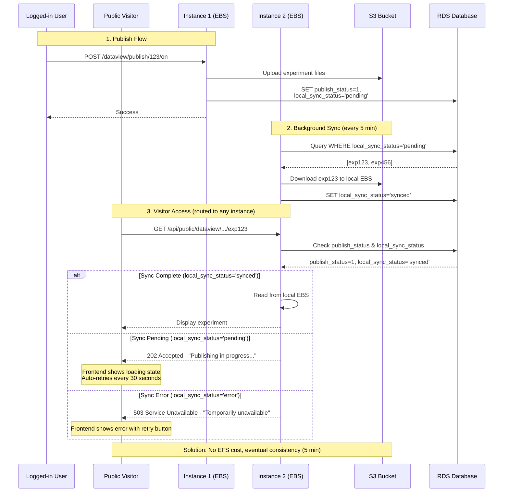
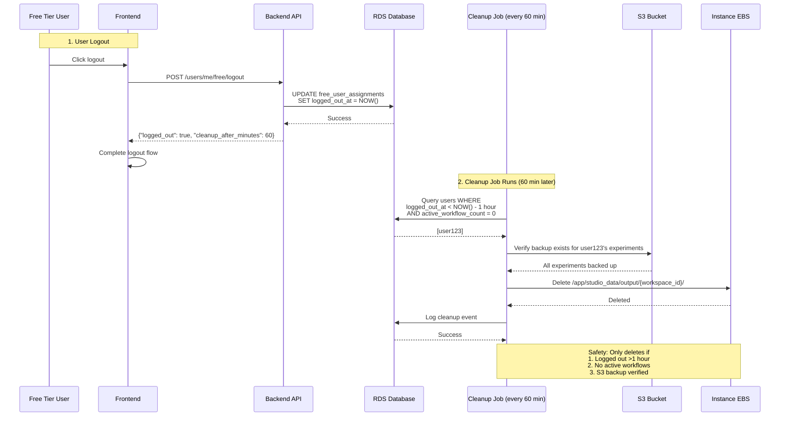

# EBS Storage

## Executive Summary

## Key Architectural Constraints

These are the fundamental constraints that the EBS implementation satisfies:

1. **Multi-instance data accessibility**
   - Public visitors have no sticky session and can be routed to ANY instance by ALB
   - Published experiment data must be accessible from all instances simultaneously
   - Solution: Background sync job downloads published experiments to all instances

2. **User rebalancing requires data portability**
   - Free Manager Lambda can migrate users between instances at any time
   - Users must be able to access their data immediately after migration
   - Solution: S3 as source of truth, local EBS as cache

3. **Storage durability and backup**
   - S3 is the source of truth for all user data (durable backup)
   - Local storage can be lost (instance termination)
   - Solution: All data uploaded to S3, verified before local deletion

4. **Performance requirements**
   - Snakemake workflow execution requires fast file I/O
   - Users expect immediate access to experiments and uploaded files
   - Solution: Local EBS provides fast I/O, S3 sync happens in background

5. **Cost constraints**
   - Free-tier storage costs for 10 users (2 instances):
     - **With proper cleanup:** $35-51/month (EFS + EBS + S3)
     - **Current state (no cleanup):** $86-96/month (accumulated garbage data)
   - Solution: Automated cleanup on logout reduces EBS usage, eliminates EFS costs

## Architecture Overview

### Key Constraints Satisfied

1. **Multi-instance accessibility** - Public visitors routed to any instance by ALB
2. **User rebalancing** - Free Manager Lambda migrates users between instances
3. **Storage durability** - S3 as source of truth, EBS as performance cache
4. **Cost optimization** - Automated cleanup prevents data accumulation

### Data Flow

```
┌─────────────────┐
│ User Publishes  │ → S3 upload → DB: local_sync_status='pending'
└─────────────────┘
         ↓
┌─────────────────┐
│ Background Sync │ → Download to all instances → DB: local_sync_status='synced'
│ (every 5 min)   │
└─────────────────┘
         ↓
┌─────────────────┐
│ Public Access   │ → Check sync status → Return 200/202/503
└─────────────────┘

┌─────────────────┐
│ User Logout     │ → DB: logged_out_at=NOW()
└─────────────────┘
         ↓
┌─────────────────┐
│ Cleanup Job     │ → Verify: logged_out >1hr, workflows=0, S3 backup exists
│ (every 60 min)  │ → Delete local EBS data
└─────────────────┘
```

### Safety Guarantees

| Guarantee                | Mechanism                                        |
|--------------------------|--------------------------------------------------|
| No data loss             | S3 backup verified before local deletion         |
| No workflow interruption | Cleanup only when `active_workflow_count = 0`    |
| No user disruption       | 1-hour grace period after logout                 |
| Eventual consistency     | Published experiments available within 5 minutes |
| Graceful degradation     | Frontend handles 202/503 responses               |

---

## Details

### 1. Workflow Tracking

**Files:** `workflow_tracking.py`, `workflow_runner.py`, `snakemake_executor.py`

**Functionality:**
- Increments `active_workflow_count` on workflow start
- Decrements on completion/failure
- Prevents cleanup during active workflows

### 2. Frontend Logout Integration

**Files Modified:**
- `frontend/src/api/users/UsersMe.ts` - Added `logoutFreeUserApi()`
- `frontend/src/utils/auth/AuthUtils.ts` - Integrated API call (fire-and-forget)

**Behavior:**
- Calls `/api/users/me/free/logout` on logout
- Updates `logged_out_at` timestamp in DB
- Proceeds even if API call fails

### 3. Frontend 202/503 Response Handling

**File Modified:** `frontend/src/components/Dataview/WorkflowDetailsView.tsx`

**Response Handling:**

| Status | UI Display | Behavior |
|--------|-----------|----------|
| 202 (Pending) | Hourglass icon + info alert | Auto-retry every 30s (max 10 retries) |
| 503 (Error) | Error icon + error alert | Manual retry button |
| 200 (Synced) | Normal experiment display | Standard workflow view |

---

## Edge Case Handling

### 1. S3 Download Failures

**Implementation:** Exponential backoff retry (3 attempts: 1s, 2s, 4s delays)

**Monitoring:**
- CloudWatch metrics: `ExperimentsSynced`, `SyncErrors`, `SyncErrorRate`
- Operator alerts when error rate > 50%

### 2. Instance Termination During Cleanup

**Implementation:** Orphaned data detection on every cleanup run

**Behavior:**
- Verifies EC2 instance state before cleanup
- Automatically cleans data from terminated instances
- Only when `active_workflow_count = 0`

### 3. Concurrent Publish/Unpublish

**Implementation:** Optimistic locking with version field

**Behavior:**
- Automatic retry on concurrent modification (max 3 attempts)
- Returns 409 Conflict if retries exhausted
- Prevents lost updates and race conditions

---

## Testing Summary

### Test Coverage

| Component | Tests | File |
|-----------|-------|------|
| Workflow Tracking | 11 | `test_workflow_tracking.py` |
| Sync Job | 3 | `test_sync_job.py` |
| Cleanup Job | 10 | `test_cleanup_job.py` |
| Dataview Publish | 9 | `test_dataview_publish.py` |
| Logout Endpoint | 5 | `test_users_me_logout.py` |
| **Total** | **38** | **5 files** |

### Key Test Scenarios

**Backend:**
-  Workflow count increment/decrement
-  Exponential backoff on S3 failures
-  S3 backup verification before cleanup
-  Orphaned data cleanup from terminated instances
-  Optimistic locking on concurrent publish/unpublish
-  202/503 responses based on sync status

**Frontend:**
-  Logout API call integration
-  202 response auto-retry (30s intervals)
-  503 response manual retry
-  Graceful error handling

### CI/CD Integration

**File:** `.github/workflows/test_new_features.yml`

**Triggers:** Push/PR to main/develop branches

**Jobs:** workflow-tracking, background-jobs, dataview-endpoints, integration-tests, edge-cases

---

## Architecture Diagram

### Public Dataview Access Flow (EBS + Background Sync)



### Data Cleanup Flow on Logout



---

## Files

### Backend
- `studio/app/common/core/workflow/workflow_tracking.py`
- `studio/app/common/core/background/sync_job.py`
- `studio/app/common/core/background/cleanup_job.py`
- `studio/app/common/routers/dataview.py`
- `studio/alembic/versions/a5b9c8d7e6f5_*.py`

### Frontend
- `frontend/src/api/users/UsersMe.ts`
- `frontend/src/utils/auth/AuthUtils.ts`
- `frontend/src/components/Dataview/WorkflowDetailsView.tsx`

### Testing
- `studio/tests/app/common/core/workflow/test_workflow_tracking.py`
- `studio/tests/app/common/core/background/test_sync_job.py`
- `studio/tests/app/common/core/background/test_cleanup_job.py`
- `studio/tests/app/common/routers/test_dataview_publish.py`
- `studio/tests/app/common/routers/test_users_me_logout.py`
- `studio/tests/README.md`
- `.github/workflows/test_new_features.yml`

---

## Manual Test Cases

### Category 1: Workflow Count Tracking

#### TC1.1: Basic Workflow Count Increment
**Objective:** Verify workflow count increases when a workflow starts

**Steps:**
1. Log in as free tier user
2. Query database: `SELECT active_workflow_count FROM free_user_assignments WHERE user_id = {user_id}`
3. Note the current count (should be 0)
4. Start a new workflow execution
5. Immediately query database again
6. Verify `active_workflow_count` increased by 1
7. Verify `last_workflow_start` timestamp updated to current time

**Expected Result:**
- Count increments atomically
- Timestamp updated correctly
- No errors in application logs

---

#### TC1.2: Workflow Count Decrement on Completion
**Objective:** Verify workflow count decreases when a workflow completes successfully

**Steps:**
1. Start a workflow (count should be 1)
2. Wait for workflow to complete successfully
3. Query database: `SELECT active_workflow_count FROM free_user_assignments WHERE user_id = {user_id}`
4. Verify count decreased back to 0
5. Verify `last_workflow_end` timestamp updated

**Expected Result:**
- Count decrements to 0
- `last_workflow_end` > `last_workflow_start`
- No negative counts

---

#### TC1.3: Workflow Count Decrement on Failure
**Objective:** Verify workflow count decreases even when workflow fails

**Steps:**
1. Start a workflow that will fail (e.g., invalid parameters)
2. Verify count is 1 while running
3. Wait for workflow to fail
4. Query database and verify count returned to 0

**Expected Result:**
- Count decrements on failure
- No workflow count leaks

---

#### TC1.4: Multiple Concurrent Workflows
**Objective:** Verify count handles multiple simultaneous workflows

**Steps:**
1. Start workflow #1, verify count = 1
2. While #1 is running, start workflow #2, verify count = 2
3. While both running, start workflow #3, verify count = 3
4. Wait for workflow #1 to complete, verify count = 2
5. Wait for workflow #2 to complete, verify count = 1
6. Wait for workflow #3 to complete, verify count = 0

**Expected Result:**
- Count accurately reflects active workflows
- No race conditions cause incorrect counts

---

#### TC1.5: Workflow Count Never Goes Negative
**Objective:** Verify count stays at 0 even with race conditions

**Steps:**
1. Start with count = 0
2. Manually call decrement endpoint multiple times rapidly
3. Query database and verify count remains 0 (uses `func.greatest(0, count-1)`)

**Expected Result:**
- Count never goes below 0
- Database constraint prevents negative values

---

#### TC1.6: Paid User Workflow Count Not Tracked
**Objective:** Verify paid users are not tracked (no EBS migration)

**Steps:**
1. Log in as paid tier user
2. Start a workflow
3. Query `free_user_assignments` table
4. Verify no record exists for paid user

**Expected Result:**
- Paid users not in `free_user_assignments` table
- Workflow executes normally without tracking

---

#### TC1.7: Workflow Count Decrement on Exception (Critical Bug Fix)
**Objective:** Verify count decrements even when workflow execution fails with exceptions

**Steps:**
1. Log in as free tier user
2. Note current count (should be 0)
3. Start a workflow that will fail (e.g., invalid configuration, missing files)
4. Wait for workflow to fail/error
5. Query database:
   ```sql
   SELECT active_workflow_count FROM free_user_assignments WHERE user_id = {user_id}
   ```
6. Verify count returned to 0

**Expected Result:**
- Count decrements to 0 even on workflow failure
- No workflow count leaks
- Logs show "Decremented workflow count for user {user_id}"

**Bug Context:**
Previously, if an exception occurred during workflow execution (before the decrement call), the count would remain at 1 permanently. This fix ensures decrement happens in a `finally` block.

---

### Category 2: Background Sync Job

#### TC2.1: Basic Sync Job Execution
**Objective:** Verify sync job runs and downloads pending experiments

**Steps:**
1. Publish an experiment (sets `local_sync_status = 'pending'`)
2. Verify in S3 that experiment files were uploaded
3. On a DIFFERENT instance, query database:
   ```sql
   SELECT local_sync_status FROM experiment_records WHERE id = {exp_id}
   ```
4. Wait for sync job to run (max 5 minutes) or manually trigger
5. Verify `local_sync_status` changed to `'synced'`
6. On the second instance, verify files exist locally:
   ```
   /app/studio_data/output/{workspace_id}/{uid}/experiment.yaml
   /app/studio_data/output/{workspace_id}/{uid}/workflow.yaml
   ```

**Expected Result:**
- Status changes from `pending` → `synced`
- Files downloaded to local EBS
- CloudWatch metric `ExperimentsSynced` incremented

---

#### TC2.2: Sync Job Handles Errors Gracefully
**Objective:** Verify sync job marks experiments as error when S3 download fails

**Steps:**
1. Publish an experiment
2. Manually delete the experiment from S3 bucket (simulate S3 failure)
3. Wait for sync job to run
4. Query database and verify `local_sync_status = 'error'`
5. Check CloudWatch metric `SyncErrors` incremented

**Expected Result:**
- Status marked as `error`
- Sync job continues processing other experiments
- Error logged but job doesn't crash

---

#### TC2.3: Sync Job Retries Failed Experiments
**Objective:** Verify experiments with `local_sync_status = 'error'` are retried

**Steps:**
1. Create an experiment in error state (from TC2.2)
2. Restore the experiment files to S3
3. Wait for next sync job run
4. Verify `local_sync_status` changed from `error` → `synced`
5. Verify files now exist locally

**Expected Result:**
- Error status experiments included in retry queue
- Successfully synced after S3 restored

---

#### TC2.4: Sync Job Limits Concurrent Downloads
**Objective:** Verify max 3 concurrent S3 downloads

**Steps:**
1. Publish 10 experiments simultaneously (all `local_sync_status = 'pending'`)
2. Trigger sync job manually
3. Monitor sync job logs for concurrent download messages
4. Verify no more than 3 downloads happening simultaneously

**Expected Result:**
- Semaphore limits concurrency to 3
- All 10 experiments eventually synced
- No resource exhaustion

---

#### TC2.5: Sync Job Skips Already Synced Experiments
**Objective:** Verify optimization skips experiments already local

**Steps:**
1. Publish experiment and wait for sync (status = `synced`)
2. Verify files exist locally
3. Manually set `local_sync_status = 'pending'` in database
4. Trigger sync job
5. Check logs for "already exists locally" message
6. Verify no S3 download occurred (check S3 access logs or metrics)

**Expected Result:**
- Sync job detects existing files
- Skips download (optimization)
- Still marks as synced

---

#### TC2.6: Sync Job Lock Prevents Concurrent Runs
**Objective:** Verify file lock prevents multiple sync jobs

**Steps:**
1. Manually trigger sync job on instance 1
2. While still running, manually trigger sync job on instance 2
3. Verify second job logs "Lock already held, skipping run"
4. Verify only one job processes experiments

**Expected Result:**
- Lock file `/tmp/optinist_sync_job.lock` prevents concurrent execution
- No duplicate downloads
- Lock released after job completes

---

#### TC2.7: Sync Job Processes Max 10 Experiments Per Run
**Objective:** Verify batch size limit

**Steps:**
1. Publish 15 experiments
2. Verify all have `local_sync_status = 'pending'`
3. Trigger sync job once
4. Query database and verify exactly 10 changed to `synced`
5. Verify 5 still `pending`
6. Trigger sync job again
7. Verify remaining 5 now synced

**Expected Result:**
- First run: 10 experiments synced
- Second run: 5 experiments synced
- Prevents job timeout with large backlogs

---

### Category 3: Background Cleanup Job

#### TC3.1: Basic Cleanup After Logout
**Objective:** Verify data cleaned 1 hour after logout

**Steps:**
1. Log in as free user and create some experiments
2. Verify files exist in `/app/studio_data/output/{workspace_id}/`
3. Log out via UI (triggers `POST /users/me/free/logout`)
4. Query database:
   ```sql
   SELECT logged_out_at, active_workflow_count FROM free_user_assignments WHERE user_id = {user_id}
   ```
5. Verify `logged_out_at` is set to current timestamp
6. Wait 61 minutes (1 hour grace period + 1 minute)
7. Trigger cleanup job or wait for next scheduled run (60 min interval)
8. Query database and verify `free_user_assignments` record removed
9. Check filesystem and verify workspace directory deleted

**Expected Result:**
- Logout timestamp recorded
- Data retained during grace period
- Data cleaned after 1 hour
- Database record removed

---

#### TC3.2: Cleanup Blocked by Active Workflow
**Objective:** Verify cleanup doesn't run if workflows are active

**Steps:**
1. Log in and start a long-running workflow
2. Log out immediately (workflow still running)
3. Verify `logged_out_at` set and `active_workflow_count = 1`
4. Wait 61 minutes
5. Trigger cleanup job
6. Verify cleanup job skips this user (logs should indicate)
7. Verify data still exists
8. Wait for workflow to complete (`active_workflow_count` → 0)
9. Trigger cleanup job again
10. Verify data now cleaned

**Expected Result:**
- Active workflows prevent cleanup
- Safety check prevents workflow interruption
- Cleanup proceeds after workflow completes

---

#### TC3.3: S3 Backup Verification Before Cleanup
**Objective:** Verify local data only deleted if S3 backup exists

**Steps:**
1. Create and publish experiment (uploads to S3)
2. Log out and wait for cleanup trigger
3. Before cleanup runs, manually delete experiment from S3
4. Trigger cleanup job
5. Verify input directory cleaned (always safe)
6. Verify output directory NOT cleaned (S3 verification failed)
7. Check logs for "S3 backup verification failed" message
8. Restore experiment to S3
9. Trigger cleanup again
10. Verify output directory now cleaned

**Expected Result:**
- Input always deleted (backed up on upload)
- Output kept if S3 verification fails
- Prevents data loss

---

#### TC3.4: Orphaned Data Cleanup from Terminated Instance
**Objective:** Verify cleanup handles terminated EC2 instances

**Steps:**
1. Assign user to instance A
2. Create experiments on instance A
3. Log out user
4. Manually terminate instance A (or simulate by stopping it)
5. Wait 61 minutes
6. Trigger cleanup job on instance B
7. Verify cleanup job detects terminated instance
8. Query database and verify user's `free_user_assignments` record removed
9. Note: Physical data cleanup on terminated instance not possible, but DB cleaned

**Expected Result:**
- Cleanup job detects terminated instances via EC2 API
- Database record removed
- No stuck records for dead instances

---

#### TC3.5: Cleanup Job Limits Processing to 50 Users Per Run
**Objective:** Verify batch size prevents timeout

**Steps:**
1. Create 60 free users, all logged out >1 hour ago
2. Verify all eligible for cleanup
3. Trigger cleanup job once
4. Verify exactly 50 users cleaned
5. Verify 10 still have data
6. Trigger cleanup job again
7. Verify remaining 10 cleaned

**Expected Result:**
- MAX_USERS_PER_RUN = 50 enforced
- Job completes within timeout
- All users eventually cleaned

---

#### TC3.6: Cleanup Respects Grace Period Exactly
**Objective:** Verify cleanup doesn't run before 60 minutes

**Steps:**
1. Log out at time T
2. At T+30 minutes, trigger cleanup job
3. Verify data NOT cleaned (within grace period)
4. At T+59 minutes, trigger cleanup job
5. Verify data NOT cleaned (still within grace period)
6. At T+61 minutes, trigger cleanup job
7. Verify data NOW cleaned

**Expected Result:**
- Grace period strictly enforced
- Users have full hour to log back in

---

#### TC3.7: User Logs Back In During Grace Period
**Objective:** Verify logging back in cancels cleanup

**Steps:**
1. Log out (sets `logged_out_at`)
2. Wait 30 minutes
3. Log back in
4. Verify `logged_out_at` cleared (set to NULL)
5. Wait another 60 minutes
6. Trigger cleanup job
7. Verify data NOT cleaned (logout timestamp was cleared)

**Expected Result:**
- Re-login clears logout timestamp
- Cleanup never triggers
- Data preserved

---

### Category 4: Frontend Logout Integration

#### TC4.1: Logout API Call Success
**Objective:** Verify logout endpoint called and database updated

**Steps:**
1. Open browser DevTools Network tab
2. Log in as free user
3. Click logout button
4. In Network tab, verify `POST /api/users/me/free/logout` called
5. Verify response:
   ```json
   {
     "message": "Logout recorded successfully",
     "logged_out": true,
     "cleanup_after_minutes": 60
   }
   ```
6. Query database and verify `logged_out_at` updated

**Expected Result:**
- API called on logout
- Database updated
- User redirected to login page

---

#### TC4.2: Logout Proceeds Even If API Fails
**Objective:** Verify logout completes even if backend unavailable

**Steps:**
1. Log in as free user
2. Stop backend API server (or block network to `/api/users/me/free/logout`)
3. Click logout button
4. Verify user still redirected to login page
5. Verify tokens cleared from localStorage
6. Try to access protected page
7. Verify redirected to login (tokens gone)

**Expected Result:**
- Logout completes locally
- Tokens removed
- User can't access protected resources
- Fire-and-forget API call doesn't block logout

---

#### TC4.3: Paid User Logout Doesn't Call Free Endpoint
**Objective:** Verify endpoint only for free users

**Steps:**
1. Log in as paid user
2. Open DevTools Network tab
3. Click logout
4. Verify NO call to `/api/users/me/free/logout`
5. Verify standard logout flow completes

**Expected Result:**
- Paid users use different logout flow
- No free tier cleanup triggered

---

#### TC4.4: Logout Clears All User Data from Browser
**Objective:** Verify complete cleanup of browser storage

**Steps:**
1. Log in and perform some actions (create experiments, dismiss warnings, etc.)
2. Check localStorage for tokens and settings
3. Check sessionStorage for session data
4. Log out
5. Verify localStorage cleared:
   - `access_token`
   - `refresh_token`
   - `ex_token`
   - `dismissedWarnings`
6. Verify sessionStorage cleared:
   - `storage-refreshed-on-login`

**Expected Result:**
- All auth tokens removed
- User settings cleared
- Clean slate for next login

---

### Category 5: Frontend 202/503 Response Handling

#### TC5.1: Display Pending State (202 Response)
**Objective:** Verify UI shows loading state for pending experiments

**Steps:**
1. Publish an experiment (sets `local_sync_status = 'pending'`)
2. On a DIFFERENT instance (or same instance if you manually set status), open the public experiment URL:
   `/dataview/workflow/reproduce/{workspace_id}/{uid}`
3. Verify backend returns 202 status
4. Verify UI displays:
   - Hourglass icon (⏳)
   - Message: "Publishing in progress, check back in a few minutes."
   - Subtitle: "Experiments are typically available within 5 minutes. This page will auto-retry."
5. Verify no manual action available (auto-retry only)

**Expected Result:**
- Clear pending status displayed
- User understands experiment is being prepared

---

#### TC5.2: Auto-Retry for Pending Experiments
**Objective:** Verify UI automatically retries every 30 seconds

**Steps:**
1. Open experiment with 202 status (pending)
2. Open DevTools Network tab
3. Wait and observe network requests
4. Verify GET request sent every ~30 seconds
5. After sync completes (status → `synced`), verify:
   - Next retry receives 200 response
   - UI updates to show experiment data
   - Auto-retry stops

**Expected Result:**
- Retry every 30 seconds
- Max 10 retries (5 minutes total)
- Stops when successful or max retries reached

---

#### TC5.3: Display Error State (503 Response)
**Objective:** Verify UI shows error for failed sync

**Steps:**
1. Manually set experiment `local_sync_status = 'error'` in database
2. Open public experiment URL
3. Verify backend returns 503 status
4. Verify UI displays:
   - Error icon (⚠️)
   - Message: "Experiment temporarily unavailable, please try again later."
   - Manual "Retry" button

**Expected Result:**
- Clear error message
- User can manually trigger retry

---

#### TC5.4: Manual Retry on 503 Error
**Objective:** Verify retry button works

**Steps:**
1. Trigger 503 error state (from TC5.3)
2. Fix the underlying issue (restore S3 files, run sync job, etc.)
3. Click "Retry" button in UI
4. Verify new GET request sent
5. Verify experiment now loads successfully (200 response)

**Expected Result:**
- Retry button triggers new API call
- UI updates on successful retry

---

#### TC5.5: Transition from Pending to Synced
**Objective:** Verify smooth transition during auto-retry

**Steps:**
1. Start with experiment in pending state (202)
2. UI showing hourglass and auto-retrying
3. While UI is auto-retrying, trigger sync job on backend
4. Wait for next auto-retry (30 seconds)
5. Verify UI seamlessly transitions from pending to loaded state
6. Verify workflow details now displayed

**Expected Result:**
- Smooth transition without page reload
- Auto-retry detects completion
- User experience is seamless

---

#### TC5.6: Max Retry Limit Reached
**Objective:** Verify behavior after 10 failed retries

**Steps:**
1. Keep experiment in pending state (don't let it sync)
2. Wait for 10 auto-retries (5 minutes total)
3. Verify UI stops auto-retrying
4. Verify message persists: "Publishing in progress..."
5. Manually refresh page
6. Verify retry counter resets and auto-retry resumes

**Expected Result:**
- Auto-retry stops after 10 attempts
- User can manually refresh to restart
- No infinite retry loop

---

### Category 6: Publish/Unpublish Functionality

#### TC6.1: Basic Single Experiment Publish
**Objective:** Verify publishing marks experiment as pending sync

**Steps:**
1. Create and run a successful workflow
2. Navigate to experiment in UI
3. Click "Publish" button
4. Verify API call: `POST /api/dataview/publish/{id}/on`
5. Query database:
   ```sql
   SELECT publish_status, local_sync_status, version FROM experiment_records WHERE id = {exp_id}
   ```
6. Verify:
   - `publish_status = 1` (on)
   - `local_sync_status = 'pending'`
   - `version` incremented

**Expected Result:**
- Experiment marked as published
- Sync job will pick it up
- Version incremented for optimistic locking

---

#### TC6.2: Unpublish Experiment
**Objective:** Verify unpublishing removes from public access

**Steps:**
1. Start with published experiment
2. Click "Unpublish" button
3. Verify API call: `POST /api/dataview/publish/{id}/off`
4. Query database and verify:
   - `publish_status = 0` (off)
   - `local_sync_status = 'synced'` (no sync needed for unpublish)
5. Try accessing public URL
6. Verify 404 response (not published)

**Expected Result:**
- Experiment removed from public access
- Local files may remain but not accessible via public API

---

#### TC6.3: Bulk Publish Multiple Experiments
**Objective:** Verify batch operation works

**Steps:**
1. Select 5 experiments in UI
2. Click "Publish All" or bulk action
3. Verify API call: `POST /api/dataview/multiple/publish/on` with `ids=[1,2,3,4,5]`
4. Query database and verify all 5:
   - `publish_status = 1`
   - `local_sync_status = 'pending'`

**Expected Result:**
- All experiments marked for publishing
- Single API call handles batch

---

#### TC6.4: Idempotent Publish (Already Published)
**Objective:** Verify re-publishing same experiment is no-op

**Steps:**
1. Publish experiment (already published)
2. Query database and note current `version` number
3. Click "Publish" again
4. Verify API returns success immediately
5. Query database and verify `version` unchanged (no update)

**Expected Result:**
- No-op optimization
- No unnecessary database writes

---

#### TC6.5: Concurrent Publish Conflict (Optimistic Locking)
**Objective:** Verify optimistic locking prevents concurrent modification

**Steps:**
1. Open experiment in two browser tabs (Tab A and Tab B)
2. In Tab A: Click publish (don't wait for response)
3. Immediately in Tab B: Click publish
4. One request should succeed (200), other should fail with 409 Conflict
5. Query database and verify:
   - Experiment is published (one succeeded)
   - Version incremented only once

**Expected Result:**
- Optimistic locking prevents race condition
- 409 Conflict returned for concurrent modification
- Data integrity maintained

---

### Category 7: Multi-Instance Scenarios

#### TC7.1: User Migration Between Instances
**Objective:** Verify user can access data after migration

**Steps:**
1. Log in to instance A
2. Create experiments, upload files
3. Verify files exist locally on instance A
4. Trigger user migration to instance B (via Free Manager Lambda or manual DB update)
5. Access UI (should route to instance B)
6. Verify experiments and files accessible
7. Check how data retrieved:
   - If published: Downloaded from S3 by sync job
   - If unpublished: Downloaded on-demand from S3

**Expected Result:**
- Data portable via S3
- User experience uninterrupted
- S3 as source of truth works

---

#### TC7.2: Published Experiment Accessible from All Instances
**Objective:** Verify multi-instance sync for published data

**Steps:**
1. On instance A: Publish experiment
2. Wait for sync job to run (5 minutes)
3. On instance B: Access public experiment URL
4. Verify experiment loads successfully (200 response)
5. Verify files served from instance B's local EBS (not S3 proxy)
6. On instance C (if available): Repeat steps 3-5

**Expected Result:**
- Published experiments accessible from any instance
- All instances have local copy after sync
- ALB can route to any instance

---

#### TC7.3: Sync Job Coordination Across Instances
**Objective:** Verify each instance syncs independently

**Steps:**
1. Publish 5 experiments
2. Verify both instances run sync job independently
3. Check both instances have local copies of all 5 experiments
4. Verify no duplicate S3 downloads (check S3 metrics)
5. Verify lock file prevents concurrent runs ON SAME INSTANCE

**Expected Result:**
- Each instance maintains its own local cache
- No coordination needed between instances
- Lock prevents concurrent syncs per instance

---

### Category 8: Edge Cases and Safety

#### TC8.1: S3 Upload Failure on Publish
**Objective:** Verify publish fails gracefully if S3 unavailable

**Steps:**
1. Temporarily block S3 access (firewall rule or IAM permissions)
2. Try to publish experiment
3. Verify API returns error
4. Verify `publish_status` remains 0 (not published)
5. Restore S3 access
6. Retry publish
7. Verify succeeds

**Expected Result:**
- Publish fails if S3 upload fails
- User notified of error
- Can retry after issue resolved

---

#### TC8.2: Database Connection Loss During Cleanup
**Objective:** Verify cleanup handles DB failures

**Steps:**
1. Trigger cleanup job
2. During execution, temporarily disconnect database
3. Verify cleanup job logs error and exits gracefully
4. Verify partial cleanup rolled back (transactions)
5. Restore database
6. Verify next cleanup run completes successfully

**Expected Result:**
- Cleanup is transactional
- Failures don't leave inconsistent state

---

#### TC8.3: Disk Full During Sync
**Objective:** Verify sync handles disk space issues

**Steps:**
1. Fill up EBS volume (create large files)
2. Trigger sync job with pending experiments
3. Verify sync fails with disk space error
4. Verify `local_sync_status = 'error'`
5. Free up disk space
6. Verify next sync run succeeds

**Expected Result:**
- Sync fails gracefully on disk full
- Marked as error for retry
- Recovers automatically when space available

---

#### TC8.4: Instance Terminated During Active Workflow
**Objective:** Verify workflow count persists correctly

**Steps:**
1. Start workflow on instance A (`active_workflow_count = 1`)
2. Terminate instance A mid-workflow
3. Verify database still shows `active_workflow_count = 1`
4. Verify cleanup job won't clean data (count > 0)
5. Manually set count to 0 (simulate workflow failure detection)
6. Verify cleanup now proceeds

**Expected Result:**
- Workflow count persists in database
- Safety check prevents premature cleanup
- Manual intervention required for stuck counts

---

#### TC8.5: User Logs Out During Workflow Execution
**Objective:** Verify logout during workflow is handled safely

**Steps:**
1. Start long-running workflow
2. Log out immediately
3. Verify `logged_out_at` set in database
4. Verify `active_workflow_count = 1`
5. Wait 61 minutes
6. Trigger cleanup job
7. Verify cleanup skipped (workflow still active)
8. Wait for workflow to complete
9. Trigger cleanup again
10. Verify cleanup now proceeds

**Expected Result:**
- Logout timestamp recorded
- Cleanup blocked by active workflow
- Data cleaned after workflow completes + grace period

---

#### TC8.6: Rapid Publish/Unpublish Toggles
**Objective:** Verify rapid status changes handled correctly

**Steps:**
1. Publish experiment (status = pending)
2. Immediately unpublish (status = off)
3. Immediately publish again (status = pending)
4. Wait for sync job
5. Verify final state matches last action (published)
6. Verify no inconsistent intermediate states

**Expected Result:**
- Last action wins
- Optimistic locking prevents conflicts
- Sync job processes final state

---

#### TC8.7: Invalid Experiment Data in S3
**Objective:** Verify sync handles corrupted S3 data

**Steps:**
1. Publish experiment (uploads to S3)
2. Manually corrupt S3 files (delete `experiment.yaml`)
3. Trigger sync job
4. Verify sync fails validation
5. Verify `local_sync_status = 'error'`
6. Restore valid S3 files
7. Verify next sync succeeds

**Expected Result:**
- Sync validates required files exist
- Invalid data marked as error
- Doesn't crash sync job

---

#### TC8.8: CloudWatch Metrics Publishing
**Objective:** Verify all metrics published correctly

**Steps:**
1. Execute various operations (publish, sync, cleanup)
2. Access CloudWatch Metrics console
3. Verify the following metrics exist and have recent data:
   - `ExperimentsSynced` (count)
   - `SyncErrors` (count)
   - `SyncErrorRate` (percentage)
   - `DataCleanupCount` (count)
   - `CleanupErrors` (count)
4. Verify metrics namespaced under correct service
5. Verify metrics have appropriate dimensions (instance_id, etc.)

**Expected Result:**
- All metrics published
- Data matches actual operations
- Metrics useful for monitoring

---

### Category 9: Performance and Scale Testing

#### TC9.1: Large Experiment Sync Performance
**Objective:** Verify sync handles large experiments

**Steps:**
1. Create experiment with large output (>1GB)
2. Publish experiment
3. Monitor sync job execution time
4. Verify timeout doesn't occur
5. Verify experiment eventually synced
6. Verify CloudWatch metrics accurate

**Expected Result:**
- Large experiments sync successfully
- Reasonable timeout limits
- No memory issues

---

#### TC9.2: Many Pending Experiments (Backlog)
**Objective:** Verify sync job handles backlog

**Steps:**
1. Publish 100 experiments rapidly
2. All marked as pending
3. Monitor sync job over multiple runs
4. Verify 10 experiments synced per run (MAX_SYNC_PER_RUN)
5. Verify all 100 eventually synced (within ~50 minutes)

**Expected Result:**
- Batch processing prevents timeout
- All experiments eventually synced
- No job failures

---

#### TC9.3: Many Users Logout Simultaneously
**Objective:** Verify cleanup handles many users

**Steps:**
1. Create 100 free users
2. All log out simultaneously
3. Wait 61 minutes
4. Trigger cleanup job
5. Verify 50 users cleaned (MAX_USERS_PER_RUN)
6. Trigger cleanup again
7. Verify remaining 50 cleaned

**Expected Result:**
- Batch processing prevents timeout
- All users eventually cleaned
- No database lock issues

---

### Category 10: Security and Authorization

#### TC10.1: Free User Cannot Access Paid Features
**Objective:** Verify free tier limitations enforced

**Steps:**
1. Log in as free user
2. Verify assigned to specific instance (can't choose)
3. Verify subject to cleanup policy
4. Verify workflow count tracked

**Expected Result:**
- Free tier restrictions enforced
- Cannot bypass via API calls

---

#### TC10.2: Published Experiment Public Access (No Auth)
**Objective:** Verify published experiments publicly accessible

**Steps:**
1. Log out completely (no auth token)
2. Access public experiment URL: `/api/public/dataview/workflow/reproduce/{ws}/{uid}`
3. Verify 200 response (no auth required)
4. Verify experiment data returned

**Expected Result:**
- Public endpoints don't require authentication
- Only published experiments accessible
- Unpublished return 404

---

#### TC10.3: Unpublished Experiment Private Access Only
**Objective:** Verify unpublished experiments require auth

**Steps:**
1. Create unpublished experiment
2. Log out
3. Try accessing experiment via public URL
4. Verify 404 response (not published)
5. Log in as experiment owner
6. Access experiment via authenticated endpoint
7. Verify 200 response

**Expected Result:**
- Unpublished experiments private
- Owner can access via authenticated endpoints

---

### Test Execution Recommendations

1. **Test Order:**
   - Start with Category 1 (basic functionality)
   - Then Categories 2-6 (core features)
   - Finally Categories 7-10 (advanced/edge cases)

2. **Test Environment:**
   - Use staging environment, not production
   - Ensure ability to reset database between test runs
   - Have AWS console access for verification

3. **Test Data:**
   - Create test users specifically for testing
   - Use clearly labeled test experiments
   - Clean up test data after completion

4. **Monitoring:**
   - Keep CloudWatch console open during testing
   - Monitor application logs in real-time
   - Check database state frequently

5. **Documentation:**
   - Record actual results vs expected
   - Screenshot any UI issues
   - Note any deviations for bug reports

6. **Critical Path (Minimum Test Coverage):**
   - TC1.2 (workflow count decrement)
   - TC2.1 (basic sync)
   - TC3.1 (basic cleanup)
   - TC4.1 (logout API)
   - TC5.1 (202 pending state)
   - TC6.1 (publish experiment)
   - TC7.2 (multi-instance access)

---
