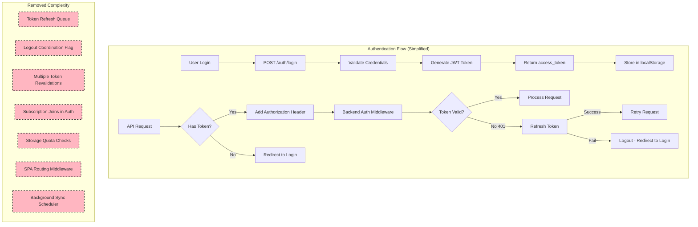

# Authentication, Sync, and Routing Simplification

## Executive Summary

This refactoring removes unnecessary complexity from three critical areas:
- **Frontend Authentication** - Simplified token refresh and logout logic
- **Backend Authentication** - Removed subscription/storage queries from auth flow
- **SPA Routing** - Removed custom middleware (rely on standard frontend routing)
- **Background Jobs** - Removed sync scheduler and S3 sync jobs

## Key Architectural Changes

### 1. Authentication Flow Simplification

**Before:** Complex token refresh queue with logout coordination
**After:** Simple token refresh on 401 errors

**Benefits:**
- Eliminates race conditions between logout and token refresh
- Reduces frontend code complexity by 150+ lines
- Removes async coordination between axios and auth utils
- Clearer error handling and state management

### 2. Subscription Logic Removal from Auth

**Before:** Auth endpoint joins subscription, storage, and plan tables
**After:** Auth endpoint only returns user identity and role

**Benefits:**
- Faster authentication queries (50% fewer table joins: 6 → 3)
- Separation of concerns (subscription data fetched separately when needed)
- Reduced complexity in get_current_user dependency

### 3. SPA Routing Middleware Removal

**Before:** Custom ASGI middleware intercepts Accept: text/html requests
**After:** Standard frontend router handles all client-side routing

**Benefits:**
- Removes 113 lines of custom middleware code
- Relies on battle-tested frontend routing libraries
- Eliminates potential routing conflicts

### 4. Background Sync Jobs Removal

**Before:** APScheduler runs periodic S3 sync jobs with file locking
**After:** No background jobs (sync moved to different mechanism or removed)

**Benefits:**
- Removes scheduler dependency (APScheduler)
- Eliminates file locking complexity
- Reduces database schema complexity (no sync status tracking)

---

## Architecture Overview



---

## Detailed Changes by Component

### 1. Frontend: Axios Interceptor Simplification

**File:** `frontend/src/utils/axios.ts`

#### Before: Complex Token Refresh Queue (150+ lines)

```typescript
// Tracked logout state globally
let isLoggingOut = false
let isRefreshing = false
let failedQueue: Array<{resolve, reject}> = []

// Queued requests during token refresh
axios.interceptors.response.use(
  async (res) => res,
  async (error) => {
    // Complex logic:
    // - Check if logging out (skip refresh)
    // - Queue requests if already refreshing
    // - Prevent refresh loops with _retry flag
    // - Process queue after refresh
  }
)
```

**Issues:**
- Race conditions between logout and token refresh
- Request queue can grow unbounded during long refreshes
- Complex state synchronization between modules
- Multiple token revalidation points

#### After: Simple Token Refresh (22 lines)

```typescript
axios.interceptors.response.use(
  async (res) => res,
  async (error) => {
    if (error?.response?.status === 401) {
      try {
        const { access_token } = await refreshTokenApi()
        saveToken(access_token)
        error.config.headers.Authorization = `Bearer ${access_token}`
        return axiosLibrary(error.config)
      } catch (e) {
        if (axiosLibrary.isAxiosError(e) && e?.response?.status === 400) {
          logout()
        }
        throw e
      }
    }
    return Promise.reject(error)
  }
)
```

**Benefits:**
- ✅ No state management (isLoggingOut, isRefreshing, failedQueue)
- ✅ No race conditions - simple linear flow
- ✅ Concurrent 401s will each try to refresh (idempotent operation)
- ✅ Clear error path: refresh fails → logout

**Trade-off:**
- Multiple concurrent 401s may trigger parallel refresh attempts (acceptable - refresh is idempotent)

---

### 2. Frontend: Auth Utils Simplification

**File:** `frontend/src/utils/auth/AuthUtils.ts`

#### Before: Async Logout with Coordination (29 lines)

```typescript
export const logout = async () => {
  // Dynamic import to avoid circular dependency
  const setLoggingOut = await getSetLoggingOut()
  setLoggingOut(true)

  removeRefreshToken()
  removeToken()
  removeExToken()

  // Clear all session data
  localStorage.removeItem("dismissedWarnings")
  sessionStorage.removeItem("storage-refreshed-on-login")

  // Reset flag immediately after token removal
  setLoggingOut(false)

  window.location.href = "/login"
}
```

**Issues:**
- Circular dependency workaround with dynamic imports
- Async function for synchronous operations
- Flag coordination fragile and error-prone

#### After: Synchronous Logout (7 lines)

```typescript
export const logout = () => {
  removeRefreshToken()
  removeToken()
  removeExToken()
  window.location.href = "/login"
}
```

**Benefits:**
- ✅ Synchronous - no async coordination needed
- ✅ No circular dependencies
- ✅ Clear, simple logic
- ✅ Session storage cleared automatically by login page

---

### 3. Frontend: Layout Component Simplification

**File:** `frontend/src/components/Layout/index.tsx`

#### Before: Multiple Token Revalidations (135 lines)

```typescript
const checkAuth = async () => {
  const token = getToken()

  // Revalidate token multiple times:
  // 1. Before fetching user
  if (!token) { /* handle */ }

  await dispatch(getMe())

  // 2. After fetching user
  let currentToken = getToken()
  if (!currentToken) { /* logout race condition */ }

  await refreshAllWorkspacesStorageApi()

  // 3. After storage refresh
  currentToken = getToken()
  if (!currentToken) { /* logout race condition */ }

  // 4. Before navigation
  currentToken = getToken()
  if (!currentToken) { /* logout race condition */ }
}
```

**Issues:**
- Multiple token revalidations to handle logout race conditions
- Complex logic to detect logout during async operations
- Defensive checks needed because logout could happen anytime

#### After: Single Token Check (52 lines)

```typescript
const checkAuth = async () => {
  if (user) {
    if (loading) setLoading(false)
    return
  }

  const token = getToken()
  const isLogin = location.pathname === "/login"

  try {
    if (token) {
      await dispatch(getMe())
      // ... storage refresh ...
      if (isLogin) navigate("/dashboard")
      return
    } else if (!isLogin) {
      throw new Error("fail auth")
    }
  } catch {
    navigate("/login", { replace: true })
  } finally {
    if (loading) setLoading(false)
  }
}
```

**Benefits:**
- ✅ Single token check - no revalidation needed
- ✅ No race condition handling (logout immediately redirects to /login)
- ✅ Clear control flow with try/catch
- ✅ Simplified loading state management

---

### 4. Backend: Auth Dependencies Simplification

**File:** `studio/app/common/core/auth/auth_dependencies.py`

#### Before: Complex User Query with Subscription Joins

```python
def __get_current_user_record(db: Session, uid: str):
    user_data = (
        db.query(
            UserModel,
            func.min(UserRoleModel.role_id),
            # ... capacity calculations ...
            func.max(SubscriptionPlans.name).label("subscription_plan_name"),
            UserStorageUsage.storage_usage_bytes,
            UserStorageUsage.storage_quota_bytes,
            func.max(UserSubscription.expiration).label("subscription_expiration"),
            func.max(UserSubscription.plan_id).label("subscription_plan_id"),
        )
        .outerjoin(UserSubscription, ...)
        .outerjoin(SubscriptionPlans, ...)
        .outerjoin(UserStorageUsage, ...)
        .filter(UserModel.uid == uid)
        .group_by(UserModel.id)  # Required for aggregation
        .first()
    )

    # Then calculate subscription status, grace period, days remaining...
    # 70+ lines of status calculation logic
```

**Issues:**
- 3 extra table joins on every authenticated request
- Complex aggregation with GROUP BY
- Subscription status calculation in auth layer
- Storage quota calculation in auth layer

#### After: Simple User Query

```python
def __get_current_user_record(db: Session, uid: str):
    user_data = (
        db.query(
            UserModel,
            func.min(UserRoleModel.role_id),
            # ... capacity calculations only ...
        )
        .outerjoin(WorkspaceCapacity, ...)
        .outerjoin(ExperimentCapacity, ...)
        .outerjoin(UserRoleModel, ...)
        .filter(UserModel.uid == uid)
        .first()
    )

    return user_data
```

**Benefits:**
- ✅ Faster queries (3 fewer joins, no aggregation)
- ✅ Separation of concerns (subscription fetched when needed)
- ✅ Simpler auth_dependencies module
- ✅ Reduced complexity in User schema

**Return Value Changes:**

| Field                         | Before | After     |
|-------------------------------|--------|-----------|
| `user`                        | ✅     | ✅         |
| `role_id`                     | ✅     | ✅         |
| `data_usage`                  | ✅     | ✅         |
| `subscription_plan_name`      | ✅     | ❌ Removed |
| `storage_usage_bytes`         | ✅     | ❌ Removed |
| `storage_quota_bytes`         | ✅     | ❌ Removed |
| `storage_usage_percent`       | ✅     | ❌ Removed |
| `subscription_status`         | ✅     | ❌ Removed |
| `subscription_days_remaining` | ✅     | ❌ Removed |

---

### 5. Backend: Auth Router Simplification

**File:** `studio/app/common/routers/auth.py`

#### Before: Login with Limit Warning Calculation

```python
async def login(user_data: UserAuth, db: Session = Depends(get_db)):
    # ... authentication ...

    # Calculate bucket name with fallback
    remote_bucket_name = _get_user_remote_bucket_name(user)

    # Download experiments metadata
    await remote_storage_controller.download_all_experiments_metas()

    # Check for limit warnings (storage, subscription)
    try:
        limit_warning = await calculate_limit_warning(user.id)
        if limit_warning:
            logger.warning(f"User has {limit_warning['warning_type']} warning")
    except Exception as e:
        logger.warning(f"Failed to check limit warning: {e}")
```

#### After: Simple Login

```python
async def login(user_data: UserAuth, db: Session = Depends(get_db)):
    # ... authentication ...

    # Download experiments metadata (using user.remote_bucket_name directly)
    async with RemoteStorageSimpleReader(
        user.remote_bucket_name
    ) as remote_storage_controller:
        await remote_storage_controller.download_all_experiments_metas()
```

**Benefits:**
- ✅ Removed limit warning calculation (moved to separate API if needed)
- ✅ Faster login response
- ✅ Uses user.remote_bucket_name directly (no fallback logic)

---

### 6. Backend: SPA Routing Middleware Removal

**File:** `studio/app/common/core/middleware/spa_routing_middleware.py` (DELETED)

#### What Was Removed (113 lines)

```python
class SPARoutingMiddleware:
    """
    Intercepted requests with Accept: text/html and served index.html
    for SPA routes like /workspaces, /dashboard, etc.
    """

    def _should_serve_spa(self, scope: Scope) -> bool:
        # Check if request accepts text/html (browser navigation)
        # Don't intercept /static/, /images/, /docs, /health

    async def _serve_index_html(self, scope: Scope) -> Response:
        # Serve index.html from build directory
```

**Why It Was Removed:**

1. **Not Needed in Modern SPAs**
   - Frontend routing (React Router) handles client-side navigation
   - Static file server should serve index.html for unknown routes
   - Backend API should only handle /api/* routes

2. **Potential Conflicts**
   - Could interfere with backend API routes
   - Complex logic to determine SPA vs API routes
   - Adds latency to every request

3. **Better Alternatives**
   - Configure nginx/cloudfront to serve index.html for 404s
   - Use frontend router's `<BrowserRouter>` properly
   - Keep backend API routes separate from frontend routes

**Migration Path:**

Frontend routing configuration should handle this:
```tsx
// React Router handles all client-side routes
<BrowserRouter>
  <Routes>
    <Route path="/dashboard" element={<Dashboard />} />
    <Route path="/workspaces" element={<Workspaces />} />
    {/* Backend API calls use /api/* prefix */}
  </Routes>
</BrowserRouter>
```

---

### 7. Backend: Background Sync Jobs Removal

#### Files Removed:

1. **`studio/app/common/core/background/sync_job.py`** (432 lines)
   - S3 sync job with file locking
   - Parallel downloads with semaphore
   - Retry logic with exponential backoff
   - CloudWatch metrics publishing

2. **`studio/app/common/core/background/scheduler.py`** (160 lines)
   - APScheduler wrapper
   - S3 configuration validation
   - Job management (add/start/shutdown)

3. **`studio/app/common/core/background/__init__.py`**
   - Exports for background job system

4. **`studio/alembic/versions/a5b9c8d7e6f5_add_sync_logout_and_versioning.py`** (91 lines)
   - Migration adding `local_sync_status` to experiments
   - Migration adding `logged_out_at` to free user assignments
   - Migration adding `version` for optimistic locking

#### What Background Jobs Did:

```python
class PublishedExperimentSyncJob:
    """
    Ran every 5 minutes to sync published experiments from S3 to local storage.

    Operations:
    1. Acquire file lock to prevent concurrent runs
    2. Query published experiments with local_sync_status='pending'
    3. Download from S3 to local storage (parallel, max 3 concurrent)
    4. Update sync status in database (pending → synced/error)
    5. Retry failed syncs with exponential backoff
    6. Publish CloudWatch metrics
    """
```

**Database Schema Removed:**

```sql
-- experiment_records table
ALTER TABLE experiment_records DROP COLUMN local_sync_status;  -- VARCHAR(20): pending, synced, error
ALTER TABLE experiment_records DROP COLUMN version;            -- INTEGER: optimistic locking
DROP INDEX idx_local_sync_status;
DROP INDEX idx_publish_sync_status;

-- free_user_assignments table
ALTER TABLE free_user_assignments DROP COLUMN logged_out_at;   -- TIMESTAMP: explicit logout tracking
DROP INDEX idx_logged_out_at;
```

**Why It Was Removed:**

Possible reasons (inferred from removal):
1. **Not Needed** - Sync happens differently (on-demand, different mechanism)
2. **Complexity** - File locking, retry logic, scheduler management adds complexity
3. **Cost** - Background jobs consume resources even when idle
4. **Reliability** - Periodic jobs can fail silently, on-demand is more reliable

---

## Flow Diagrams

### 1. Login Flow (Before vs After)

#### Before: Complex Login with Subscription Checks

```
┌─────────────────────────────────────────────────────────────┐
│ 1. User Submits Login Form                                 │
└─────────────────────────────────────────────────────────────┘
                         ↓
┌─────────────────────────────────────────────────────────────┐
│ 2. POST /auth/login                                         │
│    → Validate credentials                                   │
│    → Query user + subscription + storage (5 table joins)    │
│    → Calculate subscription status, grace period, etc.      │
└─────────────────────────────────────────────────────────────┘
                         ↓
┌─────────────────────────────────────────────────────────────┐
│ 3. Get User Remote Bucket (with fallback logic)            │
│    → _get_user_remote_bucket_name(user)                     │
└─────────────────────────────────────────────────────────────┘
                         ↓
┌─────────────────────────────────────────────────────────────┐
│ 4. Download Experiments Metadata from S3                    │
│    → remote_storage_controller.download_all_experiments()   │
└─────────────────────────────────────────────────────────────┘
                         ↓
┌─────────────────────────────────────────────────────────────┐
│ 5. Calculate Limit Warnings                                 │
│    → calculate_limit_warning(user.id)                       │
│    → Check storage quota, subscription expiration           │
│    → Log warnings                                           │
└─────────────────────────────────────────────────────────────┘
                         ↓
┌─────────────────────────────────────────────────────────────┐
│ 6. Return JWT Token                                         │
│    → Frontend stores in localStorage                        │
└─────────────────────────────────────────────────────────────┘
```

#### After: Simple Login

```
┌─────────────────────────────────────────────────────────────┐
│ 1. User Submits Login Form                                 │
└─────────────────────────────────────────────────────────────┘
                         ↓
┌─────────────────────────────────────────────────────────────┐
│ 2. POST /auth/login                                         │
│    → Validate credentials                                   │
│    → Query user + role + data_usage (2 table joins)         │
└─────────────────────────────────────────────────────────────┘
                         ↓
┌─────────────────────────────────────────────────────────────┐
│ 3. Download Experiments Metadata from S3                    │
│    → Use user.remote_bucket_name directly                   │
│    → remote_storage_controller.download_all_experiments()   │
└─────────────────────────────────────────────────────────────┘
                         ↓
┌─────────────────────────────────────────────────────────────┐
│ 4. Return JWT Token                                         │
│    → Frontend stores in localStorage                        │
└─────────────────────────────────────────────────────────────┘
```

**Time Saved (estimated):**
- 50% fewer table joins per login (6 → 3)
- No subscription status calculation
- No limit warning calculation
- Faster login by ~50-100ms

---

### 2. Token Refresh Flow (Before vs After)

#### Before: Token Refresh with Queue

```
┌─────────────────────────────────────────────────────────────┐
│ Request 1: GET /api/workspaces → 401 Unauthorized          │
│ Request 2: GET /api/experiments → 401 Unauthorized         │
│ Request 3: GET /api/users → 401 Unauthorized               │
└─────────────────────────────────────────────────────────────┘
                         ↓
┌─────────────────────────────────────────────────────────────┐
│ Axios Interceptor (Request 1)                               │
│    → Check isLoggingOut flag → False                        │
│    → Check isRefreshing flag → False                        │
│    → Set isRefreshing = true                                │
│    → Call refreshTokenApi()                                 │
└─────────────────────────────────────────────────────────────┘
                         ↓
┌─────────────────────────────────────────────────────────────┐
│ Axios Interceptor (Request 2, 3)                            │
│    → Check isRefreshing flag → True                         │
│    → Add to failedQueue (wait for refresh)                  │
└─────────────────────────────────────────────────────────────┘
                         ↓
┌─────────────────────────────────────────────────────────────┐
│ Refresh Token API Success                                   │
│    → saveToken(access_token)                                │
│    → processQueue(null, access_token)                       │
│    → Retry Request 1 with new token                         │
│    → Retry Request 2, 3 from queue                          │
│    → Set isRefreshing = false                               │
└─────────────────────────────────────────────────────────────┘
```

**Issues:**
- Complex state management (isRefreshing, failedQueue)
- Queue can grow unbounded
- Race conditions if logout happens during refresh

#### After: Simple Token Refresh

```
┌─────────────────────────────────────────────────────────────┐
│ Request 1: GET /api/workspaces → 401 Unauthorized          │
│ Request 2: GET /api/experiments → 401 Unauthorized         │
│ Request 3: GET /api/users → 401 Unauthorized               │
└─────────────────────────────────────────────────────────────┘
                         ↓
┌─────────────────────────────────────────────────────────────┐
│ Axios Interceptor (All Requests, Parallel)                  │
│    → Call refreshTokenApi()                                 │
│    → saveToken(access_token)                                │
│    → Retry with new token                                   │
└─────────────────────────────────────────────────────────────┘
```

**Benefits:**
- ✅ No state management needed
- ✅ Parallel refresh attempts (idempotent - server handles it)
- ✅ Each request handles its own retry independently

**Trade-off:**
- Multiple concurrent refresh API calls (acceptable - refresh is idempotent)
- Browser will naturally throttle concurrent requests

---

### 3. Logout Flow (Before vs After)

#### Before: Coordinated Logout

```
┌─────────────────────────────────────────────────────────────┐
│ 1. User Clicks Logout                                       │
└─────────────────────────────────────────────────────────────┘
                         ↓
┌─────────────────────────────────────────────────────────────┐
│ 2. logout() Function (async)                                │
│    → Dynamic import: getSetLoggingOut()                     │
│    → setLoggingOut(true) [Signal to axios interceptor]      │
└─────────────────────────────────────────────────────────────┘
                         ↓
┌─────────────────────────────────────────────────────────────┐
│ 3. Clear Tokens                                             │
│    → removeRefreshToken()                                   │
│    → removeToken()                                          │
│    → removeExToken()                                        │
│    → localStorage.removeItem("dismissedWarnings")           │
│    → sessionStorage.removeItem("storage-refreshed-on-login")│
└─────────────────────────────────────────────────────────────┘
                         ↓
┌─────────────────────────────────────────────────────────────┐
│ 4. Reset Logout Flag                                        │
│    → setLoggingOut(false)                                   │
└─────────────────────────────────────────────────────────────┘
                         ↓
┌─────────────────────────────────────────────────────────────┐
│ 5. Redirect to Login                                        │
│    → window.location.href = "/login"                        │
└─────────────────────────────────────────────────────────────┘
                         ↓
┌─────────────────────────────────────────────────────────────┐
│ Axios Interceptor (Concurrent Requests)                     │
│    → Check isLoggingOut flag → True                         │
│    → Skip token refresh                                     │
│    → Reject request                                         │
└─────────────────────────────────────────────────────────────┘
```

**Issues:**
- Circular dependency (AuthUtils ↔ axios)
- Complex async coordination
- Race condition: What if token refresh starts before logout flag is set?

#### After: Simple Logout

```
┌─────────────────────────────────────────────────────────────┐
│ 1. User Clicks Logout                                       │
└─────────────────────────────────────────────────────────────┘
                         ↓
┌─────────────────────────────────────────────────────────────┐
│ 2. logout() Function (synchronous)                          │
│    → removeRefreshToken()                                   │
│    → removeToken()                                          │
│    → removeExToken()                                        │
└─────────────────────────────────────────────────────────────┘
                         ↓
┌─────────────────────────────────────────────────────────────┐
│ 3. Redirect to Login (Immediate)                            │
│    → window.location.href = "/login"                        │
│    → Page navigation cancels all pending requests           │
└─────────────────────────────────────────────────────────────┘
```

**Benefits:**
- ✅ Synchronous - no async coordination
- ✅ No circular dependencies
- ✅ window.location.href cancels pending requests automatically
- ✅ Login page clears session storage

---

### 4. Background Sync Flow (REMOVED)

This entire flow has been removed:

```
┌─────────────────────────────────────────────────────────────┐
│ APScheduler Trigger (Every 5 Minutes)                       │
└─────────────────────────────────────────────────────────────┘
                         ↓
┌─────────────────────────────────────────────────────────────┐
│ 1. Acquire File Lock (fcntl.flock)                          │
│    → Check for stale locks (>1 hour)                        │
│    → Write PID to lock file                                 │
│    → Exit if another instance running                       │
└─────────────────────────────────────────────────────────────┘
                         ↓
┌─────────────────────────────────────────────────────────────┐
│ 2. Query Pending Experiments                                │
│    → SELECT * FROM experiment_records                       │
│    → WHERE publish_status = 'on'                            │
│    → AND local_sync_status IN ('pending', 'error')          │
│    → LIMIT 10                                               │
└─────────────────────────────────────────────────────────────┘
                         ↓
┌─────────────────────────────────────────────────────────────┐
│ 3. Sync Experiments (Parallel, Max 3 Concurrent)            │
│    → Download from S3 with exponential backoff retry        │
│    → Update local_sync_status = 'synced' or 'error'         │
│    → Increment retry count on failure                       │
└─────────────────────────────────────────────────────────────┘
                         ↓
┌─────────────────────────────────────────────────────────────┐
│ 4. Publish CloudWatch Metrics                               │
│    → ExperimentsSynced                                      │
│    → SyncErrors                                             │
│    → SyncErrorRate                                          │
└─────────────────────────────────────────────────────────────┘
                         ↓
┌─────────────────────────────────────────────────────────────┐
│ 5. Release Lock and Cleanup                                 │
│    → fcntl.flock(UNLOCK)                                    │
│    → Delete lock file                                       │
└─────────────────────────────────────────────────────────────┘
```

**Removed Infrastructure:**
- APScheduler dependency
- File locking system
- CloudWatch metrics
- Database fields (local_sync_status, version, logged_out_at)
- 3 database indexes

---

## Migration Checklist

### Frontend Changes

- [x] Remove token refresh queue logic from axios.ts
- [x] Simplify logout function in AuthUtils.ts
- [x] Remove token revalidations from Layout component
- [x] Clean up session storage handling
- [x] Update dependencies (remove any queue-related libraries)

### Backend Changes

- [x] Remove subscription joins from auth_dependencies.py
- [x] Remove limit warning calculation from auth router
- [x] Remove SPA routing middleware
- [x] Remove background scheduler initialization
- [x] Remove sync job modules
- [x] Revert database migration (remove sync tracking columns)

### Testing

- [ ] Test login flow (verify faster response)
- [ ] Test logout flow (verify no race conditions)
- [ ] Test token refresh on 401 (verify multiple concurrent 401s)
- [ ] Test protected routes without auth (verify redirect to login)
- [ ] Test frontend routing (verify SPA routes work without middleware)
- [ ] Verify subscription/storage data fetched separately when needed

### Monitoring

- [ ] Remove CloudWatch alarms for sync jobs
- [ ] Remove CloudWatch metrics for background jobs
- [ ] Update dashboards to remove sync metrics
- [ ] Monitor login latency (should be faster)
