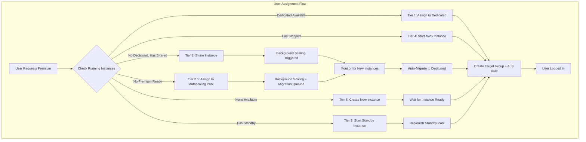
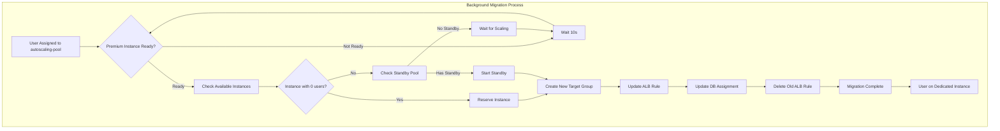

# Premium Manager Provisioning: Multi-Tier Assignment Strategy

## Executive Summary
- **Premium Manager** handles all instance provisioning and user assignment
- **5-tier prioritization** system optimizes user experience and cost
- **Standby pool** ensures sub-15-second cold starts
- **Automatic migration** moves users from shared to dedicated instances

## Key Architectural Principles

1. **Priority-Based Assignment**
   - Tier 1: Dedicated running instances (0s wait)
   - Tier 2: Shared instances for immediate login (0s wait)
   - Tier 2.5: Autoscaling pool as temporary fallback (0s wait)
   - Tier 3: Standby instances (5-15s startup)
   - Tier 4: AWS stopped instances fallback (60-90s startup)
   - Tier 5: Scale new instances (4-8 minutes)

2. **User Experience First**
   - Users get immediate login via autoscaling pool if no premium ready
   - Background migration to dedicated premium instance
   - No user-visible delays or retry loops

3. **Standby Pool Management**
   - Maintains pool of stopped instances for fast startup
   - Distributed locking prevents duplicate creations
   - Automatic replenishment when standby consumed
   - Orphaned stopped instances auto-registered as standby

4. **Intelligent Scaling**
   - Conservative algorithm: keeps `active_users + 1` instances
   - Shared assignments trigger background scaling
   - Monitors pending instance creations to avoid duplicate scaling
   - Auto-migration when new instances become ready

## Architecture Overview



### Assignment Priority Matrix

| Tier | Source            | Wait Time | User Experience      | Cost(time) | Use Case             |
|------|-------------------|-----------|----------------------|------------|----------------------|
| 1    | Dedicated Running | 0s        | Best (exclusive)     | Highest    | Active user pool     |
| 2    | Shared Instance   | 0s        | Good (shared)        | Medium     | Burst capacity       |
| 2.5  | Autoscaling Pool  | 0s        | Temporary (migrates) | Low        | Cold start fallback  |
| 3.   | Standby (Stopped) | 5-15s     | Good (warming)       | Low        | Premium provisioning |
| 4    | AWS Stopped       | 60-90s    | Acceptable           | Low        | Fallback             |
| 5    | New Instance      | 4-8 min   | Poor (scaling)       | Highest    | Last resort          |

### Autoscaling Pool Migration Flow



---

## Implementation Details

### 1. User Assignment Handler

**File:** `studio/config/terraform/premium_manager_package/premium_manager.py`

**Function:** `assign_premium_user(user_id, event)` (lines 1748-2100)

**Priority Evaluation Logic:**

```python
# PRIORITY 1: Dedicated running instances
for instance in running_instances:
    assigned_users = get_assigned_users_for_instance(instance_id)
    if len(assigned_users) == 0:
        if try_reserve_instance(instance_id, user_id):
            # Use this dedicated instance
            assignment_source = "dedicated"
            break

# PRIORITY 2: Share least loaded instance
if not instance_to_use and least_loaded_instance:
    instance_to_use = least_loaded_instance
    is_shared = True
    assignment_source = "shared"

    # Trigger background scaling if under-provisioned
    if len(running_instances) < active_users + 1:
        needs_scaling = True

# PRIORITY 2.5: Autoscaling pool temporary assignment
no_premium_available = len(running_instances) == 0 or not available_dedicated
if not instance_to_use and no_premium_available:
    instance_to_use = {"instance_id": "autoscaling-pool"}
    is_shared = True
    assignment_source = "autoscaling_temp"
    needs_scaling = True  # Always scale premium instances

# PRIORITY 3: Start standby instance
if not instance_to_use and standby_instances:
    standby_instance_id = standby_instances[0]["instance_id"]
    if start_standby_instance(standby_instance_id):
        instance_to_use = {"instance_id": standby_instance_id}
        assignment_source = "standby"
        create_and_stop_standby_instance()  # Replenish

# PRIORITY 4: AWS stopped instances
if not instance_to_use and aws_only_stopped:
    fallback_instance_id = aws_only_stopped[0]["instance_id"]
    ec2.start_instances(InstanceIds=[fallback_instance_id])
    # Wait for running state...
    assignment_source = "aws_fallback"

# PRIORITY 5: Create new instance
if not instance_to_use:
    if len(launching_instances) > 0:
        return 202  # Retry in 2-3 minutes
    else:
        scale_premium_instances_if_needed()
        return 202  # Retry in 2-3 minutes
```

### 2. Standby Pool Management

**Function:** `create_and_stop_standby_instance()` (lines 1024-1200)

**Key Features:**

1. **Distributed Locking:**
   ```python
   # MySQL GET_LOCK prevents concurrent Lambda executions
   cursor.execute("SELECT GET_LOCK(%s, %s)", (lock_name, lock_timeout))
   lock_result = cursor.fetchone()["lock_result"]

   if lock_result != 1:
       # Another Lambda is creating standby, skip
       return None
   ```

2. **Double-Check After Lock:**
   ```python
   # Re-check standby count after acquiring lock
   standby_count = get_standby_count()
   if standby_count >= standby_pool_size:
       # Another Lambda already created one
       return None
   ```

3. **Multi-AZ Instance Creation:**
   ```python
   # Try each subnet (different AZ) until one succeeds
   for subnet_id in subnet_ids:
       try:
           response = ec2.run_instances(
               LaunchTemplate={'LaunchTemplateId': launch_template_id},
               SubnetId=subnet_id,
               MinCount=1, MaxCount=1
           )
           instance_id = response['Instances'][0]['InstanceId']
           break
       except ClientError as e:
           if 'InsufficientInstanceCapacity' in str(e):
               continue  # Try next AZ
   ```

4. **Register and Stop:**
   ```python
   # Wait for running state
   waiter = ec2.get_waiter('instance_running')
   waiter.wait(InstanceIds=[instance_id])

   # Stop immediately for standby
   ec2.stop_instances(InstanceIds=[instance_id])

   # Register in database
   register_standby_instance(instance_id)
   ```

**Function:** `start_standby_instance(instance_id)` (lines 1215-1290)

```python
def start_standby_instance(instance_id: str):
    """
    Start a standby instance and remove it from standby pool.
    Returns True on success, False on failure.
    """
    ec2 = boto3.client('ec2')

    # Start the instance
    ec2.start_instances(InstanceIds=[instance_id])

    # Remove from standby pool in database
    with get_db_connection() as connection:
        with connection.cursor() as cursor:
            cursor.execute(
                "DELETE FROM premium_standby_pool WHERE instance_id = %s",
                (instance_id,)
            )
            connection.commit()

    # Wait for running state (5-15 seconds typically)
    waiter = ec2.get_waiter('instance_running')
    waiter.wait(InstanceIds=[instance_id])

    return True
```

### 3. Orphaned Instance Registration

**Function:** `register_orphaned_stopped_instances()` (called at assignment start)

**Purpose:** Auto-register stopped instances that exist in AWS but not in standby database

```python
def register_orphaned_stopped_instances():
    """
    Find stopped premium instances in AWS that are not in standby pool
    and register them as standby instances.

    This handles:
    - Instances that were stopped manually
    - Instances created outside normal standby flow
    - Recovery from database inconsistencies
    """
    all_instances = get_all_premium_instances_with_states()
    stopped_instances = [i for i in all_instances if i['state'] == 'stopped']

    standby_instances = get_available_standby_instances()
    standby_ids = {s['instance_id'] for s in standby_instances}

    orphaned = [i for i in stopped_instances
                if i['instance_id'] not in standby_ids]

    for instance in orphaned:
        instance_id = instance['instance_id']
        register_standby_instance(instance_id)
        print(f"Registered orphaned stopped instance as standby: {instance_id}")
```

### 4. Background Migration System

**Function:** `process_shared_instance_optimization()` (lines 3343-3500)

**Trigger:** Called after user assignment completes when `needs_scaling=True`

**Flow:**

1. **Identify Users Needing Migration:**
   ```python
   # Get users on autoscaling pool
   autoscaling_users = get_assigned_users_for_instance("autoscaling-pool")

   # Get users on shared premium instances (>1 user per instance)
   shared_instances = []
   for instance in all_instances:
       assigned_users = get_assigned_users_for_instance(instance_id)
       if len(assigned_users) > 1:
           shared_instances.append((instance_id, assigned_users))
   ```

2. **Find Available Instances:**
   ```python
   # Running instances with 0 users
   for instance in all_instances:
       if instance['state'] == 'running':
           if is_instance_ready(instance_id):
               assigned_users = get_assigned_users_for_instance(instance_id)
               if len(assigned_users) == 0:
                   available_instances.append(instance_id)
   ```

3. **Ensure Capacity:**
   ```python
   total_users_needing_migration = sum(len(users) for _, users in shared_instances)

   if len(available_instances) < total_users_needing_migration:
       # Start standby instances to fill gap
       standby_needed = total_users_needing_migration - len(available_instances)
       for standby in standby_instances[:standby_needed]:
           start_standby_instance(standby['instance_id'])
           available_instances.append(standby['instance_id'])
   ```

4. **Perform Migration:**
   ```python
   for instance_id, users in shared_instances:
       if instance_id == "autoscaling-pool":
           # Migrate ALL users from autoscaling pool
           users_to_migrate = users
       else:
           # Keep first user on premium instance, migrate rest
           users_to_migrate = users[1:]

       for user in users_to_migrate:
           target_instance = available_instances.pop(0)
           migrate_user_to_instance(user, target_instance)
   ```

**Migration Details** (`migrate_user_to_dedicated_instance()`):

```python
def migrate_user_to_dedicated_instance(user_id: str, target_instance_id: str):
    """
    Migrate user from current instance to target instance.

    Steps:
    1. Get current assignment (instance_id, target_group, rule)
    2. Create new target group for target instance
    3. Register target instance in new target group
    4. Update ALB rule to point to new target group
    5. Update database assignment
    6. Delete old ALB rule and target group (if dedicated)
    """
    elbv2 = boto3.client('elbv2')

    # Get current assignment
    assignment = get_user_assignment(user_id)
    old_instance_id = assignment['instance_id']
    old_target_group = assignment['target_group_arn']
    old_rule_arn = assignment['alb_rule_arn']

    # Create new target group (if migrating from autoscaling pool)
    if old_instance_id == "autoscaling-pool":
        vpc_id = os.environ.get("VPC_ID")
        target_group = elbv2.create_target_group(
            Name=f"premium-{user_id[:8]}-{int(time.time())}",
            Protocol='HTTP',
            Port=8000,
            VpcId=vpc_id,
            TargetType='instance'
        )
        new_target_group_arn = target_group['TargetGroups'][0]['TargetGroupArn']

        # Register target instance
        elbv2.register_targets(
            TargetGroupArn=new_target_group_arn,
            Targets=[{'Id': target_instance_id}]
        )

    # Update ALB rule to point to new target group
    elbv2.modify_rule(
        RuleArn=old_rule_arn,
        Actions=[{
            'Type': 'forward',
            'TargetGroupArn': new_target_group_arn
        }]
    )

    # Update database
    update_user_assignment(
        user_id=user_id,
        instance_id=target_instance_id,
        target_group_arn=new_target_group_arn
    )

    # Cleanup: Delete old rule/target group (if autoscaling pool, skip)
    if old_instance_id != "autoscaling-pool":
        # Will be cleaned up by normal release flow
        pass
```

---

## Edge Case Handling

### 1. Race Condition: Multiple Users Requesting Simultaneously

**Problem:** Two users request premium assignment at the same time, both see same available instance.

**Solution:** Transaction-based reservation system:

```python
def try_reserve_instance_transaction(instance_id: str, user_id: str) -> bool:
    """
    Try to atomically reserve an instance for a user.
    Uses database transaction to prevent race conditions.

    Returns True if successfully reserved, False if another user claimed it.
    """
    with get_db_connection() as connection:
        with connection.cursor() as cursor:
            # Check current assignments
            cursor.execute(
                "SELECT user_id FROM premium_user_assignments WHERE instance_id = %s",
                (instance_id,)
            )
            existing = cursor.fetchall()

            if len(existing) > 0:
                # Someone else claimed it
                return False

            # Claim it with placeholder
            cursor.execute(
                """INSERT INTO premium_user_assignments
                   (instance_id, user_id, target_group_arn, alb_rule_arn)
                   VALUES (%s, %s, 'reserving', NULL)""",
                (instance_id, f"reserving-{user_id}")
            )
            connection.commit()
            return True
```

### 2. Standby Pool Exhaustion

**Problem:** Multiple users arrive, consume all standby instances.

**Solution:** Automatic replenishment + fallback chain:

```python
# When consuming standby
if start_standby_instance(standby_instance_id):
    # Immediately trigger replacement
    create_and_stop_standby_instance()

# If standby pool empty, fall back to AWS stopped instances
if not standby_instances and aws_stopped_instances:
    # Use AWS stopped as fallback
    start_aws_instance(aws_stopped_instances[0])

# If no stopped instances, create new
if not standby_instances and not aws_stopped_instances:
    scale_premium_instances_if_needed()
```

### 3. Instance Fails to Start

**Problem:** Standby instance fails health checks after starting.

**Solution:** Timeout + cleanup + retry:

```python
# Wait for instance readiness with timeout
is_ready = check_instance_readiness_with_retry(
    instance_id,
    max_wait_seconds=120,
    retry_interval=15
)

if not is_ready:
    # Release reservation
    release_instance_reservation(instance_id, user_id)

    # Mark instance as failed
    mark_instance_failed(instance_id)

    # Cleanup will reconcile and potentially terminate it
    # Fall back to next priority tier
```

### 4. Migration Loop Prevention

**Problem:** User keeps getting migrated back and forth.

**Solution:** Migration only from autoscaling pool or shared → dedicated:

```python
# Only migrate users in these scenarios:
# 1. From autoscaling pool to ANY premium instance
# 2. From shared premium (>1 user) to dedicated (0 users)
# Never migrate from dedicated to anything

if instance_id == "autoscaling-pool":
    # Always migrate
    users_to_migrate = users
elif instance_id.startswith("i-") and len(users) > 1:
    # Keep first user, migrate others
    users_to_migrate = users[1:]
else:
    # Single user on premium instance - do not migrate
    users_to_migrate = []
```

### 5. Scaling Stampede Prevention

**Problem:** Multiple Lambda invocations try to scale simultaneously.

**Solution:** Pending creation tracking:

```python
def count_pending_standby_creations() -> int:
    """Count how many standbys are being created right now"""
    with get_db_connection() as connection:
        with connection.cursor() as cursor:
            cursor.execute(
                """SELECT COUNT(*) as count
                   FROM premium_standby_creations
                   WHERE created_at > DATE_SUB(NOW(), INTERVAL 10 MINUTE)"""
            )
            return cursor.fetchone()['count']

# Before creating standby
if count_pending_standby_creations() >= 2:
    print("Already creating 2 standbys, skipping")
    return None
```

---

## Monitoring and Metrics

### CloudWatch Metrics Published

**By Premium Manager** (every 15 minutes + on-demand):

| Metric Name                | Description                       | Unit  | Trigger                  |
|----------------------------|-----------------------------------|-------|--------------------------|
| `ActivePremiumUsers`       | Users with active assignments     | Count | Scheduled + Assignment   |
| `IdlePremiumUsers`         | Premium users without assignments | Count | Scheduled                |
| `RunningInstances`         | EC2 instances in "running" state  | Count | Scheduled + Assignment   |
| `IdleInstances`            | Running instances with 0 users    | Count | Scheduled                |
| `StandbyPoolSize`          | Stopped instances in standby pool | Count | Assignment + Standby ops |
| `PendingInstanceCreations` | Instances being created now       | Count | Scaling operations       |
| `MigrationsPending`        | Users on autoscaling pool         | Count | Migration checks         |

**Dashboard:** `subscr-premium-tier-monitoring`

### Key Log Events

**Premium Manager Logs** (`/aws/lambda/subscr-premium-manager`):

```
=== PREMIUM USER ASSIGNMENT START ===
Target user: user-123
Assignment context:
- Running instances: 2
- Launching instances: 0
- Active users: 3
- Standby available: 1
- Total instances: 3

PRIORITY 1: Evaluating 2 running instances
[1/2] Evaluating instance i-abc123
Found 0 assigned users
Reserved dedicated instance: i-abc123
PRIORITY 1 SUCCESS: Using dedicated running instance

Creating target group: premium-user123-1234567890
Registering target: i-abc123
Creating ALB rule with priority 1234
=== ASSIGNMENT COMPLETE ===
Instance: i-abc123
Assignment type: dedicated
Wait time: 0s
```

**Standby Creation Logs:**

```
Acquired distributed lock for standby creation
Standby pool has capacity (0/1), proceeding with creation
Creating instance from launch template: lt-xyz789
Instance created: i-def456
Waiting for instance to start...
Instance running, stopping for standby...
Instance stopped successfully
Registered instance i-def456 as standby
Released lock
```

**Migration Logs:**

```
Background migration check triggered
Found 1 users on autoscaling pool needing migration
Found 2 available instances with 0 users
Migrating user user-123 from autoscaling-pool to i-ghi789
Created new target group: premium-user123-1234567891
Updated ALB rule arn:aws:... to point to new target group
Updated database assignment
Migration completed for user-123
1 migrations performed, 0 users remaining on autoscaling pool
```

---

### Triggers

| Lambda          | Trigger                | Frequency         | EventBridge Rule                    |
|-----------------|------------------------|-------------------|-------------------------------------|
| Premium Manager | User assign/release    | On-demand (API)   | N/A                                 |
| Premium Manager | Scheduled monitoring   | Every 15 minutes  | `subscr-premium-manager-schedule`   |
| Premium Manager | ASG lifecycle events   | On EC2 events     | `subscr-premium-manager-asg-events` |
| Premium Manager | Migration check        | After assignment  | N/A (inline)                        |

---

## Testing

### Test Suite

**File:** `studio/scripts/test_premium_instance_provisioning.py`

**What it Tests:**

1. **Clean State Setup (Step 0):**
   - Unassigns all test users
   - Stops all premium instances
   - Ensures starting from 0 running instances

2. **User 1 Assignment (Step 1):**
   - Assigns first premium user
   - Verifies instance provisioning (from stopped or new)
   - Confirms instance reaches running state
   - Validates ECS task starts on instance
   - **Expected:** User gets dedicated instance (Tier 1 or Tier 3)

3. **User 2 Assignment (Step 2):**
   - Assigns second premium user while User 1 active
   - May be assigned to:
     - Same instance as User 1 (shared)
     - Autoscaling pool (temporary)
     - New premium instance (if ready)
   - **Expected:** User gets immediate login

4. **Background Scaling Verification (Step 3):**
   - Waits for system to provision premium instances
   - Monitors for up to 10 minutes
   - Verifies at least 2 premium instances exist
   - **Expected:** System scales to `active_users + 1` instances

5. **Migration Verification (Step 4):**
   - Polls user assignments every 10 seconds
   - Waits up to 10 minutes for migration completion
   - Verifies both users on separate dedicated instances
   - **Expected:** Both users migrated from autoscaling pool or shared

6. **Final State Verification (Step 5):**
   - Confirms at least 2 running instances
   - Validates User 1 on correct instance
   - Validates User 2 on correct instance
   - Ensures no users remain on autoscaling pool
   - **Expected:** Clean steady state
